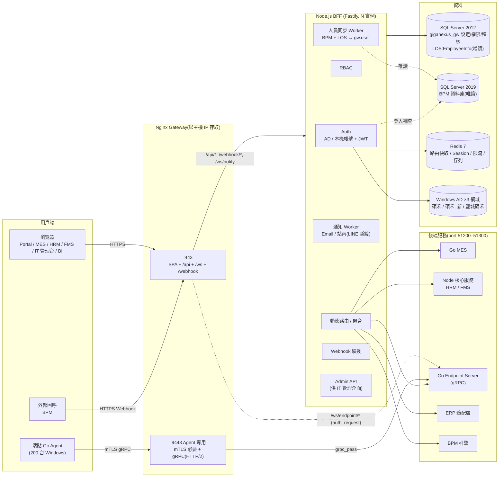

# GigaNexus Gateway — 整體架構

> 本文件自 [PRD.md](PRD.md) §6 拆出,為該主題的唯一維護來源;PRD 僅保留摘要與連結。
> 對應 PRD 版本:**v0.4**(2026-09-24)。

---

## 1. 架構總覽

## 2. 流量類型與走向

| # | 流量 | 入口(Host / Path) | 經過 | 目的地 | 認證 |
| --- | --- | --- | --- | --- | --- |
| T1 | SPA 靜態檔 | `<gateway-ip>/`、`/mes/`、`/hrm/`、`/fms/`、`/it/`、`/bi/`(新系統依 PRD §7.2.1 登記子路徑) | Nginx | 本機靜態目錄 `/srv/www/<app>/current` | 無(未登入由 SPA 導向 `/login`) |
| T2 | 業務 API | `<gateway-ip>/api/{system}/...` | Nginx → BFF | 依路由表轉上游 | JWT Cookie + RBAC |
| T3 | 認證 API | `<gateway-ip>/api/auth/*`(登入、註冊、忘記密碼) | Nginx(嚴格限流)→ BFF | BFF 本身 | 登入前免驗證 |
| T4 | 管理 API | `<gateway-ip>/api/admin/*` | Nginx → BFF | BFF 本身 | JWT + `gw.admin.*` 權限 |
| T5 | 通知 WebSocket | `<gateway-ip>/ws/notify` | Nginx → BFF | BFF | Cookie(握手時驗) |
| T6 | 串流 WebSocket(螢幕串流等大流量) | `<gateway-ip>/ws/endpoint/*` | Nginx(`auth_request` 問 BFF)→ | Go Endpoint Server | Cookie → BFF 驗證後放行 |
| T7 | Webhook | `<gateway-ip>/webhook/{source}` | Nginx(IP 白名單)→ BFF | BFF 驗簽後分派 | HMAC 簽章 / 來源 IP |
| T8 | Agent gRPC | `<gateway-ip>:9443`(HTTP/2) | Nginx(mTLS 必要)→ | Go Endpoint Server | 裝置憑證(mTLS) |
| T9 | 系統對系統 API | `<gateway-ip>/api/{system}/...` | Nginx → BFF | 上游 | API Key(`X-Api-Key`)+ 範圍 |

## 3. 關鍵架構決策

| # | 決策 | 理由 | 替代方案(未採用) |
| --- | --- | --- | --- |
| D1 | **所有 `/api/*` 由 Nginx 一律轉給 BFF**,由 BFF 依路由表轉上游;Nginx 只保留固定、少量的 location | API 要能由 IT 介面動態維護且即時生效;權限判斷需在同一處。改 Nginx 設定需 reload 且難以資料庫化 | Nginx 直接依 `/api/mes` 轉 Go MES + `auth_request`:少一跳,但路由無法動態管理 |
| D2 | **大流量/長連線例外**:螢幕串流 WebSocket(T6)走 Nginx 直連 Endpoint Server,以 `auth_request` 向 BFF 驗證一次 | 避免影像串流多經一層 Node | 全部經 BFF:實作簡單但浪費頻寬與 CPU |
| D3 | **Agent 使用獨立 port `:9443`**,該 server block `ssl_verify_client on` | 以 IP 存取(PRD Q1)時 TLS 無法用 SNI 區分主機名稱;獨立 port 讓瀏覽器完全不會被要求出示憑證,Agent 流量的設定、日誌、限流與防火牆規則皆分開 | 同一 port 設 `ssl_verify_client optional`:設定混雜、易誤放行;以主機名稱(SNI)區分:需要 DNS,目前沒有 |
| D4 | **Access / Refresh Token 皆放 httpOnly + Secure + SameSite=Strict Cookie**,搭配 CSRF 雙重提交 Token | 前端 JS 讀不到 Token,降低 XSS 竊取風險 | Token 放 LocalStorage:易被 XSS 竊取 |
| D5 | **下游服務只信任 BFF 簽發的短效內部 Token**(`X-Internal-Token`,60 秒,`aud`=服務代碼) | 下游 Go/Node 服務以 JWKS 驗章即可取得身分,不必各自接 AD | 只傳 `X-User-Id` 明文標頭:若網段被繞過即可偽造 |
| D6 | 路由設定 **SQL Server 為事實來源**,Redis 存「已發佈版本」快照 + Pub/Sub 通知,BFF 實例記憶體內建立路由樹 | 查詢路徑不打 DB;Redis 掛掉時仍可用記憶體與本地快照運作 | 每次請求查 Redis:多一次網路往返 |
| D7 | **身分與人事資料分開取得**:AD 只負責驗證密碼與提供群組;姓名、部門、職稱、主管等人事資料以 **BPM(SQL Server 2019)為主、LOS `EmployeeInfo`(SQL Server 2012)補充**,由排程同步進 `gw.user`,登入時查無資料才即時補查 | AD 的部門欄位不一定有維護;人事資料已存在 BPM / LOS。排程同步讓登入不受外部資料庫延遲或停機影響 | 每次登入即時查兩台資料庫:資料最即時,但任一台停機就影響登入 |
| D8 | **一個工號只有一種驗證方式**:有 AD 網域者用 AD;無網域子公司員工以 LOS / BPM 的工號自行註冊**本機帳號**(Argon2id 雜湊);兼任帳號不可單獨登入、不同工號不歸戶;舊單一入口(`PortalSolar.LoginData`)帳號首次登入時比對舊密碼、自動建立本機帳號並強制設定新密碼(PRD §8.2.5) | 子公司不一定有網域;身分仍以 LOS / BPM 工號為準,登入後的 Token 與權限模型與 AD 帳號一致 | 為無網域子公司建立 AD 帳號:需 IT 維護大量帳號與網域信任,短期不可行 |

## 4. 部署架構

- 主機 1(Ubuntu):GitLab 與 Container Registry;主機 2(Windows + Docker Desktop):B 測試區 + CI Runner;主機 3(Windows + Docker Desktop):A 正式區 + CD Runner。
- `develop` 自動部署測試區;`main` 經手動核可後,由正式區 Runner 在本機拉取同一個 commit SHA 的映像檔更新(無 SSH)。
- 詳細流程、元件部署順序與回滾見 [DEPLOYMENT.md](DEPLOYMENT.md)。
