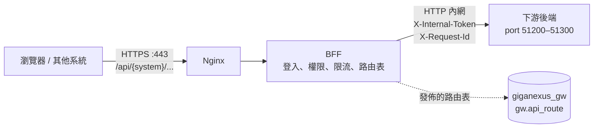
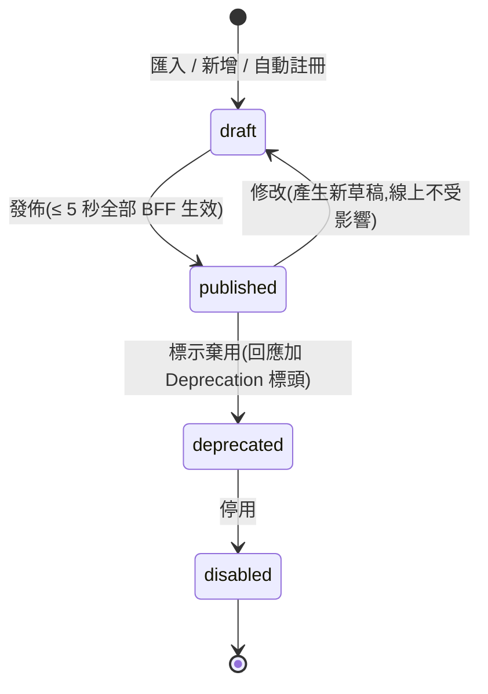
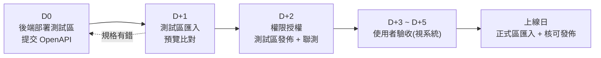

# GigaNexus Gateway — 下游後端接入規範與 API 上架流程

> 適用對象:所有經 GigaNexus Gateway 對外提供 API 的後端服務(Go、Node.js、.NET 等)。
> 對應 PRD 版本:**v0.7**(2026-09-26)。相關規格:[PRD.md](PRD.md) §8.2(身分)、§8.3(權限)、§8.4(動態路由與匯入);[DATABASE.md](DATABASE.md) §2(路由資料表)。端點 Agent 經 `:9443` 的 gRPC 通道另見 [ENDPOINT-AGENT-GUIDE.md](ENDPOINT-AGENT-GUIDE.md)。

---

## 1. 文件資訊

| 項目 | 內容 |
| --- | --- |
| 文件版本 | v0.5(2026-10-01,新增 §7.6 Webhook 呼叫:簽章標頭與回應、§7.7 發送通知);v0.4(`x-permissions` 新增 `kind` / `parent` / `sort`,畫面權限與 API 權限同一套;登記 `portal-api` 51271;`itapp-api` 規劃改經 BFF);v0.3 OpenAPI 根層新增選用的 `x-gateway.project` 開發專案;v0.2 新增 §7.5 自動註冊、路由查詢、Node.js SDK 與樣本,OpenAPI 新增 `description`、`x-gherkin` |
| 建立日期 | 2026-09-24 |
| 適用範圍 | 新開發的後端服務(必須遵守);既有系統遷移時比照(PRD §7.2.4) |
| 維護者 | Gateway 負責人 |

---

## 2. 接入全貌



- 使用者**永遠不直接連到後端**;所有請求都經過 Nginx 與 BFF。
- BFF 依**路由表**(`gw.api_route`)決定請求轉給哪個後端、需要什麼權限。後端完成後,要把 API **匯入路由表並發佈**才能被呼叫(§8、§9);測試區、正式區由服務啟動時**自動註冊為草稿**(§7.5)。

### 2.1 分工

| 項目 | Gateway(Nginx + BFF) | 後端服務 |
| --- | --- | --- |
| 登入、Token、Cookie、CSRF | ✅ 全權處理 | ❌ 不實作 |
| API 層級權限(能不能呼叫這支 API) | ✅ 依 `x-permission` 檢查 | ❌ 不重複檢查 |
| 資料層級權限(只能看本部門、本人的資料) | 提供身分資訊(部門、公司、角色) | ✅ 依內部 Token 過濾 |
| TLS、CORS、對外限流 | ✅ | ❌ 不設定 |
| 輸入驗證、業務邏輯、業務資料稽核 | — | ✅ |
| 健康檢查 | 定期呼叫 | ✅ 提供 `/healthz` |

---

## 3. Port 規範(51200–51300)

### 3.1 規則

- 所有下游後端服務供 Gateway 呼叫的 port **一律使用 51200–51300**(含端點 Agent 通道)。
- **一個服務一個 port**;同一服務的多個實例若在不同主機,使用相同 port。
- **測試區與正式區使用相同 port**,只有主機不同。
- 防火牆**只允許 Gateway 主機(BFF、Nginx)連入**,不對使用者網段開放(PRD §4.2「入口收斂」)。
- 服務以 HTTP 在內網提供即可(TLS 由 Gateway 對外處理);如需加密,於上游設定 `protocol = https` 並提供憑證。
- 既有系統(例如 `notesapp` 後端 `5121`、GeneralBackend `5123`)在遷移時(PRD §7.2.4、IMPL-PLAN P2-8)改用區間內的 port。
- **開發前**向 Gateway 負責人申請 port 與服務代碼,登記於 §3.3;未登記的 port 不會被加入上游設定。
- 部署沿用同一套 GitLab 流程:`develop` 自動部署測試區(主機 2)、`main` 手動部署正式區(主機 3),映像檔以 commit SHA 標記([DEPLOYMENT.md](DEPLOYMENT.md))。與 Gateway 部署在同一台主機時,容器需加入 Gateway 的 Docker 網路,BFF 以容器名稱連線,port 仍依本區間。

### 3.2 區段分配

| 區段 | 用途 |
| --- | --- |
| 51200–51209 | Gateway 平台保留(測試用上游、模擬服務) |
| 51210–51219 | MES |
| 51220–51229 | HRM |
| 51230–51239 | FMS |
| 51240–51249 | Endpoint Server(RustIt:REST 與 Agent HTTPS / WebSocket) |
| 51250–51259 | BPM 適配 |
| 51260–51269 | ERP 適配層 |
| 51270–51279 | 入口網 / 共用服務(公告、檔案等) |
| 51280–51289 | BI / 報表 |
| 51290–51300 | 未分配(新系統申請) |

> 一個系統的服務超過 10 個時,向 Gateway 負責人申請 51290 之後的區段。

### 3.3 分配紀錄

> 由 Gateway 負責人維護;實際位址另存於 `gw.upstream_target.base_url`(DATABASE §2)。

| Port | 系統 | 服務代碼(`upstream.code`) | 協定 | 負責人 | 狀態 |
| --- | --- | --- | --- | --- | --- |
| 51201 | Gateway 平台 | `node-sample`(Node.js 後端樣本,`samples/node-backend`) | HTTP | Gateway 負責人 | 範例 |
| 51210 | MES | `go-mes` | HTTP | MES 負責人 | 規劃中 |
| 51240 | Endpoint | `endpoint-api` | HTTP | W6 負責人 | 規劃中 |
| 51291 | IT 管理系統 | `itapp-api`(GigaItApp,SPA `/it/`;目前 API `/it/api/*` 由 Nginx 直接轉入、不經 BFF 路由表,**規劃改為系統代碼 `it`、`/api/it/*` 經 BFF**,PRD §7.2.1 v0.7) | HTTP | IT 管理系統負責人 | 測試區 |
| 51241 | Endpoint | `endpoint-agent`(Agent 通道,Nginx `:9443` 轉入;2026-10-01 由 `endpoint-grpc` 改名) | HTTPS / WebSocket(TLS) | W6 負責人 | 規劃中 |
| 51271 | 員工入口網 | `portal-api`(giga-Portal,系統代碼 `portal`,API `/api/portal/*`;取代本機模擬 `portal-svc` 51270) | HTTP | 入口網負責人 | 規劃中 |

---

## 4. 身分與授權

### 4.1 原則

- **後端不實作登入**,也不讀取瀏覽器 Cookie(BFF 轉發時預設移除 Cookie)。
- 使用者身分只從 **`X-Internal-Token`** 取得;**不可信任**請求中的其他身分標頭(例如 `X-User-Id`),Nginx 會清除使用者送入的 `X-Internal-*`、`X-User-*`。

### 4.2 驗證 `X-Internal-Token`

| 檢查項目 | 規則 |
| --- | --- |
| 演算法 | 只接受 **ES256** |
| 簽章 | 以 BFF 內網端點 `GET /.well-known/jwks.json` 取得公鑰(依 `kid` 選鑰);公鑰可快取,遇到未知 `kid` 時重新下載(金鑰輪替) |
| `iss` | `giganexus-bff` |
| `aud` | **自己的服務代碼**(例如 `go-mes`);不是自己的一律拒絕 |
| `exp` | 效期 60 秒,過期拒絕(允許 30 秒以內的時鐘誤差) |

**Node.js(`jose`)**

```ts
import { createRemoteJWKSet, jwtVerify } from 'jose'

const JWKS = createRemoteJWKSet(new URL('http://<bff-internal>/.well-known/jwks.json'))

export async function verifyInternalToken(token: string) {
  const { payload } = await jwtVerify(token, JWKS, {
    issuer: 'giganexus-bff',
    audience: 'go-mes',          // 自己的服務代碼
    algorithms: ['ES256'],
    clockTolerance: 30,
  })
  return payload                 // { sub, emp, name, dept, cos, amr, roles, ... }
}
```

**Go(`golang-jwt/jwt/v5` + `MicahParks/keyfunc/v3`)**

```go
k, err := keyfunc.NewDefault([]string{"http://<bff-internal>/.well-known/jwks.json"})
if err != nil { /* 啟動失敗 */ }

token, err := jwt.Parse(raw, k.Keyfunc,
    jwt.WithValidMethods([]string{"ES256"}),
    jwt.WithIssuer("giganexus-bff"),
    jwt.WithAudience("go-mes"),
    jwt.WithLeeway(30*time.Second))
```

### 4.3 Token 內容

| Claim | 說明 | 範例 |
| --- | --- | --- |
| `sub` | Gateway 使用者 ID;系統對系統呼叫時為 `client:{clientId}` | `1024` |
| `emp` | 工號(登入帳號) | `S112009` |
| `upn` | AD UPN;本機帳號為空 | `S112009@gsmc.com.tw` |
| `name` | 姓名 | 王小明 |
| `dept` | 部門代碼(BPM > LOS) | `S1800` |
| `cos` | 所屬公司(含兼任) | `["碩禾"]` |
| `amr` | 驗證方式 | `ad` / `local` |
| `roles` | 角色代碼 | `["employee","mes-operator"]` |

- **資料範圍**由後端依 `dept`、`cos`、`roles` 自行過濾(PRD §8.3)。
- 需要更多使用者資料(例如主管)時,以 `emp` 查詢自己系統或 BPM;不要要求 Gateway 在 Token 加欄位。
- 過渡期無法驗證 Token 的舊系統,可由路由設定改傳 `X-User-*` 標頭,但該系統必須只接受來自 Gateway 主機的連線(PRD §14.1)。

---

## 5. API 設計規範

### 5.1 路徑與方法

| 項目 | 規則 |
| --- | --- |
| 對外路徑 | `/api/{system_code}/{resource}`,例如 `/api/mes/work-orders/{id}` |
| 後端路徑 | 建議 `/v1/{resource}`;匯入時預設**去掉開頭的版本段**對應到對外路徑(`/v1/work-orders/{id}` → `/api/mes/work-orders/{id}`),需要不同路徑時以 `x-gateway-path` 指定 |
| 資源命名 | 名詞、複數、kebab-case(`work-orders`、`leave-requests`) |
| 冪等 | `GET`、`PUT`、`DELETE` **必須冪等**(BFF 只對冪等方法自動重試);`POST` 建議支援 `Idempotency-Key` 標頭 |
| 版本 | 不相容的變更以新版本並存(`/v2/...`,對外以 `x-gateway-path` 區分);舊版標示棄用至少 30 天後才停用(§9.3) |

### 5.2 請求與回應

| 項目 | 規則 |
| --- | --- |
| 格式 | JSON、UTF-8、欄位 camelCase |
| 時間 | ISO 8601,含時區(例:`2026-12-01T08:30:00+08:00`) |
| 分頁 | 參數 `page`(從 1 開始)、`pageSize`(上限 100);回應 `{ "items": [], "total": 0, "page": 1, "pageSize": 20 }` |
| 請求大小 | 預設上限 10 MB;檔案上傳路由另外申請 |
| 回應時間 | 預設逾時 10 秒(可依路由申請調整,最長 60 秒);超過者改為非同步(送出工作 → 查詢結果) |
| 標頭 | 不回 `Set-Cookie`、CORS 標頭、`Server`、`X-Powered-By` |
| 追蹤 | 讀取 `X-Request-Id` 寫入每一筆日誌,並在呼叫其他服務時往下傳遞 |

### 5.3 錯誤格式

與 BFF 統一(完整代碼見 [PRD.md](PRD.md) §8.1.1)。後端自訂代碼**以系統代碼開頭**(例 `MES_WORK_ORDER_NOT_FOUND`),不可使用 `UNAUTHENTICATED`、`PERMISSION_DENIED`、`CSRF_INVALID`、`UPSTREAM_*` 等 Gateway 專用代碼:

```jsonc
{
  "code": "MES_WORK_ORDER_NOT_FOUND",   // 大寫蛇形,以系統代碼開頭
  "message": "找不到工單",            // 可直接顯示給使用者
  "requestId": "7f3c…",              // 取自 X-Request-Id
  "details": [ { "field": "qty", "message": "必須大於 0" } ]   // 選用,驗證錯誤時使用
}
```

| 狀態碼 | 後端使用時機 |
| --- | --- |
| 400 | 參數驗證失敗:`VALIDATION_FAILED`(附 `details`) |
| 403 | **資料層級**無權限:`DATA_ACCESS_DENIED`(例如看其他部門的資料);API 層級權限由 BFF 處理 |
| 404 | 資源不存在 |
| 409 | 資料已被他人修改:`VERSION_CONFLICT`;或業務狀態衝突(自訂代碼) |
| 422 | 業務規則不允許(例如工單已結案不能報工) |
| 500 | 非預期錯誤:`INTERNAL_ERROR`;**不可回傳堆疊或 SQL 內容** |

> 後端**只有在內部 Token 驗證失敗時才回 401**;登入狀態由 Gateway 處理,正常情況不會發生。BFF 收到上游的 401 會視為設定錯誤(金鑰或 `aud` 不符)並告警,對使用者回 502。

### 5.4 健康檢查與監控

| 端點 | 規則 |
| --- | --- |
| `GET /healthz` | **必備**。程序存活即回 200,不檢查相依服務;BFF 用來判斷上游健康與斷路器 |
| `GET /readyz` | 建議。資料庫等相依服務可用才回 200 |
| `GET /metrics` | 選用。Prometheus 格式 |

---

## 6. OpenAPI 規格(上架必備)

每個後端服務都要提供 **OpenAPI 3.0 / 3.1**(JSON 或 YAML)規格檔,由程式自動產生(Go:`swaggo/swag`、`huma`;Node.js:`@fastify/swagger`;.NET:Swashbuckle)。Gateway 依此匯入路由(PRD §8.4.4)。

### 6.1 必填欄位與擴充欄位

| 位置 | 欄位 | 必填 | 對應 `gw.api_route` | 說明 |
| --- | --- | --- | --- | --- |
| 根 | `x-gateway.upstream` | ✅ | `upstream_id` | 服務代碼(§3.3),同時是內部 Token 的 `aud` |
| 根 | `x-gateway.system` | ✅ | `system_code` | 系統代碼,決定對外前綴 `/api/{system}` |
| 根 | `x-gateway.project` | 建議 | `gw.upstream.project` | **開發專案**:實作本服務的 repo 資料夾名稱(Gateway `AGENT.md` §10.2,英數與 `. _ -`,100 字內);管理介面與路由查詢據此顯示「由哪個專案開發」。未提供時保留既有值。**Node.js SDK 由 `package.json` 的 `gateway.project` 自動寫入**(§7.5);其他語言自行實作註冊時也必須帶入 |
| 根 | `x-permissions` | ✅ | `gw.permission` | 本服務用到的權限代碼與中文名稱;匯入時不存在者一併建立。**有畫面的應用**另宣告 `kind`(`app` / `menu` / `tab` / `button`,省略 = `api`)、`parent`(上層權限代碼)、`sort`,供 IT 在 GigaItApp 以「應用 → 選單 → Tab → 按鈕」設定(PRD §8.3.2;2026-10-01 已實作:格式錯誤列為 `IMPORT_HAS_ERRORS`,既有權限只更新有宣告的 `kind` / `parent` / `sort`,名稱不覆寫);按鈕的代碼必須等於它呼叫的寫入 API 的 `x-permission` |
| operation | `operationId` | ✅ | `route_code` | 全域唯一,格式 `{system}.{resource}.{action}`,例 `mes.workorder.get` |
| operation | `summary` | ✅ | `name` | 中文名稱,顯示於管理介面 |
| operation | `description` | 建議 | `description` | **API 用途說明**(1000 字內):做什麼、資料範圍、主要錯誤代碼;路由查詢(§7.5)以此比對關鍵字 |
| operation | `x-gherkin` | 建議 | `gherkin` | **行為規格**:Gherkin 場景文字(zh-TW 關鍵字 `場景`、`假如`、`當`、`那麼`、`而且`),描述可觀察的行為(HTTP 狀態、`code`) |
| operation | `x-permission` | ✅ | `auth_mode` / `permission_code` | 權限代碼(例 `mes.workorder.read`);或 `authenticated`(登入即可)、`public`(免登入,需 IT 核准) |
| operation | `tags` | 建議 | `tags` | 功能分類 |
| operation | `x-gateway-path` | 選用 | `public_path` | 對外路徑與預設規則不同時指定 |
| operation | `x-timeout-ms` | 選用 | `timeout_ms` | 覆寫預設逾時(最長 60000) |
| operation | `x-cache-ttl` | 選用 | `cache_ttl_sec` | GET 回應快取秒數(僅限不含個人資料的查詢,或搭配 `x-cache-scope: user`) |
| operation | `x-cache-scope` | 選用 | `cache_scope` | `shared`(所有人共用)/ `user`(每位使用者各自快取);設定 `x-cache-ttl` 時必填 |
| operation | `x-audit-level` | 選用 | `audit_level` | `none` / `meta` / `body`;敏感 API(薪資、個資)至少 `meta` |
| operation | `x-rate-limit` | 選用 | `rate_limit_policy_id` | 限流政策代碼(例 `report-heavy`),未填用預設 |

- 權限代碼格式 `{system}.{resource}.{action}`(PRD §8.3);`action` 常用 `read`、`write`、`approve`、`export`。
- **沒有 `x-permission` 的 operation 匯入時列為錯誤**,不會自動視為公開。
- `description` 超過 1000 字、`x-gherkin` 不是文字時列為錯誤;兩者不影響路由轉送,只供管理介面與路由查詢使用。以 Node.js 樣本(§7.5)開發時,`npm test` 會檢查兩者必填。

### 6.2 範例

```yaml
openapi: 3.0.3
info:
  title: MES API
  version: 1.2.0
x-gateway:
  upstream: go-mes
  system: mes
  project: giga-mes
x-permissions:
  - code: mes.workorder.read
    name: 工單查詢
  - code: mes.workorder.report
    name: 報工
# 有畫面的應用(例:員工入口網)另宣告 kind / parent / sort(PRD §8.3.2):
#  - { code: portal.app.access, name: 員工入口網, kind: app }
#  - { code: portal.leave.read, name: 我的假期, kind: menu, parent: portal.app.access, sort: 20 }
#  - { code: portal.leave.apply, name: 請假申請, kind: button, parent: portal.leave.read }
paths:
  /v1/work-orders/{id}:          # 對外:/api/mes/work-orders/{id}
    get:
      operationId: mes.workorder.get
      summary: 查詢工單
      description: 依工單號查詢工單內容與狀態;只能查詢本廠區的工單
      tags: [工單]
      x-permission: mes.workorder.read
      x-gherkin: |
        場景: 查詢不存在的工單
          假如 使用者擁有 mes.workorder.read
          當 呼叫 GET /api/mes/work-orders/WO-000
          那麼 回應 404
          而且 回應的 code 為 "MES_WORK_ORDER_NOT_FOUND"
      x-cache-ttl: 30
      x-cache-scope: shared
      parameters:
        - { name: id, in: path, required: true, schema: { type: string } }
      responses:
        '200': { description: OK }
  /v1/work-orders/{id}/reports:  # 對外:/api/mes/work-orders/{id}/reports
    post:
      operationId: mes.workorder.report
      summary: 報工
      tags: [工單]
      x-permission: mes.workorder.report
      x-audit-level: meta
      responses:
        '201': { description: Created }
```

### 6.3 沒有 OpenAPI 的服務

無法產生 OpenAPI 的舊系統改用 **Excel / CSV 範本**(欄位對應 `gw.api_route`,範本由 Gateway 負責人提供),必填欄位同 §6.1。

---

## 7. BFF 管理方式

### 7.1 管理對象

| 對象 | 資料表 | 說明 |
| --- | --- | --- |
| 上游服務 | `gw.upstream`、`gw.upstream_target` | 服務代碼、位址(主機 + 51200–51300 的 port)、逾時、重試、斷路器、健康檢查路徑 |
| API 路由 | `gw.api_route`、`gw.aggregate_step` | 對外路徑 → 上游路徑、權限、限流、快取、稽核等級 |
| 權限與角色 | `gw.permission`、`gw.role_permission`、`gw.role_ad_group`、`gw.role_company` | 權限代碼,以及哪些角色、AD 群組、公司擁有該權限 |
| 限流政策 | `gw.rate_limit_policy` | 共用的限流設定 |
| 發佈版本 | `gw.config_release` | 每次發佈的完整快照,可回滾 |

### 7.2 角色分工

| 角色 | 負責 |
| --- | --- |
| 後端開發者 | 申請 port 與服務代碼;新增 API 前先查既有路由(§7.5);依本規範開發;提供 OpenAPI;部署測試區並確認 `/healthz` 與自動註冊成功 |
| 系統負責人 | 決定權限代碼的授權對象(哪些角色 / AD 群組 / 公司);驗收 |
| Gateway 負責人 | 分配 port;為每個服務建立測試區與正式區各自的 API Key(§7.5);MVP 期間代為匯入與發佈;維護上游設定與限流政策 |
| IT 管理者 | 第二階段起於管理介面自助匯入、授權、發佈、回滾 |

### 7.3 路由狀態與發佈



- **草稿不影響線上**;發佈前可預覽差異(新增 / 修改 / 停用)。
- 發佈有問題時,**選擇上一個版本回滾**,同樣 5 秒內生效(PRD §8.4.3)。
- 測試區與正式區各自一套資料庫、**設定不互通**(PRD Q3):兩區各自由後端啟動時自動註冊為草稿(§7.5),IT 分別核可發佈;正式區不再由測試區匯出 / 匯入。
- 發佈會一併發佈**所有**草稿(含其他服務自動註冊的草稿);發佈前務必檢視差異(新增 / 修改 / 停用)。

### 7.4 各階段的操作方式

| 期間 | 匯入與發佈方式 | 執行者 |
| --- | --- | --- |
| ~ 2027-01-29(W3 開發中) | 尚未提供;前端需要時,可在**測試區**建立 `mock` 路由 | Gateway 負責人 |
| 2027-01-29 ~ 03-12(MVP 上線,管理功能開發中) | **CLI**:由 OpenAPI 檔產生草稿並發佈(IMPL-PLAN W3-5.7) | Gateway 負責人代為執行 |
| 2027-03-12 起(匯入功能完成,IMPL-PLAN P2-4) | **管理 API / W4 IT 管理介面**:上傳 OpenAPI → 預覽比對 → 設定權限 → 發佈;介面開放時間依 W4 時程 | IT 管理者自助 |
| 自動註冊上線起(IMPL-PLAN W3-5.7a) | **後端自動註冊**:服務部署到測試區 / 正式區後啟動即寫入草稿(§7.5);發佈仍依上列方式 | 後端(註冊)、Gateway 負責人 / IT(發佈) |

### 7.5 自動註冊與路由查詢(Node.js SDK 與樣本)

後端服務以 **API Key** 呼叫 Gateway 管理端點(PRD §8.7),Node.js 服務使用共用套件 `@giganexus/backend-sdk`(`sdk/node`);可直接複製 **Node.js 後端樣本**(`samples/node-backend`,含 AI 協作準則 `AGENT.md`)開始開發。

| 端點 | 權限 | 用途 |
| --- | --- | --- |
| `POST /api/admin/registrations` | `gw.admin.route.register` | 啟動時送出 `{ spec: <OpenAPI>, target: <SERVICE_ADVERTISE_URL> }`,寫入草稿;回應新增 / 修改 / 不變數量與 `pendingPublish` |
| `GET /api/admin/routes/catalog?q=&system=&status=` | `gw.admin.route.read` | 查詢既有路由(含草稿、說明、Gherkin 與開發專案 `project`),**新增 API 前先查,避免重複開發** |

**部署區(`GW_ENV`)**

| 項目 | `dev`(本機開發) | `test`(測試區) | `prod`(正式區) |
| --- | --- | --- | --- |
| 自動註冊 | 不註冊 | 啟動時寫入測試區 Gateway 草稿 | 啟動時寫入正式區 Gateway 草稿 |
| 生效 | — | IT 發佈後 | IT 核可發佈後 |
| API Key | `GW_API_KEY` 或 `GW_API_KEY_FILE` | `GW_API_KEY_FILE` | 只接受 `GW_API_KEY_FILE`(Docker secret) |

**開發專案**:寫在 `package.json` 的 `"gateway": { "project": "<repo 資料夾名稱>" }`(不是環境變數,不隨部署區改變),複製樣本後由工程師命名一次(樣本 `AGENT.md` §0)。SDK 0.2 起 `loadGatewayEnv` 讀取(缺少或格式錯誤時啟動失敗),`autoRegister` 送出前自動寫入 `x-gateway.project`;OpenAPI 已手寫且不一致時拒絕註冊。

其他環境變數:`SERVICE_CODE`(服務代碼)、`GW_BASE_URL`(Gateway 位址)、`SERVICE_ADVERTISE_URL`(Gateway 連到本服務的位址,test / prod 必填,port 51200–51300)、`GW_JWKS_URL`(選用,預設 `{GW_BASE_URL}/.well-known/jwks.json`)。

**規則**

- API Key 由 Gateway 負責人以 CLI 建立,**測試區與正式區各一把**,明文只顯示一次,存入該服務的 Docker secret:
  `npm run gw -- client:create --code <服務代碼> [--ips <CIDR>]`(預設權限 `gw.admin.route.register`、`gw.admin.route.read`;再次執行即換發,舊金鑰立即失效)、停用 `client:disable --code <服務代碼>`。
- **API Key 代碼必須等於 `x-gateway.upstream`**:只能註冊自己的服務;`route_code` 已屬於其他上游時整批拒絕(`IMPORT_HAS_ERRORS`)。
- 規則同 §6.1 匯入(有錯誤整批不寫入);同一服務多台主機各自註冊時只**補上**上游位址,不互相覆蓋。
- **只寫草稿,不自動發佈**;新權限代碼一併建立,但需系統負責人指定授權對象後才有人能呼叫。
- 註冊失敗(Gateway 無法連線時 SDK 以 1、2、4、8、16 秒重試)不會停止服務,但以 `error` 記錄;已發佈的路由不受影響。
- 開發者查詢:`npx gw-lookup <關鍵字> [--system mes] [--status published] [--gherkin]`(讀 `GW_BASE_URL`、`GW_API_KEY`)。

### 7.6 Webhook 呼叫(外部系統 → Gateway,PRD §8.6)

外部系統(本階段只有 BPM)事件發生時呼叫 `POST https://<gateway-host>/webhook/{source}`。Nginx 只放行白名單 IP(`nginx/allowlists/<區域>/webhook-bpm.conf`),BFF 驗簽、檢查時間戳與去重後寫入 `gw.webhook_log`、排入佇列,**立即回 200**,實際處理在 worker。

| 標頭 | 內容 |
| --- | --- |
| `Content-Type` | `application/json`(body 以原始位元組驗簽,送出後不可再改寫) |
| `X-Gw-Timestamp` | 送出時間,Unix 秒;與 Gateway 時間相差超過 ±5 分鐘視為重放 |
| `X-Gw-Signature` | `sha256=` + 小寫 hex(`HMAC-SHA256(密鑰, X-Gw-Timestamp + "." + 原始 body)`) |
| `Idempotency-Key` | 事件的唯一鍵(1–100 個可見 ASCII 字元),例:`bpm-LV-20261201-001-step2`;**重送時沿用同一個**,24 小時內只處理一次 |

| 回應 | 意義 | 呼叫端處理 |
| --- | --- | --- |
| 200 `{ received: true, logId }` | 已接收並排入處理 | 完成 |
| 200 `{ code: "DUPLICATE_REQUEST" }` | 同一個 `Idempotency-Key` 已處理過 | 完成,不需重送 |
| 400 `VALIDATION_FAILED` | 缺少或格式錯誤的 `Idempotency-Key` | 修正後重送 |
| 401 `WEBHOOK_SIGNATURE_INVALID` / `WEBHOOK_TIMESTAMP_INVALID` | 簽章不符 / 時間戳超出範圍 | 檢查密鑰與主機時間(NTP),**以新的時間戳重新簽章**後重送 |
| 403 `IP_NOT_ALLOWED`(Nginx) | 來源 IP 不在白名單 | 請 Gateway 負責人更新白名單 |
| 404 `WEBHOOK_SOURCE_NOT_FOUND` | 該來源未設定或已停用 | 聯絡 Gateway 負責人 |
| 500 `INTERNAL_ERROR` | Gateway 暫時無法處理(密鑰、Redis、資料庫) | 以相同 `Idempotency-Key` 指數退避重送 |

```js
// Node.js 範例(其他語言同理:先算 HMAC,再以同一份位元組送出)
const body = JSON.stringify(event);
const ts = String(Math.floor(Date.now() / 1000));
const sig = 'sha256=' + crypto.createHmac('sha256', secret).update(`${ts}.${body}`).digest('hex');
await fetch(`${GW}/webhook/bpm`, { method: 'POST', body, headers: { 'content-type': 'application/json', 'x-gw-timestamp': ts, 'x-gw-signature': sig, 'idempotency-key': event.id } });
```

- **密鑰**:測試區與正式區各一把,由 Gateway 負責人產生(`openssl rand -hex 32`),放在各區 `${GW_SECRETS_DIR}/webhook/<secret_ref>`(BFF 容器內 `/run/secrets/gw/webhook/`),再以安全管道交給來源系統;不寫進設定檔或版控。
- **端點設定**:`npm run gw -- apply --file <設定.yaml>` 的 `webhooks:`(`source`、`verifyMethod: hmac_sha256`、`secretRef`、`dispatchType: queue`、`dispatchTarget`),寫入 `gw.webhook_endpoint`。
- **事件內容**:BPM 簽核事件的格式尚未定義(Gherkin `webhook.feature`「BPM 簽核完成後通知申請人」為 `@wip`);目前事件只記錄、不處理(`gw.webhook_log.error_message` = `尚無處理程序:<dispatch_target>`)。

### 7.7 發送通知(後端 → Gateway,PRD §8.5)

後端以 **API Key** 呼叫 `POST https://<gateway-host>/api/notify/send`(標頭 `X-Api-Key`,不需 CSRF);API Key 需有權限 `notify.message.send`,由 Gateway 負責人以 `npm run gw -- client:create --code <服務代碼> --perm notify.message.send [--perm 其他權限]` 加上(再次執行即換發)。

```jsonc
{
  "templateCode": "BPM_APPROVAL_PENDING",     // 範本由 Gateway 負責人以 CLI apply 的 notifyTemplates: 建立
  "channels": ["email", "inapp"],             // 省略時用範本預設;line 回 400 CHANNEL_NOT_SUPPORTED
  "to": { "users": ["S112009"], "adGroups": ["GN-HR-Managers"], "emails": [] },
  "data": { "formNo": "LV-20261201-001", "linkUrl": "/bpm/forms/LV-20261201-001" },
  "priority": "normal",                       // high | normal | low
  "idempotencyKey": "bpm-LV-20261201-001-step2"
}
```

| 回應 | 意義 |
| --- | --- |
| 202 `{ queued, skipped }` | 已入列;`skipped` 為查無工號、停用或沒有 Email 的收件人(記錄於 `gw.notify_log`,不重試) |
| 200 `{ code: "DUPLICATE_REQUEST" }` | 相同 `idempotencyKey` 24 小時內已送出 |
| 400 `VALIDATION_FAILED` / `CHANNEL_NOT_SUPPORTED` | 範本不存在、範本缺少該通道內容、收件人為空或超過 1,000 則 |
| 401 / 403 | API Key 無效 / 沒有 `notify.message.send` |

- 站內通知的 `data.linkUrl` 只接受站內路徑(`/` 開頭)或 `https://` 網址。
- 測試區所有 Email 改寄測試信箱(DEPLOYMENT.md §5.1),不會寄給真實收件人。

---

## 8. API 上架時程(後端完成後)

以「後端完成並部署到測試區」為 **D0**(工作天):



| 時點 | 工作 | 負責 | 完成條件 |
| --- | --- | --- | --- |
| **開發前** | 申請 port、服務代碼、系統代碼;規劃權限代碼 | 後端 → Gateway 負責人 | 登記於 §3.3 |
| 開發中(需要時) | 申請測試區 `mock` 路由供前端先行 | 前端 / 後端 | mock 路由可呼叫 |
| **D0** | 後端部署測試區(自動註冊為草稿,§7.5)或提交 OpenAPI;`/healthz` 回 200 | 後端 | 自動註冊成功 / 規格檔通過 §6.1 檢查 |
| **D+1** | 測試區匯入 → 預覽比對 → 規格有錯退回修正 | Gateway 負責人 / IT | 無錯誤的匯入批次 |
| **D+2** | 系統負責人確認權限授權對象;測試區發佈;前後端聯測(含無權限時的 403) | 系統負責人、IT、開發者 | 測試區可正常呼叫 |
| D+3 ~ D+5 | 使用者驗收(視系統需要) | 系統負責人 | 驗收通過 |
| **上線日** | 後端部署正式區(自動註冊為正式區草稿)→ 設定權限授權對象 → 檢視差異後手動核可發佈 | 後端、IT | 正式區可正常呼叫 |

- **D0 到測試區可呼叫:約 2 個工作天**;上線日依驗收結果與正式區部署排程決定。
- 規格有錯需退回時,時程順延;為縮短時程,建議開發期間就用 §6.1 自我檢查。
- 緊急修正依同一流程,但可在同一天完成測試區驗證與正式區發佈;出問題時立即回滾。

---

## 9. 異動與下架

### 9.1 修改既有 API

- 重新提交 OpenAPI,依 §8 流程匯入;預覽會列出「修改」項目。
- **相容的變更**(新增選用欄位、新增 API):直接更新。
- **不相容的變更**(刪欄位、改型別、改語意):以新版本並存(§5.1),不可直接覆蓋。

### 9.2 權限調整

權限代碼的授權對象由系統負責人提出、IT 於管理介面調整,**不需要重新匯入或重新部署後端**;調整後使用者下次請求即生效。

### 9.3 下架

1. 將路由標示為 `deprecated`(回應加 `Deprecation` 標頭),通知前端與呼叫方。
2. **至少 30 天**後改為 `disabled`。
3. 確認無呼叫後,後端移除程式,並向 Gateway 負責人釋出 port(§3.3 狀態改為「已釋出」)。

---

## 10. 上線檢查清單

- [ ] Port 位於 51200–51300,且已登記於 §3.3
- [ ] 防火牆只允許 Gateway 主機連入
- [ ] 驗證 `X-Internal-Token`(ES256、`iss`、`aud` = 自己的服務代碼、`exp`),不信任其他身分標頭
- [ ] 資料層級權限依 `dept` / `cos` / `roles` 過濾
- [ ] 錯誤回應符合 §5.3,不洩漏堆疊與 SQL
- [ ] `GET` / `PUT` / `DELETE` 冪等
- [ ] 提供 `/healthz`
- [ ] 日誌記錄 `X-Request-Id`
- [ ] 不回 `Set-Cookie`、CORS、`Server`、`X-Powered-By` 標頭
- [ ] OpenAPI 每個 operation 都有 `operationId`、`summary`、`x-permission`(建議 `description`、`x-gherkin`);根層有 `x-gateway`(建議含 `project`)與 `x-permissions`
- [ ] 新增的 API 已查過既有路由,沒有重複(§7.5)
- [ ] 測試區、正式區各自的 API Key 已存入 Docker secret,`GW_ENV` 設定正確,啟動日誌顯示自動註冊成功
- [ ] 敏感 API 設定 `x-audit-level`
