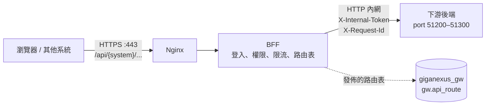
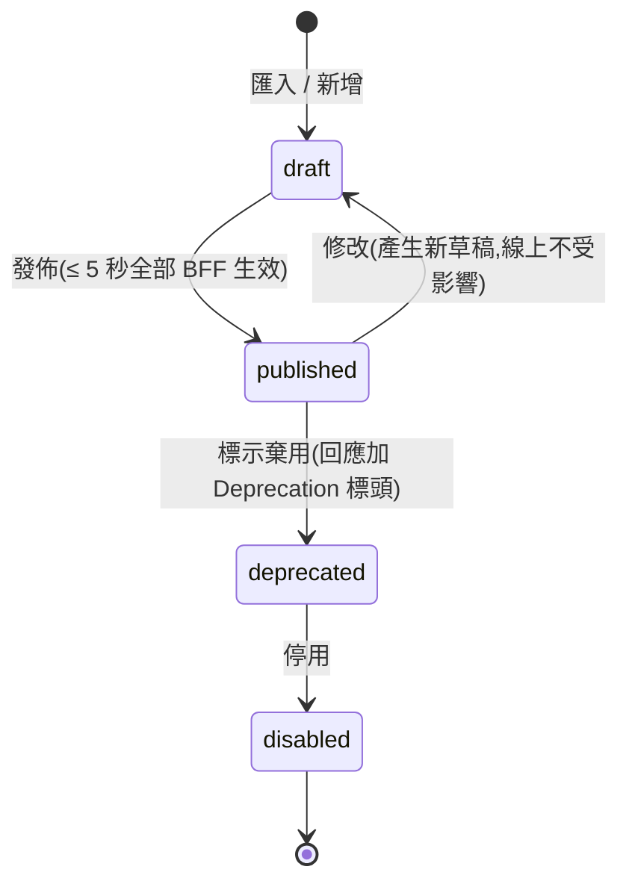
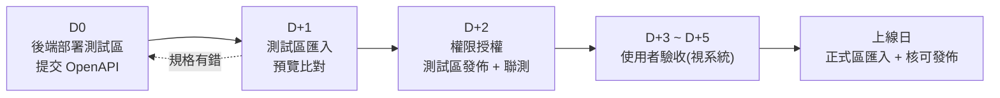

# GigaNexus Gateway — 下游後端接入規範與 API 上架流程

> 適用對象:所有經 GigaNexus Gateway 對外提供 API 的後端服務(Go、Node.js、.NET 等)。
> 對應 PRD 版本:**v0.4**(2026-09-24)。相關規格:[PRD.md](PRD.md) §8.2(身分)、§8.3(權限)、§8.4(動態路由與匯入);[DATABASE.md](DATABASE.md) §2(路由資料表)。

---

## 1. 文件資訊

| 項目 | 內容 |
| --- | --- |
| 文件版本 | v0.1(初稿) |
| 建立日期 | 2026-09-24 |
| 適用範圍 | 新開發的後端服務(必須遵守);既有系統遷移時比照(PRD §7.2.4) |
| 維護者 | Gateway 負責人 |

---

## 2. 接入全貌



- 使用者**永遠不直接連到後端**;所有請求都經過 Nginx 與 BFF。
- BFF 依**路由表**(`gw.api_route`)決定請求轉給哪個後端、需要什麼權限。後端完成後,要把 API **匯入路由表並發佈**才能被呼叫(§8、§9)。

### 2.1 分工

| 項目 | Gateway(Nginx + BFF) | 後端服務 |
| --- | --- | --- |
| 登入、Token、Cookie、CSRF | ✅ 全權處理 | ❌ 不實作 |
| API 層級權限(能不能呼叫這支 API) | ✅ 依 `x-permission` 檢查 | ❌ 不重複檢查 |
| 資料層級權限(只能看本部門、本人的資料) | 提供身分資訊(部門、公司、角色) | ✅ 依內部 Token 過濾 |
| TLS、CORS、對外限流 | ✅ | ❌ 不設定 |
| 輸入驗證、業務邏輯、業務資料稽核 | — | ✅ |
| 健康檢查 | 定期呼叫 | ✅ 提供 `/healthz` |

---

## 3. Port 規範(51200–51300)

### 3.1 規則

- 所有下游後端服務供 Gateway 呼叫的 port **一律使用 51200–51300**(含 gRPC)。
- **一個服務一個 port**;同一服務的多個實例若在不同主機,使用相同 port。
- **測試區與正式區使用相同 port**,只有主機不同。
- 防火牆**只允許 Gateway 主機(BFF、Nginx)連入**,不對使用者網段開放(PRD §4.2「入口收斂」)。
- 服務以 HTTP 在內網提供即可(TLS 由 Gateway 對外處理);如需加密,於上游設定 `protocol = https` 並提供憑證。
- 既有系統(例如 `notesapp` 後端 `5121`、GeneralBackend `5123`)在遷移時(PRD §7.2.4、IMPL-PLAN P2-8)改用區間內的 port。
- **開發前**向 Gateway 負責人申請 port 與服務代碼,登記於 §3.3;未登記的 port 不會被加入上游設定。

### 3.2 區段分配

| 區段 | 用途 |
| --- | --- |
| 51200–51209 | Gateway 平台保留(測試用上游、模擬服務) |
| 51210–51219 | MES |
| 51220–51229 | HRM |
| 51230–51239 | FMS |
| 51240–51249 | Endpoint Server(REST 與 Agent gRPC) |
| 51250–51259 | BPM 適配 |
| 51260–51269 | ERP 適配層 |
| 51270–51279 | 入口網 / 共用服務(公告、檔案等) |
| 51280–51289 | BI / 報表 |
| 51290–51300 | 未分配(新系統申請) |

> 一個系統的服務超過 10 個時,向 Gateway 負責人申請 51290 之後的區段。

### 3.3 分配紀錄

> 由 Gateway 負責人維護;實際位址另存於 `gw.upstream_target.base_url`(DATABASE §2)。

| Port | 系統 | 服務代碼(`upstream.code`) | 協定 | 負責人 | 狀態 |
| --- | --- | --- | --- | --- | --- |
| 51210 | MES | `go-mes` | HTTP | MES 負責人 | 規劃中 |
| 51240 | Endpoint | `endpoint-api` | HTTP | W6 負責人 | 規劃中 |
| 51241 | Endpoint | `endpoint-grpc`(Agent gRPC,Nginx `:9443` 轉入) | gRPC(TLS) | W6 負責人 | 規劃中 |

---

## 4. 身分與授權

### 4.1 原則

- **後端不實作登入**,也不讀取瀏覽器 Cookie(BFF 轉發時預設移除 Cookie)。
- 使用者身分只從 **`X-Internal-Token`** 取得;**不可信任**請求中的其他身分標頭(例如 `X-User-Id`),Nginx 會清除使用者送入的 `X-Internal-*`、`X-User-*`。

### 4.2 驗證 `X-Internal-Token`

| 檢查項目 | 規則 |
| --- | --- |
| 演算法 | 只接受 **ES256** |
| 簽章 | 以 BFF 內網端點 `GET /.well-known/jwks.json` 取得公鑰(依 `kid` 選鑰);公鑰可快取,遇到未知 `kid` 時重新下載(金鑰輪替) |
| `iss` | `giganexus-bff` |
| `aud` | **自己的服務代碼**(例如 `go-mes`);不是自己的一律拒絕 |
| `exp` | 效期 60 秒,過期拒絕(允許 30 秒以內的時鐘誤差) |

**Node.js(`jose`)**

```ts
import { createRemoteJWKSet, jwtVerify } from 'jose'

const JWKS = createRemoteJWKSet(new URL('http://<bff-internal>/.well-known/jwks.json'))

export async function verifyInternalToken(token: string) {
  const { payload } = await jwtVerify(token, JWKS, {
    issuer: 'giganexus-bff',
    audience: 'go-mes',          // 自己的服務代碼
    algorithms: ['ES256'],
    clockTolerance: 30,
  })
  return payload                 // { sub, emp, name, dept, cos, amr, roles, ... }
}
```

**Go(`golang-jwt/jwt/v5` + `MicahParks/keyfunc/v3`)**

```go
k, err := keyfunc.NewDefault([]string{"http://<bff-internal>/.well-known/jwks.json"})
if err != nil { /* 啟動失敗 */ }

token, err := jwt.Parse(raw, k.Keyfunc,
    jwt.WithValidMethods([]string{"ES256"}),
    jwt.WithIssuer("giganexus-bff"),
    jwt.WithAudience("go-mes"),
    jwt.WithLeeway(30*time.Second))
```

### 4.3 Token 內容

| Claim | 說明 | 範例 |
| --- | --- | --- |
| `sub` | Gateway 使用者 ID;系統對系統呼叫時為 `client:{clientId}` | `1024` |
| `emp` | 工號(登入帳號) | `S112009` |
| `upn` | AD UPN;本機帳號為空 | `S112009@gsmc.com.tw` |
| `name` | 姓名 | 王小明 |
| `dept` | 部門代碼(BPM > LOS) | `S1800` |
| `cos` | 所屬公司(含兼任) | `["碩禾"]` |
| `amr` | 驗證方式 | `ad` / `local` |
| `roles` | 角色代碼 | `["employee","mes-operator"]` |

- **資料範圍**由後端依 `dept`、`cos`、`roles` 自行過濾(PRD §8.3)。
- 需要更多使用者資料(例如主管)時,以 `emp` 查詢自己系統或 BPM;不要要求 Gateway 在 Token 加欄位。
- 過渡期無法驗證 Token 的舊系統,可由路由設定改傳 `X-User-*` 標頭,但該系統必須只接受來自 Gateway 主機的連線(PRD §14.1)。

---

## 5. API 設計規範

### 5.1 路徑與方法

| 項目 | 規則 |
| --- | --- |
| 對外路徑 | `/api/{system_code}/{resource}`,例如 `/api/mes/work-orders/{id}` |
| 後端路徑 | 建議 `/v1/{resource}`;匯入時預設**去掉開頭的版本段**對應到對外路徑(`/v1/work-orders/{id}` → `/api/mes/work-orders/{id}`),需要不同路徑時以 `x-gateway-path` 指定 |
| 資源命名 | 名詞、複數、kebab-case(`work-orders`、`leave-requests`) |
| 冪等 | `GET`、`PUT`、`DELETE` **必須冪等**(BFF 只對冪等方法自動重試);`POST` 建議支援 `Idempotency-Key` 標頭 |
| 版本 | 不相容的變更以新版本並存(`/v2/...`,對外以 `x-gateway-path` 區分);舊版標示棄用至少 30 天後才停用(§9.3) |

### 5.2 請求與回應

| 項目 | 規則 |
| --- | --- |
| 格式 | JSON、UTF-8、欄位 camelCase |
| 時間 | ISO 8601,含時區(例:`2026-12-01T08:30:00+08:00`) |
| 分頁 | 參數 `page`(從 1 開始)、`pageSize`(上限 100);回應 `{ "items": [], "total": 0, "page": 1, "pageSize": 20 }` |
| 請求大小 | 預設上限 10 MB;檔案上傳路由另外申請 |
| 回應時間 | 預設逾時 10 秒(可依路由申請調整,最長 60 秒);超過者改為非同步(送出工作 → 查詢結果) |
| 標頭 | 不回 `Set-Cookie`、CORS 標頭、`Server`、`X-Powered-By` |
| 追蹤 | 讀取 `X-Request-Id` 寫入每一筆日誌,並在呼叫其他服務時往下傳遞 |

### 5.3 錯誤格式

與 BFF 統一(PRD §8.1、[FRONTEND-GUIDE.md](FRONTEND-GUIDE.md) §6.4):

```jsonc
{
  "code": "WORK_ORDER_NOT_FOUND",   // 大寫蛇形,前端依此判斷
  "message": "找不到工單",            // 可直接顯示給使用者
  "requestId": "7f3c…",              // 取自 X-Request-Id
  "details": [ { "field": "qty", "message": "必須大於 0" } ]   // 選用,驗證錯誤時使用
}
```

| 狀態碼 | 後端使用時機 |
| --- | --- |
| 400 | 參數驗證失敗(附 `details`) |
| 403 | **資料層級**無權限(例如看其他部門的資料);API 層級權限由 BFF 處理 |
| 404 | 資源不存在 |
| 409 | 資料已被他人修改(樂觀鎖)或狀態衝突 |
| 422 | 業務規則不允許(例如工單已結案不能報工) |
| 500 | 非預期錯誤;**不可回傳堆疊或 SQL 內容** |

> 後端**只有在內部 Token 驗證失敗時才回 401**;登入狀態由 Gateway 處理,正常情況不會發生。BFF 收到上游的 401 會視為設定錯誤(金鑰或 `aud` 不符)並告警,對使用者回 502。

### 5.4 健康檢查與監控

| 端點 | 規則 |
| --- | --- |
| `GET /healthz` | **必備**。程序存活即回 200,不檢查相依服務;BFF 用來判斷上游健康與斷路器 |
| `GET /readyz` | 建議。資料庫等相依服務可用才回 200 |
| `GET /metrics` | 選用。Prometheus 格式 |

---

## 6. OpenAPI 規格(上架必備)

每個後端服務都要提供 **OpenAPI 3.0 / 3.1**(JSON 或 YAML)規格檔,由程式自動產生(Go:`swaggo/swag`、`huma`;Node.js:`@fastify/swagger`;.NET:Swashbuckle)。Gateway 依此匯入路由(PRD §8.4.4)。

### 6.1 必填欄位與擴充欄位

| 位置 | 欄位 | 必填 | 對應 `gw.api_route` | 說明 |
| --- | --- | --- | --- | --- |
| 根 | `x-gateway.upstream` | ✅ | `upstream_id` | 服務代碼(§3.3),同時是內部 Token 的 `aud` |
| 根 | `x-gateway.system` | ✅ | `system_code` | 系統代碼,決定對外前綴 `/api/{system}` |
| 根 | `x-permissions` | ✅ | `gw.permission` | 本服務用到的權限代碼與中文名稱;匯入時不存在者一併建立 |
| operation | `operationId` | ✅ | `route_code` | 全域唯一,格式 `{system}.{resource}.{action}`,例 `mes.workorder.get` |
| operation | `summary` | ✅ | `name` | 中文名稱,顯示於管理介面 |
| operation | `x-permission` | ✅ | `auth_mode` / `permission_code` | 權限代碼(例 `mes.workorder.read`);或 `authenticated`(登入即可)、`public`(免登入,需 IT 核准) |
| operation | `tags` | 建議 | `tags` | 功能分類 |
| operation | `x-gateway-path` | 選用 | `public_path` | 對外路徑與預設規則不同時指定 |
| operation | `x-timeout-ms` | 選用 | `timeout_ms` | 覆寫預設逾時(最長 60000) |
| operation | `x-cache-ttl` | 選用 | `cache_ttl_sec` | GET 回應快取秒數(僅限不含個人資料的查詢,或搭配 `x-cache-scope: user`) |
| operation | `x-cache-scope` | 選用 | `cache_scope` | `shared`(所有人共用)/ `user`(每位使用者各自快取);設定 `x-cache-ttl` 時必填 |
| operation | `x-audit-level` | 選用 | `audit_level` | `none` / `meta` / `body`;敏感 API(薪資、個資)至少 `meta` |
| operation | `x-rate-limit` | 選用 | `rate_limit_policy_id` | 限流政策代碼(例 `report-heavy`),未填用預設 |

- 權限代碼格式 `{system}.{resource}.{action}`(PRD §8.3);`action` 常用 `read`、`write`、`approve`、`export`。
- **沒有 `x-permission` 的 operation 匯入時列為錯誤**,不會自動視為公開。

### 6.2 範例

```yaml
openapi: 3.0.3
info:
  title: MES API
  version: 1.2.0
x-gateway:
  upstream: go-mes
  system: mes
x-permissions:
  - code: mes.workorder.read
    name: 工單查詢
  - code: mes.workorder.report
    name: 報工
paths:
  /v1/work-orders/{id}:          # 對外:/api/mes/work-orders/{id}
    get:
      operationId: mes.workorder.get
      summary: 查詢工單
      tags: [工單]
      x-permission: mes.workorder.read
      x-cache-ttl: 30
      x-cache-scope: shared
      parameters:
        - { name: id, in: path, required: true, schema: { type: string } }
      responses:
        '200': { description: OK }
  /v1/work-orders/{id}/reports:  # 對外:/api/mes/work-orders/{id}/reports
    post:
      operationId: mes.workorder.report
      summary: 報工
      tags: [工單]
      x-permission: mes.workorder.report
      x-audit-level: meta
      responses:
        '201': { description: Created }
```

### 6.3 沒有 OpenAPI 的服務

無法產生 OpenAPI 的舊系統改用 **Excel / CSV 範本**(欄位對應 `gw.api_route`,範本由 Gateway 負責人提供),必填欄位同 §6.1。

---

## 7. BFF 管理方式

### 7.1 管理對象

| 對象 | 資料表 | 說明 |
| --- | --- | --- |
| 上游服務 | `gw.upstream`、`gw.upstream_target` | 服務代碼、位址(主機 + 51200–51300 的 port)、逾時、重試、斷路器、健康檢查路徑 |
| API 路由 | `gw.api_route`、`gw.aggregate_step` | 對外路徑 → 上游路徑、權限、限流、快取、稽核等級 |
| 權限與角色 | `gw.permission`、`gw.role_permission`、`gw.role_ad_group`、`gw.role_company` | 權限代碼,以及哪些角色、AD 群組、公司擁有該權限 |
| 限流政策 | `gw.rate_limit_policy` | 共用的限流設定 |
| 發佈版本 | `gw.config_release` | 每次發佈的完整快照,可回滾 |

### 7.2 角色分工

| 角色 | 負責 |
| --- | --- |
| 後端開發者 | 申請 port 與服務代碼;依本規範開發;提供 OpenAPI;部署測試區並確認 `/healthz` |
| 系統負責人 | 決定權限代碼的授權對象(哪些角色 / AD 群組 / 公司);驗收 |
| Gateway 負責人 | 分配 port;MVP 期間代為匯入與發佈;維護上游設定與限流政策 |
| IT 管理者 | 第二階段起於管理介面自助匯入、授權、發佈、回滾 |

### 7.3 路由狀態與發佈



- **草稿不影響線上**;發佈前可預覽差異(新增 / 修改 / 停用)。
- 發佈有問題時,**選擇上一個版本回滾**,同樣 5 秒內生效(PRD §8.4.3)。
- 測試區與正式區各自一套設定(PRD Q3):在測試區驗證通過的發佈版本,**匯出後匯入正式區**再發佈,正式區發佈需手動核可。

### 7.4 各階段的操作方式

| 期間 | 匯入與發佈方式 | 執行者 |
| --- | --- | --- |
| ~ 2027-01-29(W3 開發中) | 尚未提供;前端需要時,可在**測試區**建立 `mock` 路由 | Gateway 負責人 |
| 2027-01-29 ~ 03-12(MVP 上線,管理功能開發中) | **CLI**:由 OpenAPI 檔產生草稿並發佈(IMPL-PLAN W3-5.7) | Gateway 負責人代為執行 |
| 2027-03-12 起(匯入功能完成,IMPL-PLAN P2-4) | **管理 API / W4 IT 管理介面**:上傳 OpenAPI → 預覽比對 → 設定權限 → 發佈;介面開放時間依 W4 時程 | IT 管理者自助 |

---

## 8. API 上架時程(後端完成後)

以「後端完成並部署到測試區」為 **D0**(工作天):



| 時點 | 工作 | 負責 | 完成條件 |
| --- | --- | --- | --- |
| **開發前** | 申請 port、服務代碼、系統代碼;規劃權限代碼 | 後端 → Gateway 負責人 | 登記於 §3.3 |
| 開發中(需要時) | 申請測試區 `mock` 路由供前端先行 | 前端 / 後端 | mock 路由可呼叫 |
| **D0** | 後端部署測試區;提交 OpenAPI;`/healthz` 回 200 | 後端 | 規格檔通過 §6.1 檢查 |
| **D+1** | 測試區匯入 → 預覽比對 → 規格有錯退回修正 | Gateway 負責人 / IT | 無錯誤的匯入批次 |
| **D+2** | 系統負責人確認權限授權對象;測試區發佈;前後端聯測(含無權限時的 403) | 系統負責人、IT、開發者 | 測試區可正常呼叫 |
| D+3 ~ D+5 | 使用者驗收(視系統需要) | 系統負責人 | 驗收通過 |
| **上線日** | 後端部署正式區 → 匯入測試區驗證過的發佈版本 → 手動核可發佈 | 後端、IT | 正式區可正常呼叫 |

- **D0 到測試區可呼叫:約 2 個工作天**;上線日依驗收結果與正式區部署排程決定。
- 規格有錯需退回時,時程順延;為縮短時程,建議開發期間就用 §6.1 自我檢查。
- 緊急修正依同一流程,但可在同一天完成測試區驗證與正式區發佈;出問題時立即回滾。

---

## 9. 異動與下架

### 9.1 修改既有 API

- 重新提交 OpenAPI,依 §8 流程匯入;預覽會列出「修改」項目。
- **相容的變更**(新增選用欄位、新增 API):直接更新。
- **不相容的變更**(刪欄位、改型別、改語意):以新版本並存(§5.1),不可直接覆蓋。

### 9.2 權限調整

權限代碼的授權對象由系統負責人提出、IT 於管理介面調整,**不需要重新匯入或重新部署後端**;調整後使用者下次請求即生效。

### 9.3 下架

1. 將路由標示為 `deprecated`(回應加 `Deprecation` 標頭),通知前端與呼叫方。
2. **至少 30 天**後改為 `disabled`。
3. 確認無呼叫後,後端移除程式,並向 Gateway 負責人釋出 port(§3.3 狀態改為「已釋出」)。

---

## 10. 上線檢查清單

- [ ] Port 位於 51200–51300,且已登記於 §3.3
- [ ] 防火牆只允許 Gateway 主機連入
- [ ] 驗證 `X-Internal-Token`(ES256、`iss`、`aud` = 自己的服務代碼、`exp`),不信任其他身分標頭
- [ ] 資料層級權限依 `dept` / `cos` / `roles` 過濾
- [ ] 錯誤回應符合 §5.3,不洩漏堆疊與 SQL
- [ ] `GET` / `PUT` / `DELETE` 冪等
- [ ] 提供 `/healthz`
- [ ] 日誌記錄 `X-Request-Id`
- [ ] 不回 `Set-Cookie`、CORS、`Server`、`X-Powered-By` 標頭
- [ ] OpenAPI 每個 operation 都有 `operationId`、`summary`、`x-permission`;根層有 `x-gateway` 與 `x-permissions`
- [ ] 敏感 API 設定 `x-audit-level`
