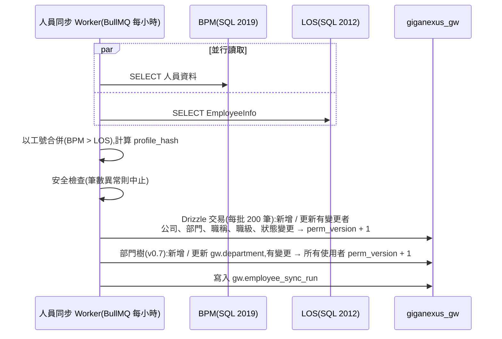

# GigaNexus Gateway — 資料庫設計(SQL Server + Redis)

> 本文件自 [PRD.md](PRD.md) §9 拆出,為該主題的唯一維護來源;PRD 僅保留摘要與連結。
> 對應 PRD 版本:**v0.7**(2026-09-26)。v0.7 新增的 `gw.role_rule`、`gw.department`、`gw.app` 與 `gw.permission` 分類欄位為**規格,尚未實作 migration**(PRD §8.3.1–§8.3.3)。

---

> 資料庫:公司現有 **Microsoft SQL Server 2012 Standard 版**(版本號 `11.00.2100` = 2012 RTM,未套用 Service Pack)。
> 資料庫位置:**已決定**於同一台 SQL Server 上建立**獨立資料庫 `giganexus_gw`**,資料表置於 **schema `gw`**;備份、權限、生命週期與主庫 `heatco_db` 分開(見 [PRD.md](PRD.md) §14.2 Q2)。BFF 使用專屬登入帳號,僅能存取 `giganexus_gw`。
> 存取層:BFF 以 **Drizzle ORM** 存取 SQL Server,並負責把設定同步到 Redis(見 §7)。
> 外部人員資料來源(唯讀):**BPM**(另一台 SQL Server 2019 Standard)與 **`[LOS].[dbo].[EmployeeInfo]`**(與 `giganexus_gw` 同一台 SQL Server 2012),同步進 `gw.user`(見 §8)。
> 共通欄位(下表以「★共通」表示):`created_at DATETIME2(3)`、`created_by NVARCHAR(64)`、`updated_at DATETIME2(3)`、`updated_by NVARCHAR(64)`、`row_ver ROWVERSION`(樂觀鎖,管理介面同時編輯時防覆蓋)。
> 主鍵一律 `INT IDENTITY`(量小、易讀);對外識別以 `code` 唯一值為準。

## 0. SQL Server 2012 相容性限制

本文件的資料表設計僅使用 SQL Server 2012 已支援的功能(`DATETIME2`、`ROWVERSION`、篩選索引、`SEQUENCE`、`OFFSET … FETCH`)。以下 2016 之後才有的功能**不可使用**,設計上改用替代做法:

| 不可用功能(起始版本) | 影響 | 替代做法 |
| --- | --- | --- |
| JSON 函式 `JSON_VALUE` / `OPENJSON` / `ISJSON`(2016) | 表中 `NVARCHAR(MAX)` 的 JSON 欄位(`snapshot`、`request_headers_add`、`ad_groups`、`before_json`…)資料庫端無法查詢或驗證 | JSON 一律由 BFF 以 zod 驗證後寫入、讀出後在應用層解析;**需要查詢或篩選的值必須拆成獨立欄位**,不可只放在 JSON 裡 |
| `CREATE OR ALTER`、`DROP … IF EXISTS`(2016) | Migration 腳本不可使用 | 以 `IF OBJECT_ID(...) IS NOT NULL DROP …` 撰寫;drizzle-kit 產生的 SQL 須人工審查(見 §7.4) |
| `STRING_AGG`(2017)、`TRIM`(2017)、`CONCAT_WS`(2017) | 報表 / 反查 SQL | `FOR XML PATH` 或在應用層組字串 |
| Temporal Table(2016) | 設定歷史版本 | 以 `gw.config_release` 快照 + `gw.audit_log` 保存歷史 |
| Always Encrypted、Row-Level Security、Dynamic Data Masking(2016) | 密鑰與敏感欄位保護 | 密鑰只存參照(`secret_ref`),實值放 Docker secret;權限以 DB 帳號與 schema 權限控管 |
| 資料表分割 Partition(2012 僅 **Enterprise 版**;Standard 版自 2016 SP1 才支援) | 公司為 Standard 版,`gw.api_access_log` 無法依月分割 | **已決定**:`occurred_at` 建叢集索引,以 SQL Agent 排程每日離峰分批刪除逾期資料(`DELETE TOP (5000) … WHERE occurred_at < @cutoff` 迴圈),`gw.auth_log` 同法處理 |

> **連線加密注意**:SQL Server 2012 RTM **不支援 TLS 1.2**(需 SP3 以上加上 TLS 1.2 更新,或 SP4)。Node.js 22(OpenSSL 3)預設最低 TLS 1.2,`mssql`/`tedious` 啟用加密連線時將握手失敗。**已決定**:BFF ↔ SQL Server 2012(`giganexus_gw` 與 LOS)走內網、**不加密**(`encrypt: false`,已取得主管與工程師同意,2026-09-24);BPM 所在的 SQL Server 2019 支援 TLS 1.2,**需加密連線**,補償控制見 [TECH-STACK.md](TECH-STACK.md) §4。

## 1. ER 概觀

```mermaid
erDiagram
    gw_upstream ||--o{ gw_upstream_target : has
    gw_upstream ||--o{ gw_api_route : serves
    gw_api_route ||--o{ gw_aggregate_step : composes
    gw_upstream ||--o{ gw_aggregate_step : calls
    gw_permission ||--o{ gw_api_route : guards
    gw_rate_limit_policy ||--o{ gw_api_route : limits
    gw_role ||--o{ gw_role_permission : grants
    gw_permission ||--o{ gw_role_permission : in
    gw_role ||--o{ gw_role_ad_group : mapped_from
    gw_role ||--o{ gw_user_role : assigned
    gw_user ||--o{ gw_user_role : has
    gw_user ||--o| gw_local_credential : "local login"
    gw_user ||--o{ gw_local_account_token : issues
    gw_user ||--o{ gw_user_company : belongs
    gw_company ||--o{ gw_user_company : has
    gw_company ||--o{ gw_company_ad_domain : uses
    gw_company ||--o{ gw_role_company : grants
    gw_role ||--o{ gw_role_company : mapped_from
    gw_role ||--o{ gw_role_rule : matched_by
    gw_department ||--o{ gw_department : parent_of
    gw_permission ||--o{ gw_permission : parent_of
    gw_permission ||--o{ gw_app : grants_access
    gw_user ||--o{ gw_notify_message : receives
    gw_config_release ||--o{ gw_api_route : snapshots
    gw_api_import_batch ||--o{ gw_api_import_item : contains
    gw_api_client ||--o{ gw_api_client_permission : scoped
    gw_notify_template ||--o{ gw_notify_log : renders
    gw_webhook_endpoint ||--o{ gw_webhook_log : receives
```



## 2. API 管理(核心)

**`gw.upstream` — 上游服務**

| 欄位 | 型別 | 說明 |
| --- | --- | --- |
| `upstream_id` | INT PK | |
| `code` | VARCHAR(50) UQ | 服務代碼,例如 `go-mes`、`core-hrm`;亦為內部 Token 的 `aud` |
| `name` | NVARCHAR(100) | 顯示名稱 |
| `system_code` | VARCHAR(30) | 所屬系統:`mes` / `hrm` / `fms` / `endpoint` / `bpm` / `erp` / `portal` |
| `protocol` | VARCHAR(10) | `http` / `https` |
| `lb_strategy` | VARCHAR(20) | `round_robin` / `least_conn`(多 target 時) |
| `timeout_ms` | INT | 預設逾時,例如 10000 |
| `retry_count` | TINYINT | 冪等方法重試次數,預設 1 |
| `circuit_fail_threshold` | SMALLINT | 斷路器連續失敗閾值,預設 10 |
| `health_check_path` | VARCHAR(200) | 例如 `/healthz` |
| `tls_verify` | BIT | 是否驗證上游憑證 |
| `forward_cookies` | BIT | 是否透傳 Cookie,預設 0 |
| `owner` | NVARCHAR(64) | 負責人 |
| `project` | VARCHAR(100) NULL | 開發專案:實作此服務的 repo 資料夾名稱(例 `giga-endpoint`,Gateway `AGENT.md` §10.2);匯入時對應 OpenAPI 根層 `x-gateway.project`,未提供時保留既有值。不進路由快照 |
| `archatlas_node_id` | VARCHAR(50) NULL | 對應 ArchAtlas 節點 ID,可連結架構圖 |
| `is_enabled` | BIT | |
| `description` | NVARCHAR(500) | |
| ★共通 | | |

**`gw.upstream_target` — 上游實例**

| 欄位 | 型別 | 說明 |
| --- | --- | --- |
| `target_id` | INT PK | |
| `upstream_id` | INT FK | |
| `base_url` | VARCHAR(300) | 例如 `http://<mes-host>:51210`;port 必須在 **51200–51300**(管理 API 寫入時檢查,見 [BACKEND-GUIDE.md](BACKEND-GUIDE.md) §3) |
| `weight` | SMALLINT | 權重,預設 1 |
| `environment` | VARCHAR(10) | `test` / `prod`;兩區各自一套資料庫、設定不互通(PRD Q3),此欄供辨識與防誤植(路由快照只取本區的位址) |
| `is_enabled` | BIT | |
| ★共通 | | |

**`gw.api_route` — API 路由(IT 管理介面主要編輯對象)**

| 欄位 | 型別 | 說明 |
| --- | --- | --- |
| `route_id` | INT PK | |
| `route_code` | VARCHAR(100) UQ | 唯一代碼,例如 `mes.workorder.get`;匯入時對應 OpenAPI `operationId` |
| `name` | NVARCHAR(100) | 顯示名稱 |
| `system_code` | VARCHAR(30) | 所屬系統,決定公開路徑前綴 `/api/{system_code}` |
| `method` | VARCHAR(10) | `GET` / `POST` / `PUT` / `PATCH` / `DELETE` / `*` |
| `public_path` | VARCHAR(300) | 對外路徑,支援參數與萬用字元:`/api/mes/work-orders/:id`、`/api/mes/*` |
| `route_type` | VARCHAR(20) | `proxy` / `aggregate` / `internal` / `mock` |
| `upstream_id` | INT FK NULL | `proxy` 必填 |
| `upstream_method` | VARCHAR(10) NULL | 改寫方法(通常同 `method`) |
| `upstream_path` | VARCHAR(300) NULL | 改寫路徑,例如 `/v1/work-orders/:id`;空值=原路徑去除 `/api/{system}` |
| `auth_mode` | VARCHAR(20) | `public` / `authenticated` / `permission` / `api_key` |
| `permission_code` | VARCHAR(100) FK NULL | `auth_mode=permission` 時必填 |
| `rate_limit_policy_id` | INT FK NULL | 未設則套用系統預設 |
| `cache_ttl_sec` | INT NULL | 僅 GET 有效;快取鍵含使用者或共用由 `cache_scope` 決定 |
| `cache_scope` | VARCHAR(10) NULL | `user` / `shared` |
| `timeout_ms` | INT NULL | 覆寫上游預設 |
| `max_body_kb` | INT NULL | 請求大小上限 |
| `request_headers_add` | NVARCHAR(MAX) NULL | JSON:額外加入上游的標頭 |
| `response_headers_remove` | NVARCHAR(MAX) NULL | JSON:要移除的回應標頭 |
| `mock_response` | NVARCHAR(MAX) NULL | `route_type=mock` 時的回應 JSON |
| `audit_level` | VARCHAR(10) | `none` / `meta`(僅記路徑、人、狀態)/ `body`(含請求內容,敏感 API 用) |
| `priority` | SMALLINT | 路徑衝突時優先序(數字小優先);明確路徑永遠優先於萬用字元 |
| `status` | VARCHAR(12) | `draft` / `published` / `disabled` / `deprecated` |
| `deprecated_at` | DATETIME2 NULL | 棄用日期(回應加 `Deprecation` 標頭) |
| `version_tag` | VARCHAR(20) NULL | API 版本註記,例如 `v1` |
| `tags` | NVARCHAR(200) NULL | 逗號分隔標籤,便於篩選 |
| `owner` | NVARCHAR(64) | 負責人 |
| `source` | VARCHAR(20) | `manual` / `openapi` / `excel` |
| `import_batch_id` | INT FK NULL | 來自哪次匯入 |
| `description` | NVARCHAR(1000) NULL | API 用途說明;匯入時對應 OpenAPI operation 的 `description` |
| `gherkin` | NVARCHAR(MAX) NULL | 行為規格(Gherkin 場景文字);匯入時對應 OpenAPI operation 的 `x-gherkin`。與 `description` 皆不進路由快照 |
| ★共通 | | |

- 唯一索引:`(method, public_path)` WHERE `status <> 'disabled'`。
- 索引:`(system_code, status)`、`(upstream_id)`、`(permission_code)`。

**`gw.aggregate_step` — 聚合步驟**

| 欄位 | 型別 | 說明 |
| --- | --- | --- |
| `step_id` | INT PK | |
| `route_id` | INT FK | 所屬聚合路由 |
| `step_key` | VARCHAR(50) | 回應中的欄位名,例如 `todos` |
| `step_order` | SMALLINT | 執行順序;相同順序者並行 |
| `upstream_id` | INT FK | |
| `method` | VARCHAR(10) | |
| `path_template` | VARCHAR(300) | 可引用請求參數與前一步結果,例如 `/v1/users/{{user.empNo}}/todos` |
| `required` | BIT | 失敗時是否整體失敗 |
| `timeout_ms` | INT | |
| `permission_code` | VARCHAR(100) NULL | 使用者無此權限時略過此步驟(同一聚合 API 依權限回傳不同內容) |
| `transform` | NVARCHAR(MAX) NULL | JSON:欄位挑選 / 改名(JSONata 表達式) |
| ★共通 | | |

**`gw.rate_limit_policy` — 限流政策**

| 欄位 | 型別 | 說明 |
| --- | --- | --- |
| `policy_id` | INT PK | |
| `code` | VARCHAR(50) UQ | 例如 `default`、`report-heavy`、`mes-high-freq` |
| `limit_count` | INT | 視窗內允許次數 |
| `window_sec` | INT | 視窗秒數 |
| `key_by` | VARCHAR(20) | `user` / `ip` / `client` / `route` |
| `burst` | INT NULL | |
| ★共通 | | |

**`gw.config_release` — 發佈版本**

| 欄位 | 型別 | 說明 |
| --- | --- | --- |
| `release_id` | INT PK | 即版本號 |
| `snapshot` | NVARCHAR(MAX) | 發佈當下完整路由 / 上游 / 政策 JSON(回滾用) |
| `diff_summary` | NVARCHAR(MAX) | 與前一版差異(新增 / 修改 / 停用清單) |
| `note` | NVARCHAR(500) | 發佈說明 |
| `published_by` / `published_at` | | |
| `rolled_back_from` | INT NULL | 若為回滾,記錄來源版本 |

**`gw.api_import_batch` / `gw.api_import_item` — 匯入紀錄**

| 表 | 主要欄位 |
| --- | --- |
| `api_import_batch` | `batch_id`、`source_type`(`openapi`/`excel`/`csv`)、`file_name`、`file_hash`、`upstream_id`(OpenAPI 匯入時指定)、`status`(`parsed`/`committed`/`failed`/`cancelled`)、`total`/`created`/`updated`/`skipped`/`errors`、★共通 |
| `api_import_item` | `item_id`、`batch_id`、`row_no`、`route_code`、`action`(`create`/`update`/`unchanged`/`error`)、`payload` JSON、`error_message` |

## 3. 身分與權限

**`gw.user` — 使用者(AD 帳號 + BPM / LOS 人事資料快取)**

> 一名員工一筆。人員同步(§8)可先建立尚未登入過的員工(AD 欄位暫為 NULL),使通知服務能以工號找到收件人;首次登入時補上 AD 欄位。

| 欄位 | 型別 | 說明 |
| --- | --- | --- |
| `user_id` | INT PK | |
| `employee_no` | VARCHAR(20) UQ | **工號**(去空白、轉大寫後儲存);對應 BPM / LOS 的唯一鍵,有網域者等於 AD `sAMAccountName`。實體工號字首代表所屬公司(S 碩禾、V 禾迅…),公司歸屬仍以 LOS 為準(§3.1) |
| `is_virtual` | BIT | LOS `IsVUser = 1` 的兼任帳號(如 `GV112001`);不可單獨登入(PRD Q16 已決定) |
| `base_employee_no` | VARCHAR(20) NULL | 兼任帳號對應的本人實體工號(`GV112001` → `V112001`) |
| `auth_type` | VARCHAR(10) NULL | 目前的驗證方式:`ad` / `local`;首次登入或註冊時寫入 |
| `ad_object_guid` | UNIQUEIDENTIFIER NULL | AD `objectGUID`;首次登入時寫入;篩選唯一索引 `WHERE ad_object_guid IS NOT NULL` |
| `ad_domain` | VARCHAR(30) NULL | 最近一次登入成功的 AD 網域(`gsc` / `gsmc` / `ygdmc`,見 PRD §8.2.1);本機帳號為 NULL |
| `upn` | VARCHAR(128) NULL | `userPrincipalName`(首次登入時寫入) |
| `display_name` | NVARCHAR(100) | 姓名(BPM > LOS > AD) |
| `email` | VARCHAR(128) NULL | BPM > LOS > AD |
| `dept_code` | VARCHAR(30) NULL | 部門代碼(BPM > LOS);內部 Token 的 `dept` |
| `department` | NVARCHAR(100) NULL | 部門名稱(BPM > LOS) |
| `org_name` | NVARCHAR(100) NULL | 所屬組織 / 公司(BPM `Organization.organizationName`) |
| `title` | NVARCHAR(100) NULL | 職稱(BPM > LOS) |
| `job_level` | VARCHAR(10) NULL | 職級(BPM `FunctionLevel.levelValue` > LOS `JobLevel`) |
| `manager_employee_no` | VARCHAR(20) NULL | 直屬主管工號(BPM) |
| `employment_status` | VARCHAR(10) NULL | `active` / `resigned` / `suspended`(BPM > LOS) |
| `profile_source` | VARCHAR(10) | `bpm` / `los` / `bpm+los` / `ad_only`(兩邊皆查無,例如外包、服務帳號) |
| `profile_hash` | CHAR(64) NULL | 人事欄位的 SHA-256,用來判斷同步時是否有變更 |
| `profile_synced_at` | DATETIME2 NULL | 最近一次成功同步人事資料的時間 |
| `ad_groups` | NVARCHAR(MAX) NULL | 最近一次登入同步的群組 DN 清單(JSON) |
| `notify_pref` | NVARCHAR(200) NULL | JSON:通道偏好 |
| `perm_version` | INT | `pv`;角色 / 狀態 / 公司 / 部門 / 職稱 / 職級變更時 +1(指派規則依這些欄位比對,PRD §8.3.1) |
| `is_disabled` | BIT | Gateway 層停用(不影響 AD) |
| `last_login_at` / `last_login_ip` | | |
| ★共通 | | |

| 表 | 欄位 | 說明 |
| --- | --- | --- |
| `gw.role` | `role_id`、`code` UQ、`name`、`description`、`is_system`(內建不可刪)、★共通 | 角色 |
| `gw.permission` | `permission_id`、`code` UQ(`mes.workorder.read`)、`name`、`system_code`、`resource`、`action`、`description`、**`kind`** VARCHAR(10) NOT NULL 預設 `api`(`app` / `menu` / `tab` / `button` / `api`,v0.7)、**`parent_code`** VARCHAR(100) NULL(上層權限代碼:選單掛應用、Tab 掛選單、按鈕掛選單或 Tab,v0.7)、**`sort`** SMALLINT 預設 0(v0.7)、★共通 | 權限;`kind` / `parent_code` / `sort` 由 OpenAPI `x-permissions` 匯入(PRD §8.3.2) |
| `gw.role_permission` | `role_id`、`permission_id`(複合 PK)、`created_at/by` | 角色 ↔ 權限 |
| `gw.role_ad_group` | `role_id`、`ad_group_dn` NVARCHAR(400)、`ad_group_guid`、`created_at/by` | AD 群組 → 角色 |
| `gw.user_role` | `user_id`、`role_id`、`valid_from`、`valid_to` NULL、`reason`、`created_at/by` | 個別指派(可到期) |
| `gw.api_client` | `client_id`、`code` UQ、`name`、`key_prefix`(前 8 碼,辨識用)、`key_hash`(Argon2id)、`allowed_ips`、`expires_at`、`is_enabled`、`last_used_at`、★共通 | 系統對系統 API Key |
| `gw.api_client_permission` | `client_id`、`permission_id` | API Key 可用權限範圍 |

### 3.1 公司與本機帳號

> 對應 PRD §8.2.5。**公司歸屬以 LOS `EmployeeInfo.CompName`(及 BPM `Organization`)為準**,不由工號字首推算(PRD Q13)。沒有 AD 網域的公司,員工以本機帳號(資料庫驗證密碼)登入。

| 表 | 欄位 | 說明 |
| --- | --- | --- |
| `gw.company` | `company_id`、`comp_name` NVARCHAR(20) UQ(LOS `CompName`,如 碩禾、禾迅、國碩、芯和)、`comp_full_name` NVARCHAR(100)(`CompFullName`)、`comp_db` VARCHAR(20) NULL(`CompDB`,ERP 資料庫代碼)、`bpm_org_oid` VARCHAR(50) NULL(BPM `Organization.OID`)、`emp_prefix` VARCHAR(5) NULL(該公司實體工號字首,參考用,如 S、V)、`is_enabled`、★共通 | 公司清單;人員同步遇到新公司時自動新增並通知 IT 設定網域 |
| `gw.company_ad_domain` | `company_id`、`domain_code` VARCHAR(30)(`gsc` / `gsmc` / `ygdmc`)、`try_order` SMALLINT;PK(`company_id`, `domain_code`) | 該公司可用的 AD 網域與嘗試順序(例:碩禾 → `gsc` 1、`gsmc` 2),由 IT 在管理介面維護;**無資料 = 無網域,需本機帳號**(例:禾迅) |
| `gw.user_company` | `user_id`、`company_id`、`via_employee_no` VARCHAR(20)(來自哪個 LOS 工號,如兼任帳號 `GV112001`)、`dept_code`、`department`、`is_virtual` BIT、`is_primary` BIT;PK(`user_id`, `company_id`, `via_employee_no`) | 使用者所屬公司與部門;由同步依本人實體工號與兼任帳號(§8.2)彙整,在職實體工號的公司為主要公司 |
| `gw.role_company` | `role_id`、`company_id`、`created_at/by`;PK(`role_id`, `company_id`) | 公司 → 角色(本機帳號與 AD 帳號皆適用) |

### 3.2 指派規則、部門樹、應用(v0.7,規格)

> 對應 PRD §8.3.1–§8.3.3(員工入口網 giga-Portal、GigaItApp 設定畫面)。尚未建立 migration;實作時依 §0 的 2012 限制與 §7.4 流程。

| 表 | 欄位 | 說明 |
| --- | --- | --- |
| `gw.role_rule` | `rule_id` INT PK、`role_id` FK、`company_id` INT NULL(FK `gw.company`)、`dept_code` VARCHAR(30) NULL、`include_sub_depts` BIT 預設 1、`job_levels` NVARCHAR(200) NULL(職級值 JSON 陣列,如 `["5","6"]`)、`title` NVARCHAR(100) NULL(職稱完全相符,選配)、`description` NVARCHAR(200) NULL、`is_enabled` BIT、★共通 | 依人事欄位指派角色:同一規則內各條件 AND,NULL = 不限;同一角色多條規則 OR;至少要有一個條件(不可空規則)。比對對象為使用者**所有所屬公司與部門**(`gw.user_company`,含兼任),職級、職稱取 `gw.user`。寫入後所有使用者 `perm_version + 1` |
| `gw.department` | `dept_code` VARCHAR(30) PK、`name` NVARCHAR(100)、`parent_dept_code` VARCHAR(30) NULL、`company_id` INT NULL、`bpm_unit_oid` VARCHAR(50) NULL、`is_enabled` BIT、`synced_at` DATETIME2(3) | 部門樹(BPM `OrganizationUnit` 與上層單位,§8.3 同步);`include_sub_depts` 以此展開下層部門。樹有變更時所有使用者 `perm_version + 1` |
| `gw.app` | `app_id` INT PK、`code` VARCHAR(30) UQ(`portal`、`it`)、`name` NVARCHAR(50)、`base_path` VARCHAR(100)(`/`、`/it/`,對應 PRD §7.2.1)、`icon` VARCHAR(30)、`sort` SMALLINT、`permission_code` VARCHAR(100) FK → `gw.permission.code`(`kind = app`)、`is_enabled` BIT、★共通 | 應用登記;`/api/auth/me` 的 `apps` 依此與使用者權限過濾;以 CLI `apply` 的 `apps:` 維護 |

- 有效角色 = AD 群組對應 ∪ 公司預設角色 ∪ **符合的指派規則** ∪ 有效的個別指派;有效權限計算結果仍以 `gw:perm:{userId}:{pv}` 快取(§6)。
- 權限試算(`POST /api/admin/rbac/preview`)與登入時使用同一個計算函式,並回傳每個角色的命中來源。

**`gw.local_credential` — 本機帳號密碼**

| 欄位 | 型別 | 說明 |
| --- | --- | --- |
| `user_id` | INT PK FK | 對應 `gw.user`;一人最多一組 |
| `password_hash` | VARCHAR(200) NULL | Argon2id 編碼字串(含參數與 salt);啟用前為 NULL |
| `status` | VARCHAR(20) | `pending_verify`(待 Email 驗證)/ `pending_approval`(LOS / BPM 查無,待管理員審核)/ `active` / `locked` / `disabled` |
| `failed_count` | SMALLINT | 連續失敗次數,登入成功歸零;達 10 次改為 `locked` |
| `locked_at` | DATETIME2 NULL | |
| `must_change_password` | BIT | IT 代建或重設後為 1,首次登入須更換 |
| `password_changed_at` | DATETIME2 NULL | |
| `password_history` | NVARCHAR(1000) NULL | 前 3 次密碼雜湊(JSON 陣列),防止重複使用 |
| `registered_via` | VARCHAR(20) | `self_email`(Email 驗證)/ `self_jobdate`(無 Email,比對到職日)/ `self_approved`(管理員審核)/ `admin`(IT 代建)/ `legacy_portal`(舊單一入口自動遷移,§9) |
| `legacy_migrated_at` | DATETIME2 NULL | 自舊單一入口遷移的時間 |
| `approved_by` / `approved_at` | NVARCHAR(64) / DATETIME2 NULL | LOS / BPM 查無者的管理員審核紀錄 |
| `manager_notified_at` | DATETIME2 NULL | 無 Email 直接啟用時,通知主管的時間 |
| ★共通 | | |

**`gw.local_account_token` — 驗證 / 啟用 / 重設連結**

| 欄位 | 型別 | 說明 |
| --- | --- | --- |
| `token_id` | INT PK | |
| `user_id` | INT FK | |
| `purpose` | VARCHAR(20) | `verify_email` / `activate` / `reset_password` |
| `token_hash` | CHAR(64) UQ | SHA-256;明文只出現在寄出的連結中 |
| `expires_at` | DATETIME2 | 驗證與重設 30 分鐘;IT 代建的啟用連結 72 小時 |
| `used_at` | DATETIME2 NULL | 使用後即失效;同用途新 token 產生時舊 token 一併作廢 |
| `created_ip` | VARCHAR(45) | |
| `created_at` | DATETIME2(3) | |

- 索引:`gw.local_credential(status)`(管理介面查待審核);`gw.local_account_token(user_id, purpose)`。
- 逾期 30 天的 token 由 §0 的 SQL Agent 排程分批刪除。
- 本機帳號的建立、審核、重設、解鎖、停用寫入 `gw.audit_log`;登入、註冊、重設密碼事件寫入 `gw.auth_log`(§5)。

## 4. 通知與 Webhook

| 表 | 主要欄位 |
| --- | --- |
| `gw.notify_template` | `template_id`、`code` UQ、`name`、`channels`(預設通道 JSON)、`email_subject`、`email_body`(HTML)、`inapp_body`、`is_enabled`、★共通 |
| `gw.notify_log` | `log_id` BIGINT PK、`template_code`、`channel`、`recipient_user_id`、`recipient_address`、`status`(`queued`/`sent`/`failed`/`dead`)、`retry_count`、`provider_msg_id`、`error_message`、`idempotency_key`、`requested_by`、`queued_at`、`sent_at` |
| `gw.notify_message` | `message_id` BIGINT PK、`user_id`、`title`、`body`、`link_url`、`is_read`、`read_at`、`created_at`(站內通知) |
| `gw.webhook_endpoint` | `endpoint_id`、`source_code` UQ(本階段僅 `bpm`)、`verify_method`(`hmac_sha256`/`none`)、`secret_ref`(密鑰參照,實值存 secret 檔或加密欄位)、`signature_header`、`allowed_ips`、`dispatch_type`(`route`/`queue`/`handler`)、`dispatch_target`、`is_enabled`、★共通 |
| `gw.webhook_log` | `log_id` BIGINT PK、`endpoint_id`、`request_id`、`idempotency_key`、`remote_ip`、`verified`、`status_code`、`payload`(可設定是否保存)、`received_at`、`processed_at`、`error_message` |

> **LINE 相關欄位暫緩**:`gw.user.line_user_id` / `line_bound_at`、`gw.notify_template.line_body`、`gw.line_bind_code` 表、`webhook_endpoint.verify_method = line_signature` 本階段**不建立**;開發 LINE 通知時再以 migration 新增(見 PRD §8.5)。

## 5. 稽核

| 表 | 主要欄位 | 保存 |
| --- | --- | --- |
| `gw.audit_log` | `audit_id` BIGINT PK、`occurred_at`、`actor_user_id`、`actor_name`、`actor_ip`、`action`(`route.create`、`release.publish`、`role.permission.grant`…)、`entity_type`、`entity_id`、`before_json`、`after_json`、`request_id` | 只新增不可修改(資料庫權限僅 INSERT/SELECT);至少保存 3 年 |
| `gw.auth_log` | `log_id` BIGINT PK、`occurred_at`、`username`、`user_id` NULL、`auth_method`(`ad`/`local`)、`event`(`login_success`/`login_fail`/`logout`/`refresh`/`token_reuse_detected`/`forced_logout`/`register_request`/`register_verified`/`register_approved`/`password_reset_request`/`password_reset`/`password_changed`/`account_locked`/`legacy_migrated`)、`reason`、`ip`、`user_agent` | 1 年 |
| `gw.api_access_log`(選用) | 僅 `audit_level ≥ meta` 的路由:`occurred_at`、`request_id`、`route_code`、`user_id`/`client_id`、`method`、`path`、`status`、`duration_ms`、`body`(僅 `body` 等級) | 180 天;排程分批刪除(Standard 版不支援分割,見 §0) |

> 一般 API 存取量大,**全量存取紀錄走 Nginx / BFF 日誌檔 → 集中日誌**,不寫入 SQL Server;DB 只存需稽核的路由。

## 6. Redis 鍵設計

| 鍵 | 型別 | TTL | 用途 |
| --- | --- | --- | --- |
| `gw:routes:version` | String | — | 目前發佈版本號 |
| `gw:routes:snapshot` | String(JSON) | — | 目前發佈的完整路由快照 |
| `gw:config:changed` | Pub/Sub 頻道 | — | 通知所有 BFF 重載 |
| `gw:perm:{userId}:{pv}` | Set | 15 分 | 使用者有效權限代碼集合 |
| `gw:rt:{familyId}` | Hash | 8h / 7d | Refresh Token 家族:目前 RT 雜湊、userId、裝置資訊 |
| `gw:user:rt:{userId}` | Set | 同上 | 使用者所有 RT 家族(強制登出用) |
| `gw:deny:{jti}` | String | Access Token 剩餘效期 | 已撤銷 Access Token |
| `gw:login:fail:{user}` / `gw:login:fail:ip:{ip}` | Counter | 15 分 | 登入失敗限流 |
| `gw:rl:{policy}:{key}` | Sorted Set | 視窗秒數 | 滑動視窗限流 |
| `gw:cache:{routeCode}:{hash}` | String | `cache_ttl_sec` | GET 回應快取 |
| `gw:cb:{upstreamCode}` | Hash | 30 秒 | 斷路器狀態 |
| `gw:client:{keyPrefix}` | Hash | 5 分 | API Key 快取(雜湊、權限範圍、允許 IP) |
| `gw:idem:{source}:{key}` | String | 24h | Webhook / 通知去重 |
| `bull:notify:*` | BullMQ | — | 通知佇列 |
| `bull:employee-sync:*` | BullMQ(可重複工作) | — | 人員同步排程;BullMQ 確保多個實例下同一時間只執行一次 |
| `gw:lock:sync` | String(`SET NX PX`) | 30 秒 | 補償同步時的分散式鎖,避免多個 BFF 實例同時重推快照 |
| `gw:pwchg:{tokenHash}` | String | 10 分 | 限定變更密碼憑證(舊入口遷移或 IT 重設後首次登入;只能呼叫變更密碼) |
| `gw:reg:ip:{ip}` / `gw:reg:emp:{employeeNo}` | Counter | 1 小時 | 註冊與忘記密碼請求限流(例如每 IP 每小時 10 次、每工號每小時 3 次) |

## 7. Drizzle ORM 與 Redis 同步

### 7.1 存取層原則

- **SQL Server 是事實來源,Redis 是衍生資料**:所有設定、權限、使用者資料都以 Drizzle 寫入 SQL Server;Redis 內容一律可由 SQL Server 重建。
- Drizzle schema(TypeScript,`bff/src/db/schema/`)為資料表定義的唯一來源,對應本文件 §2–§5 與 §8.5;查詢與寫入的型別由 schema 推導,不另寫手動 DTO。
- 所有同步邏輯集中在 BFF 的 `sync` 模組(`bff/src/db/sync/`),業務模組不直接操作設定類 Redis 鍵。不使用 Drizzle 內建的查詢快取,以免快取失效時機分散在各處、難以掌握。
- **先提交資料庫、再更新 Redis**:Redis 寫入不放在資料庫交易內;Redis 失敗不回滾資料庫,改由補償機制(§7.3)修正。

### 7.2 各類資料的同步方式

| 資料 | 寫入(Drizzle → SQL Server) | Redis 同步方式 | 失效 / 更新時機 |
| --- | --- | --- | --- |
| 路由、上游、聚合步驟、限流政策 | 管理 API 編輯存為 `draft` | **發佈時整份快照推送**:交易內 `draft → published` 並寫入 `gw.config_release`;提交後 `SET gw:routes:snapshot`、`SET gw:routes:version`、`PUBLISH gw:config:changed` | 只有「發佈 / 回滾」會改變 Redis;編輯草稿不影響線上 |
| 使用者有效權限 | 角色、權限、AD 群組對應、個別指派變更 | **Cache-aside**:查 `gw:perm:{userId}:{pv}`,未命中時以 Drizzle 查詢展開後寫入(TTL 15 分) | 變更時在**同一交易**內遞增受影響使用者的 `perm_version`;鍵名含 `pv`,舊鍵自然過期,不需逐一刪除 |
| 使用者基本資料 | 人員同步 Worker 自 BPM / LOS 寫入人事欄位;登入時補 AD 欄位(見 §8) | 不另外快取(登入時才讀) | 人事欄位變更時在同一交易內遞增 `perm_version`,已登入者 15 分鐘內換發的 Token 即帶新部門 |
| API Key | 建立 / 停用 `gw.api_client` | Cache-aside:`gw:client:{keyPrefix}`(TTL 5 分) | 停用時提交後直接 `DEL` |
| 稽核紀錄 | 與業務變更在**同一交易**內寫入 `gw.audit_log` | 不同步 | — |
| Refresh Token、黑名單、限流、去重 | 不寫資料庫 | 只存在 Redis | 依 TTL |

### 7.3 一致性與補償

```mermaid
sequenceDiagram
    participant B as BFF(發佈)
    participant S as SQL Server
    participant R as Redis
    participant BN as 所有 BFF 實例
    B->>S: Drizzle 交易:draft → published、寫 config_release N、寫 audit_log
    S-->>B: COMMIT
    B->>R: SET snapshot / version = N;PUBLISH gw:config:changed N
    alt Redis 寫入失敗
        B-->>B: 回應「已發佈,同步中」,記錄告警
    end
    loop 每 60 秒
        BN->>R: GET gw:routes:version
        BN->>S: SELECT MAX(release_id)(Drizzle)
        alt Redis 版本落後資料庫
            BN->>R: SET gw:lock:sync NX PX 30000
            BN->>S: 讀取 config_release 最新快照
            BN->>R: 重推 snapshot / version + PUBLISH
        end
    end
```

- 版本號(`release_id`)單調遞增,BFF 實例只接受**比目前更新**的版本,重複或亂序的通知不會造成回退(回滾也是產生新的版本號)。
- Redis 整個清空或重建時,第一個啟動的 BFF 實例依上述補償流程自 SQL Server 重推快照;權限快取則自然於下次請求時重建。

### 7.4 Migration 流程

- 以 `drizzle-kit generate` 由 schema 產生 SQL migration,放在 `db/migrations/`,納入版控。
- **產生的 SQL 須人工審查**,確認不含 SQL Server 2012 不支援的語法(見 §0);必要時手動調整後再提交。
- 測試區與正式區一律在部署時以 migration 容器套用(`docker compose run --rm migrate`,以 Drizzle migrator 執行,見 [DEPLOYMENT.md](DEPLOYMENT.md) §3.2–3.3);migration 必須向下相容;**正式區禁止使用 `drizzle-kit push`**。
- 內建角色、權限、預設政策等種子資料以 Drizzle 撰寫的 seed 腳本(`db/seed/`)匯入,可重複執行(以 `code` 判斷存在與否)。

## 8. 外部人員資料來源(BPM / LOS)

### 8.1 來源與連線

| 來源 | 主機 / 版本 | 讀取對象 | 帳號權限 | 連線加密 | 角色 |
| --- | --- | --- | --- | --- | --- |
| **BPM** | 獨立主機,**SQL Server 2019 Standard**(`15.0.2160.4`,RTM-GDR) | EFGP 組織資料表(`Users`、`Functions`、`OrganizationUnit`、`Organization`、`FunctionDefinition`、`FunctionLevel`),建議包成唯讀 view([REFERENCES.md](REFERENCES.md) §1.2) | 唯讀,僅 SELECT 指定 view / 表 | **`encrypt: true`**(2019 支援 TLS 1.2);BPM 憑證若非企業 CA 簽發,加 `trustServerCertificate: true`。既有 GeneralBackend 目前以不加密連線,Gateway 改為加密 | **主要來源** |
| **LOS** | 與 `giganexus_gw` 同一台 **SQL Server 2012** | `[LOS].[dbo].[EmployeeInfo]`(含兼任帳號 `IsVUser = 1`);建議 DBA 提供**排除個資欄位**的唯讀 view | 唯讀,僅 SELECT 該 view | `encrypt: false`(同 §0 決策) | 補充來源 |
| **舊單一入口** | 與 LOS 同一台 **SQL Server 2012** | `[PortalSolar].[dbo].[LoginData]`,只在舊帳號首次登入時讀取(§9) | 唯讀,僅 SELECT 指定 view | `encrypt: false`(同 §0 決策) | 帳號遷移 |

- 每個來源**各自一個連線池、各自一個唯讀登入帳號**,與寫入 `giganexus_gw` 的帳號分開;不使用 Linked Server 或跨資料庫 JOIN,在 BFF 應用層合併。
- **建議**由 BPM 負責人與 DBA 各提供一個固定欄位的唯讀 view(例如 `dbo.vw_gn_employee`),避免來源系統改表結構時直接影響 Gateway(PRD Q9)。
- 以 Drizzle 定義這兩個來源的**唯讀** schema(`bff/src/db/external/`),drizzle-kit **不得**對外部資料庫產生或執行 migration。

### 8.2 對應鍵與欄位合併

- **對應鍵**:工號(BPM `Users.id` = LOS `UserID` = AD `sAMAccountName`)。比對前一律去除空白並轉大寫。
- **合併規則**:同一欄位 **BPM 有值用 BPM,否則用 LOS,兩者皆無才用 AD**。
- 兩個來源都查無此工號(外包、服務帳號):仍可登入,`profile_source = ad_only`,部門為 NULL。
- 欄位對應(BPM 依 GeneralBackend 已驗證的 EFGP 查詢,見 [REFERENCES.md](REFERENCES.md) §1.2;LOS 依 `EmployeeInfo` 欄位,PRD Q9 已決定):

| `gw.user` 欄位 | BPM(主) | LOS `EmployeeInfo`(補充) | AD(最後) |
| --- | --- | --- | --- |
| `employee_no`(對應鍵) | `Users.id` | `UserID` | `sAMAccountName`(本機帳號無) |
| `display_name` | `Users.userName` | `UserName` | `displayName` |
| `email` | `Users.mailAddress` | `EMail`(可能為空) | `mail` |
| `dept_code` / `department` | `OrganizationUnit.id` / `organizationUnitName`(僅 `Functions.isMain = 1`) | `EFDept` / `EFDeptName`(BPM 部門代碼) | — |
| 部門樹 `gw.department`(v0.7) | `OrganizationUnit` 的上層單位(欄位名稱待 BPM 負責人提供的唯讀 view 確認) | — | — |
| `org_name` 與公司歸屬 | `Organization.organizationName` | `CompName`(對應 `gw.company`) | — |
| `title` | `FunctionDefinition.functionDefinitionName` | `JobName` | — |
| `job_level` | `FunctionLevel.levelValue`(`Functions.approvalLevelOID`) | `JobLevel` | — |
| `manager_employee_no` | 指定主管 > 單位主管;主管為本人時取上層 / 上上層單位主管(既有 CASE 邏輯) | `BossID` | — |
| `employment_status` | `Users.leaveDate IS NULL` → `active`,有值 → `resigned` | `LeaveDate` 空白 → `active`,有值 → `resigned` | — |
| `is_virtual` / `base_employee_no` | — | `IsVUser`;兼任帳號以字尾比對本人工號 | — |

- LOS 的日期欄位(`JobDate`、`LeaveDate`、`TransDate`)查詢結果為 `d/M/yyyy` 形式(例 `22/3/2023`);若欄位型別為字串,同步時必須明確依此格式解析,不可依伺服器地區設定自動轉換。
- **不讀取、不儲存的個資欄位**:`ID`、`ID2`、`ID3`(身分證字號等)、`BossPID`、`BirthDate`、`Sex`、`PhoneNo`、`EmployeeCard`、`CPF39`、`CPF32`、`IsLeavePay`。建議 LOS view 直接不提供這些欄位。
- `JobDate`(到職日)只在自行註冊時即時比對(PRD §8.2.5),不寫入 `gw.user`。
- 暫不使用:`CompDB`(僅存於 `gw.company`)、`ERPDept`、`NotesID`、`TransDate`、`IsNew`、`BossName` / `BossJobName` / `BossNotesID` / `BossEMail`(由主管工號即可查得;`BossEMail` 僅用於無 Email 註冊時的主管通知)。

**兼任帳號(虛擬帳號)**

- LOS `IsVUser = 1` 的工號是本人在其他公司的兼任身分,工號為「兼任字首 + 本人實體工號」,例如 `GV112001`(本人 `V112001` 在碩禾兼任)、`US112009`(本人 `S112009` 在禾迅兼任)。
- 同步時以**字尾比對**找出本人實體工號(取最長相符者),寫入 `base_employee_no`,並把兼任的公司與部門併入本人的 `gw.user_company`(`is_virtual = 1`);權限取所有公司角色的聯集。
- 兼任帳號本身**不可登入**(PRD Q16 已決定);字尾比對不到本人者記錄於同步紀錄並告警。

**同一人多個實體工號(調動)**

- 員工調動時 LOS 會有多筆實體工號,例如 `S112009`(碩禾,已離職)與 `V112001`(禾迅,在職)。
- **不歸戶**(PRD Q17 已決定):每個工號是獨立的 `gw.user`,以哪個工號登入就使用該工號的人事資料與權限;Gateway 不讀取身分證字號。
- 以已離職工號登入時(例如 AD 帳號仍為 `S112009`),依 PRD Q10 只標記並通知 IT,不自動停用;調動者應改用新工號登入(新公司無網域者自行註冊本機帳號)。

### 8.3 排程同步



- **公司歸屬**:依 LOS 每筆紀錄的 `CompName` 對應 `gw.company`(遇到新公司自動新增,預設無網域並通知 IT 設定);本人實體工號與兼任帳號的公司、部門彙整進 `gw.user_company`。
- **頻率**:每小時全量比對一次(人數在數百到數千之間,全量讀取成本低,邏輯最簡單);IT 可於管理介面手動觸發。
- **只更新有變更的人**:以 `profile_hash` 比對,未變更者不寫入,避免無意義地遞增 `perm_version`。
- **安全檢查**:任一來源回傳筆數比上次成功同步少 **20% 以上**,或回傳 0 筆,視為來源異常,本次**中止不寫入**並告警。
- **來源停機**:某一來源讀取失敗時,只用另一來源的資料更新**其有值的欄位**,不因缺資料把既有欄位清成 NULL;連續 3 次失敗發送告警。
- **離職**:`employment_status` 變為 `resigned` 時,標記並通知 IT;**不自動停用** Gateway 帳號,登入仍以 AD 帳號狀態為準(PRD Q10 已決定)。

### 8.4 登入時補查

- 登入時 `gw.user` 找不到該工號,或 `profile_synced_at` 為 NULL(從未同步成功)時,BFF 以工號**並行**即時查詢 BPM 與 LOS,各逾時 **3 秒**。
- 補查失敗不阻擋登入:以 AD 資料建立 / 更新使用者(`profile_source = ad_only`),並將該工號加入下一次同步的優先清單。

### 8.5 同步紀錄表

**`gw.employee_sync_run` — 人員同步執行紀錄**

| 欄位 | 型別 | 說明 |
| --- | --- | --- |
| `run_id` | INT PK | |
| `trigger_type` | VARCHAR(10) | `schedule` / `manual` / `login` |
| `started_at` / `finished_at` | DATETIME2(3) | |
| `status` | VARCHAR(12) | `success` / `partial`(一個來源失敗)/ `aborted`(安全檢查未過)/ `failed` |
| `bpm_rows` / `los_rows` | INT NULL | 各來源讀到的筆數 |
| `created` / `updated` / `unchanged` | INT | 寫入結果 |
| `resigned_flagged` | INT | 本次新標記離職人數 |
| `error_message` | NVARCHAR(2000) NULL | |
| `triggered_by` | NVARCHAR(64) NULL | 手動觸發者 |

保存 1 年,以 §0 的排程分批刪除處理(與 `gw.auth_log` 同一個 SQL Agent 作業)。

## 9. 舊單一入口帳號遷移(PortalSolar.LoginData)

> 對應 PRD §8.2.5「舊單一入口帳號自動遷移」。舊系統在員工沒有 AD 帳號時以此表驗證帳密;Gateway 只在**首次登入**時讀取,驗證成功即建立 `gw.local_credential`,之後不再讀取。

### 9.1 來源欄位

| 欄位 | 型別 | Gateway 用途 |
| --- | --- | --- |
| `PID` | NVARCHAR(50) | 工號,查詢條件(`PID = @工號`) |
| `PNum` | NVARCHAR(50) | 舊密碼密文(演算法見下)。**只用來比對,不寫入 `giganexus_gw`** |
| `CName` | NVARCHAR(50) | 姓名,僅供稽核紀錄比對 |
| `Certify` | NVARCHAR(50) | 舊註冊時固定寫入 `NoPass`,舊登入驗證從未使用;Gateway 不使用(PRD Q19) |
| `EName` | NVARCHAR(50) | 依備份原始碼,舊註冊頁把「確認密碼」**以明文**寫入此欄(欄位名稱雖為英文名)。Gateway **不讀取**,view 不得包含此欄;舊系統不修改(PRD Q22) |
| `DeptId`、`TelNum`、`EMail` | NVARCHAR(50) | 不使用(部門與 Email 以 LOS / BPM 為準) |

- 建議 DBA 提供唯讀 view,只含 `PID`、`PNum`、`CName`、`Certify`;BFF 使用獨立的唯讀登入帳號與連線池。
- 比對方式:以舊演算法加密使用者輸入的密碼,與 `PNum` 比較;**不解密舊密文**。演算法金鑰存 Docker secret,不入文件與版控。
- **演算法**(舊系統 `App_Code/GSCLib.cs` 的 `Cipher.Encrypt`,PRD Q18;**NAS 上的原始碼為兩三年前的備份,現行正式版本可能不同**):
  1. `md5 = MD5(UTF8(金鑰字串 + 伺服器常數))`,共 16 bytes;前 8 bytes 為 DES 金鑰,後 8 bytes 為 IV。
  2. 以 **DES-CBC、PKCS7 填補**加密 `UTF8(輸入密碼)`。
  3. 輸出 **Base64**,與 `PNum` 字串完全相等即為相符。
  - 兩個常數字串存 Docker secret,不寫入文件與版控。單一 DES 不在 Node.js 22 預設的 OpenSSL 3 中,以純 JS 實作;以**現行系統**建立的測試帳號驗證密文一致後才啟用。
- 舊登入以字串串接組 SQL(有 SQL injection 風險);Gateway 一律使用參數化查詢。

### 9.2 遷移結果

| 情況 | 處理 |
| --- | --- |
| 比對成功、LOS / BPM 在職 | 建立 `gw.local_credential`:`password_hash` = 輸入密碼的 Argon2id、`registered_via = legacy_portal`、`must_change_password = 1`、`legacy_migrated_at`;寫入 `gw.auth_log`(`legacy_migrated`)與 `gw.audit_log` |
| 比對成功、但已離職 | 不遷移,回覆一般登入失敗訊息,記錄 `gw.auth_log` |
| 查無工號或密碼不符 | 回覆一般登入失敗訊息,失敗次數計入 `gw:login:fail:{user}` |
| 已有 `gw.local_credential` | 不再讀取 `LoginData` |

- 遷移進度:以 `registered_via = legacy_portal` 統計已遷移人數,作為 PRD Q20 停用舊入口的依據。
