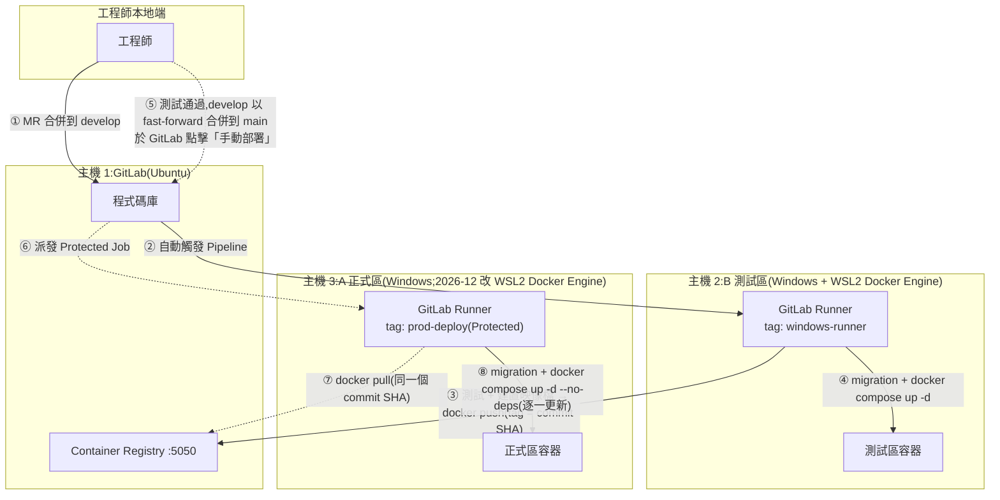
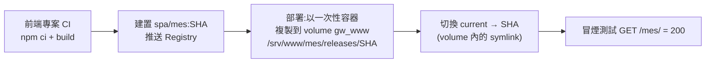

# GigaNexus Gateway — 部署與 CI/CD

> 對應 PRD 版本:**v0.9**(2026-10-01;主機 Docker 現況:主機 2 已改 WSL2 Docker Engine,主機 3 於 2026-12 改用)。測試區架設紀錄見 [TEST-DEPLOY-RUNBOOK.md](TEST-DEPLOY-RUNBOOK.md)、[COMPANY-ENV-PLAN.md](COMPANY-ENV-PLAN.md) §1。說明測試區 / 正式區主機、GitLab CI/CD 流程,以及 Gateway 各元件(BFF、worker、Nginx、SPA、資料庫 migration)的部署與回滾方式。
> 下游後端與前端 SPA 專案沿用同一套流程(見 [BACKEND-GUIDE.md](BACKEND-GUIDE.md)、[FRONTEND-GUIDE.md](FRONTEND-GUIDE.md) §9)。

---

## 1. 主機與角色

| 主機 | 作業系統 / Docker | 角色 | 主要內容 |
| --- | --- | --- | --- |
| **主機 1** | Ubuntu VM;Docker Engine(指令安裝) | GitLab 伺服器 | 程式碼庫、CI/CD、**Container Registry(`:5050`)** |
| **主機 2**(10.10.130.124) | Windows 10;**WSL2 內的 Docker Engine**(2026-09-30 起;不使用 Docker Desktop) | **B 測試區** + CI Runner(WSL shell executor,tag `windows-runner`) | Gateway 測試區:`nginx`、`bff ×2`、`worker`、`redis`;其他系統的測試容器 |
| **主機 3**(10.10.130.122) | Windows;目前為 **Docker Desktop**,**2026-12 建置正式區時改為 WSL2 內的 Docker Engine**(與主機 2 相同) | **A 正式區** + CD Runner(tag `prod-deploy`,Protected) | Gateway 正式區:同上 |
| 既有 SQL Server 2012 主機 | — | 資料庫 | `giganexus_gw_test`(測試區)、`giganexus_gw`(正式區)、LOS、PortalSolar |
| BPM 主機 | SQL Server 2019 | 人事資料來源(唯讀) | EFGP 組織資料 |

- 測試區與正式區**各自一套** Gateway 容器、Redis 與 `giganexus_gw` 資料庫(PRD Q3)。
- `:443` 以 **DNS 名稱**對外(PRD Q1,測試區 `giganexus-test.gigasolar.com.tw`、正式區 `giganexus.gigasolar.com.tw`),`:80` 轉址;`:9443`(Agent)以**主機 IP** 存取。
- 下游後端可部署在同一台主機或其他主機;供 Gateway 呼叫的 port 一律在 **51200–51300**(BACKEND-GUIDE §3)。

---

## 2. CI/CD 流程

- **正式區不使用 SSH、不放私鑰**:由主機 3 上的 Runner 自己拉映像檔、在本機更新容器。
- **正式區部署的映像檔,就是測試區測過的那一個**:映像檔以 commit SHA 標記;`develop` 合併到 `main` 使用 **fast-forward**,`main` 的 SHA 與測試區相同,正式區直接拉該 SHA 的映像檔,不重新建置。若因特殊情況無法 fast-forward,`main` 的 Pipeline 先在主機 2 建置並推送,再進入手動部署。

### 2.1 分支策略

| 分支 | 用途 | Pipeline |
| --- | --- | --- |
| `feature/*` | 功能開發 | lint、型別檢查、單元測試 |
| `develop` | 整合分支(僅能經 MR 合併) | 測試 → 建置推送 → **自動部署測試區** |
| `main` | 正式版本(Protected,僅能經 MR 合併) | **手動核可**後部署正式區 |
| `hotfix/*` | 正式區緊急修正 | 由 `main` 分出,合併回 `main` 部署後,再合併回 `develop` |

### 2.2 Pipeline 階段

| 階段 | 工作 | Runner | 觸發 |
| --- | --- | --- | --- |
| `check` | lint、型別檢查、單元測試、Gherkin `@mvp` 場景、`nginx -t`(以 nginx 映像檔檢查設定) | `windows-runner` | 所有分支 |
| `build` | 建置映像檔並推送 Registry,tag 為 `$CI_COMMIT_SHA` | `windows-runner` | `develop`、`main`(非 fast-forward 時) |
| `deploy-test` | 部署測試區(§3) | `windows-runner` | `develop`,自動 |
| `deploy-prod` | 部署正式區(§3) | `prod-deploy` | `main`,**手動**、Protected |
| `rollback-*` | 各元件回滾(§4) | 對應區的 Runner | 手動 |

---

## 3. 各元件的部署方式

### 3.1 映像檔

| 映像檔 | 內容 | 用於 |
| --- | --- | --- |
| `…/gateway/bff` | BFF(Fastify)與 worker 共用,以啟動指令區分;內含 migration 執行程式 | `bff-1`、`bff-2`、`worker`、`migrate` |
| `…/gateway/nginx` | Nginx 與設定檔(`nginx/`) | `nginx` |
| `…/spa/<app>` | 各 SPA 的 `dist/`(由各前端專案建置) | 發佈到共用 volume(§3.4) |
| `redis:7` | 官方映像檔 | `redis`(資料存於 named volume) |

> Registry 位址為 `<gitlab-host>:5050`。Docker Desktop 預設只接受 HTTPS Registry;若 Registry 未設定 TLS,兩台 Windows 主機需在 Docker Desktop 設定 `insecure-registries`(建議改為企業 CA 簽發憑證的 HTTPS)。

### 3.2 部署順序(每次 `deploy-test` / `deploy-prod`)

1. `docker compose pull`(拉取本次 commit SHA 的映像檔)。
2. **資料庫 migration**:`docker compose run --rm migrate`(以 Drizzle migrator 套用 `db/migrations/`;失敗即中止部署)。
3. **BFF 逐一更新**:`docker compose up -d --no-deps bff-1` → 等待 `/readyz` 通過 → `bff-2`。Nginx upstream 同時有兩個實例,更新期間不中斷服務。
4. **worker**:`docker compose up -d --no-deps worker`(BullMQ 等待執行中的工作完成後才結束)。
5. **Nginx**:只有設定或映像檔有變更時才更新。`up -d --no-deps nginx` 會重建容器,**WebSocket 會短暫斷線並由前端自動重連**;正式區安排在離峰時段。
6. **冒煙測試**:`GET /healthz`、`GET /api/auth/me`(預期 401)、各 SPA 首頁 200。

### 3.3 資料庫 migration 規則

- Migration 必須**向下相容**(先加欄位 / 表 → 程式改用 → 下一版才刪舊欄位),讓舊版 BFF 在更新過程中仍可運作。
- 不做自動降版;有問題時以**新的 migration 修正**(forward fix)。
- 測試區自動套用;正式區隨 `deploy-prod` 手動核可後套用。不使用 `drizzle-kit push`(DATABASE §7.4)。

### 3.4 SPA 靜態檔(打包成映像檔)

- Nginx 以唯讀方式掛載 named volume **`gw_www`** 到 `/srv/www`。
- 部署指令:`docker run --rm -v gw_www:/srv/www <registry>/spa/mes:<SHA> publish`,由映像檔內的腳本複製檔案並**原子切換** `current`,保留最近 5 版;**不需重啟或 reload Nginx**。
- 回滾:`docker run --rm -v gw_www:/srv/www <registry>/spa/mes:<SHA> rollback`,將 `current` 指回上一版。
- 使用 named volume(位於 Docker Desktop 的 Linux 檔案系統)而非 Windows 目錄,symlink 才能正常運作。
- 各前端專案 `include` Gateway 提供的 CI 範本(`ci-templates/spa-deploy.yml`),只需設定子路徑名稱。

### 3.5 路由設定與權限

路由、權限等設定存於資料庫,**不隨程式部署**;以 CLI / 管理介面發佈(BACKEND-GUIDE §7)。測試區與正式區設定不互通(PRD Q3):下游後端部署到各區後啟動即自動註冊為該區草稿(BACKEND-GUIDE §7.5),IT 在各區分別檢視差異後核可發佈。

---

## 4. 回滾

| 對象 | 方式 |
| --- | --- |
| BFF / worker / Nginx | 在 GitLab 對上一個成功的 Pipeline 重新執行部署 job(拉取舊 SHA 的映像檔,依 §3.2 逐一更新) |
| SPA | 執行該 SPA 的 `rollback` job(§3.4) |
| 資料庫 | 不降版,以新的 migration 修正(§3.3) |
| 路由設定 | 以發佈版本回滾(PRD §8.4.3),5 秒內生效 |

---

## 5. 設定與機密

| 類別 | 存放 | 說明 |
| --- | --- | --- |
| 環境設定(非機密) | `deploy/docker-compose.yml` + `deploy/docker-compose.test.yml` / `.prod.yml` | IP、資料庫名稱、上游位址等 |
| 機密 | 各主機受保護目錄中的檔案,以 Docker Compose `secrets` 掛載;或 GitLab **Protected + Masked** CI 變數 | JWT 私鑰、各 AD 網域服務帳號、SQL 帳密(`giganexus_gw`、LOS、BPM、PortalSolar)、SMTP、舊單一入口演算法常數、Webhook 密鑰(`webhook/<secret_ref>`,[BACKEND-GUIDE.md](BACKEND-GUIDE.md) §7.6) |
| Registry 登入 | GitLab CI 內建 `CI_REGISTRY_*` 變數 | Runner 以 job token 登入 Registry |

- 機密**不入版控、不寫進映像檔**;測試區與正式區使用不同的機密值。
- `prod-deploy` Runner 只接受 Protected 分支的 job,確保正式區機密只在正式部署時可用。

### 5.1 測試區注意事項

- **Email 攔截**:測試區的 SMTP 改寄到測試信箱(或只允許白名單收件人),避免測試通知寄給真實員工。
- **人事資料來源**:LOS、BPM、PortalSolar 沒有測試庫時,測試區以唯讀帳號讀取正式資料;測試區不寫入任何來源資料庫。
- **AD**:測試區使用與正式區相同的網域,另建測試帳號供自動化測試。

---

## 6. Windows 主機與 Docker

**現況(2026-10-01)**:主機 2 已在 WSL2 內安裝 Docker Engine(不使用 Docker Desktop),Runner 在 WSL 內以 shell executor 執行,Windows 以 `netsh interface portproxy` 將 `0.0.0.0:80 / 443` 轉到 WSL(細節見 [COMPANY-ENV-PLAN.md](COMPANY-ENV-PLAN.md) §1、[GITLAB-SETUP.md](GITLAB-SETUP.md) §3)。主機 3 目前為 Docker Desktop,**2026-12 建置正式區時改為與主機 2 相同的做法**。

| 項目 | 說明 / 設定 |
| --- | --- |
| **授權** | WSL2 內的 Docker Engine 不需授權。主機 3 改用前若仍使用 Docker Desktop:免費使用須**同時**符合員工少於 250 人**且**年營收少於 1,000 萬美元(PRD Q25) |
| **開機自動啟動** | WSL 在沒有使用中的工作階段時會停止 VM:以工作排程器於開機時啟動 WSL 並讓 Docker Engine、Runner 常駐。(Docker Desktop 則需設為登入時啟動並以專用帳號自動登入) |
| **自動更新** | 正式區不自動更新 Docker Engine / WSL,更新前先在測試區驗證 |
| **容器重啟** | 所有 Gateway 容器設定 `restart: unless-stopped`,Docker 啟動後自動恢復 |
| **資源** | 以 `.wslconfig` 設定 WSL2 可用的記憶體與 CPU,避免與主機上其他服務互相搶用 |
| **資料保存** | Redis 資料、SPA 靜態檔(`gw_www`)、CRL 使用 named volume;不使用 Windows 目錄掛載 |
| **Port 衝突** | 主機上已有其他容器(例如 `notesapp`)。部署前確認 `80`、`443`、`9443` 未被佔用 |
| **防火牆** | Windows 防火牆開放 `80`、`443`(使用者網段)、`9443`(端點網段);`51200–51300` 只開放給 Gateway 主機 |
| **來源 IP** | 主機 2 已確認 Nginx 看不到真實來源 IP(§6.1、PRD Q26),**開放給一般使用者前必須處理**;主機 3 改 Docker Engine 時採相同方案 |

### 6.1 來源 IP 保留

**主機 2 實測(2026-09-30)**:WSL2 Docker Engine(預設 NAT)+ `netsh portproxy`(即下表方案 D),自 10.10.112.13 連入,Nginx log 的 `remote_addr` 一律為 `172.19.0.1`(Docker 閘道),**來源 IP 遺失**。

**本機現象**:本機開發環境(macOS Docker Desktop 4.92,engine 29.8.0)的 Nginx access log,`remote_addr` 一律是 `192.168.65.1`(Docker Desktop VM 的閘道)。2026-09-25 以一次性 `nginx:alpine` 容器實測,從本機區網 IP 或 `127.0.0.1` 連入都一樣。

**原因**:Docker Desktop 的 published port 是由主機上的 `com.docker.backend` 程序接受連線,再經共享記憶體通道,在 VM 內**另外建立一條連線**到容器,因此原始來源 IP 不會帶進容器。Windows(WSL2 後端)使用同一套機制,社群也回報容器只看到閘道 IP(參考 1、2)。主機 2、3 若同樣如此,以下依賴 `$remote_addr` / `$binary_remote_addr` 或 BFF `req.ip` 的功能會全部失效:

| 依賴來源 IP 的功能 | 位置 | 所有連線變成同一個 IP 時 |
| --- | --- | --- |
| 全站限流 `gw_ip`(50 r/s,burst 100) | `nginx/nginx.conf`、`nginx/conf.d/portal.conf`(`:443` server 層) | 全公司共用一份額度,尖峰時 SPA 與 API 回 429 |
| 登入 / 註冊 / 密碼 API 限流 `gw_auth`(`GW_AUTH_RATE`,預設 5 r/m,burst 4) | `nginx/templates/00-env.conf.template`、`portal.conf` | 全公司每分鐘約只能登入 5 次,上班時段大量 429 |
| BFF 登入失敗 IP 計數(15 分鐘 50 次,`LOGIN_FAIL_IP_LIMIT`) | `bff/src/modules/auth/login.ts` | 任何人累計輸錯 50 次,所有人 15 分鐘內都無法登入 |
| ~~Agent 同時串流數 `limit_conn agent_conn 10`~~ | `nginx/nginx.conf` | **已處理(2026-09-25)**:改以裝置憑證指紋(`$ssl_client_fingerprint`)計算,每張憑證 10 條,不受來源 IP 影響。原本以 IP 計算時,200 台 Agent 會共用 10 條連線,其餘回 429 |
| Webhook IP 白名單(PRD §7.5) | `nginx/allowlists/<區域>/webhook-bpm.conf` | BPM 主機 IP 永遠比對不到,一律 403;若為此加入閘道 IP,等於對所有來源開放 |
| 內網服務白名單(JWKS、`/readyz`、`/docs`、`/metrics`) | `nginx/allowlists/<區域>/internal-services.conf` | 同上:只能全部拒絕或全部放行 |
| 「記住我」僅限內網(PRD Q4、IMPL-PLAN W3-4.4) | BFF `INTERNAL_NETWORKS` | 閘道 IP 落在預設值 `192.168.0.0/16` 內,所有人都被判定為內網 |
| API Key `allowed_ips`、路由限流 `keyBy: ip` | BFF | 白名單同樣只能全拒或全放;限流共用一份額度 |
| 稽核與 access log 的來源 IP | `gw.auth_log`、Nginx log、`X-Real-IP` / `X-Forwarded-For` | 無法追查請求來自哪台電腦(PRD §12 稽核「從哪」) |

#### 方案比較

| 方案 | 保留來源 IP | 說明 / 代價 |
| --- | --- | --- |
| A. 維持 Docker Desktop 預設(主機 3 現行) | 否 | 見上表 |
| B. Docker Desktop「Enable host networking」(4.34 起,`network_mode: host`) | 否 | 官方文件說明此功能運作在 layer 4,仍由 Docker Desktop 轉送;社群回報搭配 WSL mirrored 模式時,容器看到的仍是 `192.168.65.x`(參考 3、4) |
| C. Docker Desktop + WSL `networkingMode=mirrored` | 否 | mirrored 只作用在使用者自己的 WSL 發行版;Docker Desktop 不使用 mirrored 網卡,published port 仍經 `com.docker.backend`(參考 4) |
| D. 在 WSL2 內自行安裝 Docker Engine(預設 NAT 模式)+ `netsh interface portproxy`(**主機 2 現行**) | 否(**已實測**) | portproxy 是 Windows 上的 TCP 轉送,Nginx 看到的是閘道 IP(主機 2 為 `172.19.0.1`) |
| E. 在 WSL2 內自行安裝 Docker Engine + mirrored 模式 | 預期可以,**需實測** | WSL 直接使用主機的網卡與 IP,連入封包經 Docker 的 iptables DNAT 轉到容器,不改變來源位址;社群有改用此方式解決的案例(參考 4、5)。限制:需 **Windows 11 22H2 以上**(Windows Server 2022 不支援,Server 2025 目前無法啟用,參考 6);需設定 Hyper-V 防火牆允許連入;WSL 在沒有使用中的工作階段時會停止 VM,需以工作排程器於開機時啟動並讓 VM 常駐;GitLab Runner 需改在 WSL 內執行或以 `DOCKER_HOST` 指向;mirrored 模式較新,仍有已知問題(例如 IPv6 無法連入容器)。**不需 Docker Desktop 授權**,可一併解決 Q25 |
| F. Hyper-V Linux VM(外部虛擬交換器)+ Docker Engine | 可以(與一般 Linux 主機相同) | VM 在區網有自己的 IP,行為與 Linux 上的 Docker 完全相同,最可預期;以 Hyper-V「自動啟動動作」在主機開機時啟動 VM,不需使用者登入(同時解決 §6「開機自動啟動」)。**不需 Docker Desktop 授權**(Q25)。代價:需 Windows Pro / Enterprise / Server 的 Hyper-V;需網管配發新 IP,Gateway IP 改變後伺服器憑證 SAN、防火牆、使用者連結與 Agent 設定都改用新 IP(Q1);多一台 VM 需要維護與更新;主機上其他系統的容器是否一併移入另行評估 |
| G. Nginx 不放在 Docker,直接執行 nginx for Windows | 可以 | 官方標示為 beta:只有一個 worker 實際工作、只使用 `select()` / `poll()`,不應期待高效能與擴充性,且不是 Windows 服務(參考 7);與「正式區使用測試區測過的同一個映像檔」(§2)的做法不同,設定、envsubst 範本與憑證路徑需另外處理。200 條 Agent WebSocket 長連線加上瀏覽器流量,不建議 |
| H. 前面加一台 Linux 的 L4 轉送(HAProxy 或 Nginx `stream`),以 PROXY protocol 帶入來源 IP | 可以 | Docker Desktop 只轉送 TCP 內容,PROXY protocol 標頭會原樣送到容器內的 Nginx;Nginx 改為 `listen ... proxy_protocol`,並以 `set_real_ip_from <Docker 閘道 IP>`、`real_ip_header proxy_protocol` 取出來源 IP。TLS / mTLS 仍在原 Nginx 終止,憑證不需搬移。代價:需要一台 Linux 主機(主機 1 為 GitLab,不建議混用);多一個故障點;使用者改連轉送主機的 IP;**Windows 防火牆必須只允許轉送主機連入 80 / 443 / 9443**,否則任何人都能直接連入並偽造 PROXY 標頭 |
| I. 接受遺失,改用其他鍵值補償 | — | (Agent `limit_conn` 已改以裝置憑證計算);登入改以 BFF 的帳號失敗鎖定為主,放寬 Nginx `gw_ip` / `gw_auth` 並停用 BFF IP 失敗計數;Webhook 只靠 HMAC 簽章與時間戳(W3-5.10);「記住我」無法判定內網(需重新決定 Q4);稽核沒有來源 IP。PRD §7.5、Q4、§12 的要求無法滿足,只適合過渡使用 |

**建議**:

1. 主機 2 已確認遺失(方案 D)。
2. 優先採用 **F(Hyper-V Linux VM)**;主機為 Windows 11 22H2 以上且希望不另開 VM 時,可先以 **E** 做 PoC(同樣用下方步驟驗證)。已有可用的 Linux 主機時可考慮 **H**。B、C、D 無法解決,G 不建議。
3. Agent `limit_conn` 已改以裝置憑證指紋計算(2026-09-25,`nginx/nginx.conf`),不論驗證結果都適用(子公司經 NAT 連入時同樣共用來源 IP)。

#### 驗證步驟(不影響 Gateway,可在部署前執行)

1. 記錄主機環境(PowerShell):`Get-ComputerInfo -Property OsName,OsVersion`、`wsl --version`、`docker version --format '{{.Server.Platform.Name}}'`,以及 `%USERPROFILE%\.wslconfig` 的內容(是否有 `networkingMode`)。
2. 在主機上啟動一次性容器:`docker run -d --rm --name ipcheck -p 18080:80 nginx:alpine`
3. 在**另一台電腦**先以 `ipconfig` 記下自己的 IP,再執行(PowerShell 需用 `curl.exe`,不是 `curl` 別名):
   `curl.exe -s -o NUL -w "%{http_code}" "http://<主機 IP>:18080/?probe=ipcheck-<電腦名稱>"`
   連不到時,先確認 Windows 防火牆是否擋住 `18080`(測試完即移除暫時開放的規則)。
4. 回到主機查看並清除:`docker logs ipcheck 2>&1 | Select-String ipcheck`,之後 `docker stop ipcheck`。
5. 判讀:每行第一個欄位就是 Nginx 的 `remote_addr`。等於另一台電腦的 IP → **保留**;是 `192.168.65.x`、`172.x.x.x` 或主機自己的 IP → **遺失**。將結果(含步驟 1 的版本)記錄到 PRD Q26。
6. Gateway 部署到測試區後再複驗一次:`curl.exe -k -s -o NUL -w "%{http_code}" "https://<主機 IP>/api/auth/me?probe=ipcheck"`(預期 401),在主機執行 `docker logs giganexus-gw-nginx-1 --since 5m 2>&1 | Select-String ipcheck` 檢查 JSON log 的 `remote_addr`;Agent 通道(`:9443`)以測試 Agent 連線後檢查 `json_agent` log 的 `remote_addr`。
7. 若改採方案 E 或 F,以同樣步驟重新驗證。

參考(2026-09-25 查閱):

1. Docker Docs — Networking(port 轉送機制):<https://docs.docker.com/desktop/features/networking/>
2. docker/for-win#12644「WSL uses docker gateway ip for all incoming requests」:<https://github.com/docker/for-win/issues/12644>
3. Docker Docs — Host network driver(Docker Desktop 4.34+、layer 4):<https://docs.docker.com/engine/network/drivers/host/>
4. Docker Community Forums「Host networking not working on Docker Desktop in WSL2 with mirrored mode」(2025-05):<https://forums.docker.com/t/host-networking-not-working-on-docker-desktop-in-wsl2-with-mirrored-mode/147994>
5. Microsoft Learn — Accessing network applications with WSL(NAT / portproxy / mirrored、Hyper-V 防火牆):<https://learn.microsoft.com/en-us/windows/wsl/networking>
6. microsoft/WSL#12569「Support mirrored networking mode on Windows Server 2025」:<https://github.com/microsoft/WSL/issues/12569>
7. nginx for Windows — Known issues:<https://nginx.org/en/docs/windows.html>

---

## 7. 上線前檢查(每台主機一次)

- [ ] 主機使用 WSL2 Docker Engine(主機 3 於 2026-12 由 Docker Desktop 改用);主機重開後 Docker 與 Runner 能自動恢復
- [ ] GitLab Runner 已註冊並設定 tag(主機 2 `windows-runner`、主機 3 `prod-deploy` Protected)
- [ ] 兩台主機可登入 Registry `:5050`(HTTPS 憑證或 `insecure-registries`)
- [ ] `80`、`443`、`9443` 未被其他容器佔用;Windows 防火牆規則已設定
- [ ] 來源 IP 驗證(§6.1):從另一台電腦連入時,Nginx log 的 `remote_addr` 是那台電腦的 IP
- [ ] 機密檔案已放入受保護目錄,權限只限 Docker 服務帳號
- [ ] 公司 DNS A 紀錄已建立(PRD Q1);`:443` 公司憑證 `server.crt/key`、`:9443` 伺服器憑證 `agent-server.crt/key`(SAN 含本機 IP)、Agent 中繼 CA、CRL 已放入對應 volume
- [ ] 測試區 SMTP 已設定攔截
