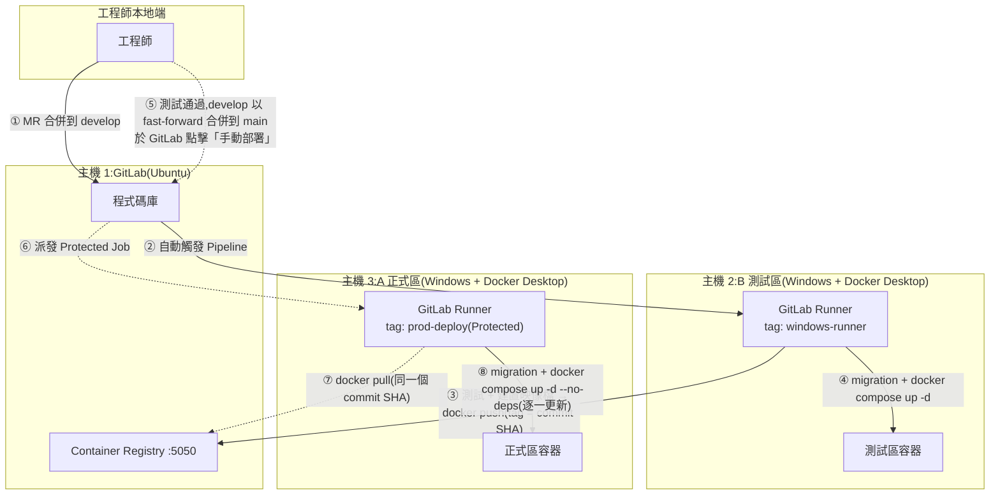
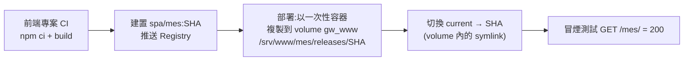

# GigaNexus Gateway — 部署與 CI/CD

> 對應 PRD 版本:**v0.4**(2026-09-24)。說明測試區 / 正式區主機、GitLab CI/CD 流程,以及 Gateway 各元件(BFF、worker、Nginx、SPA、資料庫 migration)的部署與回滾方式。
> 下游後端與前端 SPA 專案沿用同一套流程(見 [BACKEND-GUIDE.md](BACKEND-GUIDE.md)、[FRONTEND-GUIDE.md](FRONTEND-GUIDE.md) §9)。

---

## 1. 主機與角色

| 主機 | 作業系統 / Docker | 角色 | 主要內容 |
| --- | --- | --- | --- |
| **主機 1** | Ubuntu VM;Docker Engine(指令安裝) | GitLab 伺服器 | 程式碼庫、CI/CD、**Container Registry(`:5050`)** |
| **主機 2** | Windows;**Docker Desktop**(WSL2、Linux 容器) | **B 測試區** + CI Runner(tag `windows-runner`) | Gateway 測試區:`nginx`、`bff ×2`、`worker`、`redis`;其他系統的測試容器 |
| **主機 3** | Windows;**Docker Desktop**(WSL2、Linux 容器) | **A 正式區** + CD Runner(tag `prod-deploy`,Protected) | Gateway 正式區:同上 |
| 既有 SQL Server 2012 主機 | — | 資料庫 | `giganexus_gw_test`(測試區)、`giganexus_gw`(正式區)、LOS、PortalSolar |
| BPM 主機 | SQL Server 2019 | 人事資料來源(唯讀) | EFGP 組織資料 |

- 測試區與正式區**各自一套** Gateway 容器、Redis 與 `giganexus_gw` 資料庫(PRD Q3)。
- 兩區皆以**主機 IP** 對外(PRD Q1):`:80`(轉址)、`:443`、`:9443`(Agent)。
- 下游後端可部署在同一台主機或其他主機;供 Gateway 呼叫的 port 一律在 **51200–51300**(BACKEND-GUIDE §3)。

---

## 2. CI/CD 流程

- **正式區不使用 SSH、不放私鑰**:由主機 3 上的 Runner 自己拉映像檔、在本機更新容器。
- **正式區部署的映像檔,就是測試區測過的那一個**:映像檔以 commit SHA 標記;`develop` 合併到 `main` 使用 **fast-forward**,`main` 的 SHA 與測試區相同,正式區直接拉該 SHA 的映像檔,不重新建置。若因特殊情況無法 fast-forward,`main` 的 Pipeline 先在主機 2 建置並推送,再進入手動部署。

### 2.1 分支策略

| 分支 | 用途 | Pipeline |
| --- | --- | --- |
| `feature/*` | 功能開發 | lint、型別檢查、單元測試 |
| `develop` | 整合分支(僅能經 MR 合併) | 測試 → 建置推送 → **自動部署測試區** |
| `main` | 正式版本(Protected,僅能經 MR 合併) | **手動核可**後部署正式區 |
| `hotfix/*` | 正式區緊急修正 | 由 `main` 分出,合併回 `main` 部署後,再合併回 `develop` |

### 2.2 Pipeline 階段

| 階段 | 工作 | Runner | 觸發 |
| --- | --- | --- | --- |
| `check` | lint、型別檢查、單元測試、Gherkin `@mvp` 場景、`nginx -t`(以 nginx 映像檔檢查設定) | `windows-runner` | 所有分支 |
| `build` | 建置映像檔並推送 Registry,tag 為 `$CI_COMMIT_SHA` | `windows-runner` | `develop`、`main`(非 fast-forward 時) |
| `deploy-test` | 部署測試區(§3) | `windows-runner` | `develop`,自動 |
| `deploy-prod` | 部署正式區(§3) | `prod-deploy` | `main`,**手動**、Protected |
| `rollback-*` | 各元件回滾(§4) | 對應區的 Runner | 手動 |

---

## 3. 各元件的部署方式

### 3.1 映像檔

| 映像檔 | 內容 | 用於 |
| --- | --- | --- |
| `…/gateway/bff` | BFF(Fastify)與 worker 共用,以啟動指令區分;內含 migration 執行程式 | `bff-1`、`bff-2`、`worker`、`migrate` |
| `…/gateway/nginx` | Nginx 與設定檔(`nginx/`) | `nginx` |
| `…/spa/<app>` | 各 SPA 的 `dist/`(由各前端專案建置) | 發佈到共用 volume(§3.4) |
| `redis:7` | 官方映像檔 | `redis`(資料存於 named volume) |

> Registry 位址為 `<gitlab-host>:5050`。Docker Desktop 預設只接受 HTTPS Registry;若 Registry 未設定 TLS,兩台 Windows 主機需在 Docker Desktop 設定 `insecure-registries`(建議改為企業 CA 簽發憑證的 HTTPS)。

### 3.2 部署順序(每次 `deploy-test` / `deploy-prod`)

1. `docker compose pull`(拉取本次 commit SHA 的映像檔)。
2. **資料庫 migration**:`docker compose run --rm migrate`(以 Drizzle migrator 套用 `db/migrations/`;失敗即中止部署)。
3. **BFF 逐一更新**:`docker compose up -d --no-deps bff-1` → 等待 `/readyz` 通過 → `bff-2`。Nginx upstream 同時有兩個實例,更新期間不中斷服務。
4. **worker**:`docker compose up -d --no-deps worker`(BullMQ 等待執行中的工作完成後才結束)。
5. **Nginx**:只有設定或映像檔有變更時才更新。`up -d --no-deps nginx` 會重建容器,**WebSocket 會短暫斷線並由前端自動重連**;正式區安排在離峰時段。
6. **冒煙測試**:`GET /healthz`、`GET /api/auth/me`(預期 401)、各 SPA 首頁 200。

### 3.3 資料庫 migration 規則

- Migration 必須**向下相容**(先加欄位 / 表 → 程式改用 → 下一版才刪舊欄位),讓舊版 BFF 在更新過程中仍可運作。
- 不做自動降版;有問題時以**新的 migration 修正**(forward fix)。
- 測試區自動套用;正式區隨 `deploy-prod` 手動核可後套用。不使用 `drizzle-kit push`(DATABASE §7.4)。

### 3.4 SPA 靜態檔(打包成映像檔)

- Nginx 以唯讀方式掛載 named volume **`gw_www`** 到 `/srv/www`。
- 部署指令:`docker run --rm -v gw_www:/srv/www <registry>/spa/mes:<SHA> publish`,由映像檔內的腳本複製檔案並**原子切換** `current`,保留最近 5 版;**不需重啟或 reload Nginx**。
- 回滾:`docker run --rm -v gw_www:/srv/www <registry>/spa/mes:<SHA> rollback`,將 `current` 指回上一版。
- 使用 named volume(位於 Docker Desktop 的 Linux 檔案系統)而非 Windows 目錄,symlink 才能正常運作。
- 各前端專案 `include` Gateway 提供的 CI 範本(`ci-templates/spa-deploy.yml`),只需設定子路徑名稱。

### 3.5 路由設定與權限

路由、權限等設定存於資料庫,**不隨程式部署**;以 CLI / 管理介面發佈(BACKEND-GUIDE §7)。測試區驗證過的發佈版本匯出後,匯入正式區再手動核可發佈。

---

## 4. 回滾

| 對象 | 方式 |
| --- | --- |
| BFF / worker / Nginx | 在 GitLab 對上一個成功的 Pipeline 重新執行部署 job(拉取舊 SHA 的映像檔,依 §3.2 逐一更新) |
| SPA | 執行該 SPA 的 `rollback` job(§3.4) |
| 資料庫 | 不降版,以新的 migration 修正(§3.3) |
| 路由設定 | 以發佈版本回滾(PRD §8.4.3),5 秒內生效 |

---

## 5. 設定與機密

| 類別 | 存放 | 說明 |
| --- | --- | --- |
| 環境設定(非機密) | `deploy/docker-compose.yml` + `deploy/docker-compose.test.yml` / `.prod.yml` | IP、資料庫名稱、上游位址等 |
| 機密 | 各主機受保護目錄中的檔案,以 Docker Compose `secrets` 掛載;或 GitLab **Protected + Masked** CI 變數 | JWT 私鑰、各 AD 網域服務帳號、SQL 帳密(`giganexus_gw`、LOS、BPM、PortalSolar)、SMTP、舊單一入口演算法常數 |
| Registry 登入 | GitLab CI 內建 `CI_REGISTRY_*` 變數 | Runner 以 job token 登入 Registry |

- 機密**不入版控、不寫進映像檔**;測試區與正式區使用不同的機密值。
- `prod-deploy` Runner 只接受 Protected 分支的 job,確保正式區機密只在正式部署時可用。

### 5.1 測試區注意事項

- **Email 攔截**:測試區的 SMTP 改寄到測試信箱(或只允許白名單收件人),避免測試通知寄給真實員工。
- **人事資料來源**:LOS、BPM、PortalSolar 沒有測試庫時,測試區以唯讀帳號讀取正式資料;測試區不寫入任何來源資料庫。
- **AD**:測試區使用與正式區相同的網域,另建測試帳號供自動化測試。

---

## 6. Windows 主機與 Docker Desktop

| 項目 | 說明 / 設定 |
| --- | --- |
| **授權** | Docker Desktop 免費使用須**同時**符合員工少於 250 人**且**年營收少於 1,000 萬美元。員工數已確認未達 200 人,**年營收待確認**(PRD Q25);超過時需付費訂閱,或改在 WSL2 內安裝 Docker Engine |
| **開機自動啟動** | Docker Desktop 預設在使用者登入後才啟動。主機重開後需確保:Docker Desktop 設為登入時啟動,並以專用服務帳號自動登入(或以工作排程器啟動);GitLab Runner 以 Windows 服務執行 |
| **自動更新** | 正式區關閉 Docker Desktop 自動更新,更新前先在測試區驗證 |
| **容器重啟** | 所有 Gateway 容器設定 `restart: unless-stopped`,Docker Desktop 啟動後自動恢復 |
| **資源** | 以 `.wslconfig` 設定 WSL2 可用的記憶體與 CPU,避免與主機上其他服務互相搶用 |
| **資料保存** | Redis 資料、SPA 靜態檔(`gw_www`)、CRL 使用 named volume;不使用 Windows 目錄掛載 |
| **Port 衝突** | 主機上已有其他容器(例如 `notesapp`)。部署前確認 `80`、`443`、`9443` 未被佔用 |
| **防火牆** | Windows 防火牆開放 `80`、`443`(使用者網段)、`9443`(端點網段);`51200–51300` 只開放給 Gateway 主機 |

---

## 7. 上線前檢查(每台主機一次)

- [ ] Docker Desktop 授權確認;主機重開後 Docker 與 Runner 能自動恢復
- [ ] GitLab Runner 已註冊並設定 tag(主機 2 `windows-runner`、主機 3 `prod-deploy` Protected)
- [ ] 兩台主機可登入 Registry `:5050`(HTTPS 憑證或 `insecure-registries`)
- [ ] `80`、`443`、`9443` 未被其他容器佔用;Windows 防火牆規則已設定
- [ ] 機密檔案已放入受保護目錄,權限只限 Docker 服務帳號
- [ ] 伺服器憑證(SAN 含本機 IP)、Agent 中繼 CA、CRL 已放入對應 volume
- [ ] 測試區 SMTP 已設定攔截
