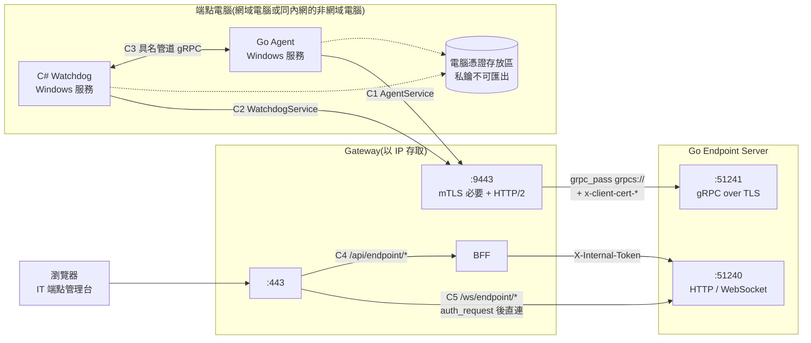
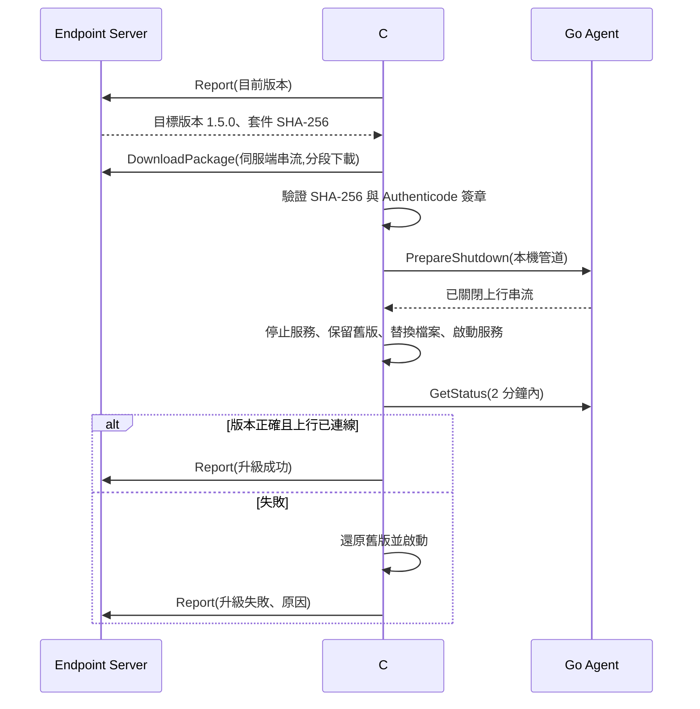
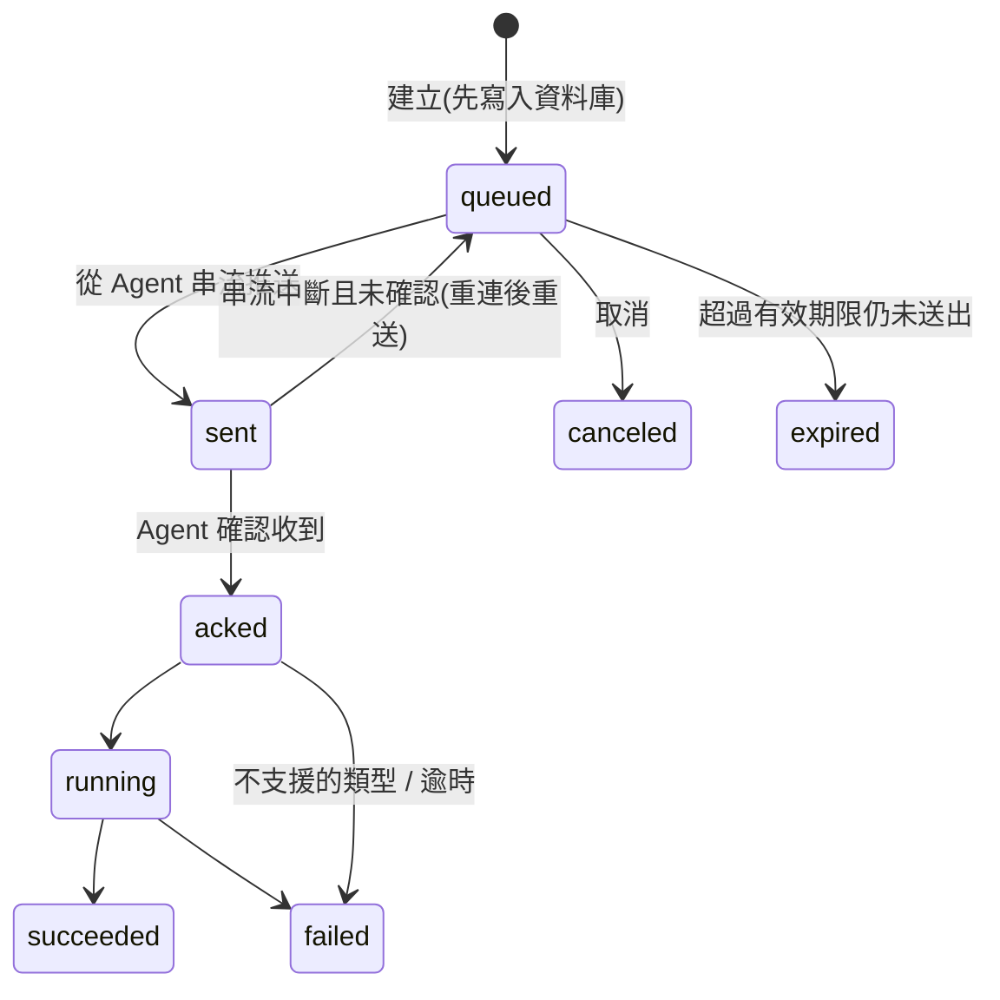

# GigaNexus Gateway — Go Endpoint Server 與端點 Agent 開發手冊

> 適用對象:Go Endpoint Server(W6)、Go Agent(W6)、C# 守護程式(Watchdog)的開發者。
> 對應 PRD 版本:**v0.5**(2026-09-25)。相關規格:[PRD.md](PRD.md) §7.4(WebSocket)、§7.6(Agent 通道);[ARCHITECTURE.md](ARCHITECTURE.md) T6、T8、D2、D3;一般下游後端規範見 [BACKEND-GUIDE.md](BACKEND-GUIDE.md)。

---

## 1. 文件資訊

| 項目 | 內容 |
| --- | --- |
| 文件版本 | v0.2(新增 §8 端點管理:以 BFF 權限為準、指令派送) |
| 建立日期 | 2026-09-25 |
| 適用範圍 | 端點電腦上的程式(Go Agent、C# Watchdog)經 Gateway `:9443` 連到 Go Endpoint Server 的通道;兩支程式在同一台電腦上的本機通道;IT 管理頁面經 BFF 管理電腦與下指令(§8) |
| 不在範圍 | Endpoint Server 的業務功能與正式 proto(由 W6 定義);端點電腦的軟體派送方式 |
| 維護者 | Gateway 負責人(通道規格)、W6 負責人(§5–§7 的程式規範) |

**gRPC 經 Nginx 只用在端點電腦。** 其他 Go 後端(例如 MES)對外的 API 一律走 HTTP/JSON,經 BFF 轉送([BACKEND-GUIDE.md](BACKEND-GUIDE.md))。Gateway 目前只在 `:9443` 提供 gRPC,而且只接受 Agent 專用中繼 CA 簽發的裝置憑證;有其他 gRPC 需求時,先找 Gateway 負責人。

**本文程式碼的驗證狀態**:§5、§6 的 Go 寫法已在本機環境實測(2026-09-25:Go client → Nginx `:9443` → 主機上的 Go server,單次呼叫、雙向串流、無效憑證、上游停止都測過)。實測時沒有 `protoc`,是以原始位元組編解碼替代產生碼,傳輸層設定與本文相同。§3.4、§7 的 C# 寫法與 Windows 憑證存放區讀取**尚未實測**,開發時需先做 PoC。

---

## 2. 全貌



| # | 通道 | 路徑 | 協定 | 身分 | 規範 |
| --- | --- | --- | --- | --- | --- |
| C1 | Agent 上行 | Go Agent → Nginx `:9443` → Endpoint Server `:51241` | gRPC(HTTP/2 + TLS),長連線雙向串流 | 電腦憑證(mTLS) | §4–§6 |
| C2 | Watchdog 上行 | C# Watchdog → Nginx `:9443` → Endpoint Server `:51241` | 同 C1 | **同一張**電腦憑證 | §7.3 |
| C3 | 本機 | C# Watchdog ↔ Go Agent(同一台電腦) | gRPC over Windows 具名管道 | Windows 帳號(管道 ACL) | §7.2 |
| C4 | 管理 API | 瀏覽器 → `:443/api/endpoint/*` → BFF → `:51240` | HTTP/JSON | `X-Internal-Token`(`aud` = `endpoint-api`) | §8、[BACKEND-GUIDE.md](BACKEND-GUIDE.md) |
| C5 | 串流 WebSocket | 瀏覽器 → `:443/ws/endpoint/{pc}` → `:51240` | WebSocket | `X-Internal-Token`(Nginx `auth_request` 取得) | §5.8 |

### 2.1 分工

| 項目 | Gateway(Nginx) | Endpoint Server | Go Agent | C# Watchdog | IT |
| --- | --- | --- | --- | --- | --- |
| 驗證裝置憑證(簽發者、效期、CRL) | ✅ | 只讀 Nginx 傳來的標頭 | 出示憑證 | 出示憑證 | 發放 / 撤銷憑證 |
| 裝置登錄、停用、DN ↔ 電腦對應 | — | ✅ | — | — | 維護 |
| 同來源串流數上限、逾時 | ✅ | — | 退避重連 | 退避重連 | — |
| 單則訊息大小上限 | 不限制(§4) | ✅ `MaxRecvMsgSize` | — | — | — |
| 應用層心跳、離線判斷 | — | ✅ | ✅ | — | — |
| Agent 存活 / 健康 / 版本監控、重啟、升級 | — | 下達目標版本 | 提供本機狀態(C3) | ✅ | — |
| CRL 更新到 Nginx | ✅(W3-3.4,未完成) | — | — | — | 發布 CRL |

---

## 3. 裝置身分與憑證

### 3.1 兩種電腦

| 項目 | 網域電腦(碩禾 / 碩禾_新 / 鹽城碩禾) | 非網域電腦(同一內網,例如禾迅) |
| --- | --- | --- |
| 發放 | AD CS 範本「GigaNexus Agent」+ GPO **電腦憑證自動註冊** | IT 以同一範本另行簽發(建議流程如下) |
| 存放 | `LocalMachine\My`,私鑰不可匯出 | 同左 |
| 根憑證 | GPO 派送到 `LocalMachine\Root` | 安裝時一併匯入 `LocalMachine\Root`(PRD §14.1) |
| 續約 | 自動(到期前由 Windows 自動續約,指紋會改變) | **人工**;Watchdog 回報剩餘天數(§7.3),到期前 30 天通知 IT |
| 撤銷 | IT 在 AD CS 撤銷 → CRL → Nginx(W3-3.4) | 同左 |

非網域電腦的建議流程(金鑰在電腦上產生,不經過 IT 的電腦):

1. 在該電腦以系統管理員執行 `certreq -new agent.inf agent.csr`(`agent.inf` 設定 `MachineKeySet = TRUE`、`Exportable = FALSE`、Subject 依 §3.2)。
2. IT 以「GigaNexus Agent」範本簽發 `agent.csr`,把 `agent.cer` 交回。
3. 在該電腦執行 `certreq -accept agent.cer`,憑證與私鑰配對後存入 `LocalMachine\My`。

### 3.2 憑證規格

| 項目 | 規則 |
| --- | --- |
| 簽發者 | **Agent 專用中繼 CA**;Nginx 只接受 `nginx/allowlists/<區域>/agent-issuers.conf` 列出的簽發者,其他 CA 簽發的一律 403 |
| 用途(EKU) | Client Authentication |
| 金鑰 | ECDSA P-256 或 RSA 2048 以上;私鑰不可匯出 |
| Subject | PRD §7.6 為 `CN=<電腦名稱>`;**三個網域加上非網域電腦的電腦名稱可能重複**,建議改用電腦 FQDN,非網域電腦用 `CN=<公司代碼>-<電腦名稱>`(待確認,§10 E1) |
| SAN | 網域電腦帶 AD 電腦物件 GUID(PRD §7.6);Nginx **不會轉送 SAN**,Endpoint Server 只看得到 Subject DN 與指紋 |

### 3.3 Endpoint Server 如何識別裝置

- 以 **`x-client-cert-dn` 完整字串**作為裝置鍵,不要只取 CN(理由見 §3.2)。
- `x-client-cert-fp` 在續約後會改變:同一 DN 出現新指紋時,更新登錄表並寫稽核紀錄;同一 DN 同時有兩個不同指紋在線上時告警(可能是憑證被複製或電腦被複製)。
- 電腦改名等於新的 DN,視為新裝置,由 IT 在管理台合併。

### 3.4 程式如何取用電腦憑證

兩支程式都以 **LocalSystem** 執行,才能使用 `LocalMachine\My` 的私鑰。挑選規則相同:簽發者為 Agent 專用中繼 CA、EKU 含 Client Authentication、在效期內,多張時取 `NotAfter` 最晚的一張。**每次建立連線都重新挑選**,自動續約後不需要重啟。

| 程式 | 做法(未實測,需 PoC) |
| --- | --- |
| Go Agent | Go 標準庫不能直接使用 Windows 憑證存放區裡不可匯出的私鑰;建議評估 `github.com/google/certtostore`(以 CNG 提供 `crypto.Signer`),在 `tls.Config.GetClientCertificate` 回傳 `tls.Certificate{Certificate: ..., PrivateKey: signer}` |
| C# Watchdog | `X509Store(StoreName.My, StoreLocation.LocalMachine)` 篩選後放入 `SocketsHttpHandler.SslOptions.ClientCertificates`;.NET 可直接使用不可匯出的 CNG 私鑰 |

本機開發沒有 Windows 憑證存放區時,改用 PEM 檔(§9)。程式應把「憑證來源」抽成介面:正式環境讀存放區,開發環境讀檔案。

---

## 4. Gateway 提供的 `:9443` 通道

設定檔:`nginx/conf.d/agent.conf`。

| 項目 | 規格 |
| --- | --- |
| 位址 | `<gateway-ip>:9443`(測試區、正式區各自的主機 IP;不用主機名稱,PRD Q1) |
| 協定 | HTTP/2 over TLS 1.2 / 1.3(ALPN `h2`) |
| 伺服器憑證 | 企業 CA 簽發,SAN 帶 Gateway IP;端點電腦需信任企業根 CA(`LocalMachine\Root`) |
| 用戶端憑證 | **必要**;簽發者限定 Agent 專用中繼 CA;檢查效期與 CRL |
| 轉送 | **所有 gRPC 路徑**都轉給 Endpoint Server `:51241`(`grpc_pass grpcs://`),新增 service 不需要改 Nginx |
| Nginx → Endpoint Server | TLS,Nginx 以企業根 CA 驗證 Endpoint Server 的憑證(§5.1) |
| 逾時 | `grpc_read_timeout` / `grpc_send_timeout` / `client_body_timeout` 皆 1 小時:**任一方向超過 1 小時沒有資料就中斷** |
| 同時進行的串流數 | 每張裝置憑證 **10 條**(`limit_conn`,以憑證指紋計算,算的是進行中的 HTTP/2 串流,不是 TCP 連線;Agent 與 Watchdog 使用同一張憑證,共用額度),超過回 429 |
| 串流累計大小 | 不限制(`client_max_body_size 0`);單則訊息上限由 Endpoint Server 設定 |
| 一條連線的串流數 | Nginx 預設每條連線處理 1000 個請求或使用 1 小時後送 GOAWAY,gRPC 用戶端會自動換新連線,進行中的串流不受影響 |

### 4.1 轉送給 Endpoint Server 的標頭

| 標頭 | 內容 | 範例 |
| --- | --- | --- |
| `x-client-cert-dn` | 用戶端憑證 Subject,RFC 2253 格式(**RDN 順序與憑證相反**) | `O=GigaNexus Dev,CN=PC-001` |
| `x-client-cert-fp` | 憑證 SHA-1 指紋,小寫十六進位 40 字 | `574f45a0357c7d134a9e2f78cd7ed4dc0444ee77` |
| `x-client-verify` | 驗證結果;能到達上游的一定是 `SUCCESS` | `SUCCESS` |
| `x-request-id` | Nginx 產生的請求 ID;**一條串流只有一個** | `fa514d1f828b4bed79db8e6a1f2eaf32` |

- Agent 自己送的同名標頭會被 Nginx **覆寫**(E2E 已驗證);其他 metadata(例如 `user-agent`、自訂標頭)原樣轉送,**不可當作身分依據**。
- Endpoint Server 看到的連線來源是 Nginx,不是 Agent;不要用 `peer.FromContext` 判斷裝置或 IP。電腦的 IP 由 Agent 在訊息中回報。

### 4.2 被拒絕時用戶端看到什麼

| 情況 | Nginx 回應 | gRPC 狀態碼 | 驗證 | 用戶端處理 |
| --- | --- | --- | --- | --- |
| 沒有憑證、過期、已撤銷、非企業 CA 簽發、CRL 過期 | HTTP 400(TLS 握手成功後才回,見 §10 G2) | `INTERNAL`,訊息含 `400` 與 `The SSL certificate error` | 實測(CRL 過期除外) | **憑證問題**:不要快速重試,退避到每 10 分鐘;寫 Windows 事件記錄(Subject、到期日、指紋) |
| 簽發者不是 Agent 專用中繼 CA | HTTP 403 | `PERMISSION_DENIED` | 依 gRPC 狀態碼對應規則 | 同上 |
| 同來源串流超過 10 條 | HTTP 429 | `UNAVAILABLE` | 實測 | 退避重試 |
| Endpoint Server 停止或無回應 | HTTP 502 / 504 | `UNAVAILABLE` | 實測 | 退避重試 |
| Nginx reload / 重啟、連線閒置超過 1 小時 | GOAWAY 或連線中斷 | `UNAVAILABLE` / `INTERNAL` | — | 重建串流(含隨機延遲) |

---

## 5. Go Endpoint Server 規範

### 5.1 監聽與 TLS

- `:51241` 提供 gRPC over TLS(BACKEND-GUIDE §3.3 已登記 `endpoint-grpc`);防火牆**只允許 Gateway 主機**連入。
- 伺服器憑證由企業 CA 簽發,**SAN 必須包含 Nginx 連線時使用的名稱**,也就是 `ENDPOINT_GRPC_UPSTREAM` 的主機部分:與 Gateway 在同一個 Docker 網路時為 `endpoint-server`(DNS),跨主機以 IP 連線時放 IP(`iPAddress`)。名稱不符時 Nginx 回 502。
- 不要求用戶端憑證(Nginx 不會出示);裝置身分只看 §4.1 的標頭。
- 正式環境不要開啟 gRPC reflection。

```go
creds, err := credentials.NewServerTLSFromFile(certFile, keyFile)
if err != nil { log.Fatal(err) }

s := grpc.NewServer(
    grpc.Creds(creds),
    grpc.MaxRecvMsgSize(4<<20), // 單則訊息上限;Nginx 不限制串流累計大小
    grpc.KeepaliveParams(keepalive.ServerParameters{Time: 2 * time.Minute, Timeout: 20 * time.Second}),
    grpc.ChainUnaryInterceptor(deviceUnary),
    grpc.ChainStreamInterceptor(deviceStream),
)
agentv1.RegisterAgentServiceServer(s, agentSvc)
watchdogv1.RegisterWatchdogServiceServer(s, watchdogSvc)
```

### 5.2 裝置身分攔截器

```go
type Device struct{ DN, FP string }
type deviceKey struct{}

// 只信任 Nginx 以 grpc_set_header 設定的值(Agent 自送的同名標頭會被覆寫)
func deviceFromMD(ctx context.Context) (Device, error) {
    md, _ := metadata.FromIncomingContext(ctx)
    get := func(k string) string {
        if v := md.Get(k); len(v) == 1 { return v[0] }
        return ""
    }
    if get("x-client-verify") != "SUCCESS" || get("x-client-cert-dn") == "" || get("x-client-cert-fp") == "" {
        return Device{}, status.Error(codes.Unauthenticated, "device certificate not verified by gateway")
    }
    d := Device{DN: get("x-client-cert-dn"), FP: get("x-client-cert-fp")}
    // 以 DN 查裝置登錄表(§3.3):停用 → codes.PermissionDenied;新指紋 → 更新並寫稽核
    return d, nil
}

type wrappedStream struct {
    grpc.ServerStream
    ctx context.Context
}

func (w wrappedStream) Context() context.Context { return w.ctx }

func deviceStream(srv any, ss grpc.ServerStream, _ *grpc.StreamServerInfo, h grpc.StreamHandler) error {
    d, err := deviceFromMD(ss.Context())
    if err != nil { return err }
    return h(srv, wrappedStream{ss, context.WithValue(ss.Context(), deviceKey{}, d)})
}
// deviceUnary 同理
```

### 5.3 長連線與離線判斷

- **HTTP/2 PING 不會穿過 Nginx**:Agent 的 keepalive ping 由 Nginx 回應,Endpoint Server 收不到;Endpoint Server 的 keepalive 只用來偵測與 Nginx 之間的連線。
- 因此一定要有**應用層心跳**:Agent 在串流上每 30 秒送一則心跳,Endpoint Server 回覆(或至少每 60 秒往下送一則訊息)。兩個方向都要有資料,否則 1 小時後被 Nginx 逾時切斷。
- 連續 3 次(90 秒)沒收到心跳即判定離線;串流結束也立即標記離線。
- Nginx 對上游不做多工:**每一條 Agent 串流都是 Nginx 到 Endpoint Server 的一條獨立 TCP / TLS 連線**。200 台 × 每台 2 條 ≈ 400 條,Go 可輕鬆處理,但連線數監控要以此估算。

### 5.4 撤銷與停用

- CRL 只在 TLS 握手時檢查。**已建立的連線在 CRL 更新後不會被中斷**,直到重連為止。
- 因此 Endpoint Server 要自己維護裝置狀態:IT 停用裝置時,立即以 `PermissionDenied` 結束該裝置的所有串流,重連時也直接拒絕(不等 CRL 更新)。

### 5.5 訊息大小

- Nginx 不再限制串流累計大小(之前沿用全域 10 MB 時,長串流上傳滿 10 MB 會被切斷,2026-09-25 已修正)。
- 單則訊息上限由 `MaxRecvMsgSize` 決定(建議 4 MB);資產快照、日誌等大資料以多則訊息分段傳送。

### 5.6 proto 相容性

- package 命名:`giganexus.agent.v1`(Agent)、`giganexus.watchdog.v1`(Watchdog)、`giganexus.agent.local.v1`(本機,§7.2)。
- Agent 是分批升級的,**Endpoint Server 必須同時支援目前版本與前一版的 Agent**。
- 只新增欄位,不改欄位編號與型別;刪除的欄位以 `reserved` 保留。不相容的變更以新 package(`v2`)並存。
- Agent 在串流的第一則訊息回報自己的版本(並以 `user-agent: giganexus-agent/<版本>` 標示),Endpoint Server 依版本決定可用的功能。

### 5.7 日誌

每一筆日誌記錄 `x-request-id`、裝置 DN、指紋。一條串流只有一個 `x-request-id`,串流內的每則訊息需要追蹤時,由 Agent 在訊息中帶自己的序號。

### 5.8 其他入口(`:51240`)

| 入口 | 身分來源 | 注意 |
| --- | --- | --- |
| 管理 API(C4) | `X-Internal-Token`,`aud` = `endpoint-api` | 依 [BACKEND-GUIDE.md](BACKEND-GUIDE.md) §4 驗證;路由由 OpenAPI 匯入 |
| 串流 WebSocket(C5)`/ws/endpoint/{pc}` | Nginx `auth_request` 向 BFF 驗證(權限 `endpoint.remote.operate`)後帶 `X-Internal-Token`、`X-Auth-User`、`X-Request-Id` 直連 | 內部 Token 效期 60 秒,**只在升級(upgrade)時驗證一次**;連線最長 1 小時,每 30 秒送 ping(PRD §7.4) |

---

## 6. Go Agent 規範

### 6.1 安裝型態

| 項目 | 規則 |
| --- | --- |
| 執行方式 | Windows 服務 `GigaNexusAgent`,以 **LocalSystem** 執行(需使用電腦憑證私鑰) |
| 失敗復原 | 服務復原選項:第 1、2、後續失敗皆重新啟動(間隔 10 秒、30 秒、60 秒),1 天後重設計數 |
| 目錄 | 程式 `%ProgramFiles%\GigaNexus\Agent\`;設定與日誌 `%ProgramData%\GigaNexus\Agent\`(ACL 只允許 SYSTEM、Administrators) |
| 簽章 | 執行檔建議以企業程式碼簽章憑證簽署(Authenticode),Watchdog 升級時會驗證(§7.4) |
| 設定 | Gateway 位址(`<gateway-ip>:9443`)依部署區不同,由安裝程式寫入設定檔 |

### 6.2 連線

**整個程式只建立一個 `grpc.ClientConn`**,所有呼叫與串流共用這條連線(HTTP/2 多工)。

```go
conn, err := grpc.NewClient(cfg.GatewayAddr, // 例:10.1.2.3:9443
    grpc.WithTransportCredentials(credentials.NewTLS(&tls.Config{
        MinVersion: tls.VersionTLS12,
        // RootCAs 不設定:Windows 上使用系統存放區(企業根 CA 已在 LocalMachine\Root)
        // 每次握手重新挑選電腦憑證(§3.4),自動續約後不需重啟
        GetClientCertificate: certSource.ClientCertificate,
    })),
    grpc.WithKeepaliveParams(keepalive.ClientParameters{Time: 30 * time.Second, Timeout: 10 * time.Second, PermitWithoutStream: true}),
    grpc.WithConnectParams(grpc.ConnectParams{
        Backoff:           backoff.Config{BaseDelay: time.Second, Multiplier: 1.6, Jitter: 0.2, MaxDelay: 2 * time.Minute},
        MinConnectTimeout: 20 * time.Second,
    }),
    grpc.WithUserAgent("giganexus-agent/" + version),
)
```

### 6.3 主串流

1. 開啟雙向串流,第一則送 `Hello`(Agent 版本、作業系統、電腦名稱、IP、開機時間)。
2. 之後每 30 秒送心跳;同時持續接收 Endpoint Server 下達的指令。
3. 串流結束或出錯時,依 §4.2 判斷原因,**等待後重建串流**:一般錯誤 1 秒起指數退避(上限 2 分鐘,加 ±20% 隨機);憑證錯誤每 10 分鐘。
4. 服務啟動時先隨機延遲 0–30 秒再連線,避免 Gateway 或 Endpoint Server 重啟後 200 台同時湧入。

### 6.4 本機狀態服務

Agent 在本機具名管道上提供 `giganexus.agent.local.v1.AgentLocal`(§7.2),讓 Watchdog 讀取健康狀態與版本。狀態包含:上行串流是否連線、最後一次收到心跳回覆的時間、最近一次錯誤(含憑證錯誤)、憑證到期日。

### 6.5 升級

Agent **不覆寫自己**;由 Watchdog 停止服務、替換檔案、重新啟動(§7.4)。Agent 收到 `PrepareShutdown` 時送出最後狀態、關閉串流後回覆。

---

## 7. C# Watchdog 與本機通道

### 7.1 定位

| 項目 | 規則 |
| --- | --- |
| 執行方式 | Windows 服務 `GigaNexusWatchdog`(.NET 8 以上),以 **LocalSystem** 執行 |
| 存活 | 每 30 秒查詢 `GigaNexusAgent` 服務狀態與行程 |
| 健康 | 每 30 秒呼叫本機 `GetStatus`;連續 3 次失敗(行程在但無回應)→ 停止服務(逾時則結束行程)→ 重新啟動 |
| 版本 | 比對 Agent 版本與 Endpoint Server 下達的目標版本,需要時執行升級(§7.4) |
| 上報 | **自己**經 `:9443` 回報(§7.3),不經過 Agent |
| 憑證 | 回報電腦憑證剩餘天數(非網域電腦需人工續約) |
| 互相看守 | Agent 也定期檢查 `GigaNexusWatchdog` 服務,停止時以 SCM 重新啟動;兩個服務都設定失敗復原選項 |

**Watchdog 為什麼要自己上報**:Agent 當掉或卡住時,Endpoint Server 只知道「串流斷了」,不知道原因。Watchdog 能回報「Agent 服務一直重啟失敗」、「版本不符」、「憑證過期」,IT 不必到現場查看。

使用者工作階段若需要顯示狀態(工作列圖示),另寫一支一般權限的程式,向 Watchdog 讀取**唯讀**狀態;不可直接連 Agent 的管道(待確認,§10 E3)。

### 7.2 本機通道(C3):gRPC over 具名管道

| 項目 | 規則 |
| --- | --- |
| 管道名稱 | `\\.\pipe\giganexus-agent-v1` |
| 伺服端 | Go Agent(`github.com/Microsoft/go-winio` 的 `winio.ListenPipe`,再交給 `grpc.Server.Serve`) |
| ACL | `D:P(A;;GA;;;SY)(A;;GA;;;BA)`:只允許 SYSTEM 與 Administrators |
| 用戶端 | C# Watchdog(`SocketsHttpHandler.ConnectCallback` 回傳 `NamedPipeClientStream`) |
| 防冒充 | Watchdog 連線後以 `GetNamedPipeServerProcessId` 取得管道伺服端的 PID,與 SCM 查到的 `GigaNexusAgent` 服務 PID 比對,不一致即中斷並記錄 |

**不用 `localhost` TCP 的原因**:同一台電腦的任何使用者程式都能連 `localhost` port,只能再自建驗證;可能與其他軟體 port 衝突;防火牆軟體可能跳出提示。具名管道直接以 Windows 帳號控管存取。

```go
// Go Agent:本機狀態服務
l, err := winio.ListenPipe(`\\.\pipe\giganexus-agent-v1`, &winio.PipeConfig{
    SecurityDescriptor: "D:P(A;;GA;;;SY)(A;;GA;;;BA)",
})
if err != nil { return err }
local := grpc.NewServer()
localv1.RegisterAgentLocalServer(local, localSvc)
go local.Serve(l)
```

```csharp
// C# Watchdog:連本機 Agent(.NET 8 以具名管道承載 gRPC 的標準做法)
var handler = new SocketsHttpHandler
{
    ConnectCallback = async (_, ct) =>
    {
        var pipe = new NamedPipeClientStream(".", "giganexus-agent-v1", PipeDirection.InOut,
            PipeOptions.WriteThrough | PipeOptions.Asynchronous, TokenImpersonationLevel.Anonymous);
        await pipe.ConnectAsync(ct);
        EnsurePipeServerIsAgentService(pipe); // 比對 GetNamedPipeServerProcessId 與服務 PID
        return pipe;
    },
};
using var channel = GrpcChannel.ForAddress("http://localhost", new GrpcChannelOptions { HttpHandler = handler });
var local = new AgentLocal.AgentLocalClient(channel);
```

本機 proto 草案(正式內容由 W6 定義):

```proto
syntax = "proto3";
package giganexus.agent.local.v1;

import "google/protobuf/timestamp.proto";

service AgentLocal {
  rpc GetStatus (GetStatusRequest) returns (AgentStatus);
  // 升級前呼叫:Agent 送出最後狀態、關閉上行串流後回覆
  rpc PrepareShutdown (PrepareShutdownRequest) returns (PrepareShutdownReply);
}

message GetStatusRequest {}

message AgentStatus {
  string version = 1;
  google.protobuf.Timestamp started_at = 2;
  bool upstream_connected = 3;
  google.protobuf.Timestamp last_heartbeat_ack = 4;
  string last_error = 5;                      // 例:certificate rejected by gateway (HTTP 400)
  google.protobuf.Timestamp cert_not_after = 6;
}

message PrepareShutdownRequest { string reason = 1; }
message PrepareShutdownReply {}
```

### 7.3 Watchdog 上行(C2)

- 與 Agent 使用**同一個位址 `:9443`、同一張電腦憑證**,呼叫另一個 service `giganexus.watchdog.v1.WatchdogService`。
- **Nginx 不需要調整**:`:9443` 轉送所有 gRPC 路徑(已實測 `/giganexus.watchdog.v1.WatchdogService/Report` 可經 Nginx 到達 Endpoint Server)。Endpoint Server 以 service 區分 Agent 與 Watchdog,以 DN 對應到同一台裝置。
- 兩支程式持有同一把私鑰,Endpoint Server **無法以密碼學區分**是誰呼叫;兩者都以 SYSTEM 執行,能取得 SYSTEM 的人本來就控制了整台電腦,可以接受。Endpoint Server 仍應只讓 `WatchdogService` 做 Watchdog 的事,不要因為 DN 相同就開放所有功能。
- 以**單次呼叫**為主:每 5 分鐘及狀態改變時呼叫 `Report`,不佔用長串流。每台電腦同時進行的串流約為 Agent 1–2 條加 Watchdog 0–1 條,在每張憑證 `limit_conn` 10 條以內。
- `Report` 內容建議:Agent 服務狀態、Agent 版本、Watchdog 版本、最後一次 `GetStatus` 結果、24 小時內重啟次數、憑證到期日、最近錯誤;回覆帶目標版本(§7.4)。

```csharp
// C# Watchdog:經 Gateway 上報(未實測)
X509Certificate2 cert = MachineCertificate.FindAgentCert(); // LocalMachine\My,依 §3.4 規則挑選
var handler = new SocketsHttpHandler
{
    SslOptions = { ClientCertificates = new X509CertificateCollection { cert } },
    KeepAlivePingDelay = TimeSpan.FromSeconds(30),
    KeepAlivePingTimeout = TimeSpan.FromSeconds(10),
};
using var channel = GrpcChannel.ForAddress($"https://{gatewayIp}:9443", new GrpcChannelOptions { HttpHandler = handler });
var client = new WatchdogService.WatchdogServiceClient(channel);
```

### 7.4 升級流程(建議)



- Watchdog 自己的升級由 Agent 以相同流程執行(互相升級,不自我覆寫)。
- 套件經 `:9443` 下載屬於**下行**方向,不受請求大小限制影響;也可改用既有軟體派送(待確認,§10 E4)。

---

## 8. 端點管理:IT 頁面、BFF 與指令派送

> **已決定(2026-09-25)**:端點管理的 API **以 BFF 的權限為準**;IT 管理系統的後端(itapp-api,Node.js)**只負責 IT 應用本身**,例如選單、Tab、按鈕要不要顯示。Go 與 Node.js 兩個後端並行,各管一塊(PRD Q27、ARCHITECTURE D9)。

### 8.1 分工

```
                        ┌─ /it/api/*        ─▶ itapp-api (Node)       選單、Tab、按鈕顯示權限、IT 人員與部門
IT 前端 /it/ ─▶ Nginx ─┤
                        ├─ /api/endpoint/*  ─▶ BFF ─▶ Endpoint Server (Go)   電腦清單、指令(權限在 BFF 檢查)
                        └─ /ws/endpoint/*   ─▶ Endpoint Server (Go)          遠端畫面(Nginx 先向 BFF 驗證)

Go Agent ×200 ─▶ Nginx :9443 ─▶ Endpoint Server (Go)   指令即時從 Agent 的串流推送
```

| 項目 | itapp-api(Node) | BFF | Endpoint Server(Go) | IT 前端 |
| --- | --- | --- | --- | --- |
| 選單、Tab、按鈕要不要顯示 | ✅(職級 × 部門) | 提供 `/api/auth/me` 的權限 | — | 取兩者交集(§8.6) |
| 能不能查詢電腦、下指令 | ❌ 不檢查、不轉送 | ✅ 依路由的 `endpoint.*` 權限 | 資料範圍(§8.2)、指令類型與路徑相符 | — |
| 操作人身分 | — | 簽發內部 Token(工號、公司、角色) | 從內部 Token 取得並寫入稽核 | 顯示目前的 Gateway 登入者 |
| 指令保存、派送、結果 | — | — | ✅ | 輪詢結果(§8.4) |
| 稽核 | IT 應用本身的操作 | 路由 `x-audit-level: meta` | ✅ 每一筆指令(§8.5) | — |

- itapp-api **不轉送**端點 API,也**不持有**能呼叫 Endpoint Server 的服務帳號;端點相關的請求一律由瀏覽器帶著 Gateway 的登入狀態經 BFF。
- Go 與 Node 兩個後端**不互相呼叫**;Endpoint Server 需要的操作人資訊都在內部 Token 裡。

### 8.2 權限代碼(BFF)

BFF 一條路由只能檢查一個權限代碼,Endpoint Server 也看不到權限代碼(內部 Token 只帶角色),所以**依風險等級拆成不同路徑**,由 BFF 檢查。

| 權限代碼 | 名稱 | 可以做什麼 |
| --- | --- | --- |
| `endpoint.device.read` | 端點查詢 | 電腦清單、資產、線上狀態、指令紀錄與結果 |
| `endpoint.command.basic` | 端點一般指令 | 對電腦沒有破壞性的指令(收集資產、重啟 Agent);取消自己建立的指令 |
| `endpoint.command.admin` | 端點管理指令 | 會影響使用者的指令(派送 / 移除軟體、重新開機、升級 Agent)、停用 / 啟用裝置 |
| `endpoint.remote.operate` | 端點遠端操作 | 遠端畫面(`/ws/endpoint/*`,已實作,E2E 已驗證) |

- 角色與 AD 群組的對應由 IT 決定(PRD §8.3);建議查詢與一般指令給 IT 人員,管理指令與遠端操作只給 IT 管理員。
- **資料範圍**:Endpoint Server 依內部 Token 的 `cos`(所屬公司)只回傳、只接受該公司的電腦;可管理所有公司的角色另行指定(待確認,§10 E6)。

### 8.3 API 草案

以 `endpoint-api`(`:51240`)提供,OpenAPI 自動註冊為草稿後由 IT 發佈([BACKEND-GUIDE.md](BACKEND-GUIDE.md) §6、§7.5;目前只有 Node.js SDK,Go 需自行呼叫 `POST /api/admin/registrations`)。路徑中的 `{deviceId}` 由 Endpoint Server 指派(電腦名稱可能重複,§3.2),畫面上顯示電腦名稱。

| 方法 | 對外路徑 | `x-permission` | 說明 |
| --- | --- | --- | --- |
| `GET` | `/api/endpoint/devices` | `endpoint.device.read` | 電腦清單;分頁,篩選線上狀態、公司、Agent 版本 |
| `GET` | `/api/endpoint/devices/{deviceId}` | `endpoint.device.read` | 電腦詳細、資產、Watchdog 最近回報 |
| `GET` | `/api/endpoint/devices/{deviceId}/commands` | `endpoint.device.read` | 該電腦的指令紀錄 |
| `GET` | `/api/endpoint/commands/{commandId}` | `endpoint.device.read` | 指令狀態與結果 |
| `POST` | `/api/endpoint/devices/{deviceId}/basic-commands` | `endpoint.command.basic` | 建立一般指令,回 `202` + `commandId` |
| `POST` | `/api/endpoint/devices/{deviceId}/admin-commands` | `endpoint.command.admin` | 建立管理指令,回 `202` + `commandId` |
| `POST` | `/api/endpoint/batches/basic-commands`、`/admin-commands` | 同上 | 多台電腦同一指令,回 `batchId` 與各台的 `commandId` |
| `POST` | `/api/endpoint/commands/{commandId}/cancel` | `endpoint.command.basic` | 只能取消**自己建立**、尚未送出的指令 |
| `PUT` | `/api/endpoint/devices/{deviceId}/status` | `endpoint.command.admin` | 停用 / 啟用裝置;停用時立即結束其串流(§5.4) |

- Endpoint Server 必須檢查「指令類型」屬於該路徑的等級(例:`basic-commands` 送來 `system.reboot` → `400 ENDPOINT_COMMAND_LEVEL_MISMATCH`),否則等於繞過 BFF 的權限。
- `POST` 支援 `Idempotency-Key`(BFF 只對冪等方法自動重試,使用者重複按下時不會建立兩筆指令)。
- 這些路由不設 `x-cache-ttl`;建立指令、停用裝置的路由設 `x-audit-level: meta`。

**指令類型(初版建議)**:不提供任意 shell 指令,只開放固定類型;新增類型時 Agent 與 Endpoint Server 一起發版,舊版 Agent 收到不認得的類型回 `UNSUPPORTED_COMMAND`。

| 類型 | 等級 | 說明 |
| --- | --- | --- |
| `inventory.collect` | basic | 立即收集並回報資產 |
| `agent.restart` | basic | Agent 結束行程,由服務失敗復原重新啟動 |
| `agent.upgrade` | admin | 升級到指定版本(交給 Watchdog,§7.4) |
| `software.install` / `software.uninstall` | admin | 派送 / 移除 IT 核可清單中的軟體 |
| `system.reboot` | admin | 重新開機;先提示使用者,可延後 |

### 8.4 指令派送



- **即時送達**:Agent 在線上時,Endpoint Server 寫入資料庫後立即從該 Agent 的串流推送;離線的電腦排隊,重連後依建立順序送出。
- **有效期限**:每筆指令有 `expiresAt`(預設 1 小時,依類型調整),避免電腦幾天後開機才執行過時的指令。
- **至少送達一次**:串流中斷且 Agent 未確認的指令會重送,**Agent 以 `commandId` 去重**。
- **結果回傳給頁面**:先以輪詢 `GET /api/endpoint/commands/{commandId}`(執行中每 2 秒)。指令送達本身是即時的,輪詢只影響畫面更新;需要伺服器主動推送時再新增事件 WebSocket(需調整 Nginx 與 BFF 路由)。
- **批次**:多台電腦的派送 / 重開機限制同時執行台數(例如 20 台),避免頻寬與服務同時中斷。
- Endpoint Server 先以**單一實例**部署。之後若要多實例,指令必須轉給握有該 Agent 串流的實例(例如 Redis pub/sub)。

Agent 串流上的訊息草案(正式內容由 W6 定義,擴充 §6.3 的主串流):

```proto
// giganexus.agent.v1(草案)
message ServerMessage {
  oneof body {
    HeartbeatAck heartbeat_ack = 1;
    Command command = 2;
  }
}

message Command {
  string command_id = 1;                       // UUID;Agent 以此去重
  string type = 2;                             // 例:inventory.collect
  bytes params = 3;                            // 依 type 定義的 JSON
  google.protobuf.Timestamp expires_at = 4;    // 過期不執行,回 failed(EXPIRED)
  string issued_by = 5;                        // 操作人工號,Agent 寫入本機日誌
}

message AgentMessage {
  oneof body {
    Hello hello = 1;
    Heartbeat heartbeat = 2;
    CommandUpdate command_update = 3;
  }
}

message CommandUpdate {
  string command_id = 1;
  CommandState state = 2;                      // ACKED / RUNNING / SUCCEEDED / FAILED
  int32 progress = 3;                          // 0–100
  bytes result = 4;                            // 結果摘要;大量資料分段上傳
  string error_code = 5;                       // 例:UNSUPPORTED_COMMAND、EXPIRED
  string error_message = 6;
}
```

### 8.5 稽核

Endpoint Server 為每一筆指令保存:`commandId`、`batchId`、`X-Request-Id`、操作人(內部 Token 的 `emp`、`name`)、裝置(`deviceId`、DN)、類型、參數(敏感值遮罩)、建立 / 送出 / 完成時間、狀態、結果摘要、錯誤代碼。BFF 另依路由的 `x-audit-level` 記錄 API 呼叫。**不以來源 IP 作為稽核依據**(Docker Desktop 下不可靠,[DEPLOYMENT.md](DEPLOYMENT.md) §6.1)。

### 8.6 IT 前端(GigaItApp)

| 項目 | 規則 |
| --- | --- |
| 呼叫方式 | `/api/endpoint/*` 一律經 `@giganexus/web-kit`(處理 CSRF 與 Token 更新,[FRONTEND-GUIDE.md](FRONTEND-GUIDE.md));`/it/api/*` 維持現狀 |
| Gateway 登入 | 進入端點管理頁時呼叫 `/api/auth/me`;回 401 時導向 Gateway 登入頁,登入後回到原頁面 |
| 同一人檢查 | `/api/auth/me` 的 `emp` 必須等於 GigaItApp 登入者的 `employeeNo`;不一致時(例如共用電腦上留著別人的 Gateway 登入)不顯示端點功能,要求重新登入 Gateway |
| 按鈕顯示 | **itapp 的按鈕權限 ∧ `/api/auth/me` 有對應的 `endpoint.*` 權限**;兩者都有才顯示,避免按下去才被拒絕 |
| 被拒絕 | BFF 回 `403 PERMISSION_DENIED` 時顯示「權限不足」,並以 BFF 的結果為準(itapp 權限只影響顯示) |
| 身分顯示 | 端點管理頁顯示「以 `<工號> <姓名>` 身分操作」,與稽核紀錄一致 |

itapp 的按鈕權限代碼建議與 BFF 權限一一對應(例如 itapp 按鈕 `endpoint.command.admin` 對應 BFF 同名權限),GigaItApp 的權限表由 GigaItApp 專案維護。

---

## 9. 本機開發與測試

本機完整環境:`sh deploy/dev/up.sh`(需 Docker)。`:9443` 在 `localhost:9443`,開發用憑證在 `deploy/dev/secrets/pki/`(不進版控):

| 檔案 | 用途 |
| --- | --- |
| `ca.crt` | 開發用根 CA(用戶端以此驗證 Gateway 與 Endpoint Server) |
| `agent-valid.crt` / `.key` | 有效裝置憑證,DN `O=GigaNexus Dev,CN=PC-001` |
| `agent-expired`、`agent-revoked`、`agent-rogue` | 過期、已撤銷、非企業 CA 簽發(應被拒) |

預設的 Endpoint Server 是 Node.js 模擬服務(`tools/mock-upstream/endpoint.js`,proto 為 `tools/mock-upstream/agent.proto`)。**改接自己在主機上執行的 Go Endpoint Server**:

1. 以開發用 CA 為 Go Endpoint Server 簽一張 SAN 含 `host.docker.internal` 的憑證:

   ```bash
   openssl req -newkey ec -pkeyopt ec_paramgen_curve:P-256 -nodes -keyout endpoint-go.key -out endpoint-go.csr -subj "/O=GigaNexus Dev/CN=endpoint-go"
   ```

   ```bash
   printf "subjectAltName=DNS:host.docker.internal,DNS:localhost\nextendedKeyUsage=serverAuth\n" > endpoint-go.ext
   ```

   ```bash
   openssl x509 -req -in endpoint-go.csr -CA deploy/dev/secrets/pki/ca.crt -CAkey deploy/dev/secrets/pki/ca.key -CAcreateserial -days 30 -sha256 -extfile endpoint-go.ext -out endpoint-go.crt
   ```

2. 在主機以此憑證啟動 Go Endpoint Server(`:51241`)。
3. 建立覆寫檔 `nginx-go.override.yml`,讓 Nginx 改轉到主機:

   ```yaml
   services:
     nginx:
       environment:
         ENDPOINT_GRPC_UPSTREAM: host.docker.internal:51241
   ```

   在 `deploy/` 下執行:

   ```bash
   docker compose --env-file dev.env -f docker-compose.yml -f docker-compose.dev.yml -f nginx-go.override.yml up -d --wait nginx
   ```

4. 測完還原(去掉覆寫檔再 `up` 一次):

   ```bash
   docker compose --env-file dev.env -f docker-compose.yml -f docker-compose.dev.yml up -d --wait nginx
   ```

- Agent 在本機開發時以 PEM 檔作為憑證來源(§3.4),並以 `ca.crt` 作為 `RootCAs`。
- 通道的預期行為以 E2E 測試為準:`bff/test/e2e/06-websocket-agent.test.ts`(單次呼叫、雙向串流、同連線多串流、累計 11 MB 串流、偽造身分標頭、無效憑證)。
- 對應驗收場景:`docs/Gherkin/gateway/agent-mtls.feature`。

---

## 10. 未完成與待確認

### 10.1 Gateway 端

| # | 項目 | 影響 | 狀態 |
| --- | --- | --- | --- |
| G1 | CRL 定期更新並 reload Nginx(W3-3.4) | **CRL 過期時 Nginx 會拒絕所有 Agent**(HTTP 400);撤銷的憑證也不會生效 | 未開始;**上線前必須完成** |
| G2 | 無效憑證在 TLS 握手後才回 HTTP 400,不是在 TLS 層拒絕 | 與 IMPL-PLAN W3-3 驗收字面不同;不會到達 Endpoint Server | 待確認是否接受 |
| G3 | 200 條連線維持 1 小時壓測(W3-3.6) | — | 未做;需要 Go 測試工具(W3-3.5) |
| G4 | Docker Desktop 下 Nginx 看到的來源 IP | 本機(macOS)所有連線的來源都是 `192.168.65.1`。`limit_conn` 已改以裝置憑證計算,Agent 通道不再受影響;其他依賴來源 IP 的功能見 [DEPLOYMENT.md](DEPLOYMENT.md) §6.1、PRD Q26 | Agent 部分已處理(2026-09-25) |
| G5 | 子公司經 NAT 連入 | 同一公司的電腦共用來源 IP;`limit_conn` 已改以裝置憑證計算,不受影響 | 已處理(2026-09-25) |
| G6 | reload 時,舊的 Nginx worker 要等長串流結束才會退出(未設定 `worker_shutdown_timeout`) | CRL 更新頻繁 reload 時,舊 worker 可能累積最多 1 小時 | 建議與 G1 一起處理 |
| G7 | 只允許已知的 gRPC 路徑(例:`/giganexus.agent.v1.*`、`/giganexus.watchdog.v1.*`) | 目前轉送所有路徑,由 Endpoint Server 回 `UNIMPLEMENTED` | 正式 proto 定案後再評估 |

### 10.2 待決事項

| # | 問題 | 建議 | 決定者 |
| --- | --- | --- | --- |
| E1 | 裝置憑證的 Subject 格式;三個網域與非網域電腦的電腦名稱可能重複 | 網域電腦用 FQDN;非網域電腦用 `CN=<公司代碼>-<電腦名稱>`;Endpoint Server 以完整 DN 為鍵 | IT(W2)+ W6 負責人 |
| E2 | 三個 AD 網域是否都能從同一個企業 CA 自動註冊「GigaNexus Agent」範本(是否同一樹系) | 若不同樹系,各自的簽發 CA 都要列入 `agent-issuers.conf` 與 `agent-ca-chain.pem` | IT |
| E3 | Watchdog 是否需要使用者看得到的介面(工作列圖示) | 需要時另寫一般權限的程式,只讀 Watchdog 的唯讀狀態 | 提案人 |
| E4 | Agent / Watchdog 的升級套件來源:經 `:9443` 下載,或用既有軟體派送(GPO 等) | 經 `:9443`(§7.4),與版本管理在同一處 | W6 負責人 + IT |
| E5 | 非網域電腦的憑證由誰申請、安裝、續約 | §3.1 的 `certreq` 流程,由 IT 執行;Watchdog 提前 30 天提醒 | IT |
| E6 | 端點管理的資料範圍:IT 人員是否只能管理自己公司(`cos`)的電腦;哪些角色可管理全部 | 預設依 `cos`;另設一個「全部公司」角色給 IT 主管 | 主管 + IT |
| E7 | 指令類型清單與各類型的等級、有效期限(§8.3 初版) | 先上線 `inventory.collect`、`agent.restart`,其餘隨 W6 逐步開放 | W6 負責人 + IT |

---

## 11. 上線檢查清單

**Endpoint Server**

- [ ] `:51241` 只允許 Gateway 主機連入;伺服器憑證 SAN 符合 `ENDPOINT_GRPC_UPSTREAM` 的主機名稱或 IP
- [ ] 裝置身分只取 `x-client-cert-*`,並要求 `x-client-verify = SUCCESS`;以完整 DN 為裝置鍵
- [ ] 停用裝置時立即結束其串流(不等 CRL)
- [ ] 設定 `MaxRecvMsgSize`;大資料分段
- [ ] 應用層心跳與離線判斷;每 60 秒內至少往下送一則訊息
- [ ] 同時支援前一版 Agent
- [ ] 日誌記錄 `x-request-id`、DN、指紋;正式環境關閉 reflection
- [ ] 指令 API 依等級拆路徑(§8.3),並檢查指令類型與路徑等級相符;依 `cos` 過濾資料範圍
- [ ] 指令先寫入資料庫再推送;有效期限、重送、每筆指令的稽核欄位(§8.5)

**Go Agent / C# Watchdog**

- [ ] 以 LocalSystem 執行的 Windows 服務,設定失敗復原選項
- [ ] 每次連線重新挑選電腦憑證(續約後不需重啟)
- [ ] 單一 gRPC 連線、keepalive 30 秒、指數退避加隨機、啟動時隨機延遲
- [ ] 憑證錯誤(`INTERNAL` + HTTP 400)降低重試頻率並寫事件記錄
- [ ] 本機管道 ACL 只允許 SYSTEM 與 Administrators;Watchdog 比對管道伺服端 PID
- [ ] 升級前驗證 SHA-256 與簽章,失敗自動還原
- [ ] Agent 以 `commandId` 去重;過期或不認得的指令回 failed,不執行

**IT 前端(GigaItApp)**

- [ ] `/api/endpoint/*` 經 web-kit 呼叫;Gateway 登入者與 GigaItApp 登入者為同一工號
- [ ] 端點按鈕顯示取 itapp 按鈕權限與 BFF 權限的交集
