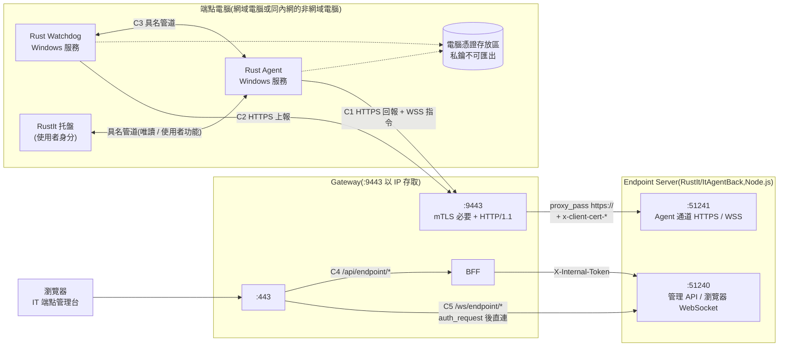
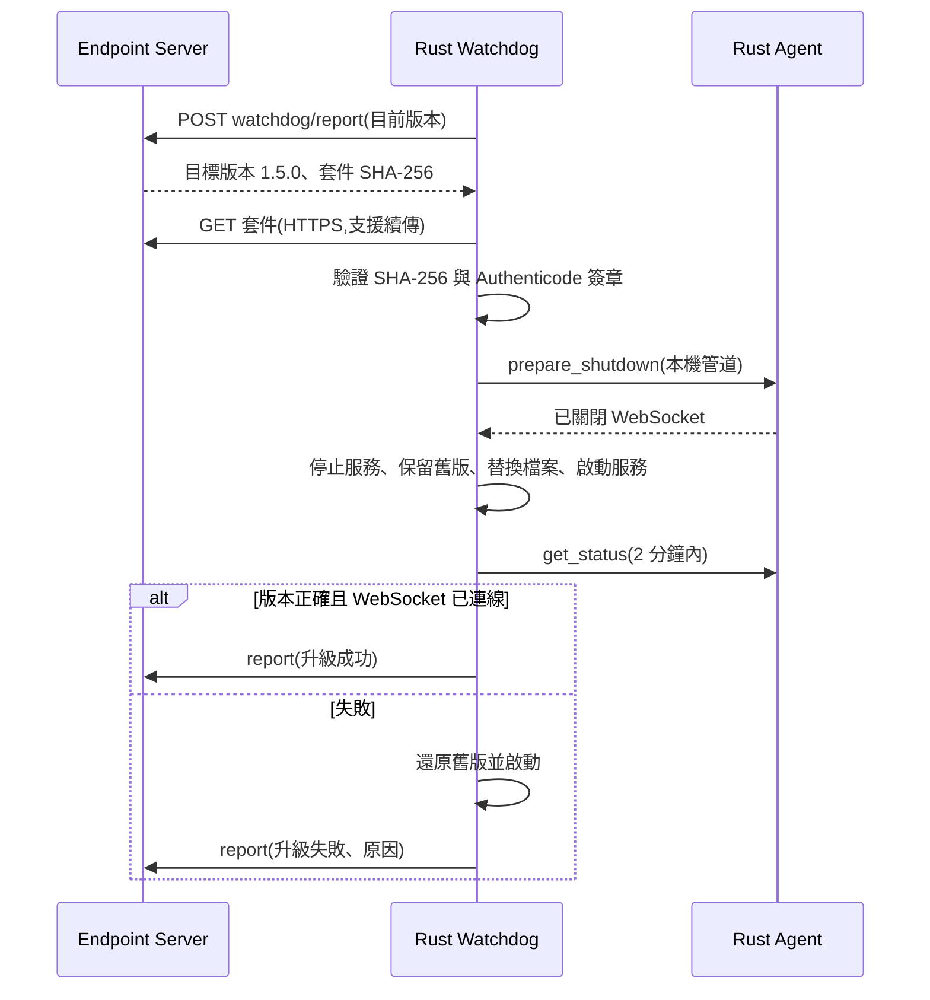
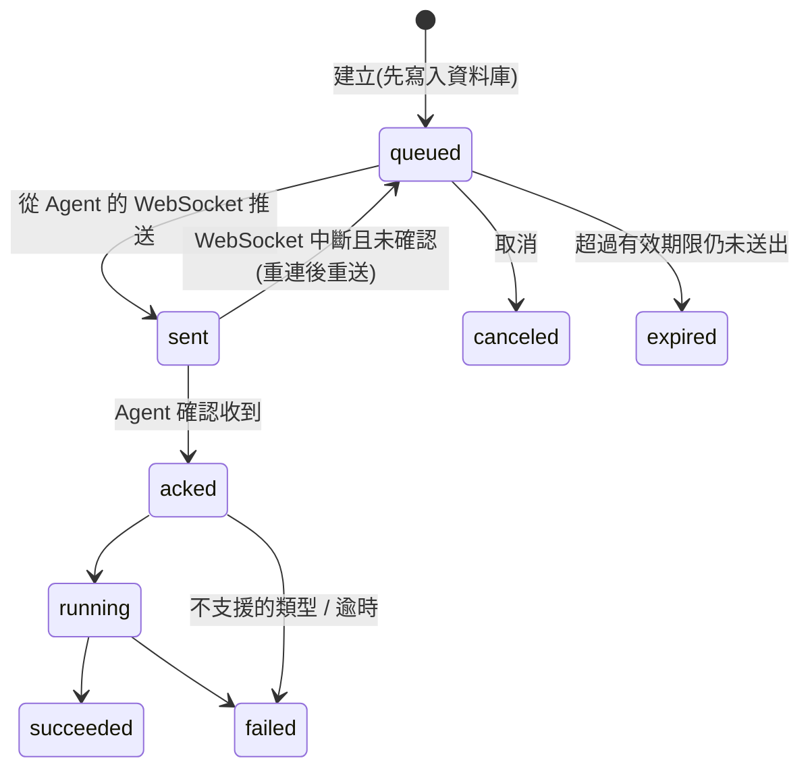

# GigaNexus Gateway — Endpoint Server 與端點 Agent 開發手冊(Node.js 後端 + Rust Agent,WebSocket)

> 適用對象:RustIt 的 Endpoint Server(`RustIt/ItAgentBack`,Node.js + Fastify)、Rust Agent(`RustIt/RustAgent/crates/agent`)、Rust Watchdog 的開發者(W6)。
> 對應 PRD 版本:**v0.9**(2026-10-01)。相關規格:[PRD.md](PRD.md) §7.4(WebSocket)、§7.6(Agent 通道);[ARCHITECTURE.md](ARCHITECTURE.md) T6、T8、D2、D3;一般下游後端規範見 [BACKEND-GUIDE.md](BACKEND-GUIDE.md);RustIt 的產品規格見 `../RustIt/docs/PRD.md`。

---

## 1. 文件資訊

| 項目 | 內容 |
| --- | --- |
| 文件版本 | v0.4(2026-10-06:Endpoint Server 由 Rust Axum 改為 Node.js〔`RustIt/ItAgentBack`〕,Rust 只負責端點的 Agent、Watchdog、托盤;資料存 SQL Server + MongoDB + Redis;通道、port、權限、API 不變。v0.3〔2026-10-01〕:Agent 通道由 gRPC 改為 HTTPS / WebSocket) |
| 建立日期 | 2026-09-25 |
| 適用範圍 | 端點電腦上的程式(Rust Agent、Rust Watchdog)經 Gateway `:9443` 連到 Endpoint Server 的通道;同一台電腦上的本機通道;IT 管理頁面經 BFF 管理電腦與下指令(§8) |
| 不在範圍 | Endpoint Server 的業務功能與正式訊息格式(由 W6-1 定義);端點電腦的軟體派送方式 |
| 維護者 | Gateway 負責人(通道規格)、W6 負責人(§5–§7 的程式規範) |

**為什麼不用 gRPC(2026-09-29 決定)**:1,000 台以內的端點,一條 WebSocket 接收指令、HTTPS 回報資料已足夠;gRPC 的效益在萬台規模才明顯。WebSocket 可直接沿用 Nginx、瀏覽器與 Node.js(`ws`)的既有支援,除錯工具也較普及。

**HTTPS / WebSocket 經 `:9443` 只用在端點電腦**。其他後端(例如 MES)對外的 API 一律走 HTTP/JSON,經 BFF 轉送([BACKEND-GUIDE.md](BACKEND-GUIDE.md))。`:9443` 只接受 Agent 專用中繼 CA 簽發的裝置憑證。

**實作狀態**:

| 項目 | 狀態 |
| --- | --- |
| Gateway `:9443` 設定(`nginx/conf.d/agent.conf`) | ⚠ **仍為 gRPC 版**(`grpc_pass`,2026-09-25 實測通過)。依 §4 改寫為 `proxy_pass` + WebSocket,**W6-1 訊息協定定版後進行** |
| §3.4、§6–§7 的 Rust 寫法 | 建議做法,**尚未實測**,開發時先做 PoC(特別是 Windows 憑證存放區的不可匯出私鑰) |
| Endpoint Server(`RustIt/ItAgentBack`,§5) | 規劃中;整合計畫 `../../RustIt/docs/INTEGRATION-PLAN.md`、決策 `../../RustIt/docs/decisions/0004-node-endpoint-server.md` |

---

## 2. 全貌



| # | 通道 | 路徑 | 協定 | 身分 | 規範 |
| --- | --- | --- | --- | --- | --- |
| C1 | Agent 上行 | Rust Agent → Nginx `:9443` → Endpoint Server `:51241` | HTTPS(回報資料)+ 一條 WebSocket 長連線(心跳、接收指令、回報指令進度) | 電腦憑證(mTLS) | §4–§6 |
| C2 | Watchdog 上行 | Rust Watchdog → Nginx `:9443` → Endpoint Server `:51241` | HTTPS 單次請求 | **同一張**電腦憑證 | §7.3 |
| C3 | 本機 | Rust Watchdog ↔ Rust Agent(同一台電腦) | Windows 具名管道,JSON 訊息 | Windows 帳號(管道 ACL) | §7.2 |
| C4 | 管理 API | 瀏覽器 → `:443/api/endpoint/*` → BFF → `:51240` | HTTP/JSON | `X-Internal-Token`(`aud` = `endpoint-api`) | §8、[BACKEND-GUIDE.md](BACKEND-GUIDE.md) |
| C5 | 串流 WebSocket | 瀏覽器 → `:443/ws/endpoint/{pc}` → `:51240` | WebSocket | `X-Internal-Token`(Nginx `auth_request` 取得) | §5.8 |

### 2.1 分工

| 項目 | Gateway(Nginx) | Endpoint Server | Rust Agent | Rust Watchdog | IT |
| --- | --- | --- | --- | --- | --- |
| 驗證裝置憑證(簽發者、效期、CRL) | ✅ | 只讀 Nginx 傳來的標頭 | 出示憑證 | 出示憑證 | 發放 / 撤銷憑證 |
| 裝置登錄、停用、DN ↔ 電腦對應 | — | ✅ | — | — | 維護 |
| 同一張憑證的連線數上限、逾時 | ✅ | — | 退避重連 | 退避重試 | — |
| 單則訊息 / 請求大小上限 | 不限制(§4) | ✅ | — | — | — |
| 應用層心跳、離線判斷 | — | ✅ | ✅ | — | — |
| Agent 存活 / 健康 / 版本監控、重啟、升級 | — | 下達目標版本 | 提供本機狀態(C3) | ✅ | — |
| CRL 更新到 Nginx | ✅(未完成,§10 G1) | — | — | — | 發布 CRL |

---

## 3. 裝置身分與憑證

### 3.1 兩種電腦

| 項目 | 網域電腦(碩禾 / 碩禾_新 / 鹽城碩禾) | 非網域電腦(同一內網,例如禾迅) |
| --- | --- | --- |
| 發放 | AD CS 範本「GigaNexus Agent」+ GPO **電腦憑證自動註冊** | IT 以同一範本另行簽發(建議流程如下) |
| 存放 | `LocalMachine\My`,私鑰不可匯出 | 同左 |
| 根憑證 | GPO 派送到 `LocalMachine\Root` | 安裝時一併匯入 `LocalMachine\Root`(PRD §14.1) |
| 續約 | 自動(到期前由 Windows 自動續約,指紋會改變) | **人工**;Watchdog 回報剩餘天數(§7.3),到期前 30 天通知 IT |
| 撤銷 | IT 在 AD CS 撤銷 → CRL → Nginx(§10 G1) | 同左 |

非網域電腦的建議流程(金鑰在電腦上產生,不經過 IT 的電腦):

1. 在該電腦以系統管理員執行 `certreq -new agent.inf agent.csr`(`agent.inf` 設定 `MachineKeySet = TRUE`、`Exportable = FALSE`、Subject 依 §3.2)。
2. IT 以「GigaNexus Agent」範本簽發 `agent.csr`,把 `agent.cer` 交回。
3. 在該電腦執行 `certreq -accept agent.cer`,憑證與私鑰配對後存入 `LocalMachine\My`。

> RustIt PRD 另規劃「首次註冊以一次性 enrollment token 取得裝置憑證」。與上述 AD CS 方式擇一,於 W6-1 定案(§10 E8)。

### 3.2 憑證規格

| 項目 | 規則 |
| --- | --- |
| 簽發者 | **Agent 專用中繼 CA**;Nginx 只接受 `nginx/allowlists/<區域>/agent-issuers.conf` 列出的簽發者,其他 CA 簽發的一律 403 |
| 用途(EKU) | Client Authentication |
| 金鑰 | ECDSA P-256 或 RSA 2048 以上;私鑰不可匯出 |
| Subject | PRD §7.6 為 `CN=<電腦名稱>`;**三個網域加上非網域電腦的電腦名稱可能重複**,建議改用電腦 FQDN,非網域電腦用 `CN=<公司代碼>-<電腦名稱>`(待確認,§10 E1) |
| SAN | 網域電腦帶 AD 電腦物件 GUID(PRD §7.6);Nginx **不會轉送 SAN**,Endpoint Server 只看得到 Subject DN 與指紋 |

### 3.3 Endpoint Server 如何識別裝置

- 以 **`x-client-cert-dn` 完整字串**作為裝置鍵,不要只取 CN(理由見 §3.2)。
- `x-client-cert-fp` 在續約後會改變:同一 DN 出現新指紋時,更新登錄表並寫稽核紀錄;同一 DN 同時有兩個不同指紋在線上時告警(可能是憑證被複製或電腦被複製)。
- 電腦改名等於新的 DN,視為新裝置,由 IT 在管理台合併。

### 3.4 程式如何取用電腦憑證

Agent 與 Watchdog 都以 **LocalSystem** 執行,才能使用 `LocalMachine\My` 的私鑰。挑選規則相同:簽發者為 Agent 專用中繼 CA、EKU 含 Client Authentication、在效期內,多張時取 `NotAfter` 最晚的一張。**每次建立連線都重新挑選**,自動續約後不需要重啟。

| 做法(未實測,需 PoC) | 說明 |
| --- | --- |
| `rustls` + `rustls-cng` | 以 Windows CNG 開啟 `LocalMachine\My` 的憑證,私鑰留在 CNG 內簽章(不可匯出也能用),實作 `rustls::client::ResolvesClientCert`,每次握手重新挑選 |
| 不建議 `native-tls` | 其用戶端憑證需以 PKCS#12 載入,私鑰必須可匯出 |

HTTP 用 `reqwest`、WebSocket 用 `tokio-tungstenite`,兩者共用同一個 `rustls::ClientConfig`。本機開發沒有 Windows 憑證存放區時,改用 PEM 檔(§9)。程式應把「憑證來源」抽成 trait:正式環境讀存放區,開發環境讀檔案。

---

## 4. Gateway 提供的 `:9443` 通道

設定檔:`nginx/conf.d/agent.conf`(⚠ 現行為 gRPC 版,依本節改寫)。

| 項目 | 規格 |
| --- | --- |
| 位址 | `<gateway-ip>:9443`(測試區、正式區各自的主機 IP;不用主機名稱,PRD Q1) |
| 協定 | **HTTP/1.1** over TLS 1.2 / 1.3。WebSocket 以 HTTP/1.1 `Upgrade` 建立;Nginx 不支援以 HTTP/2 承載 WebSocket,`:9443` 不開 `http2` |
| 伺服器憑證 | 企業 CA 簽發,SAN 帶 Gateway IP;端點電腦需信任企業根 CA(`LocalMachine\Root`) |
| 用戶端憑證 | **必要**;簽發者限定 Agent 專用中繼 CA;檢查效期與 CRL |
| 轉送 | **所有路徑**都轉給 Endpoint Server `:51241`(`proxy_pass https://`),新增 API 不需要改 Nginx |
| Nginx → Endpoint Server | TLS,Nginx 以企業根 CA 驗證 Endpoint Server 的憑證(`proxy_ssl_verify on`,§5.1) |
| WebSocket | `proxy_http_version 1.1`、`Upgrade` / `Connection` 標頭映射(沿用 `snippets/websocket.conf` 的寫法) |
| 逾時 | `proxy_read_timeout` / `proxy_send_timeout` 1 小時:**任一方向超過 1 小時沒有資料就中斷**(心跳見 §5.3) |
| 同時連線數 | 每張裝置憑證 **10 條**(`limit_conn`,以憑證指紋計算;Agent 與 Watchdog 使用同一張憑證,共用額度),超過回 429。HTTP/1.1 下一條 TCP 連線同時只處理一個請求,Agent 的 WebSocket 佔 1 條、回報請求以 keep-alive 重用 1–2 條 |
| 請求大小 | 不限制(`client_max_body_size 0`);單則訊息 / 請求上限由 Endpoint Server 設定 |

建議設定(改寫時參考;實際以 `nginx -t` 與 E2E 為準):

```nginx
location / {
    proxy_http_version 1.1;
    proxy_set_header Upgrade    $http_upgrade;
    proxy_set_header Connection $connection_upgrade;
    proxy_set_header x-client-cert-dn  $ssl_client_s_dn;
    proxy_set_header x-client-cert-fp  $ssl_client_fingerprint;
    proxy_set_header x-client-verify   $ssl_client_verify;
    proxy_set_header x-request-id      $request_id;
    proxy_read_timeout 1h;
    proxy_send_timeout 1h;
    client_max_body_size 0;
    proxy_ssl_trusted_certificate /etc/nginx/pki/ca.crt;
    proxy_ssl_verify on;
    proxy_ssl_server_name on;
    proxy_pass https://$endpoint_agent_upstream;
}
```

### 4.1 轉送給 Endpoint Server 的標頭

| 標頭 | 內容 | 範例 |
| --- | --- | --- |
| `x-client-cert-dn` | 用戶端憑證 Subject,RFC 2253 格式(**RDN 順序與憑證相反**) | `O=GigaNexus Dev,CN=PC-001` |
| `x-client-cert-fp` | 憑證 SHA-1 指紋,小寫十六進位 40 字 | `574f45a0357c7d134a9e2f78cd7ed4dc0444ee77` |
| `x-client-verify` | 驗證結果;能到達上游的一定是 `SUCCESS` | `SUCCESS` |
| `x-request-id` | Nginx 產生的請求 ID;**一條 WebSocket 連線只有一個** | `fa514d1f828b4bed79db8e6a1f2eaf32` |

- Agent 自己送的同名標頭會被 Nginx **覆寫**(`proxy_set_header`);其他標頭(例如 `user-agent`)原樣轉送,**不可當作身分依據**。
- Endpoint Server 看到的連線來源是 Nginx,不是 Agent;不要用連線的對端位址判斷裝置或 IP。電腦的 IP 由 Agent 在訊息中回報。

### 4.2 被拒絕時用戶端看到什麼

| 情況 | Nginx 回應 | 用戶端處理 |
| --- | --- | --- |
| 沒有憑證、過期、已撤銷、非企業 CA 簽發、CRL 過期 | HTTP 400(TLS 握手成功後才回,見 §10 G2);WebSocket 升級失敗 | **憑證問題**:不要快速重試,退避到每 10 分鐘;寫 Windows 事件記錄(Subject、到期日、指紋) |
| 簽發者不是 Agent 專用中繼 CA | HTTP 403 | 同上 |
| 同一張憑證超過 10 條連線 | HTTP 429 | 退避重試 |
| Endpoint Server 停止或無回應 | HTTP 502 / 504;已建立的 WebSocket 中斷 | 退避重試 |
| Nginx reload / 重啟、連線閒置超過 1 小時 | WebSocket 關閉(close frame 或 TCP 中斷) | 重建連線(含隨機延遲) |

---

## 5. Endpoint Server 規範(RustIt `ItAgentBack`,Node.js + Fastify)

### 5.1 監聽與 TLS

- `:51241` 提供 Agent 通道,**HTTPS + WebSocket over TLS**(BACKEND-GUIDE §3.3 登記為 `endpoint-agent`);防火牆**只允許 Gateway 主機**連入。
- 伺服器憑證由企業 CA 簽發,**SAN 必須包含 Nginx 連線時使用的名稱**,也就是 `ENDPOINT_AGENT_UPSTREAM` 的主機部分:與 Gateway 在同一個 Docker 網路時為 `endpoint-server`(DNS),跨主機以 IP 連線時放 IP(`iPAddress`)。名稱不符時 Nginx 回 502。
- 不要求用戶端憑證(Nginx 不會出示);裝置身分只看 §4.1 的標頭。
- `:51240`(管理 API、瀏覽器 WebSocket)與 `:51241` 分開監聽,避免 Agent 通道的路由被瀏覽器流量誤用。

### 5.2 裝置身分(Fastify hook)

`:51241` 的所有路由都先經過身分 hook 取得裝置,未通過一律 401,不進入業務邏輯(`:51240` 是另一個 Fastify 實例,只認 `X-Internal-Token`,兩者不共用 hook):

```ts
// 只信任 Nginx 以 proxy_set_header 設定的值(Agent 自送的同名標頭會被覆寫)
agentApp.addHook('onRequest', async (req, reply) => {
  const h = (k: string) => String(req.headers[k] ?? '');
  if (h('x-client-verify') !== 'SUCCESS' || !h('x-client-cert-dn') || !h('x-client-cert-fp')) {
    return reply.code(401).send({ code: 'DEVICE_UNAUTHORIZED' });
  }
  // 以完整 DN 查裝置登錄表(§3.3):停用 → 403;新指紋 → 更新並寫稽核
  req.device = await devices.identify({ dn: h('x-client-cert-dn'), fp: h('x-client-cert-fp') });
});
```

### 5.3 WebSocket 長連線與離線判斷

- 每台 Agent 只維持**一條** WebSocket(`GET /agent/v1/ws`),用來接收指令、送心跳與指令進度;資產與事件等資料量大的回報走 HTTPS(§6.3),不佔用 WebSocket。
- WebSocket 的 ping / pong frame 會穿過 Nginx,但**仍要有應用層心跳**:Agent 每 30 秒送一則 `heartbeat` 訊息,Endpoint Server 回 `heartbeat_ack`。心跳同時帶 Agent 狀態,也確保兩個方向都有資料,不會被 Nginx 的 1 小時逾時切斷。
- 連續 3 次(90 秒)沒收到心跳即判定離線;WebSocket 關閉也立即標記離線。
- Nginx 對上游不做多工:**每一條 Agent WebSocket 都是 Nginx 到 Endpoint Server 的一條獨立 TCP / TLS 連線**。200 台 × 1 條 ≈ 200 條長連線,Node.js 可輕鬆處理(1,000 條上限以實測為準),連線數監控以此估算。

### 5.4 撤銷與停用

- CRL 只在 TLS 握手時檢查。**已建立的 WebSocket 在 CRL 更新後不會被中斷**,直到重連為止。
- 因此 Endpoint Server 要自己維護裝置狀態:IT 停用裝置時,立即以 close code `4403` 關閉該裝置的 WebSocket,HTTPS 請求回 403,重連時也直接拒絕(不等 CRL 更新)。

### 5.5 訊息大小

- Nginx 不限制請求大小(`client_max_body_size 0`)。
- WebSocket 單則訊息上限由 Endpoint Server 設定(建議 1 MB);資產快照、日誌等大資料走 HTTPS 回報,必要時分段。

### 5.6 訊息格式與相容性

- WebSocket 使用 **JSON 文字訊息**,共用信封:`{ "v": 1, "type": "<類型>", "id": "<UUID>", "body": { ... } }`。正式類型清單由 W6-1 定義,資料結構以 `RustIt/docs/contracts/` 的 JSON Schema 與範例檔為準,Agent(Rust)與 Server(Node.js)各自以同一份範例做契約測試。
- 路徑帶版本:`/agent/v1/...`。Agent 是分批升級的,**Endpoint Server 必須同時支援目前版本與前一版的 Agent**。
- 只新增欄位、不改既有欄位的意義;收到不認得的欄位忽略、不認得的 `type` 回 `unsupported`。不相容的變更以新路徑(`/agent/v2/`)並存。
- Agent 在 WebSocket 的第一則訊息 `hello` 回報自己的版本(並以 `user-agent: giganexus-agent/<版本>` 標示),Endpoint Server 依版本決定可用的功能。

### 5.7 日誌

每一筆日誌記錄 `x-request-id`、裝置 DN、指紋。一條 WebSocket 只有一個 `x-request-id`,連線內的每則訊息以信封的 `id` 追蹤。

### 5.8 其他入口(`:51240`)

| 入口 | 身分來源 | 注意 |
| --- | --- | --- |
| 管理 API(C4) | `X-Internal-Token`,`aud` = `endpoint-api` | 依 [BACKEND-GUIDE.md](BACKEND-GUIDE.md) §4 驗證;路由由 OpenAPI 匯入 |
| 串流 WebSocket(C5)`/ws/endpoint/{pc}` | Nginx `auth_request` 向 BFF 驗證(權限 `endpoint.remote.operate`)後帶 `X-Internal-Token`、`X-Auth-User`、`X-Request-Id` 直連 | 內部 Token 效期 60 秒,**只在升級(upgrade)時驗證一次**;連線最長 1 小時,每 30 秒送 ping(PRD §7.4) |

---

## 6. Rust Agent 規範(RustIt `RustAgent/crates/agent`)

### 6.1 安裝型態

| 項目 | 規則 |
| --- | --- |
| 執行方式 | Windows 服務 `GigaNexusAgent`(`windows-service` crate),以 **LocalSystem** 執行(需使用電腦憑證私鑰) |
| 失敗復原 | 服務復原選項:第 1、2、後續失敗皆重新啟動(間隔 10 秒、30 秒、60 秒),1 天後重設計數 |
| 目錄 | 程式 `%ProgramFiles%\GigaNexus\Agent\`;設定與日誌 `%ProgramData%\GigaNexus\Agent\`(ACL 只允許 SYSTEM、Administrators) |
| 簽章 | 執行檔以企業程式碼簽章憑證簽署(Authenticode,RustIt ADR 0003),Watchdog 升級時會驗證(§7.4) |
| 安裝 | MSI,經 GPO 派送(RustIt PRD);Gateway 位址(`<gateway-ip>:9443`)依部署區不同,由安裝程式寫入設定檔 |

### 6.2 連線

- 建立**一個** `rustls::ClientConfig`(用戶端憑證依 §3.4 每次握手重新挑選;信任 `LocalMachine\Root` 的企業根 CA),HTTPS(`reqwest::Client`,keep-alive 重用連線)與 WebSocket(`tokio-tungstenite`)共用。
- 整個程式只維持**一條** WebSocket;斷線時依 §6.3 重建。

### 6.3 主流程

1. 服務啟動時先隨機延遲 0–30 秒再連線,避免 Gateway 或 Endpoint Server 重啟後 200 台同時湧入。
2. 開啟 WebSocket `wss://<gateway-ip>:9443/agent/v1/ws`,第一則送 `hello`(Agent 版本、作業系統、電腦名稱、IP、開機時間)。
3. 之後每 30 秒送 `heartbeat`;同時持續接收 Endpoint Server 下達的 `command`,以 `command_update` 回報進度。
4. 資產快照、事件、指令的大量結果以 HTTPS `POST /agent/v1/...` 回報(開機完整回報、每 24 小時完整掃描、變更時增量,依 RustIt PRD §2)。
5. WebSocket 結束或出錯時,依 §4.2 判斷原因,**等待後重建**:一般錯誤 1 秒起指數退避(上限 2 分鐘,加 ±20% 隨機);憑證錯誤每 10 分鐘。

### 6.4 本機狀態服務

Agent 在本機具名管道上提供狀態查詢(§7.2),讓 Watchdog 讀取健康狀態與版本。狀態包含:WebSocket 是否連線、最後一次收到 `heartbeat_ack` 的時間、最近一次錯誤(含憑證錯誤)、憑證到期日。

### 6.5 升級

Agent **不覆寫自己**;由 Watchdog 停止服務、替換檔案、重新啟動(§7.4)。Agent 收到 `prepare_shutdown` 時送出最後狀態、關閉 WebSocket 後回覆。

---

## 7. Rust Watchdog 與本機通道

> 原規劃為 C# Watchdog(2026-09-24),2026-10-01 改為 Rust,與 Agent 同在 RustIt 的 Cargo workspace(`RustAgent/crates/watchdog`,規劃中),共用憑證來源與訊息契約。

### 7.1 定位

| 項目 | 規則 |
| --- | --- |
| 執行方式 | Windows 服務 `GigaNexusWatchdog`,以 **LocalSystem** 執行 |
| 存活 | 每 30 秒查詢 `GigaNexusAgent` 服務狀態與行程 |
| 健康 | 每 30 秒呼叫本機 `get_status`;連續 3 次失敗(行程在但無回應)→ 停止服務(逾時則結束行程)→ 重新啟動 |
| 版本 | 比對 Agent 版本與 Endpoint Server 下達的目標版本,需要時執行升級(§7.4) |
| 上報 | **自己**經 `:9443` 回報(§7.3),不經過 Agent |
| 憑證 | 回報電腦憑證剩餘天數(非網域電腦需人工續約) |
| 互相看守 | Agent 也定期檢查 `GigaNexusWatchdog` 服務,停止時以 SCM 重新啟動;兩個服務都設定失敗復原選項 |

**Watchdog 為什麼要自己上報**:Agent 當掉或卡住時,Endpoint Server 只知道「WebSocket 斷了」,不知道原因。Watchdog 能回報「Agent 服務一直重啟失敗」、「版本不符」、「憑證過期」,IT 不必到現場查看。

使用者看得到的介面由 **RustIt 托盤程式**(一般使用者權限)負責;托盤只能讀取唯讀狀態與使用者功能(報修、公告),不可呼叫 Agent 的管理操作(§10 E3)。

### 7.2 本機通道(C3):具名管道

| 項目 | 規則 |
| --- | --- |
| 管道名稱 | `\\.\pipe\giganexus-agent-v1` |
| 伺服端 | Rust Agent(`tokio::net::windows::named_pipe::ServerOptions`,以安全性描述元限制存取) |
| ACL | `D:P(A;;GA;;;SY)(A;;GA;;;BA)`:只允許 SYSTEM 與 Administrators(托盤另開唯讀管道,權限另訂) |
| 用戶端 | Rust Watchdog(`ClientOptions::open`) |
| 訊息 | 每則一行 JSON(與 §5.6 相同的信封),請求 / 回應;正式類型由 W6-1 定義,草案:`get_status`、`prepare_shutdown` |
| 防冒充 | Watchdog 連線後以 `GetNamedPipeServerProcessId` 取得管道伺服端的 PID,與 SCM 查到的 `GigaNexusAgent` 服務 PID 比對,不一致即中斷並記錄 |

**不用 `localhost` TCP 的原因**:同一台電腦的任何使用者程式都能連 `localhost` port,只能再自建驗證;可能與其他軟體 port 衝突;防火牆軟體可能跳出提示。具名管道直接以 Windows 帳號控管存取。

`get_status` 回應草案:

```json
{ "v": 1, "type": "status", "id": "…", "body": {
  "version": "1.4.2",
  "started_at": "2026-10-01T08:00:00Z",
  "ws_connected": true,
  "last_heartbeat_ack": "2026-10-01T08:30:00Z",
  "last_error": "certificate rejected by gateway (HTTP 400)",
  "cert_not_after": "2027-09-30T00:00:00Z"
} }
```

### 7.3 Watchdog 上行(C2)

- 與 Agent 使用**同一個位址 `:9443`、同一張電腦憑證**,呼叫 `POST /agent/v1/watchdog/report`。
- **Nginx 不需要調整**:`:9443` 轉送所有路徑。Endpoint Server 以路徑區分 Agent 與 Watchdog,以 DN 對應到同一台裝置。
- 兩支程式持有同一把私鑰,Endpoint Server **無法以密碼學區分**是誰呼叫;兩者都以 SYSTEM 執行,能取得 SYSTEM 的人本來就控制了整台電腦,可以接受。Endpoint Server 仍應只讓 `watchdog/*` 路徑做 Watchdog 的事,不要因為 DN 相同就開放所有功能。
- 以**單次 HTTPS 請求**為主:每 5 分鐘及狀態改變時上報,不佔用長連線。每台電腦同時的連線約為 Agent 1 條 WebSocket + 1–2 條 HTTPS,加 Watchdog 0–1 條,在每張憑證 `limit_conn` 10 條以內。
- 上報內容建議:Agent 服務狀態、Agent 版本、Watchdog 版本、最後一次 `get_status` 結果、24 小時內重啟次數、憑證到期日、最近錯誤;回應帶目標版本(§7.4)。

### 7.4 升級流程(建議)



- Watchdog 自己的升級由 Agent 以相同流程執行(互相升級,不自我覆寫)。
- 套件經 `:9443` 下載屬於**下行**方向,不受請求大小限制影響;也可改用既有軟體派送(GPO / MSI,待確認,§10 E4)。

---

## 8. 端點管理:IT 頁面、BFF 與指令派送

> **已決定(2026-09-25)**:端點管理的 API **以 BFF 的權限為準**;IT 管理系統的後端(itapp-api,Node.js)**只負責 IT 應用本身**,例如選單、Tab、按鈕要不要顯示。Rust(Endpoint Server)與 Node.js(itapp-api)兩個後端並行,各管一塊(PRD Q27、ARCHITECTURE D9)。

### 8.1 分工

```
                        ┌─ /it/api/*        ─▶ itapp-api (Node)            選單、Tab、按鈕顯示權限、IT 人員與部門
IT 前端 /it/ ─▶ Nginx ─┤
                        ├─ /api/endpoint/*  ─▶ BFF ─▶ Endpoint Server (Node.js)   電腦清單、指令(權限在 BFF 檢查)
                        └─ /ws/endpoint/*   ─▶ Endpoint Server (Node.js)          遠端畫面(Nginx 先向 BFF 驗證)

Rust Agent ×200 ─▶ Nginx :9443 ─▶ Endpoint Server (Node.js)   指令即時從 Agent 的 WebSocket 推送
```

| 項目 | itapp-api(Node) | BFF | Endpoint Server(Node.js) | IT 前端 |
| --- | --- | --- | --- | --- |
| 選單、Tab、按鈕要不要顯示 | ✅(職級 × 部門) | 提供 `/api/auth/me` 的權限 | — | 取兩者交集(§8.6) |
| 能不能查詢電腦、下指令 | ❌ 不檢查、不轉送 | ✅ 依路由的 `endpoint.*` 權限 | 資料範圍(§8.2)、指令類型與路徑相符 | — |
| 操作人身分 | — | 簽發內部 Token(工號、公司、角色) | 從內部 Token 取得並寫入稽核 | 顯示目前的 Gateway 登入者 |
| 指令保存、派送、結果 | — | — | ✅ | 輪詢結果(§8.4) |
| 稽核 | IT 應用本身的操作 | 路由 `x-audit-level: meta` | ✅ 每一筆指令(§8.5) | — |

- itapp-api **不轉送**端點 API,也**不持有**能呼叫 Endpoint Server 的服務帳號;端點相關的請求一律由瀏覽器帶著 Gateway 的登入狀態經 BFF。
- `ItAgentBack`(Endpoint Server)與 `itapp-api` 兩個 Node.js 後端**不互相呼叫**;Endpoint Server 需要的操作人資訊都在內部 Token 裡。

### 8.2 權限代碼(BFF)

BFF 一條路由只能檢查一個權限代碼,Endpoint Server 也看不到權限代碼(內部 Token 只帶角色),所以**依風險等級拆成不同路徑**,由 BFF 檢查。

| 權限代碼 | 名稱 | 可以做什麼 |
| --- | --- | --- |
| `endpoint.device.read` | 端點查詢 | 電腦清單、資產、線上狀態、指令紀錄與結果 |
| `endpoint.command.basic` | 端點一般指令 | 對電腦沒有破壞性的指令(收集資產、重啟 Agent);取消自己建立的指令 |
| `endpoint.command.admin` | 端點管理指令 | 會影響使用者的指令(派送 / 移除軟體、重新開機、升級 Agent)、停用 / 啟用裝置 |
| `endpoint.remote.operate` | 端點遠端操作 | 遠端畫面(`/ws/endpoint/*`,已實作,E2E 已驗證) |

- 角色與 AD 群組的對應由 IT 決定(PRD §8.3);建議查詢與一般指令給 IT 人員,管理指令與遠端操作只給 IT 管理員。
- **資料範圍**:Endpoint Server 依內部 Token 的 `cos`(所屬公司)只回傳、只接受該公司的電腦;可管理所有公司的角色另行指定(待確認,§10 E6)。

### 8.3 API 草案

以 `endpoint-api`(`:51240`)提供,OpenAPI 自動註冊為草稿後由 IT 發佈([BACKEND-GUIDE.md](BACKEND-GUIDE.md) §6、§7.5;Endpoint Server 使用 Node.js `@giganexus/backend-sdk` 自動註冊,OpenAPI 根層必須帶 `x-gateway.project: RustIt`,BACKEND-GUIDE §6.1)。路徑中的 `{deviceId}` 由 Endpoint Server 指派(電腦名稱可能重複,§3.2),畫面上顯示電腦名稱。

| 方法 | 對外路徑 | `x-permission` | 說明 |
| --- | --- | --- | --- |
| `GET` | `/api/endpoint/devices` | `endpoint.device.read` | 電腦清單;分頁,篩選線上狀態、公司、Agent 版本 |
| `GET` | `/api/endpoint/devices/{deviceId}` | `endpoint.device.read` | 電腦詳細、資產、Watchdog 最近回報 |
| `GET` | `/api/endpoint/devices/{deviceId}/commands` | `endpoint.device.read` | 該電腦的指令紀錄 |
| `GET` | `/api/endpoint/commands/{commandId}` | `endpoint.device.read` | 指令狀態與結果 |
| `POST` | `/api/endpoint/devices/{deviceId}/basic-commands` | `endpoint.command.basic` | 建立一般指令,回 `202` + `commandId` |
| `POST` | `/api/endpoint/devices/{deviceId}/admin-commands` | `endpoint.command.admin` | 建立管理指令,回 `202` + `commandId` |
| `POST` | `/api/endpoint/batches/basic-commands`、`/admin-commands` | 同上 | 多台電腦同一指令,回 `batchId` 與各台的 `commandId` |
| `POST` | `/api/endpoint/commands/{commandId}/cancel` | `endpoint.command.basic` | 只能取消**自己建立**、尚未送出的指令 |
| `PUT` | `/api/endpoint/devices/{deviceId}/status` | `endpoint.command.admin` | 停用 / 啟用裝置;停用時立即關閉其 WebSocket(§5.4) |

- Endpoint Server 必須檢查「指令類型」屬於該路徑的等級(例:`basic-commands` 送來 `system.reboot` → `400 ENDPOINT_COMMAND_LEVEL_MISMATCH`),否則等於繞過 BFF 的權限。
- `POST` 支援 `Idempotency-Key`(BFF 只對冪等方法自動重試,使用者重複按下時不會建立兩筆指令)。
- 這些路由不設 `x-cache-ttl`;建立指令、停用裝置的路由設 `x-audit-level: meta`。

**指令類型(初版建議)**:不提供任意 shell 指令,只開放固定類型;新增類型時 Agent 與 Endpoint Server 一起發版,舊版 Agent 收到不認得的類型回 `UNSUPPORTED_COMMAND`。

| 類型 | 等級 | 說明 |
| --- | --- | --- |
| `inventory.collect` | basic | 立即收集並回報資產 |
| `agent.restart` | basic | Agent 結束行程,由服務失敗復原重新啟動 |
| `agent.upgrade` | admin | 升級到指定版本(交給 Watchdog,§7.4) |
| `software.install` / `software.uninstall` | admin | 派送 / 移除 IT 核可清單中的軟體 |
| `system.reboot` | admin | 重新開機;先提示使用者,可延後 |

### 8.4 指令派送



- **即時送達**:Agent 在線上時,Endpoint Server 寫入資料庫後立即從該 Agent 的 WebSocket 推送;離線的電腦排隊,重連後依建立順序送出。
- **有效期限**:每筆指令有 `expires_at`(預設 1 小時,依類型調整),避免電腦幾天後開機才執行過時的指令。
- **至少送達一次**:WebSocket 中斷且 Agent 未確認的指令會重送,**Agent 以 `command_id` 去重**。
- **結果回傳給頁面**:先以輪詢 `GET /api/endpoint/commands/{commandId}`(執行中每 2 秒)。指令送達本身是即時的,輪詢只影響畫面更新;需要伺服器主動推送時再新增事件 WebSocket(需調整 Nginx 與 BFF 路由)。
- **批次**:多台電腦的派送 / 重開機限制同時執行台數(例如 20 台),避免頻寬與服務同時中斷。
- Endpoint Server 先以**單一實例**部署。之後若要多實例,指令必須轉給握有該 Agent WebSocket 的實例(例如 Redis pub/sub)。

WebSocket 上的訊息草案(信封見 §5.6;正式內容由 W6-1 定義):

| 方向 | `type` | `body` 主要欄位 |
| --- | --- | --- |
| Agent → Server | `hello` | `version`、`os`、`hostname`、`ips`、`boot_at` |
| Agent → Server | `heartbeat` | `seq`、狀態摘要 |
| Server → Agent | `heartbeat_ack` | `seq` |
| Server → Agent | `command` | `command_id`(UUID,Agent 以此去重)、`kind`(例:`inventory.collect`)、`params`、`expires_at`(過期不執行,回 `failed` / `EXPIRED`)、`issued_by`(操作人工號,Agent 寫入本機日誌) |
| Agent → Server | `command_update` | `command_id`、`state`(`acked` / `running` / `succeeded` / `failed`)、`progress`(0–100)、`result`(摘要;大量資料改走 HTTPS)、`error_code`(例:`UNSUPPORTED_COMMAND`、`EXPIRED`)、`error_message` |
| Server → Agent | `prepare_shutdown` | `reason` |

### 8.5 稽核

Endpoint Server 為每一筆指令保存:`commandId`、`batchId`、`X-Request-Id`、操作人(內部 Token 的 `emp`、`name`)、裝置(`deviceId`、DN)、類型、參數(敏感值遮罩)、建立 / 送出 / 完成時間、狀態、結果摘要、錯誤代碼。BFF 另依路由的 `x-audit-level` 記錄 API 呼叫。**不以來源 IP 作為稽核依據**(Windows 主機上的 Docker 目前看不到真實來源 IP,[DEPLOYMENT.md](DEPLOYMENT.md) §6.1)。

### 8.6 IT 前端(GigaItApp)

| 項目 | 規則 |
| --- | --- |
| 呼叫方式 | `/api/endpoint/*` 一律經 `@giganexus/web-kit`(處理 CSRF 與 Token 更新,[FRONTEND-GUIDE.md](FRONTEND-GUIDE.md));`/it/api/*` 維持現狀 |
| Gateway 登入 | 進入端點管理頁時呼叫 `/api/auth/me`;回 401 時導向 Gateway 登入頁,登入後回到原頁面 |
| 同一人檢查 | `/api/auth/me` 的 `emp` 必須等於 GigaItApp 登入者的 `employeeNo`;不一致時(例如共用電腦上留著別人的 Gateway 登入)不顯示端點功能,要求重新登入 Gateway |
| 按鈕顯示 | **itapp 的按鈕權限 ∧ `/api/auth/me` 有對應的 `endpoint.*` 權限**;兩者都有才顯示,避免按下去才被拒絕 |
| 被拒絕 | BFF 回 `403 PERMISSION_DENIED` 時顯示「權限不足」,並以 BFF 的結果為準(itapp 權限只影響顯示) |
| 身分顯示 | 端點管理頁顯示「以 `<工號> <姓名>` 身分操作」,與稽核紀錄一致 |

itapp 的按鈕權限代碼建議與 BFF 權限一一對應(例如 itapp 按鈕 `endpoint.command.admin` 對應 BFF 同名權限),GigaItApp 的權限表由 GigaItApp 專案維護。

---

## 9. 開發與測試

- 測試區 `:9443` 在 `10.10.130.124:9443`;臨時 PKI(根 CA、`agent-server.crt`、Agent CA 與 CRL)由 `deploy/gen-temp-pki.sh` 產生,放在主機 2 的 `${GW_SECRETS_DIR}/pki/`(不進版控)。正式的裝置憑證由 AD CS 簽發(§3)。
- Endpoint Server 改接位址以環境變數 `ENDPOINT_GRPC_UPSTREAM` 指定(`agent.conf` 改寫時更名為 `ENDPOINT_AGENT_UPSTREAM`),寫在主機 2 的 `test.env`。
- Agent 開發時以 PEM 檔作為憑證來源(§3.4),並以臨時根 CA 作為信任的根。
- 對應驗收場景:`docs/Gherkin/gateway/agent-mtls.feature`;E2E 只驗證 `:9443` 拒絕沒有用戶端憑證的連線(`bff/test/e2e/01-nginx-entry`),HTTPS / WebSocket 通道的 E2E 於 `agent.conf` 改寫時補上。

---

## 10. 未完成與待確認

### 10.1 Gateway 端

| # | 項目 | 影響 | 狀態 |
| --- | --- | --- | --- |
| G0 | `agent.conf` 由 gRPC 改為 HTTPS / WebSocket(§4),環境變數改名 `ENDPOINT_AGENT_UPSTREAM`,並補上通道的 E2E | Agent 上線前必須完成 | **待 W6-1 訊息協定定版** |
| G1 | CRL 定期更新並 reload Nginx | **CRL 過期時 Nginx 會拒絕所有 Agent**(HTTP 400);撤銷的憑證也不會生效 | 未開始;**上線前必須完成** |
| G2 | 無效憑證在 TLS 握手後才回 HTTP 400,不是在 TLS 層拒絕 | 與 PRD 舊版「TLS 層拒絕」字面不同;不會到達 Endpoint Server | **已接受**(2026-10-01 需求方確認) |
| G3 | 200 條 WebSocket 維持 1 小時壓測 | — | 未做;需 k6 或自寫 Node.js / Rust 測試工具 |
| G4 | Windows 主機上 Nginx 看到的來源 IP | 主機 2 已以 Traefik + PROXY protocol 保留來源 IP(`:443`,2026-10-01);`:9443` 開放時在 Traefik 加 `agent` 入口 → `127.0.0.1:19443`(Nginx 已有 `19443 proxy_protocol`,[DEPLOYMENT.md](DEPLOYMENT.md) §6.1)。`limit_conn` 以裝置憑證計算 | `:443` 已處理;`:9443` 待 Agent 上線 |
| G5 | 子公司經 NAT 連入 | 同一公司的電腦共用來源 IP;`limit_conn` 已改以裝置憑證計算,不受影響 | 已處理(2026-09-25) |
| G6 | reload 時,舊的 Nginx worker 要等 WebSocket 結束才會退出(未設定 `worker_shutdown_timeout`) | CRL 更新頻繁 reload 時,舊 worker 可能累積最多 1 小時 | 建議與 G1 一起處理 |
| G7 | 只轉送已知路徑(例:`/agent/v1/*`) | 目前規劃轉送所有路徑,由 Endpoint Server 回 404 | 訊息協定定案後再評估 |

### 10.2 待決事項

| # | 問題 | 建議 | 決定者 |
| --- | --- | --- | --- |
| E1 | 裝置憑證的 Subject 格式;三個網域與非網域電腦的電腦名稱可能重複 | 網域電腦用 FQDN;非網域電腦用 `CN=<公司代碼>-<電腦名稱>`;Endpoint Server 以完整 DN 為鍵 | IT(W2)+ W6 負責人 |
| E2 | 三個 AD 網域是否都能從同一個企業 CA 自動註冊「GigaNexus Agent」範本(是否同一樹系) | 若不同樹系,各自的簽發 CA 都要列入 `agent-issuers.conf` 與 `agent-ca-chain.pem` | IT |
| E3 | 托盤程式可讀取哪些 Agent 狀態、可做哪些使用者功能 | 另開唯讀管道,只提供狀態與報修 / 公告;不可呼叫管理操作 | 提案人 + W6 負責人 |
| E4 | Agent / Watchdog 的升級套件來源:經 `:9443` 下載,或用既有軟體派送(GPO / MSI) | 經 `:9443`(§7.4),與版本管理在同一處;首次安裝用 GPO MSI | W6 負責人 + IT |
| E5 | 非網域電腦的憑證由誰申請、安裝、續約 | §3.1 的 `certreq` 流程,由 IT 執行;Watchdog 提前 30 天提醒 | IT |
| E6 | 端點管理的資料範圍:IT 人員是否只能管理自己公司(`cos`)的電腦;哪些角色可管理全部 | 預設依 `cos`;另設一個「全部公司」角色給 IT 主管 | 主管 + IT |
| E7 | 指令類型清單與各類型的等級、有效期限(§8.3 初版) | 先上線 `inventory.collect`、`agent.restart`,其餘隨 W6 逐步開放 | W6 負責人 + IT |
| E8 | 裝置憑證取得方式:AD CS 自動註冊(本文 §3.1)或 RustIt PRD 的 enrollment token | 網域電腦用 AD CS;非網域電腦評估 enrollment token 以減少 IT 人工 | W6 負責人 + IT |

---

## 11. 上線檢查清單

**Gateway**

- [ ] `agent.conf` 已改為 `proxy_pass` + WebSocket(§4),E2E 改寫並通過
- [ ] CRL 定期更新(G1)

**Endpoint Server**

- [ ] `:51241` 只允許 Gateway 主機連入;伺服器憑證 SAN 符合 `ENDPOINT_AGENT_UPSTREAM` 的主機名稱或 IP
- [ ] 裝置身分只取 `x-client-cert-*`,並要求 `x-client-verify = SUCCESS`;以完整 DN 為裝置鍵
- [ ] 停用裝置時立即關閉其 WebSocket(不等 CRL)
- [ ] 設定 WebSocket 單則訊息上限;大資料走 HTTPS
- [ ] 應用層心跳與離線判斷
- [ ] 同時支援前一版 Agent
- [ ] 日誌記錄 `x-request-id`、DN、指紋
- [ ] 指令 API 依等級拆路徑(§8.3),並檢查指令類型與路徑等級相符;依 `cos` 過濾資料範圍
- [ ] 指令先寫入資料庫再推送;有效期限、重送、每筆指令的稽核欄位(§8.5)

**Rust Agent / Rust Watchdog**

- [ ] 以 LocalSystem 執行的 Windows 服務,設定失敗復原選項
- [ ] 每次連線重新挑選電腦憑證(續約後不需重啟)
- [ ] 單一 WebSocket、30 秒心跳、指數退避加隨機、啟動時隨機延遲
- [ ] 憑證錯誤(HTTP 400 / 403)降低重試頻率並寫事件記錄
- [ ] 本機管道 ACL 只允許 SYSTEM 與 Administrators;Watchdog 比對管道伺服端 PID
- [ ] 升級前驗證 SHA-256 與簽章,失敗自動還原
- [ ] Agent 以 `command_id` 去重;過期或不認得的指令回 failed,不執行

**IT 前端(GigaItApp)**

- [ ] `/api/endpoint/*` 經 web-kit 呼叫;Gateway 登入者與 GigaItApp 登入者為同一工號
- [ ] 端點按鈕顯示取 itapp 按鈕權限與 BFF 權限的交集
