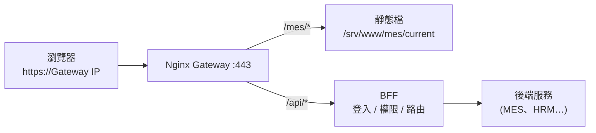
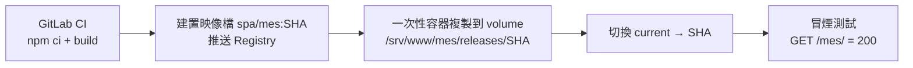

# GigaNexus Gateway — 前端接入規範

> 適用對象:所有經 GigaNexus Gateway 對外提供的前端專案(**Vue 3 + Vite** SPA)。
> 對應 PRD 版本:**v0.7**(2026-09-26)。
> 相關規格:[PRD.md](PRD.md) §7.2(SPA 託管)、§8.2(身分認證)、§8.3(RBAC);[ARCHITECTURE.md](ARCHITECTURE.md)。

---

## 1. 文件資訊

| 項目 | 內容 |
| --- | --- |
| 文件版本 | v0.2(§7.2 `me` 新增 `apps`、職級;§7.4 應用切換與應用層守衛;§7.5 選單 / Tab / 按鈕權限分類;登入頁由員工入口網 giga-Portal 提供) |
| 建立日期 | 2026-09-24 |
| 適用範圍 | 新開發的 Vue 專案(必須遵守);既有專案遷移時比照(見 §10) |
| 維護者 | Gateway 負責人 |

---

## 2. 核心觀念



1. **同一個來源、不同子路徑**:以 DNS 名稱存取(`https://<gateway-host>/`,PRD Q1),每個系統掛在固定子路徑下(例如 `/mes/`),與 API 同來源,**沒有 CORS 問題**。
2. **前端不碰 Token**:登入後 BFF 以 httpOnly Cookie 保存身分,瀏覽器自動帶上;前端只需處理 CSRF 標頭與 401 / 403。
3. **只呼叫 `/api/...`**:前端不知道、也不應知道後端服務的主機與 port,一律經 Gateway。
4. **統一登入**:各系統不自建登入頁,未登入一律導向入口網 `/login`(由員工入口網 `../giga-Portal` 提供)。
5. **應用切換**:各系統右上角帳號旁提供應用切換,只列出使用者有權限的應用;沒有該應用權限時導回員工入口網(§7.4)。

---

## 3. 子路徑登記

新系統開發前,先向 Gateway 負責人登記子路徑(規則見 PRD §7.2.1):

| 項目 | 規則 |
| --- | --- |
| 格式 | 小寫英數與 `-`,前後帶 `/`,例如 `/mes/`、`/notes/`、`/asset-mgmt/` |
| 保留路徑 | `/api/`、`/ws/`、`/webhook/`、`/_auth/`、`/.well-known/`、`/docs`、`/healthz`、`/readyz`、`/metrics`、`/login`、`/register`、`/reset-password` |
| API 前綴 | 對應的後端 API 一律為 `/api/{system_code}/...`,`system_code` 與子路徑名稱**建議相同** |

> 以下範例以子路徑 `/mes/`、API 前綴 `/api/mes/` 說明。

---

## 4. 專案設定

### 4.1 `vite.config.ts`

```ts
import { defineConfig } from 'vite'
import vue from '@vitejs/plugin-vue'

export default defineConfig({
  base: '/mes/', // 必須與登記的子路徑完全一致(前後都要有 /)
  plugins: [vue()],
  server: {
    port: 5173,
    proxy: {
      // 本機開發時,API 與 WebSocket 轉到測試區 Gateway(見 §8)
      '/api': { target: 'https://giganexus-test.gigasolar.com.tw', changeOrigin: true, secure: false, cookieDomainRewrite: '' },
      '/ws': { target: 'wss://giganexus-test.gigasolar.com.tw', ws: true, changeOrigin: true, secure: false },
    },
  },
})
```

### 4.2 Vue Router

```ts
import { createRouter, createWebHistory } from 'vue-router'

export const router = createRouter({
  history: createWebHistory(import.meta.env.BASE_URL), // = '/mes/'
  routes,
})
```

- 一律使用 **History 模式**(`createWebHistory`),不使用 Hash 模式;Nginx 已設定找不到檔案時回傳該系統的 `index.html`。
- 路由內的路徑寫**相對於子路徑**(`/work-orders`),不要寫成 `/mes/work-orders`。

### 4.3 環境變數

- 子路徑與 API 前綴在各環境相同,**不需要**依環境切換 API 位址。
- `VITE_*` 變數會被打包進前端程式碼,**不可放任何密鑰、帳密或內部主機位址**。

---

## 5. 資源路徑規則

| 情境 | 正確 | 錯誤(打包後找不到) |
| --- | --- | --- |
| `src/` 內的圖片、字型 | `import logo from '@/assets/logo.png'`(Vite 自動處理) | — |
| `public/` 內的檔案(JS 中) | `` `${import.meta.env.BASE_URL}config.json` `` | `'/config.json'` |
| `public/` 內的檔案(模板中) | ``(`base` 取自 `import.meta.env.BASE_URL`) | `` |
| CSS 中的圖片 | `url('@/assets/bg.png')` 或相對路徑 | `url('/bg.png')` |
| 系統內頁面跳轉 | `router.push('/work-orders')` | `location.href = '/work-orders'` |
| 跳到其他系統 | `location.href = '/hrm/leave'`(完整子路徑) | 寫死主機與 port |

> 原則:**任何以 `/` 開頭的寫死路徑都要檢查**;只有 `/api/...`、`/ws/...`、`/login` 與跨系統連結可以用根路徑。

---

## 6. 呼叫 API

### 6.1 共用套件

所有專案使用 Gateway 團隊維護的共用套件(建議名稱 **`@giganexus/web-kit`**,發佈於公司 GitLab Package Registry),內含 HTTP client、CSRF、401 / 403 處理、`me` 查詢與權限判斷。**不要在各專案自行重寫這些邏輯。**

```ts
// main.ts
import { createWebKit } from '@giganexus/web-kit'

app.use(createWebKit({ router }))
```

以下說明共用套件的行為,供理解與除錯。

### 6.2 請求規則

| 項目 | 規則 |
| --- | --- |
| 路徑 | 相對路徑 `/api/mes/...`,不加主機名稱 |
| Cookie | 同網域請求瀏覽器自動帶上;**不需要**設定 `withCredentials`,也**不要**手動處理 Token |
| CSRF | `POST` / `PUT` / `PATCH` / `DELETE` 必須帶 `X-CSRF-Token` 標頭,值為 `gn_csrf` Cookie |
| 追蹤 | 回應標頭 `X-Request-Id` 應在錯誤訊息中顯示,方便回報問題時查日誌 |
| 檔案上傳 | `multipart/form-data`;大小上限依路由設定(預設 10 MB) |

### 6.3 HTTP client 行為(共用套件內部實作示意)

```ts
import axios, { AxiosError } from 'axios'

const http = axios.create({ baseURL: '', timeout: 30_000 })

const readCookie = (name: string) =>
  document.cookie.split('; ').find((c) => c.startsWith(`${name}=`))?.split('=')[1]

// 1) 非 GET 請求帶上 CSRF Token
http.interceptors.request.use((config) => {
  const method = (config.method ?? 'get').toUpperCase()
  if (!['GET', 'HEAD', 'OPTIONS'].includes(method)) {
    const token = readCookie('gn_csrf')
    if (token) config.headers.set('X-CSRF-Token', decodeURIComponent(token))
  }
  return config
})

// 2) 401 → 先 Refresh 一次(多個請求共用同一次 Refresh),失敗才導向登入
let refreshing: Promise<void> | null = null

http.interceptors.response.use(undefined, async (error: AxiosError) => {
  const original = error.config as any
  if (error.response?.status !== 401 || original?._retried || original?.url?.startsWith('/api/auth/')) {
    throw error
  }
  original._retried = true
  refreshing ??= http.post('/api/auth/refresh').then(() => undefined).finally(() => (refreshing = null))
  try {
    await refreshing
    return http(original)
  } catch {
    const back = encodeURIComponent(location.pathname + location.search)
    location.href = `/login?redirect=${back}`
    throw error
  }
})
```

### 6.4 錯誤回應

BFF 統一的錯誤格式(完整代碼見 [PRD.md](PRD.md) §8.1.1 錯誤代碼總表):

```jsonc
{
  "code": "PERMISSION_DENIED",   // 錯誤代碼,前端依此判斷(PRD §8.1.1)
  "message": "您沒有此功能的權限", // 可直接顯示給使用者
  "requestId": "7f3c…"            // 與 X-Request-Id 相同
}
```

| 狀態碼 | 意義 | 前端處理 |
| --- | --- | --- |
| 400 | 參數驗證失敗 | 顯示 `message`,表單欄位錯誤另見 `details` |
| 401 | 未登入 / Token 過期 | 共用套件自動 Refresh,失敗導向 `/login` |
| 403 | 已登入但無權限,或 CSRF 驗證失敗 | 顯示無權限頁,附 `requestId` |
| 404 | 路由不存在 | 顯示找不到資源 |
| 409 | 資料已被他人修改(樂觀鎖) | 提示重新載入後再編輯 |
| 422 | 業務規則不允許(例如工單已結案) | 顯示 `message` |
| 429 | 超過限流 | 提示稍後再試,不要自動無限重試 |
| 502 / 503 / 504 | 上游服務異常或逾時 | 顯示系統暫時無法使用,附 `requestId` |

---

## 7. 登入、使用者與權限

### 7.1 登入流程

- 各系統**不做登入頁**。未登入時(Refresh 也失敗),導向 `/login?redirect=<目前路徑>`,入口網登入後自動導回(`redirect` 只接受同網域相對路徑)。`/login`、`/register`、`/reset-password` 由員工入口網(giga-Portal)實作。
- 入口網的登入頁同時支援 **AD 帳號與本機帳號**(無網域子公司員工),並提供自行註冊(`/register`)與忘記密碼(`/reset-password`);各系統不需處理這些流程(PRD §8.2.5)。
- 舊單一入口帳號首次在新入口網登入時,登入 API 回 `PASSWORD_CHANGE_REQUIRED`,由入口網引導設定新密碼後才完成登入;新舊入口並行期間,兩邊密碼各自獨立(PRD §8.2.6)。
- 登出:呼叫 `POST /api/auth/logout`,完成後導向 `/login`。
- 登入後在任一系統之間切換都不需重新登入(同網域共用 Cookie)。

### 7.2 取得使用者與權限

應用程式啟動時呼叫一次 `GET /api/auth/me`(共用套件已處理並快取):

```jsonc
// 回應示意(實際欄位以 BFF /docs 為準)
{
  "user": { "employeeNo": "S112009", "name": "王小明", "deptCode": "IT01", "department": "資訊部", "title": "工程師", "jobLevel": "5", "authType": "ad" },
  "companies": ["碩禾"],   // 含兼任公司
  "roles": ["employee", "mes-operator"],
  "permissions": ["portal.app.access", "mes.app.access", "mes.workorder.read", "mes.workorder.report"],
  "apps": [                // v0.7:可使用的應用(PRD §8.3.3),依排序
    { "code": "portal", "name": "員工入口網", "basePath": "/", "icon": "home" },
    { "code": "mes", "name": "MES 看板", "basePath": "/mes/", "icon": "factory" }
  ],
  "menus": []              // 保留欄位;選單由各系統依 permissions 過濾自己的路由定義
}
```

```ts
import { useAuth } from '@giganexus/web-kit'

const { user, can } = useAuth()
// 模板:<button v-if="can('mes.workorder.report')">報工</button>
```

- **路由守衛**:在路由 `meta.permission` 標示所需權限,共用套件的守衛會檢查,無權限導向 403 頁。
- **前端隱藏按鈕只是使用體驗,不是安全機制**:真正的權限檢查在 BFF,前端不可因隱藏了按鈕就假設 API 不會被呼叫。
- 權限代碼格式:`{system}.{resource}.{action}`,新功能需要的權限代碼請於開發前向 IT 登記。

### 7.3 禁止事項

- 不可將任何 Token、密碼存入 `localStorage`、`sessionStorage` 或 Pinia 持久化儲存。
- 不可自行解析 JWT 取得使用者資訊(前端也讀不到);一律使用 `/api/auth/me`。
- 不可直接呼叫後端服務的主機與 port(例如 `http://server:5121`)。

### 7.4 應用切換與應用層守衛(PRD §8.3.3,v0.7)

每個 SPA 都要實作(員工入口網、GigaItApp 已規劃,新系統比照):

| 項目 | 規範 |
| --- | --- |
| 應用登記 | 上線前向 Gateway 負責人登記應用代碼、名稱、子路徑、圖示與 `app` 權限(`{system}.app.access`),寫入 `gw.app` |
| 應用切換 | 頂列帳號旁的圖示按鈕 + 下拉,列出 `me.apps`,標示目前所在應用;點選以**整頁導向**該應用 `basePath`;`apps` 只有一個以下時不顯示 |
| 應用層守衛 | 啟動時取得 `me`:未登入 → `/login?redirect=`;`me.apps` 不含本應用 → 以 `location.replace('/')` 導回員工入口網並帶提示參數(員工入口網本身沒有權限時顯示無權限頁,不可導回自己) |
| 權限變更 | 換頁或 5 分鐘內重新取得 `me`,應用、選單、按鈕隨之更新;API 權限由 BFF 以 `pv` 立即生效 |

### 7.5 選單、Tab、按鈕權限(PRD §8.3.2,v0.7)

- 兩層選單的功能頁、頁內 Tab、按鈕各自對應一個權限代碼(`kind` 為 `menu` / `tab` / `button`),在後端 OpenAPI `x-permissions` 宣告並掛到上層(BACKEND-GUIDE §6.1),由 IT 在 GigaItApp 依角色、部門、職位設定。
- 路由 `meta.permission` 用 `menu` / `tab` 代碼;按鈕用 `button` 代碼,且**必須等於**按鈕呼叫的寫入 API 的權限代碼。
- 無 `menu` 權限的功能不顯示,沒有任何可見功能的選單群組不顯示;直接輸入網址時顯示 403 頁。

---

## 8. 本機開發

| 方式 | 做法 | 適用 |
| --- | --- | --- |
| **連測試區 Gateway**(建議) | `npm run dev`,Vite proxy 將 `/api`、`/ws` 轉到測試區(§4.1) | 後端 API 已在測試區 |
| **Mock 路由** | 後端未完成時,請 Gateway 負責人在**測試區**建立 `mock` 型路由(PRD §8.4.1),前端照正式路徑呼叫 | 前後端並行開發 |
| **本機 Mock** | 使用 MSW 等工具在瀏覽器攔截 `/api/...` | 離線或單元測試 |

- 以 `http://localhost:5173/mes/` 開啟(注意要帶子路徑)。
- 登入:開發模式下導向共用套件提供的**開發用登入頁**(僅在 `import.meta.env.DEV` 時啟用,不會打包進正式版),以測試區 AD 帳號登入;Cookie 由 Vite proxy 轉寫到 `localhost`。
- 瀏覽器將 `localhost` 視為安全來源,帶 `Secure` 屬性的 Cookie 在 `http://localhost` 下仍可運作。

---

## 9. 建置與部署

### 9.1 建置

```bash
npm ci
npm run build   # 產出 dist/,資源路徑皆以 /mes/ 開頭
```

建置後自我檢查:`dist/index.html` 中的 `<script>`、`<link>` 路徑應為 `/mes/assets/...`。

### 9.2 部署(CI Pipeline)



- `dist/` 打包成映像檔(tag 為 commit SHA),部署時由該區主機的 Runner 以一次性容器複製到 Nginx 掛載的 named volume,再**原子切換** `current`;**不需重啟或 reload Nginx**([DEPLOYMENT.md](DEPLOYMENT.md) §3.4)。
- 保留最近 5 個版本;回滾使用 Pipeline 的手動回滾 job,將 `current` 指回上一版。
- 分支:`develop` 自動部署測試區;`main` 經手動核可部署正式區(正式區使用與測試區相同 SHA 的映像檔)。
- 快取:`index.html` 不快取,`assets/*` 帶 hash 長期快取,因此**部署後使用者重新整理即可取得新版**,不需要求清除快取。

Pipeline 範本由 Gateway 團隊提供(`include` 共用的 `.gitlab-ci` 片段),各專案只需設定子路徑名稱。

---

## 10. 既有系統遷移

既有系統(例如 `notesapp`:前端容器 `5122:80`、後端 `5121`)以根路徑 `/` 打包並各自開 port,需依 PRD §7.2.4 選擇過渡方式。

### 10.1 方式 A / B 共同的前端改造步驟

- [ ] 登記子路徑(例如 `/notes/`)與 API 前綴(`/api/notes/`)
- [ ] `vite.config.ts` 設定 `base: '/notes/'`
- [ ] Router 改為 `createWebHistory(import.meta.env.BASE_URL)`,移除寫死的 `/notes` 前綴
- [ ] 依 §5 檢查所有以 `/` 開頭的資源路徑
- [ ] 將寫死的後端位址(例如 `http://server:5121/api/...`)改為 `/api/notes/...`
- [ ] 移除自建的登入頁與 Token 處理,改用共用套件(§6、§7)
- [ ] 後端:API 登記至 BFF 路由表,改由 `X-Internal-Token` 取得使用者身分(過渡期可用 `X-User-*` 標頭,見 PRD §14.1)

### 10.2 各方式差異

| 方式 | 前端靜態檔 | Gateway 設定 | 下一步 |
| --- | --- | --- | --- |
| **A. 遷入 Gateway** | 依 §9 部署到 `/srv/www/notes/` | 一般 SPA location | 停用舊前端容器 |
| **B. 轉發既有容器** | 仍由原容器提供(已用新 `base` 重新打包) | `location /notes/ { proxy_pass http://notesapp-frontend/; }` | 調整部署流程後轉為 A |
| **C. 獨立 port** | 不改 | 以獨立 port(如 `:8443`)整站轉發(目前無 DNS,無法用子網域) | 無法共用登入;僅用於無法修改的系統 |

> 方式 B 中 `proxy_pass` 結尾的 `/` 會去掉 `/notes/` 前綴再轉給容器,容器內 Nginx 設定不需修改。

### 10.3 遷移完成條件

- [ ] 經 `https://<gateway-host>/notes/` 可正常使用,重新整理任一頁面不會 404
- [ ] 使用入口網登入後進入不需再次登入
- [ ] 舊的對外 port(`5121`、`5122`)已對使用者網段關閉

---

## 11. 上線檢查清單

- [ ] 子路徑已登記,`base` 與子路徑一致
- [ ] 以 History 模式直接開啟深層頁面(例如 `/mes/work-orders/123`)並重新整理,頁面正常
- [ ] 無任何寫死的主機、port 或根路徑資源
- [ ] 使用共用套件處理 HTTP、CSRF、401 / 403、`me`
- [ ] 無 Token 或密碼存在瀏覽器儲存空間
- [ ] 所需權限代碼已向 IT 登記,並在路由 `meta.permission` 標示
- [ ] `VITE_*` 變數中沒有密鑰
- [ ] 錯誤畫面顯示 `requestId`
- [ ] 已在測試區經 Gateway 完整測試(非只在本機 dev server)
