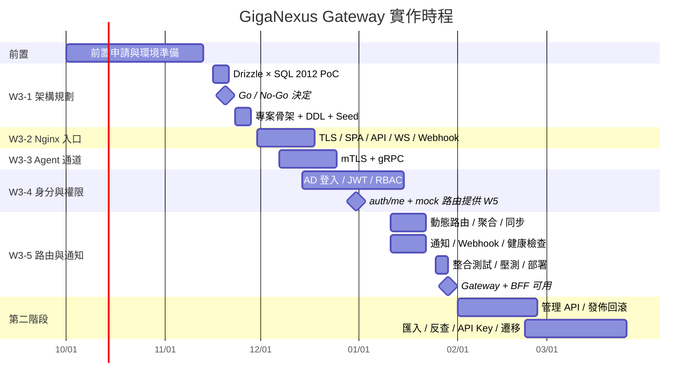

# GigaNexus Gateway — 實作計畫

> 依據 [PRD.md](PRD.md) **v0.5** §13 里程碑,將 W3 MVP 與第二階段拆解為可執行的工作項目、交付物與驗收條件。
> 相關文件:[ARCHITECTURE.md](ARCHITECTURE.md)、[DATABASE.md](DATABASE.md)、[TECH-STACK.md](TECH-STACK.md)、[FRONTEND-GUIDE.md](FRONTEND-GUIDE.md)、[BACKEND-GUIDE.md](BACKEND-GUIDE.md)、[DEPLOYMENT.md](DEPLOYMENT.md)、[REFERENCES.md](REFERENCES.md)。

---

## 1. 文件資訊

| 項目 | 內容 |
| --- | --- |
| 文件版本 | v0.5(對齊 PRD v0.5:新增 W3-5.7a,Q3 兩區設定不互通) |
| 建立日期 | 2026-09-24 |
| 對應工作流 | NexusPlan **W3. API Gateway + BFF**(2026-11-16 ~ 2027-01-29)+ 第二階段(2027-02 ~ 03) |
| 狀態 | 規劃中 |

### 1.1 已定案的前提

以下決策已於 PRD §14.2 定案,本計畫據此排程:

| 決策 | 對計畫的影響 |
| --- | --- |
| SQL Server 2012 **Standard** 版,不升級 | 稽核表以排程分批刪除取代分割;DDL 只用 2012 支援的語法([DATABASE.md](DATABASE.md) §0) |
| BFF ↔ SQL Server 2012 **內網不加密**(已取得主管與工程師同意,2026-09-24) | 完成防火牆與專屬帳號設定(前置工作 P-03) |
| **Drizzle ORM**,PoC 未通過改用 **Kysely**,兩者皆不行走**第三條路 Sequelize**(GeneralBackend 已驗證) | W3-1 第一週完成 PoC 並做 Go / No-Go 決定 |
| 獨立資料庫 **`giganexus_gw`**(schema `gw`);測試區 / 正式區**各自一套**(Q2、Q3) | DBA 需於開工前建立兩區資料庫與登入帳號;兩區設定不互通,各自由後端自動註冊(W3-5.7a),IT 分別發佈 |
| 人事資料 **BPM 為主、LOS 補充**,排程同步 + 登入補查(D7);離職只標記不自動停用(Q10) | W3-4 新增人員同步工作(W3-4.6a–c);需唯讀帳號與欄位對應(P-12、P-13) |
| 登入效期 8 小時,「記住我」7 天僅限內網(Q4);Kerberos 列第三階段(Q5) | W3-4.4 實作記住我與來源 IP 判定 |
| **LINE 通知暫緩**(Q7) | 通知只做 Email + 站內;不申請 LINE 官方帳號 |
| `:443` 以 DNS 名稱存取、公司 `*.gigasolar.com.tw` 憑證;Agent 以 IP 存取、獨立 port `:9443`(Q1,2026-10-01 修訂) | `:9443` 憑證 SAN 帶 IP(P-05);W3-3 以 port 區分;無網域子公司電腦需另外安裝企業根憑證 |
| AD 三網域全納入(Q11);過渡期沿用 `ldap://`(Q12,已取得主管與工程師同意,2026-09-24) | 各網域服務帳號(P-07) |
| 無網域子公司使用**本機帳號**:LOS / BPM 找得到就可註冊,找不到才審核;密碼至少 8 碼(Q13–Q15) | W3-4 本機帳號登入與代建(W3-4.14–15);W3-5 自行註冊與忘記密碼(W3-5.8a–b) |
| 兼任帳號不可單獨登入、併入本人(Q16);不同工號不歸戶(Q17) | 人員同步處理兼任帳號(W3-4.6b);不需 `PersonKey` |
| 舊單一入口帳號首次登入自動遷移(PRD §8.2.5);新舊入口並行、不提供舊系統單一登入相容、舊系統不修改、新進員工兩邊皆可註冊(Q20–Q24) | W3-4.16;需現行系統的測試帳號與 `LoginData` 唯讀 view(P-15);忘記密碼細節於 W5 入口網開發時確定 |

---

## 2. 時程總覽

| 里程碑 | 日期 | 判定條件 |
| --- | --- | --- |
| M0 ORM Go / No-Go | 2026-11-20 | PoC 檢查表(§4.1)全部通過 → Drizzle;否則改 Kysely;Kysely 也不通過 → Sequelize(第三條路) |
| M1 身分可用 | 2026-12-31 | `/api/auth/login`、`/api/auth/me` 與 mock 路由部署至測試區,W5 前端可串接登入 |
| **M2 Gateway + BFF 可用** | **2027-01-29** | 經 W1 Pipeline 部署至測試區;§8 驗收指標通過;W4、W5 可開始串接 |
| M3 管理功能完成 | 2027-03-26 | 第二階段項目完成,W4 IT 管理介面可自助管理 API |

---

## 3. 前置工作(2026-10-01 ~ 11-13,W3 開工前完成)

> 這些項目需要其他單位配合,前置時間長,**應立即發出申請**。任一項延誤會直接卡住對應子任務。

| # | 項目 | 負責 / 配合 | 需要的產出 | 卡住 |
| --- | --- | --- | --- | --- |
| P-01 | 建立 `giganexus_gw`、`giganexus_gw_test` 資料庫與 schema `gw` | DBA | 兩個資料庫;BFF 專屬 SQL 登入帳號(僅授權該庫,稽核表僅 INSERT / SELECT);migration 專用帳號(DDL 權限) | W3-1 |
| P-02 | ~~安全例外同意~~:BFF ↔ SQL Server 2012 內網不加密、AD 過渡期 `ldap://` | 主管、工程師 | **已完成**(已取得主管與工程師同意,2026-09-24);補償控制見 [TECH-STACK.md](TECH-STACK.md) §4 | — |
| P-03 | 防火牆:SQL Server 2012 的 1433 僅允許 BFF / worker 主機 | 網管 | 防火牆規則 | 部署 |
| P-04 | SQL Server 2012 **整合測試專用庫**(或可重建的測試 instance) | DBA | 可由 CI 連線、可清空重建的測試庫 | W3-1 起的整合測試 |
| P-05 | 伺服器憑證:`:443` 為公司 `*.gigasolar.com.tw` 憑證(2026-10-01 取得,測試區已套用);`:9443` 憑證 SAN 含測試區 / 正式區 Gateway **IP**(Agent 以 IP 存取,PRD Q1);企業根 CA 派送(網域電腦由 GPO,無網域子公司電腦另行安裝) | IT + W2 | AD CS 簽發的 IP SAN 憑證;根憑證安裝步驟 | W3-2 |
| P-06 | AD CS「GigaNexus Agent」憑證範本、Agent 專用中繼 CA、CRL 發佈點 | IT + W2 | 範本與 CA 鏈;CRL 下載位置 | W3-3(可先用測試 CA,見 §9) |
| P-07 | AD **LDAP 查詢服務帳號**(三個網域各一組,PRD Q11);企業 CA 根憑證 | IT + 資安 | 各網域服務帳號(唯讀)、baseDN、連線資訊 | W3-4 |
| P-08 | 規劃 AD 群組:`GN-*` 系列對應內建角色 | IT | 群組清單與成員 | W3-4 |
| P-09 | SMTP 中繼帳號(Exchange) | IT | 主機、帳號、寄件人位址 | W3-5 |
| P-10 | ~~LINE 官方帳號申請~~ | — | **暫緩**:本階段不開發 LINE 通知(PRD Q7) | — |
| P-11 | 主機 2(測試區)、主機 3(正式區)的 Docker Desktop 與 GitLab Runner(`windows-runner`、`prod-deploy` Protected)、Registry `:5050` 登入、開機自動恢復、Port 80 / 443 / 9443 未被佔用([DEPLOYMENT.md](DEPLOYMENT.md) §6–§7) | IT / W1 | 兩台主機可由 Pipeline 部署 Compose | W3-2 起 |
| P-12 | LOS、BPM **唯讀帳號**與欄位對應(PRD Q9) | DBA、BPM 負責人 | 兩個唯讀登入帳號;BPM 依 GeneralBackend 的 EFGP 查詢建立唯讀 view([REFERENCES.md](REFERENCES.md) §1.2);LOS `EmployeeInfo` 欄位說明 | W3-4 |
| P-13 | 防火牆:BFF / worker 主機 → BPM 主機(SQL Server 2019)1433 | 網管 | 防火牆規則;BPM 伺服器憑證的 CA(加密連線用) | W3-4 |
| P-14 | 防火牆:Gateway `:443` 開放使用者網段;`:9443` 只開放端點(Agent)網段 | 網管 | 防火牆規則 | W3-2、W3-3 |
| P-15 | 舊單一入口:`PortalSolar.LoginData` 唯讀 view(不含 `EName`)與帳號;以**現行系統**建立 2–3 組測試帳號(參考原始碼為兩三年前的備份,PRD Q18、Q22);演算法常數存入 Docker secret | 提案人、DBA、IT | 唯讀帳號、測試帳號、secret | W3-4 |
| P-16 | 下游後端 port **51200–51300** 分配([BACKEND-GUIDE.md](BACKEND-GUIDE.md) §3)與防火牆:只允許 Gateway 主機連入後端主機的該區間;各服務測試區 / 正式區 API Key(自動註冊用,§7.5) | Gateway 負責人、網管 | 分配紀錄、防火牆規則、API Key | W3-5 起各系統上架 |
| P-17 | Docker Desktop 授權:員工數已確認未達 200 人,**確認年營收是否低於 1,000 萬美元**(PRD Q25);測試區 SMTP 攔截設定([DEPLOYMENT.md](DEPLOYMENT.md) §5.1) | 主管、IT | 授權結論;測試信箱 | W3-2 前 |

---

## 4. W3 MVP 工作拆解

> 工作項目編號格式 `W3-x.n`;「文件」欄指向規格所在章節。

### 4.1 W3-1 架構規劃(11/16 ~ 11/27)

| # | 工作項目 | 文件 | 交付物 |
| --- | --- | --- | --- |
| W3-1.1 | **Drizzle × SQL Server 2012 PoC**(11/16 ~ 11/20) | [TECH-STACK.md](TECH-STACK.md) §4 | PoC 報告 + Go / No-Go 結論 |
| W3-1.2 | 專案骨架:`bff/`(Fastify 5 + TS)、`nginx/`、`db/`、`deploy/docker-compose*.yml`、ESLint / Prettier / Vitest、`.gitlab-ci.yml`(check / build / deploy-test / deploy-prod,分支策略見 [DEPLOYMENT.md](DEPLOYMENT.md) §2) | [TECH-STACK.md](TECH-STACK.md) §2 | 可建置、可跑測試的空專案 |
| W3-1.3 | Drizzle schema:`gw.*` 全部資料表 | [DATABASE.md](DATABASE.md) §2–§5 | `bff/src/db/schema/` |
| W3-1.4 | 產生初版 migration,**人工審查 2012 相容性**後套用至測試庫 | [DATABASE.md](DATABASE.md) §0、§7.4 | `db/migrations/0001_*.sql` |
| W3-1.5 | Seed:內建角色(`gw-super-admin`、`gw-it-admin`、`employee`)、`gw.admin.*` 權限、預設限流政策、公司與 AD 網域對應(碩禾 → `gsc`、`gsmc`;鹽城碩禾 → `ygdmc`) | PRD §8.3 | `db/seed/`,可重複執行 |
| W3-1.6 | 稽核表保存排程:SQL Agent 作業(分批刪除 `api_access_log` > 180 天、`auth_log` 與 `employee_sync_run` > 1 年、逾期 30 天的 `local_account_token`) | [DATABASE.md](DATABASE.md) §0、§5 | 作業腳本,交 DBA 建立 |
| W3-1.7 | ArchAtlas 更新:`nginx-gateway`、`node-bff` 節點與上下游 | PRD §1 | 更新後的 `sample-atlas.json` |

**PoC 檢查表(M0 判定):**

- [ ] 以 `mssql`(`encrypt: false`)連上 SQL Server 2012 RTM(連線參數以 GeneralBackend 為基準,[REFERENCES.md](REFERENCES.md) §1.1)
- [ ] schema `gw` 下的資料表定義、INT IDENTITY、`DATETIME2(3)`、`NVARCHAR(MAX)`、`UNIQUEIDENTIFIER`、`ROWVERSION`
- [ ] `drizzle-kit generate` 產出的 SQL 可在 2012 執行(無 `CREATE OR ALTER`、`DROP … IF EXISTS` 等語法),或可經少量手動修改後執行
- [ ] 篩選唯一索引(`WHERE status <> 'disabled'`)可定義或以手寫 migration 補上
- [ ] 基本增刪改查、交易(`db.transaction`)含回滾
- [ ] `OFFSET … FETCH` 分頁、`TOP`
- [ ] `ROWVERSION` 樂觀鎖:更新時比對 `row_ver`,衝突可偵測
- [ ] migration(Drizzle migrator,以 `docker compose run --rm migrate` 執行)可重複執行、記錄已套用版本
- [ ] 100 並行查詢下連線池穩定
- [ ] 同一程式以唯讀 schema 查詢 **SQL Server 2019**(BPM,`encrypt: true`)與 2012 上的 LOS

> 若有 1 項以上無法以合理方式繞過 → **No-Go**,改用 Kysely:W3-1.3 改寫為 Kysely 型別定義,W3-1.4 改為手寫 SQL migration(預估多 2 ~ 3 人天,由 W3-1 第二週吸收)。Kysely 以同一檢查表於 11/23 前複驗;仍不通過則**走第三條路**,改用 GeneralBackend 已驗證的 Sequelize 6(預估再多 2 人天)。

**驗收:** 空專案經 CI 建置通過;migration 與 seed 在 `giganexus_gw_test` 套用成功;PoC 結論已記錄於 [TECH-STACK.md](TECH-STACK.md) §4。

### 4.2 W3-2 Nginx:入口、SPA、API、WebSocket、Webhook(11/30 ~ 12/18)

| # | 工作項目 | 文件 | 交付物 |
| --- | --- | --- | --- |
| W3-2.1 | `nginx.conf` 與 `snippets/`:TLS 1.2 / 1.3、安全標頭、`server_tokens off`、`X-Request-Id`、JSON access log | PRD §7.1、§7.7 | `nginx/nginx.conf`、`nginx/snippets/*` |
| W3-2.2 | `:80` → 301;`:443` server block(DNS 名稱,`default_server`) | PRD §7.1 | `nginx/conf.d/portal.conf` |
| W3-2.3 | SPA 託管:`/`、`/mes/`、`/hrm/`、`/fms/`、`/it/`、`/bi/`,History 模式、快取標頭、gzip;`/srv/www/<app>/current` symlink 結構 | PRD §7.2 | 各路徑以範例 SPA 驗證 |
| W3-2.3a | 前端部署 CI 範本:建置 SPA 映像檔、以一次性容器發佈到 `gw_www` volume、原子切換 `current`、保留 5 版、手動回滾 job | PRD §7.2.3、[DEPLOYMENT.md](DEPLOYMENT.md) §3.4 | `ci-templates/spa-deploy.yml` |
| W3-2.4 | `/api/` → `bff_upstream`(keepalive);清除 `X-Internal-*`、`X-User-*`;body 大小、逾時 | PRD §7.3 | |
| W3-2.5 | 第一道限流:全域 IP 限流;`/api/auth/login` 嚴格限流 | PRD §7.3 | |
| W3-2.6 | WebSocket:`/ws/notify` → BFF;`/ws/endpoint/*` → Endpoint Server + `auth_request /_auth/verify`(BFF 端先以 stub 回 204) | PRD §7.4 | |
| W3-2.7 | `/webhook/{source}`:IP 白名單 → BFF | PRD §7.5 | |
| W3-2.8 | nginx-prometheus-exporter | PRD §7.7 | Prometheus 可抓到指標 |
| W3-2.9 | Pipeline:`check` 階段以 nginx 映像檔執行 `nginx -t`;Nginx 映像檔建置與部署([DEPLOYMENT.md](DEPLOYMENT.md) §3.2) | [DEPLOYMENT.md](DEPLOYMENT.md) §2.2 | CI 步驟 |

**驗收:** 測試區以正式憑證(或 W2 暫用憑證)通過 HTTPS;SSL Labs 類工具檢查無弱加密;送入偽造 `X-User-Id` 不會到達上游;超過限流回 429;WebSocket 可維持 1 小時以上。

### 4.3 W3-3 Nginx:Agent mTLS + gRPC(12/07 ~ 12/25)

| # | 工作項目 | 文件 | 交付物 |
| --- | --- | --- | --- |
| W3-3.1 | `:9443` Agent 專用 server block:`ssl_verify_client on`、`ssl_verify_depth 2`、`ssl_client_certificate`(Agent 中繼 CA) | PRD §7.6 | `nginx/conf.d/agent.conf` |
| W3-3.2 | `grpc_pass grpcs://endpoint_upstream`;傳遞 `x-client-cert-dn / -fp / -verify` | PRD §7.6 | |
| W3-3.3 | 長連線逾時、keepalive、`limit_conn` | PRD §7.6 | |
| W3-3.4 | CRL:Pipeline 定期下載並 reload | PRD §14.1 | 排程作業 |
| W3-3.5 | 測試工具:測試 CA 簽發的有效 / 過期 / 撤銷憑證;測試用 gRPC echo server 與 client(Go) | — | `tools/agent-test/` |
| W3-3.6 | 200 條長連線模擬 | PRD §4.2 | 測試報告 |

**驗收:** 有效憑證可建立雙向串流且上游收到正確 DN / 指紋;無憑證、過期、已撤銷憑證 100% 在 TLS 層被拒;瀏覽器存取 `:443` 不會被要求出示憑證;200 條連線維持 1 小時無中斷。

### 4.4 W3-4 BFF:AD 登入、JWT Cookie、RBAC(12/14 ~ 01/15)

| # | 工作項目 | 文件 | 交付物 |
| --- | --- | --- | --- |
| W3-4.1 | Plugins:`db`(Drizzle + mssql 連線池)、`redis`(ioredis)、`metrics`、請求 ID、pino 日誌 | [TECH-STACK.md](TECH-STACK.md) §2 | `bff/src/plugins/*` |
| W3-4.2 | LDAP:**多網域設定**(PRD Q11)、服務帳號 bind → 搜尋 → 使用者 bind → 巢狀群組查詢;三種帳號格式與「碩禾 → 碩禾_新」嘗試順序;錯誤代碼 | PRD §8.2.1、[REFERENCES.md](REFERENCES.md) §1.3 | `modules/auth/ldap.ts` |
| W3-4.3 | 登入失敗限流(帳號 + IP) | PRD §8.2.1 | |
| W3-4.4 | JWT(ES256、`kid` 輪替)、`gn_at` / `gn_rt` / `gn_csrf` Cookie、CSRF 檢查;「記住我」7 天(僅公司內網來源 IP) | PRD §8.2.2 | |
| W3-4.5 | Refresh Token Rotation + 重用偵測;登出(RT 家族刪除、`jti` 黑名單) | PRD §8.2.2 | |
| W3-4.6 | `gw.user` upsert(以工號對應)、AD 群組 → 角色對應、`perm_version` | [DATABASE.md](DATABASE.md) §3 | |
| W3-4.6a | BPM / LOS 唯讀連線池與唯讀 schema(`db/external/`) | [DATABASE.md](DATABASE.md) §8.1 | |
| W3-4.6b | 人員同步 Worker:每小時全量比對、BPM > LOS 合併、`profile_hash`、安全檢查、`gw.company` 自動建立、`gw.user_company`(兼任帳號併入本人)、`gw.employee_sync_run` | [DATABASE.md](DATABASE.md) §8.2–§8.3 | `workers/employee-sync.worker.ts` |
| W3-4.6c | 登入補查:查無工號時並行即時查詢 BPM / LOS(逾時 3 秒,失敗以 AD 資料登入) | [DATABASE.md](DATABASE.md) §8.4 | |
| W3-4.7 | 權限計算與 Cache-aside(`gw:perm:{userId}:{pv}`) | [DATABASE.md](DATABASE.md) §7.2 | `db/sync/permission.ts` |
| W3-4.8 | RBAC `preHandler`:`auth_mode` 判斷、黑名單、`pv` 檢查 | PRD §8.3 | |
| W3-4.9 | 內部 Token(`X-Internal-Token`,60 秒,`aud`)與 `/.well-known/jwks.json` | PRD §8.2.3 | |
| W3-4.10 | `/api/auth/login|refresh|logout|me`、`/_auth/verify`(取代 W3-2.6 的 stub) | PRD §8.2.4 | |
| W3-4.11 | `gw.auth_log` 寫入;登入 / 登出 / 重用偵測事件 | [DATABASE.md](DATABASE.md) §5 | |
| W3-4.12 | **提前交付(M1,12/31)**:login / me + `mock` 型路由,讓 W5 前端先串接 | PRD §14.1 | 部署至測試區 |
| W3-4.13 | 前端共用套件 `@giganexus/web-kit` v0(M1 一併交付):HTTP client、CSRF、401 Refresh、`useAuth` / `can`、路由守衛、開發用登入頁 | [FRONTEND-GUIDE.md](FRONTEND-GUIDE.md) §6–§8 | 發佈至 GitLab Package Registry |
| W3-4.14 | 登入方式判斷(帶網域 → AD;有本機帳號 → 本機;否則依所屬公司試 AD 網域)與**本機帳號登入**:Argon2id 驗證、連續 10 次失敗鎖定、`must_change_password`、`/api/auth/password/change` | PRD §8.2.5、[DATABASE.md](DATABASE.md) §3.1 | |
| W3-4.15 | IT 代建本機帳號(MVP 以 CLI 或最小管理端點產生一次性啟用連結;完整管理 API 於 P2-3) | PRD §8.2.5 | |
| W3-4.16 | **舊單一入口帳號遷移**:移植舊 DES 比對(純 JS)並以測試帳號驗證、PortalSolar 唯讀連線池、限定變更密碼憑證(`gw:pwchg`)、遷移後強制設定新密碼 | PRD §8.2.5、[DATABASE.md](DATABASE.md) §9 | |

**驗收:** AD 帳密登入 p95 < 1 秒;Cookie 屬性正確、前端 JS 讀不到 `gn_at`;登出後舊 Access Token 立即 401;重用舊 RT 會撤銷整個家族;變更使用者角色後下一次請求權限即更新;同帳號連續失敗 5 次暫停嘗試且 AD 帳號未被鎖;快取命中下 RBAC 判斷 < 2 ms;同步後 `gw.user` 的部門與 BPM 一致;BPM 或 LOS 停機時仍可登入;人事資料變更後 15 分鐘內內部 Token 的 `dept` 更新;本機帳號登入 p95 < 1 秒、連續 10 次失敗鎖定;兼任帳號的公司併入本人 `cos`;以舊單一入口密碼登入可自動建立本機帳號,且未設定新密碼前拿不到正式 Token。

### 4.5 W3-5 BFF:動態路由、聚合、通知骨架(01/11 ~ 01/29)

| # | 工作項目 | 文件 | 交付物 |
| --- | --- | --- | --- |
| W3-5.1 | 路由快照載入:Redis → SQL Server → 本地快照檔三層退路 | PRD §8.4.2 | `modules/router/loader.ts` |
| W3-5.2 | 記憶體路由樹(find-my-way)與原子替換 | PRD §8.4.2 | |
| W3-5.3 | `proxy`:undici 連線池、路徑改寫、標頭清理、逾時、冪等重試、斷路器 | PRD §8.4.2 | |
| W3-5.4 | 路由層限流(Redis 滑動視窗)、GET 回應快取 | PRD §8.4.2 | |
| W3-5.5 | `aggregate`:步驟並行 / 串行、`required`、`_meta.errors`、步驟權限 | PRD §8.4.2 | |
| W3-5.6 | **同步模組**:發佈(交易 → 快照 → `SET` + `PUBLISH`)、訂閱重載、60 秒版本比對補償、`gw:lock:sync` | [DATABASE.md](DATABASE.md) §7.3 | `db/sync/release.ts` |
| W3-5.7 | MVP 發佈工具(CLI):由後端提供的 OpenAPI 檔(依 [BACKEND-GUIDE.md](BACKEND-GUIDE.md) §6)產生草稿、檢查必填欄位、發佈(`npm run release:publish`)。測試區與正式區設定不互通(PRD Q3),不做匯出 / 匯入。完整管理 API 於第二階段 | PRD §13.2、[BACKEND-GUIDE.md](BACKEND-GUIDE.md) §7.4 | CLI 指令 |
| W3-5.7a | **後端自動註冊與路由查詢**:`gw.api_route.gherkin`、OpenAPI `description` / `x-gherkin` 匯入;API Key 驗證(僅供管理端點,路由的 `api_key` 模式仍於 P2-5)與 CLI `client:create` / `client:disable`;`POST /api/admin/registrations`(寫入草稿)、`GET /api/admin/routes/catalog`;Node.js SDK(`sdk/node`)與後端樣本(`samples/node-backend`,含 AGENT.md) | PRD §8.4.4、§8.7、[BACKEND-GUIDE.md](BACKEND-GUIDE.md) §7.5 | E2E `10-service-registration`、樣本 `npm test` |
| W3-5.8 | 通知:`/api/notify/send`、BullMQ 佇列、worker(Email + 站內)、重試與死信、`gw.notify_log` | PRD §8.5 | `workers/notify.worker.ts` |
| W3-5.8a | **自行註冊**:LOS / BPM 查核、AD 全網域查無、有 Email 寄驗證連結、無 Email 比對到職日並通知主管、查無轉管理員審核;註冊限流 | PRD §8.2.5 | `/register` API |
| W3-5.8b | **忘記 / 重設密碼**:寄送重設連結(30 分鐘、一次性)、IT 重設、重設後撤銷所有 Refresh Token;API 先行,畫面細節於 W5 入口網開發時確定(PRD Q23) | PRD §8.2.5 | `/reset-password` API |
| W3-5.9 | `/ws/notify` 站內即時推播 | PRD §8.5 | |
| W3-5.10 | Webhook 模組:驗簽、時間戳、去重、`gw.webhook_log`、分派(先接 `/webhook/bpm`) | PRD §8.6 | |
| W3-5.11 | `/healthz`、`/readyz`(檢查 `giganexus_gw` 與 Redis;BPM / LOS 不列入)、`/metrics`、`/docs`(僅內網) | PRD §8.1 | |
| W3-5.12 | **整合週(01/25 ~ 01/29)**:端到端測試、k6 壓測、資安檢查、部署測試區 | §6、§8 | 測試報告 + 部署紀錄 |

**驗收:** 以 CLI 發佈新路由後 ≤ 5 秒所有 BFF 實例生效;停掉 Redis 後既有路由仍可服務;聚合路由非必要步驟失敗時回傳部分結果;上游連續失敗觸發斷路器;Email 通知失敗會重試且全部留有紀錄;BPM webhook 簽章錯誤回 401;LOS / BPM 找得到的工號可完成註冊、AD 找得到的工號無法註冊、查無者進入待審核;重設密碼後其他裝置被登出。

---

## 5. 第二階段(2027-02-01 ~ 03-26,配合 W4 IT 管理介面)

| # | 工作項目 | 文件 | 期間 |
| --- | --- | --- | --- |
| P2-1 | 管理 API:上游、路由、聚合步驟、限流政策 CRUD(含 `row_ver` 樂觀鎖) | PRD §8.7 | 02/01 ~ 02/12 |
| P2-2 | 草稿 / 差異預覽 / 發佈 / 回滾 API(取代 W3-5.7 CLI) | PRD §8.4.3 | 02/08 ~ 02/19 |
| P2-3 | 權限、角色、AD 群組對應、使用者管理、強制登出、人員同步紀錄與手動觸發、公司與網域對應、本機帳號審核 / 代建 / 重設 / 解鎖 API | PRD §8.7 | 02/15 ~ 02/26 |
| P2-3a | **配合員工入口網(giga-Portal)與 GigaItApp**:角色指派規則 `gw.role_rule`、部門樹 `gw.department`(人員同步)、權限分類 `kind` / `parent_code` / `sort`(`x-permissions` 匯入)、應用登記 `gw.app` 與 `/api/auth/me` 的 `apps`、角色權限 / 指派規則寫入 API、權限試算;`itapp-api` 登記為上游(`/api/it/*`) | PRD §8.3.1–§8.3.3、§8.7;DATABASE §3.2;Gherkin `rbac/role-rules.feature`、`auth/apps.feature` | 02/15 ~ 03/05 |
| P2-4 | OpenAPI / Excel 匯入:解析、驗證、預覽、提交 | PRD §8.4.4 | 02/22 ~ 03/12 |
| P2-5 | API Key 管理(Argon2id、IP 限制、權限範圍)與 `api_key` 驗證模式 | PRD §8.7 | 03/01 ~ 03/12 |
| P2-6 | 「誰能存取」反查、有效權限檢視 | PRD §8.7 | 03/08 ~ 03/19 |
| P2-7 | 通知範本管理與發送紀錄查詢 API、稽核查詢 API | PRD §8.7 | 03/15 ~ 03/26 |
| P2-8 | 既有系統遷移(`notesapp`、`bpm` 等):逐一評估 PRD §7.2.4 方式 A / B / C,完成後關閉舊對外 port | [FRONTEND-GUIDE.md](FRONTEND-GUIDE.md) §10 | 03/01 起逐系統進行 |

> W4 前端與管理 API 並行開發:每項管理 API 完成即部署測試區,W4 依 OpenAPI 文件(`/docs`)串接。

第三階段項目(**LINE 通知**、Kerberos SSO、Data Scope、ArchAtlas 連動、W7 AI Gateway 共用身分)維持 PRD §13.3,待第二階段結束後另行排程。

---

## 6. 測試策略

| 層級 | 工具 | 範圍 | 執行時機 |
| --- | --- | --- | --- |
| 單元測試 | Vitest | 權限計算、路由比對、聚合合併、JWT / CSRF、簽章驗證、快照差異、登入方式判斷、密碼政策、兼任帳號字尾比對 | 每次 commit(CI) |
| 整合測試 | Vitest + Testcontainers(Redis)+ **SQL Server 2012 測試庫**(P-04)+ BPM / LOS 唯讀 view 測試資料 | Drizzle 存取、交易、同步與補償、人員同步合併與安全檢查、BullMQ 佇列 | 每次 MR(CI) |
| LDAP 測試 | 測試用 AD 帳號(或 OpenLDAP 容器模擬基本流程) | 登入、群組查詢、錯誤代碼 | 每次 MR;真實 AD 於測試區驗證 |
| 驗收行為 | Cucumber(`docs/Gherkin/*.feature`,zh-TW) | 各功能的驗收場景,標籤對應工作項目 | 每次 MR 跑 `@mvp`;整合週全跑 |
| 端到端 | docker-compose(Nginx + BFF ×2 + Redis + 模擬上游) | 經 Nginx 的完整請求、WebSocket、webhook、mTLS | 每日 / 整合週 |
| 壓力測試 | k6 | 見 §8 效能指標 | 整合週、重大變更後 |
| 資安檢查 | 檢查清單(OWASP ASVS L2 子集)、`npm audit`、TLS 掃描 | Cookie、CSRF、標頭淨化、限流、密鑰管理 | 整合週 |

> 官方 SQL Server 容器映像最早為 2017,與 2012 行為不同,**不可作為資料庫整合測試的依據**。

---

## 7. 完成定義(Definition of Done)

每個工作項目需滿足:

- [ ] 程式碼經 Code Review 合併,CI(lint、型別檢查、單元 / 整合測試)通過
- [ ] 新增的資料表變更有對應 migration,且已審查 2012 相容性
- [ ] 設定類資料的寫入遵守「先提交資料庫、再更新 Redis」([DATABASE.md](DATABASE.md) §7.1)
- [ ] 新 API 具 JSON Schema 驗證,並出現在 `/docs`
- [ ] 需稽核的操作寫入 `gw.audit_log` / `gw.auth_log`
- [ ] 新增的指標與日誌欄位已確認可在 Prometheus / 集中日誌查到
- [ ] 對應 `docs/Gherkin` 中該工作項目標籤的場景全部通過
- [ ] 部署至測試區並完成該項驗收條件
- [ ] 規格有變動時同步更新 PRD / ARCHITECTURE / DATABASE / TECH-STACK / FRONTEND-GUIDE / 本計畫

---

## 8. MVP 驗收對照(PRD §4.2)

| 指標 | 目標 | 驗證方式 | 負責子任務 |
| --- | --- | --- | --- |
| 入口收斂 | 僅 `:443` 對外 | 自使用者網段掃描後端 port 應全部不可達 | W3-2 |
| Gateway 額外延遲 | p95 < 20 ms | k6:經 Gateway 與直連模擬上游的延遲差 | W3-5.12 |
| BFF 吞吐 | 單實例 ≥ 1,500 RPS | k6:簡單代理路由 | W3-5.12 |
| 權限判斷 | < 2 ms(快取命中) | 單元基準測試 + `/metrics` 直方圖 | W3-4 |
| 路由生效時間 | ≤ 5 秒 | 發佈後輪詢各實例,量測生效時間 | W3-5.6 |
| 登入 | p95 < 1 秒;登出即失效 | k6 登入情境;登出後重放舊 Token | W3-4 |
| Agent 連線 | 200 條穩定;無效憑證 100% 拒絕 | W3-3.6 模擬測試 | W3-3 |
| 通知 | 送達率 ≥ 99%;100% 有紀錄 | 模擬 SMTP 暫時失敗,確認重試與紀錄 | W3-5.8 |
| 稽核 | 登入、權限、設定變更 100% 記錄 | 端到端情境後比對稽核表 | W3-4、W3-5 |

---

## 9. 執行風險與應變

| 風險 | 觸發訊號 | 應變 |
| --- | --- | --- |
| Drizzle PoC 未通過 | M0(11/20)檢查表有項目無法繞過 | 改用 Kysely;W3-1 第二週吸收額外 2 ~ 3 人天;Kysely 也不通過則走第三條路 Sequelize(GeneralBackend 已驗證) |
| 過渡期 LDAP 未加密 | PRD Q12 已決定過渡期用 `ldap://` | 限內網(主管與工程師已同意);W2 補發網域控制站憑證後切換 LDAPS,只改連線設定 |
| SQL Server 2012 測試庫無法提供 | P-04 於 11/13 前未就緒 | 暫以共用測試庫 + 每次測試使用獨立 schema 前綴隔離,CI 整合測試改為夜間執行 |
| W2 憑證 / AD CS 範本延誤 | P-05、P-06 未就緒 | W3-2 先用暫用自簽憑證;W3-3 以自建測試 CA 完成功能驗證,正式 CA 就緒後只替換憑證 |
| AD 服務帳號延誤 | P-07 未就緒 | W3-4 先以 OpenLDAP 容器開發,真實 AD 驗證順延但不晚於 01/08 |
| W3-4 與 W3-5 時程重疊 | W3-4 於 01/11 仍未完成 | W3-5 先做不依賴登入的部分(路由載入、代理、斷路器、通知 worker),以 `public` 路由測試 |
| 整合週發現效能不達標 | k6 未達 §8 指標 | 先調整連線池與快取;MES 高頻路由依 PRD Q6 評估例外直連 |
| BPM / LOS 欄位對應未定 | P-12 於 12/14 前未就緒 | 先以 AD 資料登入(`profile_source = ad_only`),同步 Worker 與欄位對應於 01/15 前補上;W3-4 其餘項目不受影響 |
| BPM 資料表結構變動 | 同步安全檢查中止或欄位讀取錯誤 | 以唯讀 view 隔離;view 由 BPM 負責人維護,變更前通知 |
| 舊演算法測試帳號未就緒 | P-15 於 12/14 前未就緒 | 暫不啟用自動遷移,舊帳號使用者改走自行註冊(LOS / BPM 找得到就可註冊);測試帳號驗證通過後再開啟 |
| Docker Desktop 授權未確認或主機重開後未自動恢復 | P-17 未完成;重開機演練失敗 | 改在 WSL2 內安裝 Docker Engine 並設為開機啟動;以 Windows 服務執行 Runner |
