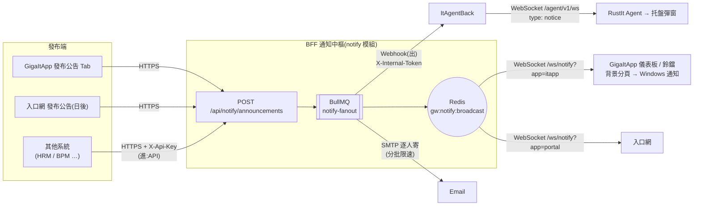

# GigaNexus — 通知與公告計畫

> **時程以 NexusPlan 甘特圖為準**,本文不列日期。
> 相關文件:[PRD.md](PRD.md) §7.4、§8.5、[DATABASE.md](DATABASE.md) §4、[BACKEND-GUIDE.md](BACKEND-GUIDE.md) §4.3、[FRONTEND-GUIDE.md](FRONTEND-GUIDE.md) §7.5、[ENDPOINT-AGENT-GUIDE.md](ENDPOINT-AGENT-GUIDE.md) §5.6;RustIt `docs/PRD.md` §4.2(公告)、`docs/contracts/ws-envelope.schema.json`;GigaItApp `docs/UI-GUIDE.md`。

---

## 1. 文件資訊

| 項目 | 內容 |
| --- | --- |
| 文件版本 | v0.4(2026-10-07,N1 BFF 實作完成(§11),實作差異:分母改用人員同步後的 `gw.user`、對象欄位改為 `companies`(公司 ID)/ `jobTier`、內文過大沿用 `PAYLOAD_TOO_LARGE`、新增 `compose-options` 與 `preview` API);v0.3(2026-10-07,取消 Notes 群組匯入:Notes 匯出帶不出 Internet 位址、部分部門群組沒有信箱,且公司將汰換 Notes → Email 一律逐人寄;工作項目編入甘特圖 W10);v0.2(2026-10-07,需求方確認:D5 增加超級管理員、D8 先做 L1(L2 另案)、Q3 Email 逐人寄並預留 Notes 群組匯入、Q5 內文改 HTML + 編輯器、Q6 保留期限由畫面設定且預設永久、可查歷史公告;其餘依建議採用);v0.1 初稿 |
| 情境 | 總經理要告知全公司員工「全體員工特休」;發布人可選擇由**員工入口網、GigaItApp、端點 Agent(托盤)、Email** 中的哪些管道送達 |
| 範圍 | BFF 通知模組擴充(公告、廣播、已讀回條、應用間訊息交換、通知設定);GigaItApp 通知中心(發布、紀錄、收件匣、公告查詢、設定)與儀表板接收;`@giganexus/web-kit` 通知模組;RustIt ItAgentBack 接收公告並轉給 Agent;員工入口網套用 |
| 不在範圍 | Web Push(L2,主管決定要做時另案,設計保留在附錄 A);LINE / Teams(PRD Q7 暫緩,保留擴充點);簽核流程(BPM);手機 App 推播 |

## 2. 目標

1. **一次發布,多管道送達**:發布人填一次公告、勾選管道與對象,BFF 負責分送;各應用不必自己寫推播。
2. **在線即時、離線不漏**:開著畫面的人即時看到(WebSocket),分頁在背景時跳 Windows 通知;沒開的人下次打開收件匣看得到。
3. **已讀可追蹤**:重要公告可要求「已閱讀」確認,發布人看得到已讀 / 未讀名單,可對未讀者重發。
4. **公告可長期查詢**:預設永久保留,員工可查到多年前的公司公告。
5. **畫面可複製**:先在 GigaItApp 做「發布公告」Tab 當範本,之後原樣搬到員工入口網;接收端邏輯放在 web-kit,兩個應用共用。

## 3. 現況盤點

| 項目 | 現況(已完成) | 缺口 |
| --- | --- | --- |
| 發送 API `POST /api/notify/send` | 範本 + 收件人(工號 / AD 群組 / Email)× 通道(`email` / `inapp`)展開成 `gw.notify_log`,BullMQ 佇列、重試 5 次、死信告警;API Key 或 `notify.message.send` 權限 | **單次上限 1,000 則**(收件人 × 通道),全公司廣播會超過;每人寫一筆 `notify_message`,沒有「一則公告」的概念,無法統計已讀率、撤回、到期下架 |
| 站內通知 | `gw.notify_message`;`/ws/notify`(BFF 各實例訂閱 Redis `gw:notify:user:*` 推播);收件匣 `GET /api/notify/messages`、已讀 | 只能推給「個人」頻道,沒有廣播頻道;不分應用(入口網 / GigaItApp 收到的是同一份) |
| 範本管理 | `/api/admin/notify/templates`、`/logs`(`gw.admin.notify.*`) | 公告是一次性內容,不適合每則都建範本 |
| 前端 | GigaItApp 只有通知範本稽核文字;**沒有任何畫面連 `/ws/notify`**;員工入口網沒有收件匣 | 鈴鐺、收件匣、Toast、發布畫面、HTML 編輯器全部沒有 |
| Agent 通道 | ItAgentBack `GET /agent/v1/ws` 信封 `{v,type,id,body}`,目前只有 `hello` / `heartbeat` | 沒有 Server → Agent 的公告訊息類型;**托盤程式尚未開發**(Agent 是 Windows 服務,本身不能在使用者桌面彈窗) |
| 應用間 | 其他系統可呼叫 `/api/notify/send`(進);`gw.webhook_endpoint` / `webhook_log` 是**外部系統回呼進來**用 | 沒有「BFF 通知其他應用」(出)的機制 |
| 角色 | 內建 `gw-super-admin`(IT 主管群組,權限不開放以 API 修改)、`gw-it-admin`、`employee` | 沒有公告相關權限 |
| Email 群組 | 公司群組信箱在 **IBM Notes 通訊錄**(例 `.S經理級以上人員`、`.S處級以上人員`、`.MIS Group`),AD 沒有對應的郵件群組 | 平台不以群組寄信,一律逐人寄;Notes 匯出帶不出群組的 Internet 位址,部分部門群組(例 `S1600(採購部)`)本來就沒有信箱,且公司將汰換 Notes → **不匯入 Notes 群組**(§6.8) |

## 4. 決策(2026-10-07 定案)

| # | 問題 | 定案 |
| --- | --- | --- |
| D1 | Webhook 還是 WebSocket? | **兩個都用,依接收端分工**:伺服器 ↔ 伺服器用 HTTP(進:發送 API;出:Webhook),伺服器 → 使用者畫面 / Agent 用 WebSocket;詳見 §5 |
| D2 | 公告要不要獨立成資料模型? | **要**:新增 `gw.notify_announcement`(一則公告一筆)+ `gw.notify_receipt`(已讀回條,讀了才寫),不再每人複製一筆 |
| D3 | 公告送到哪些「應用」由誰決定? | 發布人勾選 `channels`:`portal`、`itapp`、`agent`、`email`;前端連 `/ws/notify?app=portal\|itapp`,BFF 只推給勾選的應用 |
| D4 | 對象怎麼選? | `audience`:全公司 / 公司(`cos`)/ 部門(含下屬)/ 職級門檻 / AD 群組 / 指定工號,可複選取聯集;比對在 BFF 記憶體做(SQL Server 2012 沒有 JSON 函式) |
| D5 | 誰能發布? | 三層:**`gw-super-admin`(超級管理員)內建全部公告權限**——可發給任何對象、看與撤回所有人的公告、修改通知設定;超級管理員可把 `notify.announce.publish.all`(全公司)授予總經理室、管理部等角色;`notify.announce.publish`(一般發布)第二階段開放給部門主管,只能發給自己部門。詳見 §7 |
| D6 | 發布畫面放哪? | GigaItApp 新功能頁「通知中心」(Tab:發布公告 / 發布紀錄 / 我的通知 / 公告查詢 / 設定),儀表板加「最新公告」卡片與頁首鈴鐺;入口網日後複製「發布公告」「公告查詢」Tab |
| D7 | Agent 怎麼收? | BFF 以 Webhook(內部呼叫,帶 X-Internal-Token)通知 ItAgentBack,ItAgentBack 經既有 `/agent/v1/ws` 送 `notice` 給 Agent,**由托盤程式顯示**;托盤完成前 Agent 只記錄與回 `notice_ack`(可驗證通道) |
| D8 | 瀏覽器推播 | **只做 L1 Notification API**(頁面開著、分頁在背景或視窗縮小時跳 Windows 通知,不需外網)。L2 Web Push(頁面關了也收得到)主管決定要做時另案,設計保留在附錄 A |
| D9 | Email 收件人 | **逐人寄**(依對象展開工號 → Email),分批、限速;不使用、也不匯入 Notes 群組(§6.8) |
| D10 | 內文格式 | **HTML**,發布畫面用所見即所得編輯器(Tiptap);BFF 以白名單清洗後才儲存,各端顯示前再清洗一次;同時自動產生純文字版供 Toast、Windows 通知、托盤使用(§6.7) |
| D11 | 保留期限 | **由 GigaItApp「設定」Tab 設定,預設永久**;到期日(`expire_at`)只代表「不再主動提醒、不出現在未讀」,公告仍可在「公告查詢」查到;設定保留期限後才由排程清除超過期限的公告 |

## 5. Webhook 與 WebSocket 怎麼選(D1)

### 5.1 兩者差異

| | Webhook | WebSocket |
| --- | --- | --- |
| 本質 | 事件發生時,**發送方主動 HTTP POST** 到接收方事先登記的網址 | 雙方建立**一條長連線**,任一方隨時送訊息 |
| 接收方條件 | 必須是**伺服器**,有可被連入的網址 | 由接收方**主動連出**,接收方在防火牆 / NAT 後面也可以 |
| 離線時 | 接收方掛了 → 發送方重試(佇列) | 沒連線就收不到 → 需收件匣補查 |
| 連線成本 | 每則一個請求,無常駐連線 | 每個在線用戶一條連線(200 台 Agent + 數百瀏覽器分頁,BFF 可負荷) |
| 適合 | **應用 ↔ 應用**:BFF 通知 ItAgentBack、portal-api、日後 Teams | **伺服器 → 使用者畫面 / Agent**:瀏覽器、端點電腦 |
| 本平台現有 | 進:`gw.webhook_endpoint`(外部系統回呼);出:無 | `/ws/notify`(瀏覽器)、`/agent/v1/ws`(Agent,mTLS) |

瀏覽器與 Agent 都不能被連入(沒有固定網址、在防火牆後面),**只能用 WebSocket**;應用之間各自是伺服器,用 Webhook 最簡單、可重試、不必常駐連線。所以不是二選一,而是:



### 5.2 應用間訊息交換規格(Webhook 出站)

- **訂閱登記**:新表 `gw.notify_webhook_subscription`(應用代碼、事件、目標),由 GigaItApp 管理;目標**以路由表的上游服務代碼**表示(不寫死主機,遵守 AGENT §10.4)。
- **內部應用**(ItAgentBack、portal-api 等):BFF 經既有動態轉發呼叫,帶 **X-Internal-Token**(60 秒,`amr = webhook`),接收端用 `@giganexus/backend-sdk` 的 `createTokenVerifier` 驗證,不必另管密鑰。
- **外部系統**(日後 Teams、LINE):HMAC-SHA256 簽章,標頭 `X-GigaNexus-Signature: t=<unix秒>,v1=<hex>`,簽 `t + "." + body`,接收端驗 5 分鐘內時間戳防重放;密鑰存 `secret_ref`。
- **事件信封**(兩者相同;`bodyHtml` 已清洗,`bodyText` 為純文字版):

```json
{
  "event": "announcement.published",
  "eventId": "8f0c…(UUID,接收端以此去重)",
  "occurredAt": "2026-10-07T08:00:00.000Z",
  "data": {
    "announcementId": 123,
    "title": "全體員工特休公告",
    "bodyHtml": "<p>…</p>",
    "bodyText": "…",
    "level": "important",
    "linkUrl": "/notices/123",
    "audience": { "all": true },
    "requireAck": true,
    "expireAt": "2026-10-20T00:00:00.000Z"
  }
}
```

- 事件:`announcement.published`、`announcement.revoked`;接收端回 2xx 視為成功,其他狀態與逾時(10 秒)依 BullMQ 指數退避重試 5 次,紀錄寫 `gw.notify_log`(`channel = webhook`,`recipient_address` = 應用代碼)。
- **接收端必須冪等**(同一 `eventId` 收到兩次只處理一次)。

## 6. 設計

### 6.1 資料表(`gw` schema,DATABASE.md §4 擴充)

| 表 | 主要欄位 | 說明 |
| --- | --- | --- |
| `notify_announcement` | `announcement_id`、`title`(200)、`body_html`(`nvarchar(max)`,清洗後,上限 200 KB)、`body_text`(4000,由 HTML 轉出)、`link_url`、`level`(`info` / `important` / `urgent`)、`audience`(JSON 文字)、`channels`(JSON 文字)、`require_ack`、`publish_at`、`expire_at`(可空 = 不到期)、`status`(`draft` / `scheduled` / `published` / `revoked`)、`published_by`(工號)、`publisher_title`(顯示用,例「總經理室」)、`idempotency_key`、`target_count`、稽核欄位、`row_ver` | 一則公告一筆;`audience` 例 `{"all":true}`、`{"companies":[1],"depts":[{"code":"S1300","sub":true}],"jobTier":"manager","adGroups":[],"users":[]}`(`jobTier` 為 RBAC 職級門檻代碼,只套用在全公司 / 公司 / 部門);索引 `(status, publish_at)` 供公告查詢 |
| `notify_announcement_asset` | `asset_id`、`announcement_id`(發布前可空)、`content_type`、`file_name`、`data`(`varbinary(max)`,單檔 ≤ 2 MB)、`created_by`、`created_at` | 編輯器內貼上 / 上傳的圖片;經 `/api/notify/assets/:id` 讀取(需登入);草稿超過 7 天未綁定公告的圖片由排程清除 |
| `notify_receipt` | `announcement_id`、`user_id`(PK 兩欄)、`first_seen_at`、`seen_via`(`portal` / `itapp` / `agent` / `email`)、`read_at`、`ack_at` | 使用者第一次看到才寫(不預先展開全公司);已讀率 = 有 `read_at` 筆數 / `target_count` |
| `notify_setting` | `setting_key`(PK)、`setting_value`(JSON 文字)、稽核欄位、`row_ver` | 通知設定(§6.9),只有超級管理員能改 |
| `notify_webhook_subscription` | `subscription_id`、`app_code`、`events`(JSON)、`target_type`(`internal` / `external`)、`upstream_code` 或 `url`、`secret_ref`、`is_enabled`、稽核欄位 | §5.2 |

- `target_count`:發布時依 `audience` 展開 `gw.user` 並快照。人員同步(BPM > LOS,每小時)已把全體在職員工寫入 `gw.user`,所以等同 LOS 在職人數(排除停用、兼任虛擬帳號、離職);未登入過平台的人只能經 Email / Agent 收到。
- 既有 `notify_message`(個人通知,例:密碼重設、審核結果)保留不動;收件匣同時讀兩種來源。
- **保留期限**:預設永久,不刪除;設定保留年數後,每日排程刪除 `publish_at` 早於期限的公告與其圖片、回條(稽核 `gw.audit_log` 不受影響)。

### 6.2 BFF API

| 方法 | 路徑 | 權限 | 說明 |
| --- | --- | --- | --- |
| POST | `/api/notify/announcements` | `notify.announce.publish`(對象超出自己部門需 `.all`) | 發布(或 `status: draft` 存草稿);`idempotencyKey` 防重送;回 201 `{ announcementId, targetCount }` |
| PATCH | `/api/notify/announcements/:id` | 同上 | 修改草稿 / 排程中的公告(已發布不可改,只能撤回重發) |
| POST | `/api/notify/assets` | `notify.announce.publish` | 上傳編輯器圖片(png / jpg / gif / webp,≤ 2 MB,以檔頭判斷格式,不信任副檔名);回 `{ assetId, url }` |
| GET | `/api/notify/assets/:id` | 登入者 | 讀取圖片(`Cache-Control: private, max-age=86400`) |
| GET | `/api/notify/announcements` | `notify.announce.publish` | 我發布的公告清單(`.all` / 超級管理員看全部),含已讀數 |
| GET | `/api/notify/announcements/:id` | 發布人,或對象內的登入者 | 明細 |
| GET | `/api/notify/announcements/:id/receipts?state=read\|unread` | 發布權限 | 已讀 / 未讀名單(未讀 = 對象展開 − 已讀);可匯出 CSV |
| POST | `/api/notify/announcements/:id/revoke` | 發布人本人、`.all` 或超級管理員 | 撤回:狀態改 `revoked`,廣播 `revoked` 讓各端移除 |
| POST | `/api/notify/announcements/:id/remind` | 同上 | 對未讀者重發(Email / Agent) |
| GET | `/api/notify/feed?app=itapp&unread=` | 登入者 | **收件匣**:我的有效公告(對象符合、未到期、未撤回、`channels` 含此 app)+ 個人通知,新到舊,含未讀數 |
| GET | `/api/notify/archive?q=&from=&to=&level=&page=` | 登入者 | **公告查詢**:我在對象內的所有已發布公告(**含已到期**,不含撤回),關鍵字查標題與 `body_text`,不限年份 |
| POST | `/api/notify/announcements/:id/read` / `/ack` | 登入者 | 已讀 / 確認已閱讀(寫 `notify_receipt`) |
| GET / PUT | `/api/admin/notify/settings` | 讀 `gw.admin.notify.read`;寫 `notify.settings.write`(只給超級管理員) | 通知設定(§6.9) |
| GET / POST / PATCH | `/api/admin/notify/webhooks` | `gw.admin.notify.*` | Webhook 訂閱管理 |

錯誤代碼沿用 `VALIDATION_FAILED`、`PERMISSION_DENIED`、`DUPLICATE_REQUEST`、`CHANNEL_NOT_SUPPORTED`;新增 `AUDIENCE_NOT_ALLOWED`(對象超出權限範圍);內文或圖片超過上限沿用 `PAYLOAD_TOO_LARGE`。另有發布畫面用的 `GET /api/notify/compose-options`(管道與開放狀態、等級、職級門檻、公司、部門樹、預設值)與 `POST /api/notify/announcements/preview`(預估人數、Email 人數、是否超出範圍)。

### 6.3 發布流程

1. API 驗證權限、清洗 HTML、轉出純文字 → 寫 `notify_announcement`(`published`)、把內文引用的圖片綁定到公告、寫稽核 `gw.audit_log`(同一交易)→ 入列 BullMQ `notify-fanout` 一個 job。
2. Worker 依 `channels` 分送:
   - `portal` / `itapp`:`PUBLISH gw:notify:broadcast`(一則訊息,不展開人數)。
   - `agent`:Webhook → ItAgentBack(§6.6)。
   - `email`:**逐人寄**(D9)。依對象展開收件人 → **每 500 人一批**入列既有 `notify` 佇列(`MAX_NOTIFICATIONS` 只套用在 `/api/notify/send`)→ Worker 沿用既有限速 `MAIL_RATE_PER_SEC`(預設每秒 10 則,公司 SMTP 中繼 10.10.130.69;PRD §8.5);每人一筆 `gw.notify_log`,可在發布紀錄看寄送進度與失敗名單。內文圖片改為 CID 內嵌附件(收件人不必登入就看得到),並附「在入口網查看」連結。測試區照舊改寄 `MAIL_REDIRECT_TO`。
3. 排程發布(`publish_at` 未到):BullMQ delayed job;到期(`expire_at`)由收件匣查詢條件自然排除,不需排程。

### 6.4 `/ws/notify` 擴充

- 連線 `GET /ws/notify?app=itapp`(`app` ∈ `portal` / `itapp`,其他值當 `portal`)。
- 各 BFF 實例除了既有 `psubscribe gw:notify:user:*`,再 `subscribe gw:notify:broadcast`;收到公告時,對每條連線以該連線的 claims(`cos`、`dept`、職級、AD 群組、工號)與 `app` 比對 `audience` / `channels`,符合才送。
- 部門「含下屬」比對需要部門樹:BFF 啟動時載入、每 10 分鐘更新到記憶體(已有部門資料表)。
- 訊息只帶摘要,完整 HTML 由前端打 `GET /api/notify/announcements/:id` 取得(避免大訊息塞滿每條連線):

```json
{ "type": "announcement", "announcementId": 123, "title": "…", "summary": "純文字前 200 字", "level": "important", "requireAck": true, "publisher": "總經理室", "publishedAt": "…" }
{ "type": "revoked", "announcementId": 123 }
{ "type": "notification", "messageId": 456, "title": "…" }   // 既有個人通知,不變
```

- 前端斷線以指數退避重連(1s → 30s),**重連後一律打一次 `/api/notify/feed` 補漏**;WebSocket 只負責「即時」,資料正確性以 API 為準。

### 6.5 前端:web-kit 通知模組與 GigaItApp 畫面

**`@giganexus/web-kit/notify`**(兩個應用共用,不含 UI):

| API | 說明 |
| --- | --- |
| `createNotifyClient({ app })` | 連線 `/ws/notify`、重連、補漏;事件 `announcement`、`revoked`、`notification` |
| `useNotifyFeed()`(Vue composable) | 收件匣清單、未讀數、`markRead`、`ack` |
| `useAnnouncementArchive()` | 公告查詢(關鍵字、日期區間、分頁) |
| `publishAnnouncement(input)` / `uploadAsset(file)` / `listAnnouncements()` / `getReceipts()` | 發布端 API 型別與呼叫 |
| `sanitizeHtml(html)` | 顯示前的第二次清洗(DOMPurify,白名單與 BFF 相同) |
| `enableDesktopNotify()` | 要求 Notification 權限(須在使用者點擊時呼叫);分頁在背景(`document.hidden`)時以 `new Notification(title, { body: summary, tag: 'ann-<id>' })` 顯示,點擊回到該頁並開啟公告(D8 L1) |

**GigaItApp:新功能頁「通知中心」**(`/notify`,側欄「系統」群組下;依 UI-GUIDE 用 `TabbedPage`,在 `deploy/gateway-rbac.yaml` 登記並 `includes` 綁定 API):

| Tab | 內容 | 綁定 API | 誰看得到 |
| --- | --- | --- | --- |
| 發布公告 | 標題;**內文 HTML 編輯器**(§6.7);等級、連結;**對象**(全公司 / 公司 / 部門樹 / 職級門檻 / AD 群組 / 工號,顯示預估人數);**管道**勾選(員工入口網 / GigaItApp / 端點 Agent / Email,未上線的管道灰掉並說明);需確認已閱讀;發布時間(立即 / 排程)、到期日(可空 = 不到期);右側即時預覽「收件人會看到的樣子」;存草稿;發布前確認視窗(列出對象人數與管道,Email 顯示預估寄送時間) | `POST/PATCH …/announcements`、`POST /api/notify/assets` | 發布權限 |
| 發布紀錄 | 公告清單(狀態、管道、對象、已讀率進度條、Email 寄送進度);點開看已讀 / 未讀名單(可匯出)、撤回、提醒未讀 | `GET …/announcements`、`…/receipts`、`…/revoke`、`…/remind` | 發布權限 |
| 我的通知 | 收件匣(公告 + 個人通知)、全部已讀、桌面通知開關 | `GET /api/notify/feed`、`…/read` | 所有登入者 |
| 公告查詢 | 所有我在對象內的公告(含已到期,不限年份),關鍵字、日期區間、等級篩選;點開看全文 | `GET /api/notify/archive` | 所有登入者 |
| 設定 | §6.9 | `GET/PUT /api/admin/notify/settings` | 超級管理員 |

**接收端(測試驗收用)**:

- 頁首**鈴鐺**(未讀數徽章,點開下拉最近 10 則);`AppLayout` 掛載時建立 `createNotifyClient({ app: 'itapp' })`。
- 新公告到達:右下角 **Toast**;`urgent` 或 `requireAck` 以**置中對話框**顯示全文,按「已閱讀」才關閉並呼叫 `ack`;分頁在背景時另跳 Windows 通知(L1)。
- **儀表板「營運總覽」加「最新公告」卡片**(最近 5 則,未讀加粗),即時更新。

**搬到員工入口網**:「發布公告」「公告查詢」Tab 元件只依賴 web-kit 與共用的 G 元件介面,搬移時換樣式(科技綠)即可;入口網接收端(鈴鐺、Toast、首頁公告欄)一併套用,`app = portal`。

### 6.6 Agent 通道(ItAgentBack + RustIt)

1. ItAgentBack 新增內部端點 `POST /internal/v1/notify-events`(經路由表登記、只接受 X-Internal-Token,`amr = webhook`),收到 `announcement.published` 以 `eventId` 去重後存入 SQL Server `giganexus_It_Agent.notice`(公告 ID、標題、純文字內文、對象、到期)。
2. 對**在線**的 Agent 送 WebSocket 訊息(ws-envelope 新增類型,契約版本 `v` 不變,舊 Agent 依規則回 `unsupported`)。托盤只顯示純文字與「查看全文」連結(開啟瀏覽器到入口網公告頁),不在托盤渲染 HTML:

```json
{ "v": 1, "type": "notice", "id": "uuid", "body": { "notice_id": 123, "title": "…", "text": "純文字內文", "url": "https://…/notices/123", "level": "important", "require_ack": true, "expire_at": "…" } }
{ "v": 1, "type": "notice_ack", "id": "同上", "body": { "notice_id": 123, "state": "delivered|shown|acknowledged", "user": "S112009", "at": "…" } }
```

3. **離線**的 Agent:下次 `hello` 後,ItAgentBack 補送未到期、未送達的公告。
4. 對象比對:Agent 回報的登入使用者(工號)→ 經 BFF 查部門;Agent 只看裝置時以「全公司 / 指定電腦」為主,部門對象在托盤階段補齊。
5. `acknowledged` 由 ItAgentBack 以 Webhook 回報 BFF(`seen_via = agent`,以工號對應使用者),已讀回條因此跨管道合併。
6. **顯示**:Agent 是 SYSTEM 權限的 Windows 服務,不能直接在使用者桌面彈窗,需由**托盤程式**(使用者 session)經本機 named pipe 取得公告,以 Windows Toast 或強制對話框顯示。托盤是 RustIt 服務台階段工作;本計畫先完成到「Agent 收到並回 `delivered`」。

### 6.7 HTML 內文與編輯器(D10)

- **編輯器**:[Tiptap](https://tiptap.dev)(Vue 3、MIT、ProseMirror 核心),只啟用白名單內的功能:標題(H2–H4)、粗體 / 斜體 / 底線 / 刪除線、文字顏色(限定色盤)、項目與編號清單、引用、表格、連結、圖片、分隔線、復原 / 重做。不開放原始碼模式與任意 HTML 貼上(貼上時由 Tiptap 轉成白名單結構;從 Word / Notes 複製的格式保留粗體、清單、表格)。
- **圖片**:貼上或拖曳 → `POST /api/notify/assets` → 內文以 `` 引用;不接受外部圖片網址(避免追蹤像素與連不到外網)。
- **清洗(兩道)**:
  1. BFF 儲存前以 `sanitize-html` 白名單清洗:允許上述標籤;屬性只留 `href`(`https:` / 站內 `/` / `mailto:`)、`src`(只限 `/api/notify/assets/`)、`colspan` / `rowspan`、限定的 `style`(`color`、`text-align`);連結一律加 `rel="noopener noreferrer" target="_blank"`;移除 `script`、事件屬性、`iframe`、`form`、`style` 標籤。
  2. 前端顯示前以 DOMPurify 再清一次(web-kit `sanitizeHtml`),Email 寄出前用 BFF 版本。
- **純文字版**:BFF 以 `html-to-text` 轉出 `body_text`,供 Toast 摘要、Windows 通知、托盤、公告查詢的關鍵字搜尋。
- **一致外觀**:收件端以同一份 CSS(web-kit 提供 `notify-content.css`,只定義內文排版,不影響應用主題)顯示;Email 版本由 BFF 套用行內樣式範本。

### 6.8 Email 收件人(D9)

- **一律逐人寄**:收件人 = 對象展開後的在職人員,Email 取自 LOS / `gw.user`;沒有 Email 的人記為 `skipped`,發布紀錄可下載名單。
- **不匯入 IBM Notes 群組**(2026-10-07 定案):Notes 匯出帶不出群組的 Internet 位址;部門群組有的有信箱(例 `S1700(人力資源部)` = `S1700@gigasolar.com.tw`)、有的沒有(例 `S1600(採購部)`),沒有信箱的群組原本就是逐人寄;公司日後將汰換 Notes。
- 對象以平台自己的人事資料表示:部門(含下屬,對應 Notes 的部門群組)、**職級門檻**(對應 `.S經理級以上人員`、`.S處級以上人員` 這類職稱群組,沿用 RBAC 指派規則的職級資料)。
- 換掉 Notes 後若新郵件系統有可靠的群組信箱,再評估「全公司寄群組信箱」的選項。

### 6.9 通知設定(D11,GigaItApp「設定」Tab)

| 設定 | 預設 | 說明 |
| --- | --- | --- |
| 公告保留期限 | **永久** | 可選「永久」或「N 年」;改成 N 年時,確認視窗顯示將刪除的公告數,每日排程執行 |
| 新公告預設到期天數 | 不到期 | 發布畫面的預設值,發布人可改 |
| 已到期公告仍可在「公告查詢」查到 | 是 | 關閉時只有發布人與超級管理員看得到已到期公告 |
| Email 寄送速率 | — | 只顯示,不在此修改:沿用環境變數 `MAIL_RATE_PER_SEC`(預設每秒 10 則,與站內通知共用),調整需改部署設定 |
| 單次 Email 收件人上限 | 5,000 | 超過時發布畫面要求改用群組或分次 |
| 圖片大小上限 | 2 MB | 單張 |
| 各等級預設顯示方式 | `info`:Toast;`important`:Toast + Windows 通知;`urgent`:強制對話框 | 發布人可另勾「需確認已閱讀」 |

設定寫入 `gw.notify_setting` 與 `gw.audit_log`;BFF 讀取後快取 60 秒。

## 7. 權限與 RBAC(D5)

| 代碼 | kind | 說明 | 預設授予 |
| --- | --- | --- | --- |
| `notify.announce.publish` | api | 發布 / 修改草稿 / 查詢自己發布的公告、撤回、提醒;對象限自己部門(含下屬) | 第二階段開放給部門主管(以 RBAC 指派規則的職級門檻) |
| `notify.announce.publish.all` | api | 對象可為全公司、多公司、任意部門;可看與撤回所有人發布的公告 | `gw-super-admin`;由超級管理員授予總經理室、管理部等角色 |
| `notify.settings.write` | api | 修改通知設定 | **只給 `gw-super-admin`** |
| `it.notify` | menu | GigaItApp 通知中心 | 所有登入者(看得到「我的通知」「公告查詢」) |
| `it.notify.publish` / `.history` / `.inbox` / `.archive` / `.settings` | tab | 五個 Tab,`includes` 綁定 §6.2 對應 API | `.inbox`、`.archive` 給所有登入者;其餘依上列 API 權限 |
| `it.notify.publish.submit`、`it.notify.history.revoke`、`it.notify.settings.save` | button | 發布、撤回、儲存設定按鈕 | 同對應 API |

- **超級管理員**沿用既有內建角色 `gw-super-admin`(IT 主管群組,權限不開放以 API 修改,`db/seed.ts` 加入上列權限);本計畫不另建角色。
- 收件匣、已讀、公告查詢只需登入(資料以登入者與對象過濾),不另設 API 權限。
- 稽核:發布、修改、撤回、提醒、設定異動、群組匯入、Webhook 訂閱異動寫 `gw.audit_log`(`notify.announcement.publish` 等,GigaItApp `format.ts` 補中文名稱)。

## 8. 工作項目與驗收

| # | 項目 | Repo | 驗收 |
| --- | --- | --- | --- |
| N1 | 資料表(§6.1)migration、公告 API(§6.2:發布 / 修改 / 圖片 / 清單 / 明細 / 撤回 / feed / archive / read / ack / settings)、HTML 清洗與純文字轉換、`notify-fanout` Worker(含 Email 逐人分批限速)、`/ws/notify` 廣播頻道與 `app` 參數、保留期限排程、`gw-super-admin` 權限 seed | giga-api-gateway-bff | 單元 + 整合測試(含 XSS 清洗案例);兩個 BFF 實例下,連在任一實例的分頁都收得到廣播;撤回後各端消失;重連補漏;保留期限預設不刪任何資料 |
| N2 | web-kit `notify` 模組(client、feed / archive composable、發布 API 型別、`sanitizeHtml`、`notify-content.css`、L1 桌面通知) | giga-api-gateway-bff(web-kit) | 單元測試;發佈到 npm Registry |
| N3 | GigaItApp 通知中心五個 Tab(含 Tiptap 編輯器)、頁首鈴鐺、Toast / 強制確認對話框、儀表板「最新公告」卡片;`gateway-rbac.yaml` 登記 | GigaItApp | **驗收情境**:以超級管理員測試帳號發布「全體員工特休」(HTML 內文含粗體、表格、圖片;管道勾 GigaItApp + Email)→ 另一個瀏覽器登入的測試帳號在儀表板即時看到卡片更新、鈴鐺 +1、Toast;`requireAck` 跳對話框,按「已閱讀」後發布紀錄的已讀數 +1;分頁在背景時跳 Windows 通知;測試信箱收到圖片正常顯示的 Email;「公告查詢」查得到已到期的公告;一般帳號看不到「發布公告」「設定」Tab |
| N4 | Webhook 出站(訂閱表、管理 API、Worker、HMAC);ItAgentBack 接收端點、`notice` 表、ws-envelope `notice` / `notice_ack` 契約與測試 | giga-api-gateway-bff、RustIt(ItAgentBack + contracts) | 測試區 10.10.112.13 的 Agent 收到 `notice` 並回 `delivered`;離線 Agent 重連後補送;重複 `eventId` 不重送 |
| N5 | 入口網套用:發布公告、公告查詢 Tab(樣式換科技綠)、鈴鐺、首頁公告欄、`app = portal` | giga-Portal | 同 N3 情境,管道勾員工入口網 |
| N6 | 部門主管發布(`notify.announce.publish` 以職級門檻授予、對象限本部門) | giga-api-gateway-bff、GigaItApp | 主管帳號發給其他部門回 `AUDIENCE_NOT_ALLOWED` |
| N7 | (日後)托盤顯示與已閱讀回報 | RustIt | — |
| N8 | (另案,主管決定)Web Push L2(附錄 A) | giga-api-gateway-bff、giga-Portal | — |

- **甘特圖 W10「通知與公告」**:W10-1 計畫、N1 = W10-2、N2 = W10-3、N3 = W10-4、N4 = W10-5、◆ W10-M 測試區公告可用(N3、N4 完成)、N5 = W10-6、N6 = W10-7、N7 = W10-8(暫停,依托盤)、N8 = W10-9(暫停,另案)。
- 跨 repo 的項目(N3、N4、N5)動工前依 AGENT §10.5 先說明並取得同意。
- 每項完成:更新 `docs/PROJECT-MAP.md`、架構資料(`GigaNexusAIPlan/architecture/*.json`,新增 BFF → ItAgentBack Webhook 關係)、NexusPlan 甘特圖狀態。

## 9. 待確認

| # | 問題 | 狀態 |
| --- | --- | --- |
| Q1 | D1–D11 是否採用 | 2026-10-07 確認 |
| Q2 | 已讀率分母 | 在職人數(人員同步後的 `gw.user`,來源 BPM > LOS),發布時快照 |
| Q3 | 全公司 Email | 逐人寄;不匯入 Notes 群組(§6.8) |
| Q4 | 全公司公告是否需第二人覆核 | 採建議:第一階段不需要,保留 `draft` 狀態,發布確認視窗顯示人數 |
| Q5 | 內文格式 | HTML + Tiptap 編輯器(§6.7) |
| Q6 | 保留期限 | 「設定」Tab 設定,預設永久;已到期公告可在「公告查詢」查到(§6.9) |
| Q7 | Notes 群組匯出檔格式 | 取消:不匯入 Notes 群組(§6.8) |

## 10. 風險與注意事項

- **WebSocket 連線數**:每個開著的分頁一條連線;以 Redis pub/sub 廣播、每實例本機比對,不隨人數寫資料庫。Nginx `/ws/notify` 需確認 `proxy_read_timeout` 大於 30 秒 ping 間隔(現有設定沿用)。
- **廣播不可靠**:Redis pub/sub 不保證送達(實例重啟期間會漏)→ 前端重連補漏是正確性的保證,WebSocket 只是加速。
- **XSS**:HTML 內文是最大的資安風險;兩道清洗、`img src` 只限站內圖片 API、CSP 不放寬(`script-src` 不加 `unsafe-inline`)。N1 測試需涵蓋常見繞過案例(`javascript:` 連結、SVG、事件屬性、`style` 內 `url()`)。
- **資料量**:預設永久保留,圖片存在 SQL Server;以每則公告 ≤ 5 張、每張 ≤ 2 MB 估算,每年數百則公告約數 GB 以內,需納入資料庫備份容量評估。
- **Email 負載**:全公司逐人寄上千封,以限速分散;寄送期間 SMTP 中繼若退信或限流,失敗者依重試規則處理,發布紀錄顯示失敗名單可重寄。
- **誤發**:全公司公告無法收回已寄出的 Email;撤回只能讓站內與 Agent 移除。發布確認視窗必須清楚顯示人數與管道。
- **桌面通知權限**:使用者拒絕後網站無法再詢問,只能由使用者在瀏覽器設定或 GPO 改回;授權按鈕旁要說明用途。GPO 若封鎖網站通知(`DefaultNotificationsSetting`),需對 `https://giganexus.gigasolar.com.tw` 加入允許清單。
- **Agent 顯示依賴托盤**:托盤上線前,「端點 Agent」管道在發布畫面標示「僅送達,尚無桌面顯示」。
- **測試資料**:Email 測試只寄 harryjiang@gigasolar.com.tw(`MAIL_REDIRECT_TO`);測試帳號以假工號建立、測完刪除(AGENT §9)。

---

## 11. 實作紀錄

### 11.1 N1 BFF(2026-10-07,甘特圖 W10-2;本機完成,待部署測試區)

| 項目 | 檔案 |
| --- | --- |
| 資料表 migration(5 張表 + `notify_log.announcement_id`),通過 2012 語法檢查 | `db/migrations/20261007031924_notify_announcement/`、`bff/src/db/schema/notify.ts` |
| 對象比對、本部門範圍 | `bff/src/modules/notify/audience.ts` |
| HTML 白名單清洗(sanitize-html)、純文字(html-to-text)、圖片檔頭判斷、CID 改寫 | `bff/src/modules/notify/html.ts` |
| 通知設定(預設永久保留) | `bff/src/modules/notify/settings.ts`、`bff/src/modules/admin/notify-settings.ts` |
| 對象展開、公告索引、已讀回條 | `bff/src/modules/notify/announce.ts` |
| 公告 API(§6.2) | `bff/src/modules/notify/announce-routes.ts` |
| `/ws/notify?app=` 公告廣播(依序處理,比對連線使用者) | `bff/src/modules/notify/ws.ts` |
| 分送 worker(廣播、Email 逐人入列、提醒、撤回、保留期限)、公告 Email(等級前綴、CID 圖片、表格框線) | `bff/src/workers/announce.worker.ts`、`bff/src/workers/notify.worker.ts`、`bff/src/worker.ts`、`bff/src/plugins/queues.ts` |
| 權限 seed(三個權限給 `gw-super-admin`)、錯誤代碼 | `db/seed/data.mts`、`bff/src/db/seed.ts`、`bff/src/errors.ts` |

驗證:單元 217 項(新增 18 項:對象、XSS 清洗、純文字、圖片、設定)、整合 36 項(新增 21 項,對 `giganexus_gw_poc_test`:對象展開、索引、併發已讀、分送 worker、保留期限、公告 Email;HTTP 層含權限範圍、重送、排程 / 改回草稿 / 版本衝突、撤回、CSV、`/ws/notify` 廣播比對,Redis 與佇列為替身)、typecheck、lint、prettier、build、`gen:builtin`(127 支)通過。測試中發現並修正:重送時應先判斷 `idempotencyKey`(否則第一則已綁定圖片而回 400);廣播需依序處理(否則「發布後立刻撤回」時撤回先送達)。

### 11.2 測試區上線步驟(寫入測試區前先確認)

1. 推送 Gateway `develop` → CI 部署 BFF / worker;migrate 容器套用 migration 並執行 seed(新增三個權限給 `gw-super-admin`)。
2. 超級管理員的權限快取 15 分鐘後生效(或重新登入)。
3. 以超級管理員帳號在測試區呼叫 `GET /api/notify/compose-options` 確認;前端畫面於 N3(GigaItApp)完成後實測。

## 附錄 A:Web Push(L2,另案保留)

> 主管決定要做「頁面關閉也收得到」時再啟動(N8)。以下為設計備忘。

| 標準 | 用途 | 需要頁面開著? | 需要外網? |
| --- | --- | --- | --- |
| Notification API(L1,本計畫已做) | 在 Windows 右下角顯示系統通知 | 是(分頁在背景、視窗縮小也可以) | 否 |
| Service Worker | 背景執行的腳本,頁面關了也能被喚醒處理事件 | 否 | 否 |
| Push API(Web Push) | 伺服器經**瀏覽器廠商的推播服務**把訊息送到 Service Worker | 否(瀏覽器程序在跑就行) | **是**:BFF 與員工電腦都要連得到推播服務 |

1. **前置網路驗證**:① BFF 主機能否 HTTPS 連出 `fcm.googleapis.com`(Chrome)、`*.notify.windows.com`(Edge,WNS)、`updates.push.services.mozilla.com`(Firefox),或需經 Proxy;② 員工電腦的瀏覽器能否建立推播連線;③ GPO 是否封鎖網站通知。任一項不通則不做。
2. **VAPID 金鑰**:一組 P-256 金鑰,私鑰放主機機密檔(測試區、正式區各一組),公鑰經 `GET /api/notify/push/public-key` 提供。
3. **Service Worker**:單一檔案 `/notify-sw.js`,由 Nginx 從入口網發佈目錄提供,scope `/`,入口網與 GigaItApp 共用;只處理 `push`、`notificationclick`,不攔截 fetch。
4. **訂閱**:`pushManager.subscribe({ userVisibleOnly: true, applicationServerKey })` → `POST /api/notify/push/subscriptions`(新表 `gw.notify_push_subscription`:`user_id`、`endpoint` 唯一、`p256dh`、`auth`、`user_agent`、`last_success_at`、`fail_count`);登出時刪除;推播服務回 404 / 410 即刪除。
5. **送出**:Worker 用 npm `web-push`(RFC 8291 加密、RFC 8292 VAPID),payload 只放 `{ announcementId, title, summary, url }`,`TTL` = 到期前秒數(上限 24 小時)。
6. 管道清單加 `webpush`,`seen_via` 加 `webpush`。
