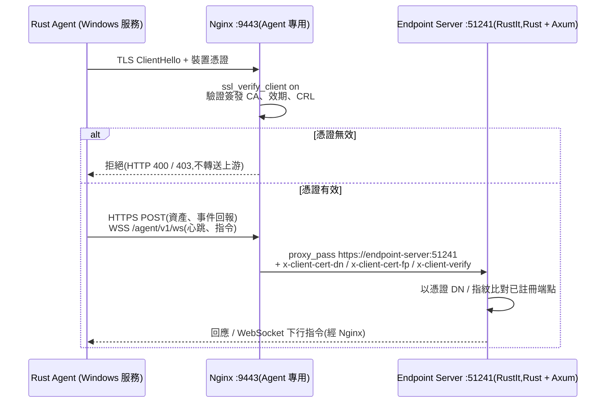
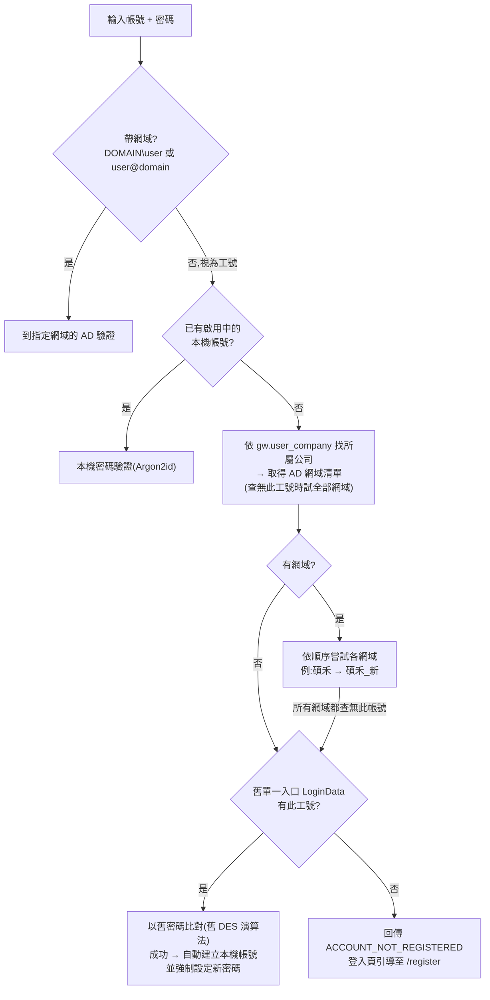
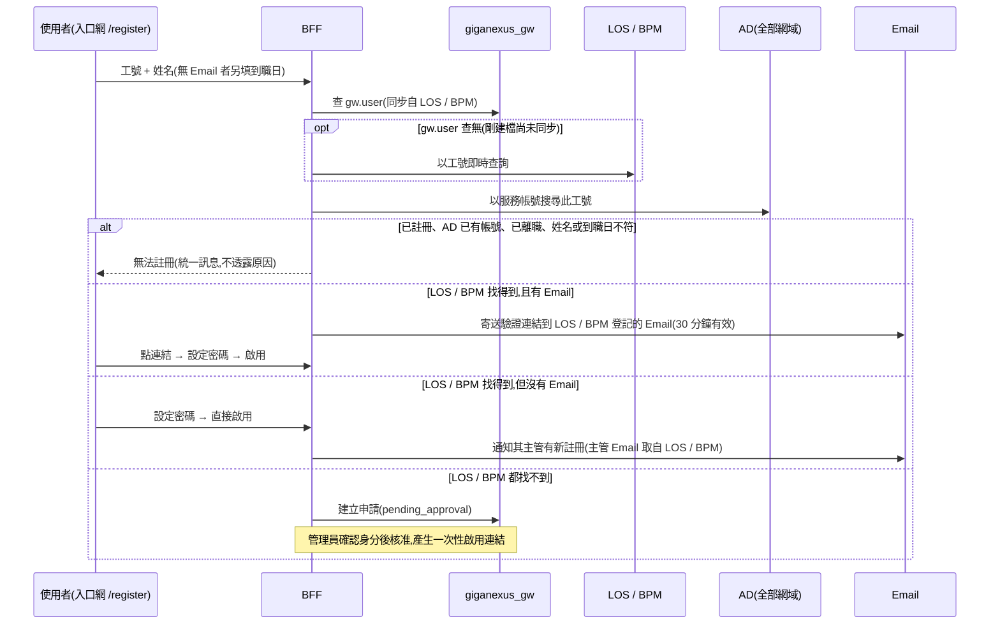
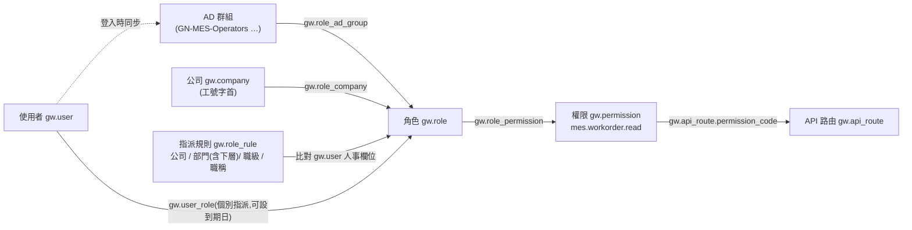

# GigaNexus Gateway — Nginx 反向代理網關 + Node.js BFF 聚合與認證

> 讓所有前端、端點 Agent 與外部回呼，都經由**同一個地端入口**進出；身分、權限、路由與通知集中在一處管理，並可由 IT 管理介面動態維護 API。

---

## 1. 文件資訊

| 項目 | 內容 |
| --- | --- |
| 產品名稱 | GigaNexus Gateway(Nginx Gateway + Node.js BFF) |
| 文件版本 | **v0.9**(2026-10-01) |
| 建立日期 | 2026-09-24 |
| 技術棧 | Nginx(TLS / HTTP2 / WebSocket / mTLS)＋ Node.js 22 LTS + Fastify 5 + TypeScript ／ SQL Server 2012(Drizzle ORM)+ Redis 7(詳見 [TECH-STACK.md](TECH-STACK.md)) |
| 相關文件 | [ARCHITECTURE.md](ARCHITECTURE.md)(整體架構)、[DATABASE.md](DATABASE.md)(資料庫設計)、[TECH-STACK.md](TECH-STACK.md)(技術棧與部署)、[IMPL-PLAN.md](IMPL-PLAN.md)(實作計畫)、[FRONTEND-GUIDE.md](FRONTEND-GUIDE.md)(前端接入規範)、[BACKEND-GUIDE.md](BACKEND-GUIDE.md)(下游後端接入規範)、[DEPLOYMENT.md](DEPLOYMENT.md)(部署與 CI/CD)、[Gherkin/](Gherkin/README.md)(驗收行為規格)、[REFERENCES.md](REFERENCES.md)(既有專案參考) |
| 對應工作流 | NexusPlan **W3. API Gateway + BFF**(時程以 NexusPlan 甘特圖為準) |
| 規劃依據 | `GigaNexusAIPlan/docs/PRD.md`(§8 W3)、`archatlas/src/data/sample-atlas.json`(`nginx-gateway`、`node-bff` 節點與上下游) |
| 狀態 | **測試區已上線**(2026-09-30,`giganexus-test.gigasolar.com.tw`);正式區預計 2026-12 建置。待決事項:Q6(待壓測)、Q25、Q26、Q29 |

### 1.1 修訂紀錄

| 版本 | 日期 | 變更內容 |
| --- | --- | --- |
| v0.1 | 2026-09-24 | 初稿 |
| v0.2 | 2026-09-24 | ① 整體架構、資料庫設計、技術棧拆為獨立文件,新增 [IMPL-PLAN.md](IMPL-PLAN.md)、[FRONTEND-GUIDE.md](FRONTEND-GUIDE.md);② 資料庫改為既有 **SQL Server 2012 Standard**,獨立資料庫 `giganexus_gw`,以 **Drizzle ORM** 存取並同步 Redis(PoC 未過改用 Kysely),DB 連線內網不加密;③ 人事資料改由 **BPM(SQL Server 2019)為主、LOS `EmployeeInfo` 補充**,AD 只負責驗證與群組(D7);④ §7.2 SPA 託管改為子路徑登記、symlink 部署與既有系統過渡;⑤ **LINE 通知暫緩**,移至第三階段;⑥ 統一錯誤回應格式;⑦ Q2、Q3、Q4、Q5、Q7、Q8、Q10 定案 |
| v0.3 | 2026-09-24 | ① 參考既有 GeneralBackend 專案([REFERENCES.md](REFERENCES.md)):ORM 備案增加第三條路 Sequelize、BPM 欄位對應確定、AD 改為多網域(新增 Q11、Q12);② Q11 定案(三個網域全納入),新增**本機帳號與自行註冊**(§8.2.5),供無 AD 網域的子公司使用;③ Q9、Q13、Q14、Q15 定案:LOS `EmployeeInfo` 欄位對應、公司歸屬取自 LOS / BPM、密碼至少 8 碼、LOS / BPM 找得到就可註冊(找不到才審核);新增兼任帳號與同一人多工號(Q16、Q17);④ Q1、Q12、Q16、Q17 定案:**以 IP 存取、Agent 改用獨立 port `:9443`**、LDAP 過渡期沿用 `ldap://`、兼任帳號不可單獨登入、不同工號不歸戶;⑤ 待決事項除 Q6(待壓測)外全數定案 |
| v0.4 | 2026-09-24 | ① 新增**舊單一入口帳號自動遷移**(`PortalSolar.LoginData`,首次登入比對舊密碼後建立本機帳號並強制設定新密碼,新增 Q18–Q20);② 依舊系統原始碼確認密碼演算法與 `Certify` 用途(Q18–Q20 定案),發現舊系統明文密碼問題;Q21 決定**不提供舊系統單一登入相容**,新舊入口並行,轉移約 7 成功能後舊系統逐步關閉(§8.2.6);③ Q22–Q24 定案:**舊系統維持現狀不修改**(參考原始碼為兩三年前的備份)、新入口網忘記密碼採 IT 重設 + Email 連結(細節入口網開發時確定)、新進員工新舊入口都可註冊;④ **兩項安全例外已取得主管與工程師同意**:BFF 連 SQL Server 2012 不加密、連 AD 過渡期使用未加密的 `ldap://`;⑤ 新增 [BACKEND-GUIDE.md](BACKEND-GUIDE.md)(下游後端接入規範、BFF 管理方式、API 上架時程);**下游後端 port 統一使用 51200–51300**;⑥ 新增 §8.1.1 **錯誤代碼總表**,並建立 [Gherkin](Gherkin/README.md) 驗收行為規格;⑦ 新增 [DEPLOYMENT.md](DEPLOYMENT.md):主機 1 GitLab(Ubuntu)、主機 2 測試區 / 主機 3 正式區(Windows + Docker Desktop)、`develop` 自動部署測試區、`main` 手動部署正式區、SPA 打包成映像檔(新增 Q25) |
| v0.5 | 2026-09-25 | ① `gw.api_route` 新增 `gherkin`(行為規格),`description` 改為 API 用途說明;OpenAPI 以 operation 的 `description` 與 `x-gherkin` 匯入(§8.4.4、[BACKEND-GUIDE.md](BACKEND-GUIDE.md) §6.1);② **後端自動註冊**:測試區、正式區的後端服務啟動時以 API Key 送出 OpenAPI,Gateway 寫入草稿,仍由 IT 核可發佈(§8.4.4、§8.7);新增既有路由查詢端點,供開發者新增 API 前查詢避免重複;③ Q3 修訂:**測試區與正式區設定不再互通**,取消「測試區發佈版本匯出 → 匯入正式區」,兩區各自由後端自動註冊;④ 新增 Node.js 後端 SDK(`sdk/node`)與樣本(`samples/node-backend`,含 AI 協作準則 AGENT.md);⑤ §14.1 新增「Docker Desktop 下 Nginx 看不到真實來源 IP」風險,新增 Q26;§7.6 Agent `limit_conn` 改以裝置憑證計算 |
| v0.6 | 2026-09-26 | `gw.upstream` 新增 `project`(開發專案:實作該服務的 repo 資料夾名稱),由 OpenAPI 根層 `x-gateway.project`(選用)或 CLI `apply` 帶入;路由查詢回傳並可依此比對關鍵字,讓管理介面與開發者知道每條路由由哪個專案開發(§8.4.4、§8.7、[BACKEND-GUIDE.md](BACKEND-GUIDE.md) §6.1);② 移除測試應用「公司文件系統」(TestGigaAPP):§7.2.1 子路徑 `/dms/`、BACKEND-GUIDE §3.3 port 51290 取消登記 |
| v0.7 | 2026-09-26 | 配合**員工入口網(giga-Portal)**與 GigaItApp 改版(規格,尚未實作):① **角色指派規則** `gw.role_rule`:依公司、部門(**含下層部門**,部門樹 `gw.department` 由 BPM 同步)、**職級(主)**、職稱(選配)自動取得角色(§8.3.1);② 權限分類 `kind`(`app` / `menu` / `tab` / `button` / `api`)與 `parent_code`,按鈕權限 = API 權限(§8.3.2);③ 應用登記 `gw.app`,`/api/auth/me` 回傳 `apps` 供各 SPA 顯示應用切換與應用層守衛(§8.2.4、§8.3.3);④ 管理 API 新增角色權限 / 指派規則寫入、部門樹、權限試算(§8.7,工作項目 P2-3a);⑤ `/` 由 giga-Portal 發佈(含 `/login`、`/register`、`/reset-password`);GigaItApp 改用單一入口、API 改為 `/api/it/*` 經 BFF(§7.2.1);BACKEND-GUIDE 登記 `portal-api` 51271;新增 Q28、Q29 |
| v0.8 | 2026-10-01 | Q1 修訂:`:443` 改以 DNS 名稱存取(測試區 `giganexus-test.gigasolar.com.tw`、正式區 `giganexus.gigasolar.com.tw`),使用公司 `*.gigasolar.com.tw` 萬用憑證(主管決定以 gigasolar.com.tw 為主);`:9443` Agent 仍以 IP 存取,伺服器憑證分開(§7.1、§7.6)。文件中 `:443` 位址以 `<gateway-host>` 表示,`:9443` 維持 `<gateway-ip>` |
| v0.9 | 2026-10-01 | ① **端點 Agent 改為 Rust + WebSocket**(RustIt):`:9443` 由 mTLS + gRPC 改為 mTLS + HTTPS / WebSocket(HTTP/1.1),Agent 以 HTTPS 回報資料、以一條 WebSocket 接收指令;Endpoint Server 改為 RustIt 的 Rust(Axum)服務;Watchdog 改以 Rust 實作(§2、§3、§4、§5、§7.6、§15,[ENDPOINT-AGENT-GUIDE.md](ENDPOINT-AGENT-GUIDE.md) v0.3)。現行 `nginx/conf.d/agent.conf` 仍為 gRPC 版,待 W6-1 訊息協定定版後改寫;② §13 時程改以 NexusPlan 甘特圖為準,標示測試區已完成項目;③ Q25、Q26 依主機現況更新:主機 2(測試區)已改用 WSL2 內的 Docker Engine,主機 3(正式區)目前為 Docker Desktop,預計 2026-12 改為 Docker Engine;④ 整理版本號(檔頭、狀態、頁尾一致,修訂紀錄依版本排序) |

---

## 2. 產品概述

本專案建置 GigaNexus 平台的**API 層**,由兩個元件組成:

| 元件 | 一句話定位 | 主要職責 |
| --- | --- | --- |
| **Nginx 反向代理網關** | 地端**唯一入口**(`:443`;Agent 專用 `:9443`) | TLS 終結、SPA 靜態檔託管、`/api/*` 轉發、WebSocket 升級、Webhook 入口、Agent **mTLS + HTTPS / WebSocket** 代理 |
| **Node.js BFF(Fastify)** | **身分與政策中心** | AD / 本機帳號登入、JWT(httpOnly Cookie)、RBAC、**資料庫驅動的動態 API 路由**、API 聚合、Email / 站內通知(LINE 暫緩) |

核心原則:

1. **一個入口**:瀏覽器、Agent、外部系統只認得 Gateway 的位址(瀏覽器與系統以 DNS 名稱、Agent 以 IP,Q1),後端服務不直接對外。
2. **一個身分**:有 AD 網域者用 AD 帳號、無網域的子公司員工用本機註冊帳號,一律以**工號**為身分;BFF 簽發 JWT,下游服務只信任 BFF 傳下來的身分。
3. **API 是資料,不是程式碼**:API 路由、權限對應、限流、快取設定存在 SQL Server,由 Redis 快取並即時生效;IT 管理介面(W4)可新增、匯入、編輯,**不需重新部署 BFF**。

---

## 3. 背景與問題

- 前端將有多個 SPA(員工入口網、MES 看板、HRM、FMS、IT 端點管理台、BI 看板),若各自對外開 port、各自做登入,**憑證、CORS、登入狀態會四散**。
- 後端服務技術異質(Go MES、Rust Endpoint Server(RustIt)、Node 核心服務、既有 BPM、鼎新 ERP 適配層),**沒有統一的認證與權限檢查點**。
- 200 台端點 Agent(Rust)需要與 Endpoint Server 維持長連線(WebSocket)接收指令,必須有**裝置層級身分(mTLS)**,且不能與一般瀏覽器流量互相影響。
- 目前新增一支 API 需要改程式、改 Nginx 設定、重新部署,**IT 無法自行管理 API 清單**,也無法回答「誰能呼叫哪些 API」。
- 通知(LINE、Email)散落在各系統,格式與失敗重試各自為政。

**痛點總結:** 入口分散、身分分散、API 清單不可見也不可管。

---

## 4. 目標與成功指標

### 4.1 產品目標

1. 建立地端唯一 HTTPS 入口,所有 SPA 與 API 同網域(免 CORS)。
2. 以 AD 帳號或本機帳號完成單一登入(無網域子公司可自行註冊),Token 只存在 **httpOnly Cookie**,前端 JS 不接觸 Token。
3. 建立以 **AD 群組 → 角色 → 權限 → API** 為骨幹的 RBAC。
4. API 路由表**資料庫化**,支援 IT 管理介面 CRUD、批次匯入(OpenAPI / Excel)、版本發佈與回滾。
5. 提供 Agent 專用的 **mTLS + HTTPS / WebSocket** 通道。
6. 提供統一的通知服務(Email / 站內通知;LINE 暫緩,見 §8.5),含範本、佇列、重試與紀錄。

### 4.2 成功指標(驗收標準)

| 指標 | 目標 |
| --- | --- |
| 入口收斂 | 所有前端與 API 僅經 `:443`(Agent 為 `:9443`)對外;後端服務 port 不對使用者網段開放 |
| Gateway 額外延遲 | Nginx + BFF 代理(不含上游)p95 < 20 ms |
| 權限判斷 | 快取命中下單次 RBAC 判斷 < 2 ms |
| 路由生效時間 | IT 於管理介面「發佈」後 ≤ 5 秒全部 BFF 實例生效,無需重啟 |
| 登入 | AD / 本機帳號登入 p95 < 1 秒;登出後 Token 立即失效 |
| Agent 連線 | 200 台 Agent 以 mTLS + WebSocket 穩定長連線;無有效憑證者 100% 拒絕,不會到達 Endpoint Server |
| 通知 | 通知送達成功率 ≥ 99%(含重試);100% 留有發送紀錄 |
| 稽核 | 登入、權限變更、API 設定變更 100% 寫入稽核紀錄 |

---

## 5. 目標受眾

| 角色 | 需求 |
| --- | --- |
| 一般員工(瀏覽器) | 用 AD 帳密一次登入,在各系統間切換不用再登入 |
| 無網域子公司員工(例如禾迅) | 以工號自行註冊本機帳號,之後與 AD 員工相同方式登入與使用 |
| 前端開發者(佳緯、Eric) | 同網域呼叫 `/api/...`;有 `/api/auth/me` 拿到使用者與權限以控制選單;遵守 [FRONTEND-GUIDE.md](FRONTEND-GUIDE.md) |
| 後端服務開發者 | 不必各自實作登入;從標頭/內部 Token 取得可信任的使用者身分 |
| IT 管理者 | 在 IT 管理介面維護 API 清單、角色權限、AD 群組對應、通知範本;查詢稽核紀錄 |
| 端點 Agent(機器) | 以裝置憑證建立 mTLS,以 HTTPS 回報資產、以 WebSocket 維持心跳並接收指令 |
| 外部系統(BPM;LINE 平台暫緩) | 以 Webhook 回呼,需驗證簽章 |

---

## 6. 整體架構

流量走向、元件關係與關鍵架構決策(D1–D9)詳見 **[ARCHITECTURE.md](ARCHITECTURE.md)**:

- 架構總覽圖(用戶端 → Nginx Gateway → BFF → 後端服務 / 資料)
- 流量類型與走向(T1–T9)
- 關鍵架構決策(D1–D9)

---

## 7. Nginx 反向代理網關 — 功能需求

### 7.1 TLS 與入口

- 監聽 `:443`(HTTP/2,瀏覽器與系統對系統)與 `:9443`(Agent 專用 mTLS,見 §7.6);`:80` 僅做 301 轉址至 HTTPS。
- **以 DNS 名稱存取 `:443`**(Q1,2026-10-01 修訂):測試區 `https://giganexus-test.gigasolar.com.tw/`(10.10.130.124)、正式區 `https://giganexus.gigasolar.com.tw/`(10.10.130.122),由網通在公司 DNS 建立 A 紀錄(測試區 2026-10-01 已建立並以瀏覽器驗證憑證受信任;正式區待建)。文件以 `<gateway-host>` 表示。Nginx `server_name` 維持 `_`(`default_server`),以 IP 連入仍可到達,但瀏覽器會出現憑證警告。
- `:443` 伺服器憑證為公司 `*.gigasolar.com.tw` 萬用憑證(Sectigo 公開 CA,瀏覽器預設信任,不需另行安裝根憑證);`pki/server.crt` 為伺服器憑證 + 中繼憑證鏈。到期日 2027-01-31,需排程更新。
- `:9443`(Agent)仍以 **IP** 連線,使用另一張伺服器憑證 `pki/agent-server.crt`(AD CS 企業 CA,SAN 帶 Gateway **IP**;到位前為臨時自簽),見 §7.6。
- TLS 1.2 / 1.3 only;停用弱加密套件;開啟 OCSP Stapling(若 CA 支援)。
- 安全標頭:`Strict-Transport-Security`、`X-Content-Type-Options: nosniff`、`X-Frame-Options: DENY`(或 CSP `frame-ancestors`)、`Referrer-Policy`、`Content-Security-Policy`(依 SPA 調整)。
- 瀏覽器對 IP 位址不套用 HSTS,仍以 `:80` 301 轉址確保使用 HTTPS。
- 產生 / 傳遞 `X-Request-Id`(`$request_id`),上下游日誌以此串接。
- 移除上游回應的 `Server`、`X-Powered-By` 等標頭;`server_tokens off`。

### 7.2 SPA 靜態檔託管

> 前端專案(Vue + Vite)的開發、建置與部署規範見 **[FRONTEND-GUIDE.md](FRONTEND-GUIDE.md)**。

#### 7.2.1 子路徑配置

所有 SPA 與 API 同一來源(`https://<gateway-host>`),每個系統掛在固定子路徑下:

| 路徑 | 目錄 | 說明 |
| --- | --- | --- |
| `/` | `/srv/www/portal/current` | 員工入口網(**giga-Portal** 發佈;含統一登入頁 `/login`、註冊 `/register`、忘記密碼 `/reset-password`,這三個保留路徑只由入口網提供);自有 API `/api/portal/*` 經 BFF 轉 `portal-api` |
| `/mes/` | `/srv/www/mes/current` | MES 看板 |
| `/hrm/`、`/fms/` | `/srv/www/hrm/current`、`/srv/www/fms/current` | 人事、財務 |
| `/it/` | `/srv/www/it-admin/current` | IT 管理介面(W4,含 API 管理);由 GigaItApp 發佈。目前自有登入,API `/it/api/*` 由 Nginx 直接轉 `itapp-api`(`ITAPP_API_UPSTREAM`);**v0.7 規劃改用單一入口**:API 改為 `/api/it/*` 經 BFF(`itapp-api` 登記為上游,系統代碼 `it`),Nginx `/it/api/` 直通於切換完成後移除 |
| `/bi/` | `/srv/www/bi/current` | 報表 / BI |

- **保留路徑**(不可作為 SPA 子路徑):`/api/`、`/ws/`、`/webhook/`、`/_auth/`、`/.well-known/`、`/docs`、`/healthz`、`/readyz`、`/metrics`、`/login`、`/register`、`/reset-password`。
- **新系統上線前需登記子路徑**:由 Gateway 負責人在 `nginx/conf.d/portal.conf` 新增 location 並經 Pipeline 發佈;子路徑一律小寫英數與 `-`,前後帶 `/`。
- 前端專案的 Vite `base` 必須與子路徑一致(例如 `/mes/`),否則資源載入失敗(見 [FRONTEND-GUIDE.md](FRONTEND-GUIDE.md) §4)。

#### 7.2.2 Nginx 設定

- History 模式:`location /mes/ { alias /srv/www/mes/current/; try_files $uri $uri/ /mes/index.html; }`。
- `index.html` 設 `Cache-Control: no-cache`;帶 hash 的資源(`/<子路徑>/assets/*`)設 `max-age=31536000, immutable`。
- 啟用 gzip(或 brotli 模組)。
- `/srv/www` 以唯讀 volume 掛入 Nginx 容器。

#### 7.2.3 部署與回滾

- 每個 SPA 由各自的 GitLab Pipeline 建置成**映像檔**(tag 為 commit SHA)推送到 Registry;部署時以一次性容器複製到 Nginx 掛載的 named volume `gw_www` 的 `/srv/www/<app>/releases/<SHA>/`,再**原子切換** `current`;**不需重啟或 reload Nginx**([DEPLOYMENT.md](DEPLOYMENT.md) §3.4)。
- 保留最近 5 個版本;回滾 = 將 `current` 指回前一版本(Pipeline 提供手動回滾 job)。
- `develop` 自動部署測試區;`main` 經手動核可部署正式區。

#### 7.2.4 既有系統過渡

既有系統(如 `notesapp`、`bpm`)目前以各自的前端容器(Nginx + Vue 靜態檔)對外開 port,且以根路徑 `/` 打包,**無法直接掛到子路徑**。依改造程度分三種方式,細節見 [FRONTEND-GUIDE.md](FRONTEND-GUIDE.md) §10:

| 方式 | 做法 | 適用 | 結果 |
| --- | --- | --- | --- |
| **A. 遷入 Gateway**(目標) | 以子路徑重新打包(`base`、Router、API 路徑),靜態檔依 §7.2.3 部署;後端 API 登記至 BFF 路由表 | 仍在維護的系統 | 完全整合,可共用登入 |
| **B. 暫時轉發既有前端容器** | 仍需以子路徑重新打包;Gateway 設 `location /notes/ { proxy_pass http://notesapp-frontend/; }`,容器部署方式不變 | 短期內無法調整部署流程的系統 | 同網域、可共用登入;之後再遷為 A |
| **C. 獨立 port** | 改給獨立 port(例如 `https://<gateway-host>:8443/`),Gateway 整站轉發,不需重新打包 | 無法修改的舊系統 | 與入口網不同來源,**無法共用登入 Cookie**,維持原有登入方式 |

- 過渡完成後,既有系統對使用者網段開放的 port(例如 `5121`、`5122`)需關閉,只經 Gateway `:443` 存取(對應 §4.2「入口收斂」)。

### 7.3 API 路由轉發

- `location /api/` → `proxy_pass http://bff_upstream;`(BFF 多實例 upstream,`keepalive`)。
- 保留原始 `Host`、`X-Forwarded-For`、`X-Forwarded-Proto`、`X-Request-Id`;**清除用戶端送入的 `X-Internal-*`、`X-User-*` 標頭**,避免偽造。
- 請求大小上限:預設 `client_max_body_size 10m`;檔案上傳路由(如 `/api/files/`)另設上限。
- 逾時:`proxy_connect_timeout 3s`、`proxy_read_timeout 60s`(長報表路由可於 BFF 層細調)。
- 第一道限流:`limit_req_zone` 以 IP 為鍵(例如 50 r/s,burst 100),防止單一來源灌爆;細緻限流由 BFF 依路由表執行。
- `/api/auth/login`、`/api/auth/register*`、`/api/auth/password/*` 另設較嚴格 IP 限流(例如 5 r/min),保護 AD 帳號不被鎖定、防止註冊與重設密碼被濫用。

### 7.4 WebSocket

- `/ws/notify` → BFF(站內即時通知、待辦數更新)。
- `/ws/endpoint/*` → Endpoint Server(RustIt,螢幕串流、遠端指令中繼),以 `auth_request /_auth/verify` 向 BFF 驗證 Cookie 與權限,BFF 回傳 `X-Auth-User`、`X-Internal-Token` 標頭由 Nginx 帶給上游。
- 必要設定:`proxy_http_version 1.1`、`Upgrade` / `Connection` 標頭映射、`proxy_read_timeout 3600s`;BFF / 上游每 30 秒送 ping。

### 7.5 Webhook 入口

- 路徑:`/webhook/{source}`(本階段僅 `/webhook/bpm`;`/webhook/line` 暫緩)→ BFF Webhook 模組。
- Nginx 層:依來源設定 **IP 白名單**(`allow` / `deny`),未列入者 403;不經 JWT。
- BFF 層:依 `gw.webhook_endpoint` 設定驗證簽章(HMAC-SHA256;未來 LINE 使用 `X-Line-Signature`)、時間戳防重放、`Idempotency-Key` 去重(Redis 24h),通過後分派至對應上游或佇列。
- **LINE Webhook** **(暫緩)**:未來開發時需從網際網路可達,需與網管確認 DMZ 反向代理僅開放 `/webhook/line`(見 §14.1 風險)。

### 7.6 Agent 專用通道:mTLS + HTTPS / WebSocket

> **v0.9(2026-10-01)改為 Rust + WebSocket**:端點 Agent 由 RustIt 以 Rust 開發,1,000 台以內 WebSocket 已足夠,不再使用 gRPC。現行 `nginx/conf.d/agent.conf` 仍為 gRPC 版(`grpc_pass`),**待 W6-1 訊息協定定版後依本節改寫**,E2E `06-websocket-agent` 同步改寫。



- 獨立 `server { listen 9443 ssl; }`:Agent 以 IP 存取,TLS 無法用 SNI 區分主機名稱,改以 **port** 區分(Q1);伺服器憑證 `agent-server.crt` 與 `:443` 分開;防火牆只開放端點網段連 `:9443`。設定:
  - `ssl_client_certificate`:內部 CA 鏈(僅信任 Agent 專用中繼 CA)。
  - `ssl_verify_client on;`、`ssl_verify_depth 2;`、`ssl_crl`(定期更新 CRL,撤銷遺失/報廢電腦的憑證)。
  - **HTTP/1.1**:WebSocket 以 HTTP/1.1 `Upgrade` 建立(Nginx 不支援以 HTTP/2 承載 WebSocket),`:9443` 不開 `http2`。
  - `proxy_pass https://endpoint_agent_upstream;`(Nginx → Endpoint Server 亦為 TLS,`proxy_ssl_verify on`)、`proxy_http_version 1.1`、`Upgrade` / `Connection` 標頭映射。
  - `proxy_set_header x-client-cert-dn $ssl_client_s_dn;`、`x-client-cert-fp $ssl_client_fingerprint;`、`x-client-verify $ssl_client_verify;`(覆寫 Agent 自送的同名標頭)。
  - 長連線:`proxy_read_timeout 1h`、`proxy_send_timeout 1h`;Agent 每 30 秒送應用層心跳,任一方向 1 小時無資料即中斷。
  - 每張裝置憑證的同時連線數上限(`limit_conn`,以憑證指紋 `$ssl_client_fingerprint` 計算,每張 10 條),避免異常 Agent 重連風暴;不以來源 IP 計算,Docker 轉送或子公司 NAT 時多台電腦共用來源 IP 也不受影響(§14.1)。
- **裝置憑證發放**(建議):AD CS 建立「GigaNexus Agent」憑證範本,以 GPO **電腦憑證自動註冊(Autoenrollment)** 發到網域電腦的 `LocalMachine\My`,Agent 以 Windows 憑證存放區讀取,私鑰不可匯出。Subject 使用電腦名稱(`CN=<電腦名稱>`),SAN 帶 AD 電腦物件 GUID。**無網域子公司的電腦無法以 GPO 自動註冊**,需由 IT 另行簽發並安裝(見 §14.1)。RustIt PRD 另規劃首次註冊以一次性 enrollment token 取得裝置憑證,兩者擇一於 W6-1 定案。
- Endpoint Server 的 HTTP / WebSocket 訊息格式由 W6(RustIt)定義;本專案只負責**通道、身分標頭與限流**。Endpoint Server、Rust Agent 與 Watchdog(同樣經 `:9443`、使用同一張電腦憑證)的開發規範見 [ENDPOINT-AGENT-GUIDE.md](ENDPOINT-AGENT-GUIDE.md)。

### 7.7 日誌與監控

- Access log 採 JSON 格式,欄位:`time, request_id, remote_addr, host, method, uri, status, bytes, request_time, upstream_addr, upstream_status, upstream_response_time, ssl_client_s_dn(agent 通道)`。
- 輸出至 stdout(容器)+ 收集至集中日誌(Loki / 檔案輪替,依既有監控規劃)。
- `stub_status` 或 nginx-prometheus-exporter 提供 QPS、連線數、4xx/5xx 比率給 Prometheus。

---

## 8. Node.js BFF(Fastify) — 功能需求

### 8.1 模組劃分

| 模組 | 路徑前綴 | 說明 |
| --- | --- | --- |
| `auth` | `/api/auth/*`、`/_auth/verify` | AD / 本機帳號登入、自行註冊、密碼重設、JWT、登出、Refresh、`me`、Nginx `auth_request` 驗證端點 |
| `rbac` | (內部) | 權限計算、快取、`preHandler` 權限檢查 |
| `router` | `/api/{system}/*` | 依路由表代理 / 聚合上游 |
| `admin` | `/api/admin/*` | 供 IT 管理介面:API、上游、角色、權限、AD 群組對應、通知範本、稽核查詢、匯入、發佈 |
| `notify` | `/api/notify/*`、`/ws/notify` | 通知發送 API、Email、站內通知(LINE 綁定暫緩) |
| `webhook` | `/webhook/*` | 簽章驗證、去重、分派 |
| `health` | `/healthz`、`/readyz`、`/metrics` | 健康檢查與 Prometheus 指標(僅內網) |

- **錯誤回應格式統一**為 `{ code, message, requestId }`(驗證錯誤另含 `details`);所有模組與上游錯誤轉換皆遵守此格式,代碼見 §8.1.1。

#### 8.1.1 錯誤代碼總表

> 回應格式 `{ code, message, requestId, details? }`。`code` 為大寫蛇形、**對外固定不變**(前端與後端依此判斷),`message` 可調整文字。新增代碼需先更新本表,並同步 [FRONTEND-GUIDE.md](FRONTEND-GUIDE.md) §6.4、[BACKEND-GUIDE.md](BACKEND-GUIDE.md) §5.3 與 [Gherkin](Gherkin/README.md) 場景。

**通用(BFF 與 Nginx)**

| code | HTTP | 產生者 | 情境 | 前端處理 |
| --- | --- | --- | --- | --- |
| `VALIDATION_FAILED` | 400 | BFF / 後端 | 參數或 JSON Schema 驗證失敗;`details` 列出欄位 | 標示欄位錯誤 |
| `UNAUTHENTICATED` | 401 | BFF | 未登入、Access Token 過期或已撤銷、權限版本變更需重新換發、只持有限定憑證卻呼叫其他 API;系統對系統呼叫的 API Key 無效、停用或過期 | 共用套件自動 Refresh,失敗導向 `/login` |
| `PERMISSION_DENIED` | 403 | BFF | 缺少路由所需權限(API 層級) | 顯示無權限頁 |
| `CSRF_INVALID` | 403 | BFF | 非 GET 請求缺少或不符 `X-CSRF-Token` | 重新載入頁面 |
| `IP_NOT_ALLOWED` | 403 | Nginx | Webhook 等限定來源的路徑,來源 IP 不在白名單 | — |
| `ROUTE_NOT_FOUND` | 404 | BFF | 路由表中沒有對應的已發佈路由 | 顯示找不到資源 |
| `PAYLOAD_TOO_LARGE` | 413 | Nginx / BFF | 請求超過大小上限(預設 10 MB) | 提示檔案過大 |
| `RATE_LIMITED` | 429 | Nginx / BFF | 入口 IP 限流、路由限流、註冊與忘記密碼限流 | 提示稍後再試,不自動重試 |
| `INTERNAL_ERROR` | 500 | BFF / 後端 | 非預期錯誤(不含堆疊或 SQL) | 顯示錯誤並附 `requestId` |
| `UPSTREAM_ERROR` | 502 | BFF | 上游回 5xx、上游回 401(視為設定錯誤並告警)、聚合路由的必要步驟失敗 | 顯示系統暫時無法使用 |
| `UPSTREAM_UNAVAILABLE` | 503 | BFF | 斷路器開啟,或上游沒有健康的實例 | 同上 |
| `UPSTREAM_TIMEOUT` | 504 | BFF | 上游超過逾時設定 | 同上 |

- Nginx 自行拒絕的請求(限流、白名單、大小)以 `error_page` 回傳相同 JSON 格式,不回 Nginx 預設的 HTML 錯誤頁。

**登入與帳號(`/api/auth/*`)**

| code | HTTP | 情境 | 前端(入口網)處理 |
| --- | --- | --- | --- |
| `INVALID_CREDENTIALS` | 401 | 帳號或密碼錯誤;帳號不存在;兼任帳號登入;舊單一入口密碼不符或已離職(一律同一代碼,不透露原因) | 顯示「帳號或密碼錯誤」 |
| `ACCOUNT_NOT_REGISTERED` | 401 | 所屬公司沒有 AD 網域,且沒有本機帳號與舊單一入口帳號 | 引導至 `/register` |
| `ACCOUNT_LOCKED` | 401 | 本機帳號連續失敗 10 次已鎖定 | 引導忘記密碼或聯絡 IT |
| `ACCOUNT_DISABLED` | 403 | Gateway 停用,或 AD 帳號已停用 | 顯示「帳號已停用,請聯絡 IT」 |
| `AD_PASSWORD_EXPIRED` | 401 | AD 密碼已過期或須於下次登入時變更 | 提示至 Windows 變更 AD 密碼 |
| `LOGIN_THROTTLED` | 429 | 同帳號 15 分鐘內失敗 5 次,暫停嘗試 | 提示 15 分鐘後再試 |
| `PASSWORD_CHANGE_REQUIRED` | 403 | 舊單一入口帳號首次登入,或 IT 代建 / 重設後首次登入;回應只附 10 分鐘有效的限定憑證 | 導向設定新密碼畫面 |
| `REFRESH_TOKEN_INVALID` | 401 | Refresh Token 過期、已撤銷,或偵測到重複使用(整個家族已撤銷) | 導向 `/login` |
| `PASSWORD_POLICY_VIOLATION` | 400 | 新密碼不符政策(少於 8 碼、未英數混合、包含工號);`details` 列出未符合的規則 | 顯示規則 |
| `PASSWORD_REUSED` | 400 | 新密碼與前 3 次或舊單一入口密碼相同 | 提示換一組密碼 |
| `REGISTRATION_NOT_ALLOWED` | 403 | 不符註冊資格(查無、已離職、姓名或到職日不符、AD 已有帳號、已註冊;一律同一代碼) | 顯示「無法註冊,請聯絡 IT」 |
| `TOKEN_INVALID` | 400 | 驗證 / 啟用 / 重設連結的 token 不存在或遭竄改 | 提示連結無效 |
| `TOKEN_EXPIRED` | 400 | 連結已過期(驗證與重設 30 分鐘、IT 代建啟用 72 小時) | 提示重新申請 |
| `TOKEN_USED` | 400 | 連結已使用過 | 提示重新申請 |

**流程狀態(非錯誤,HTTP 2xx 回應中的 `code`)**

| code | HTTP | 情境 |
| --- | --- | --- |
| `VERIFICATION_SENT` | 202 | 註冊或忘記密碼的連結已寄出(忘記密碼查無帳號時也回此代碼,不透露帳號是否存在) |
| `REGISTRATION_PENDING_APPROVAL` | 202 | LOS / BPM 查無此員工,已轉管理員審核 |
| `DUPLICATE_REQUEST` | 200 | 通知或 Webhook 的冪等鍵在 24 小時內重複,不重複處理 |

**通知、Webhook 與管理 API**

| code | HTTP | 產生者 | 情境 |
| --- | --- | --- | --- |
| `CHANNEL_NOT_SUPPORTED` | 400 | 通知 | 指定未開放的通道(例如 `line`,PRD Q7) |
| `WEBHOOK_SOURCE_NOT_FOUND` | 404 | Webhook | `/webhook/{source}` 沒有啟用的端點設定 |
| `WEBHOOK_SIGNATURE_INVALID` | 401 | Webhook | 簽章驗證失敗 |
| `WEBHOOK_TIMESTAMP_INVALID` | 401 | Webhook | 時間戳超出 ±5 分鐘(視為重放) |
| `VERSION_CONFLICT` | 409 | 管理 API / 後端 | 資料已被他人修改(`row_ver` 樂觀鎖) |
| `ROUTE_PATH_CONFLICT` | 409 | 管理 API | 對外路徑與既有路由衝突 |
| `UPSTREAM_PORT_OUT_OF_RANGE` | 400 | 管理 API | 上游位址的 port 不在 51200–51300 |
| `IMPORT_HAS_ERRORS` | 400 | 管理 API | 匯入批次或後端自動註冊含錯誤項目(例如缺少 `x-permission`、路徑衝突、註冊其他服務的路由),不可提交;`details` 列出項目 |

**下游後端自訂代碼**

- 後端可自訂業務代碼,**以系統代碼開頭**避免與 Gateway 衝突,例如 `MES_WORK_ORDER_NOT_FOUND`(404)、`MES_WORK_ORDER_CLOSED`(422)。
- 後端也可直接使用本表通用代碼中的 `VALIDATION_FAILED`、`VERSION_CONFLICT`、`INTERNAL_ERROR`;資料層級無權限使用 `DATA_ACCESS_DENIED`(403)。
- 後端**不可**使用 `UNAUTHENTICATED`、`PERMISSION_DENIED`、`CSRF_INVALID`、`UPSTREAM_*` 等 Gateway 專用代碼。

### 8.2 統一身分認證(AD / 本機帳號 + JWT)

#### 8.2.1 登入流程

> 下圖為 **AD 帳號**的登入流程;本機帳號只把 AD 驗證換成資料庫密碼驗證,其餘步驟相同。系統如何判斷該走哪一種,見 §8.2.5。

```mermaid
sequenceDiagram
    participant U as 瀏覽器 SPA
    participant B as BFF /api/auth/login
    participant AD as Windows AD (LDAPS :636)
    participant R as Redis
    participant S as SQL Server(giganexus_gw)
    participant HR as BPM / LOS(人事資料,唯讀)
    U->>B: POST {username, password}
    B->>B: 限流檢查(帳號+IP 失敗次數)
    B->>AD: 服務帳號 bind → 搜尋使用者(sAMAccountName / UPN)
    B->>AD: 以使用者 DN + 密碼 bind(驗證密碼)
    B->>AD: 查詢巢狀群組(memberOf:1.2.840.113556.1.4.1941)
    AD-->>B: DN、objectGUID、UPN、群組清單(sAMAccountName 即工號)
    B->>S: 以工號讀取 gw.user(人事資料由排程自 BPM / LOS 同步)
    opt gw.user 無此工號或從未同步
        B->>HR: 以工號即時查詢 BPM(為主)與 LOS(補充),各逾時 3 秒
        HR-->>B: 姓名、部門、職稱、主管…(失敗則僅用 AD 資料登入)
    end
    B->>S: upsert gw.user(AD 欄位 + 人事欄位);AD 群組 → 角色對應
    B->>R: 快取使用者權限 gw:perm:{userId}:{pv}(TTL 15m)
    B->>R: 儲存 Refresh Token 家族 gw:rt:{familyId}
    B-->>U: Set-Cookie gn_at(15m) / gn_rt(8h,記住我 7d) / gn_csrf<br/>回傳 me(使用者+權限清單)
```

- **AD 只負責驗證密碼與群組**;部門等人事資料不從 AD 取得,改以 **BPM 為主、LOS `EmployeeInfo` 補充**(工號 = AD 帳號),同步與合併規則見 [DATABASE.md](DATABASE.md) §8。
- **多 AD 網域**:公司現有「碩禾」(`@gsc.com.tw`,舊)、「碩禾_新」(`@gsmc.com.tw`)、「鹽城碩禾」(`@ygdmc.gsc.com.tw`)三個網域(見 [REFERENCES.md](REFERENCES.md) §1.3),**三者皆納入**(Q11)。BFF 以設定檔列出各網域的服務帳號與 baseDN;公司與網域的對應存於資料庫(`gw.company_ad_domain`)。**沒有網域的子公司員工使用本機帳號**(§8.2.5)。
- 帳號格式:接受 `sAMAccountName`、`DOMAIN\user`、`user@domain`。帶網域者直接到該網域驗證;只輸入工號時,先看是否有本機帳號,再依**工號字首對應的公司**取得網域清單依序嘗試(例:S → **碩禾 → 碩禾_新**,沿用既有系統的舊網域失敗改試新網域)。完整判斷流程見 §8.2.5。
- LDAP 函式庫:`ldapts`;**目標為僅允許 LDAPS(636)或 StartTLS**,並信任企業 CA。**過渡期沿用既有系統的 `ldap://`**(內網,Q12 已決定;已取得主管與工程師同意,2026-09-24),W2 為網域控制站補發憑證後改為 LDAPS。
- 停用/鎖定/密碼過期的 AD 帳號回覆明確但不洩漏細節的錯誤代碼。
- **登入失敗限流**:同帳號 15 分鐘內失敗 5 次即暫停 BFF 端嘗試(低於 AD 鎖定閾值),避免有人藉 Portal 把同仁 AD 帳號鎖死。
- 預留:Windows 整合驗證(Kerberos / SPNEGO,網域電腦免輸入密碼)列為**第三階段**(§14.2 Q5)。

#### 8.2.2 Token 與 Cookie

| Cookie | 內容 | 屬性 | 效期 |
| --- | --- | --- | --- |
| `gn_at` | Access Token(JWT,ES256) | `HttpOnly; Secure; SameSite=Strict; Path=/` | 15 分鐘 |
| `gn_rt` | Refresh Token(不透明隨機值,Redis 存雜湊) | `HttpOnly; Secure; SameSite=Strict; Path=/api/auth` | 8 小時(工作日);勾選「記住我」為 7 天(僅限公司內網登入,見 §14.2 Q4) |
| `gn_csrf` | CSRF Token | `Secure; SameSite=Strict`(**非** HttpOnly,供 SPA 讀取) | 同 `gn_rt` |

- Access Token Claims:`sub`(userId)、`emp`(工號,即登入帳號)、`upn`(本機帳號為 NULL)、`name`、`dept`(部門代碼)、`cos`(所屬公司陣列,含兼任,如 `["禾迅","碩禾"]`)、`amr`(`ad` / `local`)、`roles`、`pv`(權限版本號)、`jti`、`iat`、`exp`、`iss=giganexus-bff`、`aud=giganexus`。**不放完整權限清單**(避免 Cookie 過大),權限於 BFF 以 `pv` 對應 Redis 快取。
- **Refresh Token Rotation**:每次 Refresh 換發新 RT,舊 RT 失效;偵測到舊 RT 被重用 → 撤銷整個家族(判定為竊用)。
- **登出**:刪除 Redis 中 RT 家族;Access Token 的 `jti` 寫入黑名單 `gw:deny:{jti}`(TTL = 剩餘效期);清除 Cookie。
- **強制登出**:IT 停用帳號或改角色時,遞增使用者 `pv`,舊 Token 下次請求即被要求 Refresh 並重新計算權限;停用者 Refresh 失敗。
- **CSRF**:所有非 GET/HEAD 請求需帶 `X-CSRF-Token` 標頭且等於 `gn_csrf` Cookie。
- **金鑰管理**:JWT 簽章金鑰(ES256)支援輪替(`kid`),新舊金鑰並存一個 Access Token 效期;金鑰存於 Docker secret / 檔案,不入版控。

#### 8.2.3 下游身分傳遞

- BFF 轉發上游時:
  - 移除 Cookie(除非路由設定允許透傳)。
  - 加上 `X-Request-Id`、`X-Internal-Token`(JWT,`aud`=上游代碼,效期 60 秒,含 `sub/emp/upn/name/dept/cos/amr/roles`)。
- 下游服務以 BFF 內網端點 `GET /.well-known/jwks.json` 取得公鑰驗章(Go / Node 皆有現成函式庫)。
- 無使用者情境(排程、系統對系統)以 API Key 呼叫時,`X-Internal-Token` 的 `sub` 為 `client:{clientId}`。

#### 8.2.4 Auth API

| Method | Path | 說明 |
| --- | --- | --- |
| POST | `/api/auth/login` | AD 或本機帳號登入(自動判斷,見 §8.2.5),設定 Cookie,回傳 `me`;舊單一入口帳號首次登入回 `PASSWORD_CHANGE_REQUIRED` |
| POST | `/api/auth/refresh` | 以 `gn_rt` 換發新 Token |
| POST | `/api/auth/logout` | 登出並撤銷 |
| GET | `/api/auth/me` | 目前使用者(含部門、職稱、職級)、角色、權限代碼清單、**可使用的應用 `apps`**(§8.3.3);`menus` 保留為空陣列,選單由各應用依 `permissions` 過濾自己的路由定義 |
| GET | `/_auth/verify` | **僅供 Nginx `auth_request`**(internal location),依 `X-Original-URI` 判斷權限,回 204/401/403 |
| GET | `/.well-known/jwks.json` | 內部 Token 公鑰(僅內網) |
| POST | `/api/auth/register` | 本機帳號註冊申請(工號 + 姓名);資格符合時寄送驗證連結或轉 IT 審核 |
| POST | `/api/auth/register/verify` | 以驗證 / 啟用連結的 token 設定密碼,啟用帳號 |
| POST | `/api/auth/password/forgot` | 寄送重設密碼連結(僅本機帳號;AD 帳號請依公司 AD 流程) |
| POST | `/api/auth/password/reset` | 以 token 重設密碼 |
| POST | `/api/auth/password/change` | 已登入的本機帳號變更密碼 |

#### 8.2.5 本機帳號與自行註冊

> 適用對象:**沒有 AD 網域的子公司員工**(例如禾迅 `V`)。身分仍以 BPM / LOS 的工號為準,只是密碼改由 Gateway 保管。登入後的 Token、Cookie、權限檢查與 AD 帳號完全相同。

**工號、公司與兼任**

- 實體工號字首代表所屬公司,例如 `S112009`(碩禾)、`V112001`(禾迅)。
- 兼任其他公司時,LOS 另有**兼任帳號**(`IsVUser = 1`),工號為「兼任字首 + 本人工號」,例如 `GV112001`(`V112001` 在碩禾兼任)、`US112009`(`S112009` 在禾迅兼任)。兼任的公司與部門併入本人,權限取聯集;兼任帳號**不可單獨登入**(Q16 已決定)。
- **公司歸屬以 LOS / BPM 資料為準**(LOS `CompName`、BPM `Organization`),不由字首推算(Q13 已決定)。公司與 AD 網域的對應(`gw.company_ad_domain`)由 IT 在管理介面維護。
- 同一人因調動而有多個實體工號時(例:`S112009` 調至禾迅後為 `V112001`),**不歸戶**(Q17 已決定):每個工號各自獨立,以哪個工號登入就使用該工號的人事資料與權限。調動後應改用新工號登入(新公司無網域者自行註冊本機帳號),舊工號依 Q10 由 IT 處理。

**登入時判斷驗證方式**



- **一個工號只有一種驗證方式**:在任一啟用中的 AD 網域找得到帳號者**必須使用 AD**,不可註冊本機帳號。
- 身兼多家公司時,合併各公司的網域清單(主要公司優先);全部網域都找不到帳號才可註冊本機帳號。
- 子公司日後加入 AD 網域時,IT 停用其本機帳號即改走 AD,工號與權限不變。

**自行註冊流程**



- **找得到就通過**(沿用既有系統做法,Q15 已決定):工號存在於 LOS 或 BPM、在職、姓名相符、所有 AD 網域都查無此帳號、尚未註冊。入職時 LOS / BPM 就會建檔,但不一定有 Email。
- 為避免冒用他人工號:**有 Email 者**須點擊寄到 LOS / BPM 登記 Email 的驗證連結(不接受使用者自填 Email);**沒有 Email 者**另比對**到職日**(LOS `JobDate`,只即時比對、不儲存),通過後直接啟用,並通知其主管。
- **LOS / BPM 都找不到**者,轉**管理員審核**。
- IT 也可在管理介面**代建帳號**,系統產生一次性啟用連結(72 小時有效),本人首次登入時設定密碼。

**舊單一入口帳號自動遷移**

既有單一入口在員工沒有 AD 帳號時,改以 `PortalSolar.LoginData` 驗證帳密(密碼以自訂 DES 演算法加密)。員工在新系統登入時一定會輸入**舊單一入口的密碼**,因此 Gateway 在查無本機帳號時,改到舊資料表比對並**自動建立本機帳號**,再要求設定新密碼。

```mermaid
sequenceDiagram
    participant U as 使用者(入口網 /login)
    participant B as BFF
    participant S as giganexus_gw
    participant LP as PortalSolar.LoginData(唯讀)
    U->>B: 工號(例 V112001)+ 舊單一入口密碼
    B->>S: 查無本機帳號;所屬公司無網域(或所有網域都查無此帳號)
    B->>LP: 以唯讀帳號查詢 PID = 工號
    B->>B: 以舊演算法加密輸入的密碼,與 PNum 比對(不解密舊密碼)
    alt 查無或不相符
        B-->>U: 帳號或密碼錯誤(與一般登入失敗同一訊息)
    else 相符,且 LOS / BPM 顯示在職
        B->>S: 建立 gw.local_credential<br/>(registered_via = legacy_portal、must_change_password = 1)
        B-->>U: PASSWORD_CHANGE_REQUIRED + 限定憑證(10 分鐘,只能變更密碼)
        U->>B: 設定新密碼(符合 Q14,且不可與舊密碼相同)
        B-->>U: 正式登入(發 gn_at / gn_rt)
    end
```

- **觸發條件**:以工號登入、尚無本機帳號、AD 查無此帳號(所屬公司無網域,或所有網域都找不到)。**AD 找得到帳號但密碼錯誤時,不改試舊入口**,避免繞過 AD。
- **資格**:工號須在 LOS / BPM 為在職;離職者不遷移。`LoginData.Certify` 在舊系統建立帳號時固定寫入 `NoPass`、登入時並未使用,Gateway 也不以此判斷(Q19 已決定)。
- **比對方式**:用舊系統演算法加密使用者輸入的密碼,與 `PNum` 比對;**不解密、不複製舊密碼**,舊密文不寫入 `giganexus_gw`。演算法依舊系統原始碼移植(DES-CBC、PKCS7 填補,金鑰與 IV 由固定字串的 MD5 導出,輸出 Base64;細節見 [DATABASE.md](DATABASE.md) §9.1,Q18 已決定)。**NAS 上的原始碼為兩三年前的備份,現行正式版本可能不同**,因此必須以現行系統建立的測試帳號確認密文一致後才啟用。
- **舊系統的密碼保護很弱**:依備份原始碼,舊註冊頁會把「確認密碼」**以明文**存進 `LoginData.EName`,舊忘記密碼頁會解密並在畫面上顯示原密碼(見 [REFERENCES.md](REFERENCES.md) §2.3)。**舊系統維持現狀、不做修改**(Q22);Gateway 將舊密碼一律視為已外洩,遷移後必須設定新密碼,且不讀取 `EName`。
- **強制改密碼**:舊系統使用可逆的 DES 加密,舊密碼視為不安全,遷移後一律要求設定新密碼。完成前只取得 10 分鐘有效、只能呼叫 `/api/auth/password/change` 的限定憑證,不發正式 Token;中途離開者下次登入(以剛建立的本機帳號驗證)仍會被要求設定新密碼。
- **只遷移一次**:建立本機帳號後一律使用 `gw.local_credential`,不再查 `LoginData`;新舊系統的密碼各自獨立,**不回寫舊系統**。
- 失敗次數與鎖定沿用本機帳號規則(以工號計)。舊演算法金鑰與 `LoginData` 連線資訊存於 Docker secret,**不寫入文件與版控**。

**密碼與帳號安全**

| 項目 | 規則 |
| --- | --- |
| 儲存 | 只存 **Argon2id** 雜湊(OWASP 建議參數:m = 19 MiB、t = 2、p = 1),不存明文或可逆加密 |
| 密碼政策(Q14 已決定) | **至少 8 碼**、需含英文與數字、不可包含工號、不可與前 3 次相同;不強制定期更換 |
| 登入失敗 | 沿用 §8.2.1 限流(同帳號 15 分鐘 5 次暫停);連續 10 次失敗鎖定帳號,需以忘記密碼或 IT 解鎖 |
| 忘記密碼 | 入口網 `/reset-password`,重設連結寄到 BPM / LOS 登記的 Email(30 分鐘、一次性);無 Email 者由 IT 重設,並強制首次登入更換密碼。**方向已定(Q23),畫面與細節於入口網(W5)開發時確定** |
| 密碼變更後 | 撤銷該使用者所有 Refresh Token 家族,其他裝置須重新登入 |
| 驗證連結 / 啟用碼 | 只存 SHA-256 雜湊、單次使用、到期失效 |
| 錯誤訊息 | 不區分「帳號不存在」與「密碼錯誤」;註冊失敗一律同一訊息 |
| 新註冊通知 | 沒有 Email 而直接啟用的帳號,系統通知其主管;管理介面可查詢近期註冊清單 |
| 記住我 | 與 AD 帳號相同(Q4) |

**權限**

- 本機帳號沒有 AD 群組,角色來源為:① **公司預設角色**(`gw.role_company`,例如 V 公司全員 → 該公司員工角色);② **個別指派**(`gw.user_role`)。
- 公司預設角色同樣適用於 AD 帳號;身兼兩公司者取兩家公司角色的聯集。


#### 8.2.6 新舊入口並行(不提供舊系統單一登入相容)

> **Q21 已決定:不提供。** 新入口網與舊單一入口**雙系統並行**:尚未轉移的子系統(MBO、PRS 季考核、年終考核、福委會等)仍由舊入口以 `EipLogin` 連結進入(見 [REFERENCES.md](REFERENCES.md) §2.4)。功能轉移達約 **7 成**後,舊系統逐步關閉已轉移的功能;全部轉移後停用舊入口與 `LoginData` 讀取(Q20)。

- Gateway **不產生**舊格式的 `EipLogin` 連結,也不持有其金鑰。
- 並行期間,已遷移的使用者在新舊系統有**兩組各自獨立的密碼**(新密碼不回寫舊系統);新入口網的登入與改密碼頁需明示此點。
- **舊系統維持現狀、不做任何修改**(Q22):包含舊註冊、舊忘記密碼與 `LoginData`。
- 新進的無網域員工**兩邊都可註冊**(Q24):在舊入口註冊者,之後登入新入口網會自動遷移(§8.2.5);也可直接在新入口網註冊。

### 8.3 RBAC 權限控管

#### 8.3.1 模型



- **權限代碼**命名:`{system}.{resource}.{action}`,例如 `mes.workorder.read`、`hrm.leave.approve`、`gw.admin.route.write`。
- 角色來源四種:**AD 群組自動對應**(AD 帳號主要來源,人員異動由 AD 自然生效)、**公司預設角色**(依工號字首,本機帳號主要來源)、**指派規則**(v0.7,依部門與職位)與**個別指派**(例外、可設到期日)。
- **指派規則**(`gw.role_rule`,DATABASE §3.2):條件為公司、部門、職級、職稱,**同一規則內 AND、多條規則 OR**,空白 = 不限;部門預設**含下層部門**(部門樹 `gw.department`,由人員同步自 BPM 組織取得);**職位以職級 `job_level` 為主**(規則列出職級值清單),職稱 `title` 為選配;第一版不提供排除規則。人事同步使使用者的公司、部門、職級、職稱變更時遞增其 `perm_version`;規則或部門樹變更時遞增所有使用者的 `perm_version`(Q28)。
- 每條 API 路由設定 `auth_mode`:
  - `public`:免登入(極少數,如健康檢查、公告)。
  - `authenticated`:登入即可。
  - `permission`:需具備 `permission_code`。
- **資料範圍(Data Scope)**:第一階段由 BFF 將 `dept`(來自 BPM 同步的部門代碼)、`roles` 帶入內部 Token,由上游自行過濾;第二階段評估在角色上增加 `data_scope`(本人 / 本部門 / 全部)。
- 內建角色:`gw-super-admin`(僅限 IT 主管群組)、`gw-it-admin`、`employee`(所有登入者預設)。
- 權限檢查順序:路由比對 → 取出 `auth_mode` / `permission_code` → 驗證 JWT(黑名單、`pv`)→ 從 Redis 取使用者權限集合 → 比對 → 通過才轉發。

#### 8.3.2 應用、選單、Tab、按鈕權限(v0.7)

各應用(員工入口網、GigaItApp…)的畫面權限與 API 權限**同一套、只存在 BFF**,由 GigaItApp 設定;前端隱藏只是體驗,API 一律由 BFF 檢查。

| `kind` | 意義 | 代碼範例 | 前端 | BFF |
| --- | --- | --- | --- | --- |
| `app` | 可使用某應用 | `portal.app.access`、`it.app.access` | 應用切換清單、應用層守衛(§8.3.3) | 該應用自有 API 一併要求 |
| `menu` | 可見某功能頁 | `portal.leave.read` | 兩層選單、頁面守衛 | 該頁讀取 API 使用同一代碼 |
| `tab` | 可見頁內某 Tab | `portal.leave-history.read` | Tab 顯示 | 該 Tab 讀取 API 使用同一代碼 |
| `button` | 可按某按鈕 | `bpm.approval.approve` | `v-can` 隱藏 | **= 對應寫入 API 的 `permission_code`** |
| `api` | 只有 API(系統對系統、管理 API),不出現在畫面 | `gw.admin.route.read` | — | 檢查 |

- `menu` / `tab` / `button` 以 `parent_code` 掛到上層(應用 → 選單 → Tab → 按鈕),`sort` 決定設定畫面的順序;GigaItApp 以樹狀呈現與設定。
- 定義來源:各應用在 OpenAPI 根層 `x-permissions` 宣告 `kind`、`parent`、`sort`(BACKEND-GUIDE §6.1),經匯入 / 自動註冊寫入;選單的圖示、路徑、顯示名稱仍在各應用前端(路由 meta),以權限代碼對應。
- 未宣告 `kind` 的既有權限視為 `api`(相容)。

#### 8.3.3 應用登記與應用切換(v0.7)

- `gw.app`(DATABASE §3.2)登記每個 SPA 應用:代碼、名稱、子路徑(§7.2.1)、圖示、排序、所需的 `app` 權限;由 Gateway 負責人以 CLI `apply` 的 `apps:` 維護。
- `GET /api/auth/me` 回傳 `apps: [{ code, name, basePath, icon }]`,只含使用者具備其 `app` 權限且啟用中的應用。
- 各 SPA 右上角帳號旁顯示**應用切換**(只列 `apps`,一個以下不顯示);**應用層守衛**:未登入 → `/login?redirect=`;已登入但不在 `apps` 內 → 導回員工入口網 `/` 並提示(員工入口網本身沒有權限時顯示無權限頁,不可導回自己)。規範見 [FRONTEND-GUIDE.md](FRONTEND-GUIDE.md) §7.4。
- 預設:內建角色 `employee` 擁有 `portal.app.access`;`it.app.access` 由 IT 以指派規則或 AD 群組授予。

### 8.4 API 聚合與動態路由

#### 8.4.1 路由型別

| `route_type` | 行為 | 範例 |
| --- | --- | --- |
| `proxy` | 單一上游轉發,可改寫路徑 | `GET /api/mes/work-orders/:id` → `go-mes` `GET /v1/work-orders/:id` |
| `aggregate` | 依 `gw.aggregate_step` 呼叫多個上游,並行或串行,合併成一份回應 | `GET /api/portal/dashboard` = HRM 待辦 + BPM 待簽 + 公告 + MES 今日達成率 |
| `internal` | 由 BFF 內建 handler 處理(auth、admin、notify) | `/api/auth/*` |
| `mock` | 回傳設定的固定 JSON(前端先行開發用,僅測試區可啟用) | W5 資料串接前的假資料 |

#### 8.4.2 執行流程

1. 啟動時自 Redis 取已發佈的路由快照(`gw:routes:snapshot`);若 Redis 不可用改讀 SQL Server;兩者皆不可用則讀本地最後快照檔。
2. 以 `find-my-way`(Fastify 內建路由器)建立**記憶體路由樹**,O(路徑長度) 比對。
3. 請求進入 → 比對 → 權限檢查 → 限流(Redis 滑動視窗)→ 快取(GET 且設定 `cache_ttl_sec`)→ 以 `undici` 連線池轉發 → 回應標頭清理 → 記錄指標。
4. 聚合路由:各 step 設 `timeout_ms` 與 `required`;非必要步驟失敗時回傳部分結果並在 `_meta.errors` 標示,必要步驟失敗則整體 502。
5. 上游保護:每個上游有逾時、重試(僅冪等方法)、**斷路器**(連續失敗達閾值即短路 30 秒)。

#### 8.4.3 設定變更與即時生效

```mermaid
sequenceDiagram
    participant IT as IT 管理介面
    participant B1 as BFF (任一實例)
    participant S as SQL Server
    participant R as Redis
    participant BN as 所有 BFF 實例
    IT->>B1: 編輯 / 匯入 API(草稿)
    B1->>S: 寫入 gw.api_route(status=draft)+ 稽核
    IT->>B1: 預覽差異 → 發佈
    B1->>S: 交易:draft → published,產生 gw.config_release(版本 N,含完整快照)
    B1->>R: SET gw:routes:snapshot = 版本 N;SET gw:routes:version = N
    B1->>R: PUBLISH gw:config:changed N
    R-->>BN: 收到通知
    BN->>R: 讀取快照,重建路由樹,原子替換
    Note over BN: 每 60 秒輪詢 version 作為 Pub/Sub 遺漏的保險
```

- **草稿 → 發佈**兩段式,發佈前顯示差異(新增 / 修改 / 停用)。
- **回滾**:選擇任一歷史 `gw.config_release` 版本重新發佈。
- 每次發佈寫入稽核(誰、何時、差異)。

#### 8.4.4 API 匯入

> 後端提供的 OpenAPI 必填欄位、擴充欄位(`x-gateway`、`x-permissions`、`x-permission` 等)與上架時程見 [BACKEND-GUIDE.md](BACKEND-GUIDE.md) §6、§8。

| 來源 | 說明 |
| --- | --- |
| OpenAPI 3.x(JSON / YAML) | 上游服務(Go / Node)自動產出的規格;每個 operation 轉一條路由,`operationId` 作為 `route_code`,`x-permission` 擴充欄位轉 `permission_code` |
| Excel / CSV 範本 | IT 手動整理的清單,欄位對應 [DATABASE.md §2](DATABASE.md) `gw.api_route` |
| 後端自動註冊 | 測試區、正式區的後端服務啟動時以 API Key 呼叫 `POST /api/admin/registrations` 送出自己的 OpenAPI(SDK `autoRegister`,[BACKEND-GUIDE.md](BACKEND-GUIDE.md) §7.5);驗證規則同 OpenAPI 匯入,另限定只能註冊 API Key 所屬的服務 |

- 匯入流程:上傳 → 解析 → 驗證(路徑衝突、上游存在、權限代碼存在)→ **預覽比對**(新增 / 更新 / 不變 / 錯誤)→ 確認寫入為草稿 → 發佈。
- 後端自動註冊沒有預覽步驟:驗證通過即寫入草稿(有錯誤則整批不寫入),上游位址以「補上」方式登記(同一服務多台主機各自註冊,不互相覆蓋);**不自動發佈**,由 IT 於發佈前檢視差異後核可。
- operation 的 `description` 存入 `description`(API 用途說明),`x-gherkin` 存入 `gherkin`(行為規格,Gherkin 場景文字);兩者不進路由快照,只供管理介面與路由查詢使用。
- 根層 `x-gateway.project`(選用)存入 `gw.upstream.project`(開發專案 = repo 資料夾名稱,Gateway `AGENT.md` §10.2);未提供時保留既有值,不進路由快照。
- 匯入批次與逐筆結果記錄於 `gw.api_import_batch` / `gw.api_import_item`。
- 權限代碼不存在時可選擇「一併建立」。

### 8.5 Email / 站內通知(LINE 暫緩)

> **本階段範圍**:只開發 **Email** 與**站內通知**。LINE 通道(推播、綁定、`/webhook/line`)**暫緩,不在 MVP 與第二階段開發**,改列 §13.3 未來規劃;下方 LINE 相關內容僅保留為未來設計參考。通知架構(範本、佇列、紀錄)保留通道擴充點,日後加入 LINE 不需改動既有 API。

- **通道**:
  - **Email**:SMTP(公司 Exchange / 郵件伺服器),`nodemailer`,支援 HTML 範本與附件。
  - **LINE** **(暫緩)**:**LINE Messaging API**(官方帳號 push message)。注意 **LINE Notify 已於 2025-03-31 終止服務**,不可採用。使用者需先**綁定 LINE**(於入口網掃官方帳號 QR → 以一次性綁定碼完成 `line_user_id` 對應),未綁定者自動改寄 Email(可設定)。
  - **站內通知**:寫入 `gw.notify_message`,經 `/ws/notify` 即時推播。
- **範本**:`gw.notify_template`(代碼、通道、主旨、內文,以 Handlebars 變數 `{{name}}`)。
- **發送 API**(供其他服務呼叫,需 API Key 或 `notify.message.send` 權限):

  ```jsonc
  POST /api/notify/send
  {
    "templateCode": "BPM_APPROVAL_PENDING",
    "channels": ["email", "inapp"],           // 省略時依範本預設;本階段僅支援 email / inapp
    "to": { "users": ["S112009"], "adGroups": ["GN-HR-Managers"], "emails": [] },
    "data": { "formNo": "LV-20261201-001", "applicant": "王小明" },
    "priority": "normal",                     // high | normal | low
    "idempotencyKey": "bpm-LV-20261201-001-step2"
  }
  ```

- **佇列**:BullMQ(Redis)。API 只負責入列,Worker 發送;失敗以指數退避重試 5 次,最終失敗進入死信並告警。
- **限速**:依通道設定每秒上限(SMTP 伺服器限制;未來 LINE 另需遵守平台速率與月訊息額度)。
- **紀錄**:每則發送寫入 `gw.notify_log`(狀態、重試次數、錯誤訊息、供應商回應 ID)。
- **監控告警**:Prometheus Alertmanager 的 Email 告警亦可透過本服務的 webhook 端點發送。

### 8.6 Webhook 模組

- 依 `gw.webhook_endpoint` 設定:來源、驗簽方式、密鑰、允許 IP、分派目標(上游路由或內部 handler)。
- 流程:驗 IP(已在 Nginx)→ 驗簽 → 時間戳 ±5 分鐘 → 去重 → 記錄 `gw.webhook_log` → 分派 → 立即回 200(耗時工作入佇列)。
- LINE Webhook **(暫緩)**:處理 `follow` / `message` 事件完成帳號綁定。

### 8.7 管理 API(供 IT 管理介面 W4)

| 資源 | Method / Path | 權限 |
| --- | --- | --- |
| 上游服務 | `GET/POST/PATCH/DELETE /api/admin/upstreams[/:id]`、`POST /:id/health-check` | `gw.admin.upstream.*` |
| API 路由 | `GET/POST/PATCH/DELETE /api/admin/routes[/:id]`、`POST /api/admin/routes/:id/test`(以目前使用者身分試打) | `gw.admin.route.*` |
| 聚合步驟 | `PUT /api/admin/routes/:id/steps` | `gw.admin.route.write` |
| 匯入 | `POST /api/admin/imports`(上傳)、`GET /api/admin/imports/:id`(預覽)、`POST /api/admin/imports/:id/commit` | `gw.admin.route.import` |
| 發佈 / 回滾 | `GET /api/admin/releases`、`POST /api/admin/releases`(發佈草稿)、`POST /api/admin/releases/:id/rollback` | `gw.admin.release` |
| 權限 / 角色 | `/api/admin/permissions`(`?tree=1&app=`:依 `kind` / `parent_code` 回傳權限樹)、`/api/admin/roles`、`/api/admin/roles/:id/permissions`、`/api/admin/roles/:id/ad-groups` | `gw.admin.rbac.*` |
| 指派規則(v0.7) | `GET/POST/PATCH/DELETE /api/admin/roles/:id/rules[/:ruleId]`;寫入後遞增所有使用者 `pv` | 讀 `gw.admin.rbac.read`、寫 `gw.admin.rbac.write` |
| 部門樹(v0.7) | `GET /api/admin/departments`(公司 → 部門樹,含人數) | `gw.admin.rbac.read` |
| 應用(v0.7) | `GET /api/admin/apps`(維護以 CLI `apply`) | `gw.admin.rbac.read` |
| 權限試算(v0.7) | `POST /api/admin/rbac/preview`:`{ employeeNo }` 或 `{ company, deptCode, jobLevel, title }` → 角色(含命中來源:AD 群組 / 公司 / 規則 / 個別指派)、權限、`apps`;與實際登入計算一致 | `gw.admin.rbac.read` |
| 使用者 | `GET /api/admin/users`、`PATCH /api/admin/users/:id`(停用、個別角色)、`POST /api/admin/users/:id/revoke-sessions` | `gw.admin.user.*` |
| 人員同步 | `GET /api/admin/employee-sync/runs`(同步紀錄)、`POST /api/admin/employee-sync/runs`(手動觸發) | `gw.admin.user.sync` |
| 公司 | `/api/admin/companies`、`/api/admin/companies/:id/ad-domains`(網域與順序)、`/api/admin/companies/:id/roles`(公司預設角色) | `gw.admin.company.*` |
| 本機帳號 | `GET /api/admin/local-accounts`(含待審核)、`POST /api/admin/local-accounts`(代建)、`POST /:id/approve`、`POST /:id/reset-password`、`POST /:id/unlock`、`POST /:id/disable` | `gw.admin.local.*` |
| API Key | `/api/admin/api-clients`(建立時只顯示一次明文) | `gw.admin.client.*` |
| 後端自動註冊 | `POST /api/admin/registrations`(**僅接受 `X-Api-Key`**,只能註冊 API Key 代碼 = `x-gateway.upstream` 的服務,寫入草稿) | `gw.admin.route.register` |
| 路由查詢 | `GET /api/admin/routes/catalog?q=&system=&status=`(含說明、Gherkin 與開發專案;API Key 或登入者皆可) | `gw.admin.route.read` |
| 限流政策 | `/api/admin/rate-limit-policies` | `gw.admin.route.write` |
| 通知 | `/api/admin/notify/templates`、`/api/admin/notify/logs` | `gw.admin.notify.*` |
| 稽核 | `GET /api/admin/audit-logs`、`GET /api/admin/auth-logs` | `gw.admin.audit.read` |
| 反查 | `GET /api/admin/routes/:id/who-can-access`、`GET /api/admin/users/:id/effective-permissions` | `gw.admin.rbac.read` |

- **GigaItApp 改用單一入口後(v0.7)**,其前端以**使用者本人的登入**直接呼叫上述管理 API(寫入的稽核記錄實際操作人),不再使用服務帳號;`gw.admin.rbac.write` 只授予 IT 權限管理人員。

---

## 9. 資料庫設計(SQL Server)

SQL Server `gw` schema 與 Redis 鍵設計詳見 **[DATABASE.md](DATABASE.md)**:

- SQL Server 2012 相容性限制
- ER 概觀
- API 管理(上游、路由、聚合步驟、限流政策、發佈版本、匯入紀錄)
- 身分與權限(使用者、角色、權限、AD 群組對應、API Key、公司與本機帳號)
- 通知與 Webhook
- 稽核
- Redis 鍵設計
- Drizzle ORM 與 Redis 同步(同步方式、一致性補償、Migration 流程)
- 外部人員資料來源(BPM / LOS:連線、欄位合併、排程同步、登入補查)
- 舊單一入口帳號遷移(PortalSolar.LoginData 來源欄位與演算法、遷移結果)

---

## 10. 使用者情境(User Stories)

- **作為禾迅(無網域)員工**,我在入口網以工號 `V112001` 與姓名申請註冊,收到公司 Email 的驗證連結後設定密碼,之後和其他同仁一樣登入使用。
- **作為員工**,我在入口網輸入 AD 帳密登入一次,切到 MES 看板、HRM 都不用再登入;下班關瀏覽器,隔天 8 小時到期後需重新登入。
- **作為 MES 前端開發者**,我只要呼叫 `/api/mes/work-orders`,不用管 Token;無權限時統一收到 403 與錯誤代碼,前端照著顯示即可。
- **作為 Go MES 後端開發者**,我從 `X-Internal-Token` 取得工號與部門,不用自己接 AD。
- **作為 IT 管理者**,MES 團隊上了新版 API,我在 IT 管理介面匯入它的 OpenAPI 檔,預覽 12 支新增、3 支修改,指定權限後按「發佈」,5 秒內生效。
- **作為 IT 管理者**,有人問「誰可以核准加班?」,我在管理介面查 `hrm.overtime.approve` → 看到哪些角色、哪些 AD 群組、哪些人。
- **作為 IT 管理者**,某台筆電遺失,我撤銷它的裝置憑證,Agent 下次連線即在 TLS 層被拒。
- **作為 BPM 系統**,簽核完成時回呼 `/webhook/bpm`,Gateway 驗簽後通知申請人(Email + 站內通知)。
- **作為主管**,待簽核的單據會以 Email 與站內通知提醒我,點連結直接開入口網對應頁面。(未來:綁定 LINE 後改推到 LINE)

---

## 11. 技術架構與部署

技術選型、專案結構與部署拓樸詳見 **[TECH-STACK.md](TECH-STACK.md)**:

- 技術棧(Nginx 1.26+、Node.js 22 LTS + Fastify 5 + TypeScript、SQL Server 2012 + Drizzle ORM、Redis 7)
- 專案結構(預計)
- 部署拓樸(測試區 / 正式區、Secrets、Nginx 設定發佈);主機、GitLab CI/CD 流程、各元件部署與回滾見 [DEPLOYMENT.md](DEPLOYMENT.md)
- 資料庫與 ORM 注意事項(Drizzle Beta、TLS 1.2 不相容、連線池、外部資料庫帳號)

---

## 12. 非功能需求

| 項目 | 要求 |
| --- | --- |
| 效能 | Gateway 額外延遲 p95 < 20 ms;BFF 單實例 ≥ 1,500 RPS(簡單代理);200 Agent 長連線常駐 |
| 可用性 | BFF ≥ 2 實例;Redis 不可用時:路由使用記憶體快照、權限退回 DB 查詢(降級),登入仍可用;SQL Server 不可用時:已登入者可繼續使用,管理功能唯讀;BPM / LOS 不可用時:登入不受影響,人事資料維持上次同步結果 |
| 安全性 | TLS 1.2+;Token 僅 httpOnly Cookie;本機帳號密碼以 Argon2id 雜湊儲存、失敗鎖定、驗證連結只寄至 BPM / LOS 登記的 Email;CSRF 防護;上游標頭淨化;LDAPS(過渡期 `ldap://`,Q12);BFF ↔ SQL Server 2012 例外:內網不加密(SQL Server 2012 RTM 不支援 TLS 1.2,補償控制見 [TECH-STACK.md](TECH-STACK.md) §4;與 `ldap://` 過渡使用同樣已取得主管與工程師同意,2026-09-24);API Key 雜湊儲存;密鑰不入版控;OWASP ASVS L2 為檢核基準 |
| 稽核 | 登入、權限、API 設定變更、敏感 API 呼叫皆可追溯(誰、何時、從哪、改了什麼) |
| 可觀測性 | 全鏈 `X-Request-Id`;Prometheus 指標(QPS、延遲、錯誤率、上游健康、斷路器、佇列長度、登入失敗率);結構化 JSON 日誌 |
| 可維護性 | 路由/權限資料庫化;DB 以 migration 版本化;BFF 自動產生 OpenAPI 文件(`/docs` 僅內網) |
| 相容性 | 下游服務只需:信任 JWKS、讀 `X-Internal-Token`;提供 `/healthz`;提供含 `x-permission` 的 OpenAPI 規格供匯入;**port 使用 51200–51300**(規範見 [BACKEND-GUIDE.md](BACKEND-GUIDE.md)) |

---

## 13. 範圍與里程碑

> 對應 NexusPlan W3 子任務。**時程以 NexusPlan 甘特圖為準**(經常調整,本文不另列日期)。工作拆解、前置工作與驗收方式詳見 [IMPL-PLAN.md](IMPL-PLAN.md)。

### 13.1 MVP(W3)

| 子任務 | 範圍 | 狀態(2026-10-01) |
| --- | --- | --- |
| W3-1 架構規劃 | 本 PRD 定稿、TECH-STACK、DB DDL、**Drizzle × SQL Server 2012 PoC**、ArchAtlas 更新 | ✅ 完成(PoC 本機預驗通過;migration 已套用至公司 SQL Server 2012 測試庫、測試區以 2012 運作中;`test:int` 正式複驗待執行,[TECH-STACK.md](TECH-STACK.md) §4.1) |
| W3-2 Nginx:443 SSL、SPA、REST、WebSocket、Webhook 入口 | §7.1–7.5、§7.7 | ✅ 測試區完成(未做:nginx-prometheus-exporter) |
| ~~W3-3 Nginx gRPC + mTLS~~ | §7.6 | **v0.9 取消**:Agent 通道改為 HTTPS / WebSocket,併入 W6(RustIt)與 Endpoint Server 一起交付 |
| W3-4 BFF:AD / 本機帳號登入、JWT Cookie、RBAC、人員同步 | §8.2(§8.2.5 含本機帳號登入、IT 代建)、§8.3、[DATABASE.md](DATABASE.md) §3、§8;前端共用套件([FRONTEND-GUIDE.md](FRONTEND-GUIDE.md) §6) | ✅ 測試區完成;待外部前置:人員排程同步 Worker(P-12)、舊單一入口帳號遷移(P-15) |
| W3-5 BFF:動態路由、聚合、通知骨架 | §8.4(不含匯入 UI)、§8.5(Email + 站內;**LINE 暫緩**)、§8.6(僅 BPM webhook);§8.2.5 自行註冊與忘記密碼(需 Email 通知) | 🔶 進行中:路由、聚合、斷路器、發佈同步、自動註冊完成;通知 Worker、自行註冊 / 忘記密碼、Webhook 驗簽未完成 |
| ◆ 測試區 Gateway + BFF 可用 | 經 W1 Pipeline 部署至測試區;W4、W5 可開始串接 | ✅ 2026-09-30 |
| ◆ 正式區 Gateway + BFF 可用 | 主機 3(10.10.130.122)、`giganexus.gigasolar.com.tw` | 2026-12 |

### 13.2 第二階段(配合 W4 IT 管理介面)

- [ ] 管理 API 全套(§8.7)、草稿 / 發佈 / 回滾
- [ ] OpenAPI / Excel 匯入與預覽
- [ ] 「誰能存取」反查、有效權限檢視
- [ ] 角色指派規則、部門樹、應用登記與 `/api/auth/me` 的 `apps`、UI 權限分類、權限試算(P2-3a,配合員工入口網與 GigaItApp)
- [ ] API Key 管理
- [ ] 通知範本、發送紀錄、稽核、人員同步紀錄查詢
- [ ] 既有系統遷移(§7.2.4)

### 13.3 第三階段(未來)

- [ ] LINE 通知:Messaging API 推播、帳號綁定、`/webhook/line`(含 DMZ 對外規劃)
- [ ] Windows 整合驗證(Kerberos / SPNEGO)免密碼登入
- [ ] 本機帳號多因素驗證(TOTP)
- [ ] 資料範圍(Data Scope)權限
- [ ] 與 ArchAtlas 連動:由路由表自動產生服務相依連線
- [ ] W7 AI Gateway 共用本身分與權限機制(模型呼叫配額、稽核)

---

## 14. 假設、風險與待決事項

### 14.1 風險

| 風險 | 說明 | 應對 |
| --- | --- | --- |
| BFF 成為單點與瓶頸 | 所有 API 經 BFF | 多實例 + 無狀態;大流量串流走 [ARCHITECTURE.md](ARCHITECTURE.md) D2 例外;壓測(k6)納入驗收 |
| AD 帳號被鎖 | 惡意或錯誤重試觸發 AD 鎖定 | BFF 失敗閾值低於 AD;IP 與帳號雙重限流 |
| 路由設定錯誤影響全站 | IT 誤發佈 | 草稿/發佈兩段式、差異預覽、一鍵回滾、`/api/auth/*`、`/api/admin/*` 為程式內建不受路由表影響 |
| LINE Webhook 需對外(暫緩,開發 LINE 時處理) | 地端無公開入口 | 與網管規劃 DMZ 僅開放 `/webhook/line`;或第一階段僅用 push(不需 webhook),綁定改用入口網輸入綁定碼 |
| LINE 訊息費用(暫緩,開發 LINE 時處理) | Messaging API 依方案有免費額度上限 | 預估每月訊息量;非緊急通知以 Email/站內為主 |
| 裝置憑證發放與撤銷 | 200 台電腦憑證管理 | AD CS Autoenrollment + GPO;CRL 由 Pipeline 定期更新至 Nginx |
| 下游服務未改造 | 既有系統不認 `X-Internal-Token` | 過渡期允許路由設定傳 `X-User-*` 標頭,且上游僅接受來自 BFF 網段 |
| 資料庫版本老舊 | 現有 SQL Server 2012 RTM 已停止支援、不支援 TLS 1.2 與 JSON 函式;Drizzle 的 MSSQL 支援仍為 Beta | W3-1 完成 PoC,未通過改用 Kysely;**兩者皆無法在 2012 上使用時走第三條路:沿用 GeneralBackend 已驗證的 Sequelize 6 + mssql/tedious**([REFERENCES.md](REFERENCES.md) §1.1);設計只用 2012 支援的功能;DB 連線內網不加密並加防火牆與最小權限帳號(見 [TECH-STACK.md](TECH-STACK.md) §4) |
| 外部人員資料來源 | BPM / LOS 欄位對應未定(Q9)或來源表結構變動 | 以唯讀 view 隔離;同步安全檢查(筆數異常中止);未就緒前以 AD 資料登入 |
| 本機帳號密碼外洩或被猜測 | Gateway 需自行保管無網域員工的密碼 | Argon2id 雜湊、登入與註冊限流、10 次失敗鎖定、驗證連結只寄至 BPM / LOS 登記的 Email;第三階段評估 TOTP 多因素驗證 |
| 冒用他人工號註冊 | 工號與姓名容易取得 | 需工號 + 姓名 + 在職;有 Email 者須點擊寄到 LOS / BPM 登記 Email 的驗證連結;無 Email 者另比對到職日並通知其主管;LOS / BPM 查無者須管理員審核 |
| 無網域電腦不信任企業 CA | 以 IP + 企業 CA 憑證對外;禾迅等無網域子公司的電腦不會由 GPO 取得根憑證,瀏覽器會出現憑證警告 | 由 IT 提供根憑證安裝步驟或腳本,列入新進電腦設定;Agent 上線(W6)時一併派送 |
| 無網域電腦的 Agent 裝置憑證 | GPO 自動註冊只適用網域電腦 | IT 以 AD CS 另行簽發並安裝;W6 規劃 Agent 註冊流程時處理 |
| 過渡期 LDAP 未加密 | `ldap://` 下 AD 帳密以明文在內網傳輸 | 限內網(Q12,主管與工程師已同意);W2 補發網域控制站憑證後切換 LDAPS |
| 舊單一入口密碼可逆 | `LoginData` 以可逆 DES 加密,持有金鑰即可還原所有舊密碼 | 只加密輸入值比對、不解密也不複製舊密文;遷移後強制設定新密碼;金鑰存 Docker secret;全部遷移完成後停止讀取(Q20) |
| 舊演算法移植錯誤 | 自訂 DES 演算法若移植不一致,或現行版本與 NAS 備份不同,所有舊帳號都無法遷移 | 依備份原始碼移植(Q18);以**現行系統**建立的測試帳號比對密文完全一致後才啟用;不一致時向現行版本維護者確認演算法;單一 DES 在 Node.js 22 預設的 OpenSSL 3 不提供,以純 JS 實作,不啟用整個程序的 legacy provider |
| 舊單一入口留存明文密碼 | 依備份原始碼,`LoginData.EName` 可能存有明文「確認密碼」,舊忘記密碼頁會顯示原密碼 | 舊系統不修改(Q22);Gateway 不讀取 `EName`(唯讀 view 排除此欄),遷移時強制設定新密碼;舊系統隨功能轉移逐步關閉 |
| 並行期間新舊密碼不一致 | 遷移後新系統密碼與舊單一入口各自獨立,使用者可能混淆或在舊入口繼續使用已外洩的舊密碼 | 登入與改密碼頁明示「新入口網密碼與舊單一入口無關」;建議使用者一併更改舊入口密碼;舊入口隨功能轉移逐步關閉 |
| 正式區(主機 3)仍使用 Docker Desktop | 授權需付費訂閱(大型企業);預設需使用者登入才啟動,主機重開後服務可能未恢復。主機 2(測試區)已改用 WSL2 內的 Docker Engine | 主機 3 預計 2026-12 建置正式區時改為 Docker Engine(與主機 2 相同,[DEPLOYMENT.md](DEPLOYMENT.md) §6);改用前沿用 Docker Desktop 的開機自動啟動與 `restart: unless-stopped` |
| Windows 主機上 Nginx 看不到真實來源 IP | **主機 2 已確認遺失**(2026-09-30:WSL2 Docker Engine + `netsh portproxy`,`remote_addr` 一律為 Docker 閘道 `172.19.0.1`);本機(macOS Docker Desktop)所有連線的來源都是 VM 閘道 `192.168.65.1`:Docker Desktop 的 published port 由主機程序接受連線後再轉進 VM,Windows(WSL2)使用同一套機制,社群也回報看不到真實 IP。影響:全站與登入 IP 限流變成全公司共用一份額度(上班時段大量 429)、BFF 登入失敗 IP 計數會鎖住所有人、Webhook 與內網服務 IP 白名單只能全拒或全放(§7.5)、「記住我」內網判定失效(Q4)、稽核無法記錄來源 | **開放給一般使用者前**處理:改在 Hyper-V Linux VM 或 WSL2(mirrored 模式)內執行 Docker Engine,或以 Linux L4 轉送 + PROXY protocol 帶入來源 IP(Q26)。Docker Desktop 的 host networking、Docker Desktop + WSL mirrored 都無法解決;主機 3 2026-12 改 Docker Engine 時一併採用同一方案;方案確定前不修改其他 Nginx 設定;Agent `limit_conn` 已改以裝置憑證計算(2026-09-25),不受此影響 |
| 時程重疊 | W3 與 W5 架構同時進行 | W3-4 先提供 `/api/auth/me` 與 mock 路由,W5 前端可先行 |

### 14.2 待決事項

| # | 問題 | 建議 | 決定者 |
| --- | --- | --- | --- |
| Q1 | 正式網域名稱與 SAN | **已決定**(2026-10-01 修訂):`:443` 以 DNS 名稱存取,測試區 `giganexus-test.gigasolar.com.tw`、正式區 `giganexus.gigasolar.com.tw`,使用公司 `*.gigasolar.com.tw` 萬用憑證(主管提供);Agent 通道 `:9443` 仍以 IP 存取、憑證 SAN 帶 IP、獨立 port(原本以主機名稱 `agent.xxx` + SNI 區分)。原決定為「內部沒有 DNS,先以 IP 存取」 | 提案人 + IT |
| Q2 | gw 資料表放 `heatco_db` schema `gw` 或獨立 DB | **已決定**:獨立 DB `giganexus_gw`(schema `gw`),備份、權限、生命週期獨立 | 提案人 + DBA |
| Q3 | 測試區 / 正式區是否共用同一 SQL Server gw 設定 | **已決定**:各自一套(`giganexus_gw_test` / `giganexus_gw`),**設定不互通**;兩區各自由後端服務啟動時自動註冊為草稿,由 IT 分別核可發佈(v0.5 修訂,取消「匯出 → 匯入另一區」) | 提案人 |
| Q4 | Refresh 效期:8 小時(一個工作日)或 7 天 | **已決定**:預設 8 小時;勾選「記住我」延長為 7 天,僅限從公司內網登入時提供(以來源 IP 網段判定) | 主管 |
| Q5 | 是否需要 Kerberos 免密碼 SSO | **已決定**:第三階段;先以 AD 帳密登入上線 | 主管 |
| Q6 | MES 高頻報工是否例外直連(不經 BFF) | 先經 BFF,壓測不達標再以 D2 模式(見 [ARCHITECTURE.md](ARCHITECTURE.md))例外處理 | 提案人 + MES 負責人 |
| Q7 | 通知的 LINE 官方帳號申請與費用 | **已決定**:LINE 通知暫緩,本階段不申請;開發 LINE 時再評估 | 主管 |
| Q8 | SQL Server 2012 的版本(Standard / Enterprise)與是否升級 SP4 | **已決定**:Standard 版,不升級;DB 連線內網不加密(已取得主管與工程師同意,2026-09-24),稽核表以排程分批刪除取代分割;Drizzle PoC 未通過則改用 Kysely | 提案人 + DBA |
| Q9 | BPM 人員 / 組織資料表與 `LOS.dbo.EmployeeInfo` 的欄位對應(部門代碼、職稱、主管、在職狀態) | **已決定**:BPM 沿用 EFGP 查詢(含職級 `FunctionLevel`);LOS 使用 `EmployeeInfo` 欄位,對應見 [DATABASE.md](DATABASE.md) §8.2。後續請 DBA 建立唯讀 view,**排除身分證字號、生日等個資欄位** | 提案人 + BPM 負責人 + DBA |
| Q10 | BPM 標示離職、但 AD 帳號仍啟用時是否自動停用 Gateway 帳號 | **已決定**:不自動停用,只標記並通知 IT,登入以 AD 帳號狀態為準 | 主管 + IT |
| Q11 | 哪些 AD 網域納入 Gateway 登入(碩禾舊 / 碩禾_新 / 鹽城碩禾) | **已決定**:三者皆納入,沿用既有系統的驗證順序;**無網域的子公司以本機帳號登入並可自行註冊**(§8.2.5) | 主管 + IT |
| Q12 | 各網域控制站是否支援 LDAPS(636)或 StartTLS | **已決定**:過渡期沿用既有系統的 `ldap://`(內網;已取得主管與工程師同意,2026-09-24),W2 為網域控制站補發企業 CA 憑證後改為 LDAPS | IT + 資安 |
| Q13 | 公司代碼對照表:工號字首 → 公司、是否有 AD 網域 | **已決定**:公司歸屬直接取自 LOS `CompName` / BPM `Organization`,不另建字首對照表;公司與 AD 網域的對應由 IT 在管理介面設定(碩禾 → 碩禾、碩禾_新;鹽城碩禾 → 鹽城碩禾網域;禾迅等無網域公司不設定) | IT + HR |
| Q14 | 本機帳號密碼政策 | **已決定**:至少 8 碼、英數混合、不含工號、不可與前 3 次相同、不強制定期更換 | 資安 |
| Q15 | 沒有 Email 的員工,註冊由誰審核 | **已決定**:沿用既有系統做法,LOS / BPM 找得到此員工就通過(無 Email 者另比對到職日並通知主管);LOS / BPM 都找不到才由管理員審核 | 主管 + IT |
| Q16 | 兼任帳號(LOS `IsVUser = 1`,如 `GV112001`、`US112009`)是否可單獨登入 | **已決定**:不可單獨登入,兼任的公司與部門併入本人帳號,權限取聯集;上游系統需以兼任身分操作時,依內部 Token 的 `cos` 判斷 | 主管 + IT |
| Q17 | 同一人因調動有多個實體工號(如 `S112009` → `V112001`)時如何歸戶 | **已決定**:**不歸戶**,每個工號各自獨立;以哪個工號登入就使用該工號的資料與權限。Gateway 不讀取身分證字號 | 提案人 + DBA |
| Q18 | 舊單一入口密碼演算法 | **已決定**:依舊系統原始碼(`App_Code/GSCLib.cs` 的 `Cipher`)移植,細節見 [DATABASE.md](DATABASE.md) §9.1;請 IT 建 2–3 組測試帳號驗證密文一致 | 提案人 |
| Q19 | `LoginData.Certify` 的意義 | **已決定**:舊註冊時固定寫入 `NoPass`,登入驗證從未使用,Gateway 不以此判斷 | 提案人 + IT |
| Q20 | 舊單一入口何時停用;`LoginData` 保留多久 | **已決定**:新舊系統並行,功能轉移約 **7 成**後舊系統逐步關閉已轉移的功能;在此之前**持續讀取舊表**,全部轉移後停止讀取並撤銷唯讀帳號 | 主管 + IT |
| Q21 | 新入口網是否提供舊系統單一登入相容連結 | **已決定**:不提供。雙系統並行,使用者由舊入口進入尚未轉移的子系統(§8.2.6) | 主管 + IT |
| Q22 | 舊系統的明文密碼問題(`LoginData.EName`、舊忘記密碼顯示原密碼)是否處理 | **已決定**:**不動舊系統**。參考的原始碼是 NAS 上兩三年前的備份,現行版本不在 NAS;Gateway 不讀取 `EName`,遷移後強制設定新密碼 | 提案人 |
| Q23 | 新入口網的忘記密碼做法 | **已決定**:IT 重設密碼 + 寄送 Email 連結到重設頁面;畫面與細節於入口網(W5)開發時確定 | 提案人 |
| Q24 | 並行期間新進無網域員工在哪裡註冊 | **已決定**:新舊入口都可以;舊入口註冊者登入新入口網時自動遷移 | 提案人 |
| Q25 | Windows 主機(主機 2、3)使用的 Docker Desktop 是否需付費授權 | **主機 2 已改用 Docker Engine(不需授權);主機 3 預計 2026-12 改用 Docker Engine**,之後本題結案。改用前:員工人數已確認未達 200 人(門檻 250 人),尚需確認年營收:Docker 免費使用須**同時**符合員工少於 250 人**且**年營收少於 1,000 萬美元(約新台幣 3 億元),任一超過即需付費訂閱。營收若超過,改為購買訂閱或在 WSL2 內安裝 Docker Engine | 主管 + IT |
| Q26 | Windows 主機上的 Gateway 以哪種方式執行,Nginx 才能取得真實來源 IP(§14.1) | 主機 2(WSL2 Docker Engine 預設 NAT + `netsh portproxy`)已確認遺失,**開放給一般使用者前必須處理**;建議改為 **Hyper-V Linux VM + Docker Engine**(Gateway 改用 VM 的 IP);其次為 WSL2 mirrored 模式 + Docker Engine(需 Windows 11 22H2 以上,需 PoC)。主機 3 於 2026-12 改用 Docker Engine 時採用相同方案 | 主管 + IT + 網管 |
| Q27 | IT 管理系統(GigaItApp,v0.7 前為自有登入)的端點管理功能以哪邊的權限為準 | **已決定**:以 **BFF** 為準。端點 API 經 `/api/endpoint/*` → BFF(`endpoint.*` 權限、內部 Token 帶操作人工號)→ Endpoint Server(RustIt);itapp-api(Node.js)只負責 IT 應用本身的選單、Tab、按鈕顯示權限,不轉送端點 API。Rust 與 Node.js 兩個後端並行([ENDPOINT-AGENT-GUIDE.md](ENDPOINT-AGENT-GUIDE.md) §8) | 提案人 |
| Q28 | 員工入口網的選單 / Tab / 按鈕權限如何依部門、職位控管 | **已決定(2026-09-26)**:以 BFF 為唯一來源;新增角色指派規則,**職位以職級為主**、職稱選配,**部門含下層**;按鈕權限 = API 權限;GigaItApp 提供設定畫面並改用單一入口(§8.3.1–§8.3.3) | 需求方 |
| Q29 | 職級值的比較方式:規則列出職級清單,或以數值範圍(「課長以上」)表示 | 第一版列出清單;待 BPM 負責人確認 `FunctionLevel.levelValue` 大小與職位高低的對應後再評估範圍條件 | BPM 負責人 + IT |

---

## 15. 未來規劃

- IT 管理介面(W4)以本服務的管理 API 為後端,完成 API、角色、通知的自助管理。
- 端點 Agent(W6,RustIt)以本服務的 mTLS + HTTPS / WebSocket 通道上線,並以相同身分機制讓 IT 管理台呼叫 Endpoint Server。
- AI Gateway(W7)沿用本服務的身分、權限、稽核與限流,讓每一次 LLM 呼叫都可追溯到人與權限。

---

*本文件 v0.9(2026-10-01);待決事項 Q6(待 W3-5 壓測結果)、Q25、Q26、Q29。實作計畫見 [IMPL-PLAN.md](IMPL-PLAN.md),時程見 NexusPlan 甘特圖。*
